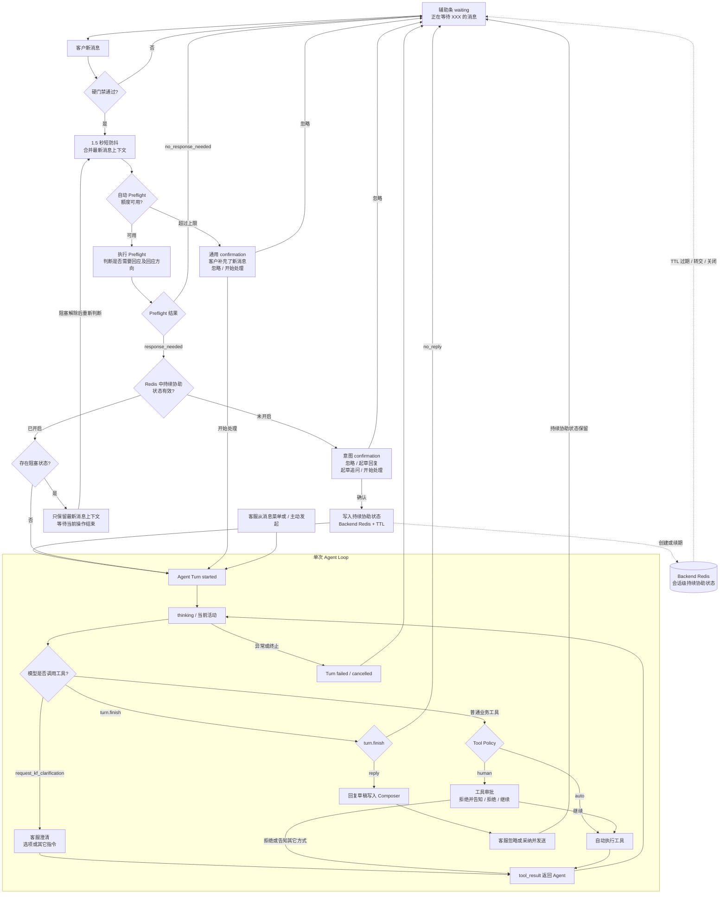

# 半托管 2.0 客户回应预判提案

- 日期：2026-09-17
- 状态：待产品评审
- 范围：客户新消息进入半托管辅助条前的回应必要性判断、意图摘要与启动建议
- 关联产品方案：[`2026-09-09-semi-managed-mode-2.md`](./2026-09-09-semi-managed-mode-2.md)
- 关联前端协议：[`../specs/2026-09-15-semi-managed-agent-turn-frontend-protocol.md`](../specs/2026-09-15-semi-managed-agent-turn-frontend-protocol.md)

## 1. 评审结论摘要

半托管 2.0 不应在每次客户发来新消息后立即运行完整 AI 处理流程。系统先通过轻量模型完成一次“客户回应预判”，回答两个问题：

1. 当前是否需要继续回应客户。
2. 如果需要，下一步回应方向是什么。

AI 持续协助尚未开启时，需要回应则由辅助条展示客户意图摘要和一个符合当前方向的主按钮，由客服决定是否开始 AI 处理。无需回应时，不启动 AI 处理，辅助条回到等待状态，并保留客服主动发起处理的入口。

轻量模型不理解 Agent Turn、技能、工具、SOP、审批策略或执行步骤。它只理解会话，并给出面向客服的回应建议。系统负责将建议映射为辅助条交互和后续 Agent Turn。

首版建议：

- AI 持续协助尚未开启时，`response_needed` 由客服首次确认开始。
- 业务结果只保留 `no_response_needed` 和 `response_needed` 两类。
- `response_needed` 下只枚举三种回应方向：起草回复、起草追问、开始处理。
- 模型不确定、超时或输出无效时，保守降级为建议回应，不能静默跳过客户消息。
- 客服首次确认开始后，会话进入有时限的“AI 持续协助”状态；后续客户消息不重复要求客服点击开始。

### 1.1 与半托管 2.0 原方案的关系

本提案细化并调整《半托管模式 2.0》第 6、7 节中的自动触发链路：

```text
原方案：客户新消息 → 直接进入能力匹配和 Agent 处理

本提案：客户新消息 → 客户回应预判 → 客服确认 → 进入 AI 持续协助
```

首次打开一个最后消息由客户发送、且尚未被客服处理的会话，同样只触发回应预判，不直接启动 Agent Turn。客服从消息菜单或 `/` 主动请求 AI 处理时，属于明确的人工作用，不需要再次经过“是否值得回应”的预判，可以直接进入 Agent Turn。

进入 AI 持续协助后，每次客户形成新的消息批次，系统可以继续静默执行回应预判：`no_response_needed` 时保持等待，`response_needed` 时自动启动新的 Agent Turn，不再重复展示启动 confirmation。

该调整不改变后续已确认的授权边界：只读查询是否自动执行、写工具是否需要审批、SOP 是否整体授权，仍由 Agent Turn 和确定性执行策略负责。

### 1.2 端到端状态流



读图规则：

1. waiting 始终只展示「正在等待 XXX 的消息」，不暴露持续协助、限流或内部状态。
2. 持续协助未开启时，第一次 `response_needed` 必须由客服确认。
3. 持续协助有效时，Preflight 仍然静默运行；`response_needed` 自动启动 Agent Turn，`no_response_needed` 回到 waiting。
4. Preflight 超过自动调用上限时不继续消耗模型，降级为通用「开始处理」confirmation。
5. 单个会话只允许一个运行中 Agent Turn、待审批节点、待澄清节点或待处理回复草稿；新消息只保留最新上下文，不并发创建 Turn。
6. Tool Policy 决定工具自动执行还是请求人工审批，Preflight 和持续协助状态都不能绕过该策略。
7. 单次 Turn 结束后持续协助状态仍可保留；Redis TTL 过期、会话转交、关闭 AI 辅助或客服主动结束后才失效。

## 2. 背景与问题

当前辅助条正在从“话术推荐入口”升级为“客服 AI 助手入口”。如果每条客户消息都直接启动完整 Agent Turn，会产生以下问题：

- 客户仅表示感谢、确认或结束对话时，仍然运行完整处理流程，增加成本和界面噪声。
- 客服在 AI 开始执行后才知道系统理解了什么，缺少启动前的心理预期。
- 简单问答、需要追问、需要办理业务三种场景使用同一个笼统按钮，不能准确表达 AI 准备提供的帮助。
- 为了提前决定技能、工具或执行路径而扩大小模型职责，会形成第二套 Agent 规划逻辑，增加误判和维护成本。

因此需要在硬门禁和 Agent Turn 之间增加一个轻量回应预判，但严格限制其职责。

## 3. 产品目标

### 3.1 目标

- 避免对明显无需回应的客户消息启动完整 Agent Turn。
- 在 AI 开始处理前，用一句话向客服呈现对客户诉求的理解。
- 根据下一步回应方向提供更准确的主按钮文案。
- 将是否开始 AI 处理交给客服，降低错误理解直接进入复杂执行流程的风险。
- 为持续协助的有效期、自动处理频率和退出规则积累真实数据。

### 3.2 非目标

回应预判不负责：

- 选择技能、知识库、工具或 SOP。
- 判断具体业务应该如何办理。
- 判断 Tool Call 是否需要人工审批。
- 判断写操作能否自动执行。
- 生成最终对客回复。
- 输出 Agent 执行计划。
- 替代 Agent Loop 内部的澄清、工具调用和完成判断。

## 4. 产品概念

产品名称建议使用“客户回应预判”，技术内部可简称 `Response Preflight`。

不建议向模型或客服使用“Agent Turn Preflight”：

- Agent Turn 是系统执行概念，不是模型需要理解的客户语义。
- 客服真正关心的是“这条消息是否值得回应、AI 准备怎么帮我”，而不是系统是否创建 Turn。
- 预判结果只是建议，不能约束后续 Agent 的实际处理路径。

## 5. 回应预判枚举

### 5.1 一级结果

| 结果 | 产品含义 | 系统行为 |
| --- | --- | --- |
| `no_response_needed` | 当前消息不需要继续回应或处理 | 不启动 Agent Turn，回到等待状态 |
| `response_needed` | 当前消息值得客服继续回应或处理 | 展示意图摘要和启动确认 |

`human_handoff`、`actionable`、`complaint`、`after_sales` 等不作为一级结果。它们描述的是客户意图或后续业务路径，不回答“当前是否需要回应”这一核心问题。

以下场景统一属于 `response_needed`：

- 客户提出问题。
- 客户要求查询、核实或办理业务。
- 客户要求转人工。
- 客户表达不满，需要解释、安抚或处理。
- 客户提供的信息不足，需要继续追问。
- 当前处理路径存在歧义，需要 AI 或客服进一步判断。

### 5.2 回应方向

只有 `response_needed` 需要输出回应方向：

| 方向 | 判断含义 | 辅助条主按钮 |
| --- | --- | --- |
| `provide_response` | 已具备回应条件，下一步主要是回答、解释或安抚 | 起草回复 |
| `request_information` | 必须先向客户补充询问必要信息 | 起草追问 |
| `handle_request` | 需要先查询、核实或办理具体业务 | 开始处理 |

方向表示“下一步最合理的客服动作”，不是 Agent 的执行约束。客服点击后，Agent 可以根据完整上下文修正判断。例如预判为“起草追问”，Agent 启动后发现可以通过已授权查询获取信息，则可以直接查询并生成回复。

### 5.3 主方向选择规则

一条消息可能同时包含多个诉求，但首版只输出一个主方向：

1. 必须先向客户补充信息，选择 `request_information`。
2. 可以通过查询、核实或业务办理继续推进，选择 `handle_request`。
3. 已具备直接回应条件，选择 `provide_response`。

意图摘要可以保留复合诉求，不需要为每个诉求生成独立按钮。

## 6. 输出内容

### 6.1 产品字段

```ts
type CustomerResponseAssessment =
  | {
      outcome: "no_response_needed";
      reasonSummary: string;
    }
  | {
      outcome: "response_needed";
      direction:
        | "provide_response"
        | "request_information"
        | "handle_request";
      intentSummary: string;
    };
```

### 6.2 文案要求

`intentSummary` 和 `reasonSummary` 必须：

- 使用一句简短中文，可直接展示在辅助条中。
- 基于客户消息和会话上下文，不补充客户没有表达的事实。
- 描述客户诉求或无需回应的原因，不描述 AI 执行方案。
- 不出现技能名、工具名、SOP 名和审批策略。
- 不输出“建议调用订单查询”“建议执行退款”等内部规划。
- 不让模型生成按钮文案；按钮由前端按 `direction` 固定映射。

推荐文案：

```text
客户希望查询订单物流状态
客户反馈商品问题，希望申请售后
客户希望查询订单，但尚未提供订单信息
客户已确认收到处理结果
```

不推荐文案：

```text
建议调用 order.query 查询订单
应该先运行售后技能，然后判断是否退款
客户一定希望退款
```

## 7. 辅助条交互

### 7.1 预判中

硬门禁通过后，辅助条进入短暂分析状态：

```text
正在理解客户诉求
```

该状态不代表 Agent Turn 已经启动，也不展示 Agent 思考过程。

### 7.2 建议起草回复

```text
客户询问退款到账时间                    [忽略] [起草回复]
```

点击「起草回复」后启动 Agent Turn。Agent 可以使用知识库或获准的查询工具，再形成回复草稿。

### 7.3 建议起草追问

```text
客户希望查询订单，但尚未提供订单信息    [忽略] [起草追问]
```

点击「起草追问」后启动 Agent Turn。Agent 负责确认是否确实需要追问，并生成适当回复。

### 7.4 建议开始处理

```text
客户希望查询订单物流异常                [忽略] [开始处理]
```

点击「开始处理」只表示允许启动本次 AI 处理：

- 已获准的只读查询可以按策略自动执行。
- 需要人工审批的 Tool Call 仍必须单独确认。
- 点击开始不构成对后续写操作或 SOP 的授权。

### 7.5 无需回应

无需回应时不进入 Agent Turn，辅助条直接回到标准 waiting：

```text
正在等待 XXX 的消息
```

`reasonSummary` 仅用于内部审计和质量评估，不在 waiting 状态向客服展示。客服仍可通过目标消息菜单或 `/ → AI 操作建议` 主动发起处理。首版不在 waiting 条增加额外主按钮，避免无需回应场景继续制造操作噪声。

### 7.6 忽略

点击「忽略」表示客服不采用本次启动建议：

- 不启动 Agent Turn。
- 不清空客服当前 Composer 内容。
- 当前上下文下不重复弹出相同建议。
- 客户后续消息继续按短防抖和自动调用上限处理。
- 客服仍可从目标消息主动发起 AI 处理。

### 7.7 AI 持续协助

客服首次点击「起草回复」「起草追问」或「开始处理」后，不应只授权当前一个 Agent Turn，而应使当前会话进入有时限的“AI 持续协助”状态。

持续协助解决的是多轮客服问题：售后处理经常需要客户补充订单号、确认处理方式或反馈新的结果。如果每轮都重新展示意图并要求客服点击开始，会形成明显的重复操作。

持续协助期间：

1. 客户发送新消息后，系统先按短防抖合并消息。
2. 后台静默执行 Preflight，不展示启动 confirmation。
3. `no_response_needed` 时保持 waiting，不启动 Agent Turn。
4. `response_needed` 时自动启动新的 Agent Turn。
5. Tool Call 的自动放行、人工审批和禁止策略保持不变。
6. Agent 生成的回复仍需客服确认发送。

因此，Preflight 在持续协助期间仍然有价值，但它只是一个低成本的静默入口判断，不再要求客服参与。它可以避免客户仅回复“好的”“谢谢”时仍启动完整 Agent Turn，也继续承担异常消息频率保护。

持续协助状态不需要在辅助条中显式展示。没有正在处理的活动时，waiting 文案始终保持「正在等待 XXX 的消息」，避免向客服暴露内部运行状态。

首版建议采用 10 分钟无会话互动自动结束的滑动有效期。客户或客服发送新消息都会刷新有效期。以下情况立即结束：

- 客服主动结束 AI 协助。
- 会话被关闭、转交或当前客服失去接管权。
- AI 辅助功能被关闭。

单个 Agent Turn 完成、客服发送一条回复或忽略当前建议，不应自动结束持续协助；这些只是一次具体处理结束，会话问题可能仍在继续。

为了保护客服正在进行的工作，以下情况不自动启动新的 Agent Turn：

- 已有 Agent Turn、工具审批或客服澄清尚未结束。
- 上一份 AI 回复草稿仍等待客服发送或忽略。
- Composer 中存在客服正在编辑的人工内容。

这些阻塞条件解除后，系统基于最新上下文重新判断；不能并发堆积多个 Agent Turn，也不能覆盖客服草稿。

### 7.8 状态存储

持续协助是 Backend 管理的会话级临时运行状态，不存放在前端工作台 Store，也不依赖当前页面是否打开。

首版建议使用 Redis 保存，并通过 TTL 管理自动过期：

```ts
type ConversationAiAssistanceState = {
  conversationId: string;
  activatedByEmployeeId: string;
  activatedAt: string;
  lastActivityAt: string;
  expiresAt: string;
};
```

存储规则：

- Key 至少按租户、业务账号和 `conversationId` 隔离。
- 客户或客服产生有效会话互动时刷新 TTL。
- 会话关闭、转交、失去接管权、关闭 AI 辅助或客服主动结束时删除状态。
- Backend 收到客户消息后读取该状态，决定 Preflight 结果是展示首次启动 confirmation，还是在 `response_needed` 时自动启动 Agent Turn。
- 前端可以消费 Backend 返回的处理结果，但不能自行推断或持有权威的持续协助状态。
- Redis 不可用或状态丢失时按“持续协助未开启”处理，不能在状态不确定时自动启动 Agent Turn。

持续协助的启用人、启用时间、结束时间和结束原因应进入可持久化审计记录；Redis 只承担短期有效状态，不作为长期审计数据源。

## 8. 与 Composer 的关系

客户回应预判不读取或改写 Composer 内容。首次由客服点击主按钮、或持续协助期间自动启动 Agent Turn 后，才进入现有的草稿处理规则。

为避免连续两次确认，产品上应遵循：

- 预判 confirmation 是“是否让 AI 开始帮助”的唯一启动确认。
- 如果 Composer 已有内容，辅助条需要同步提示后续草稿可能替换当前内容，并沿用可撤销机制。
- 不应在点击「起草回复」后立即再弹出一个语义相同的“是否起草”确认。
- Tool Call 审批和客服澄清仍是不同业务含义，可以在 Agent Turn 中后续出现。

Composer 是否已有内容不改变 `outcome` 和 `direction`，只影响启动确认中的提示及后续草稿写入行为。

## 9. 连续消息合并与自动 Preflight 保护

客户在即时通信场景中经常将一个完整诉求拆成多条短消息连续发送：

```text
客户：你好
客户：我这个订单一直没到
客户：不想要了，帮我退款吧
```

系统不能对每一条短消息分别执行回应预判，否则会产生重复调用、横条频繁切换，以及基于不完整语义的错误建议。同时，反滥用机制不应改变正常客服场景下的产品体验：客户补充了关键信息，辅助条仍应有机会更新为准确建议。

因此采用两层简单保护：正常消息使用短防抖合并，异常高频消息使用会话级调用上限兜底。

### 9.1 正常场景：短防抖合并

- 客户消息到达后等待短暂静默时间，首版建议为 1.5 秒。
- 静默期间又收到客户消息时，重置计时并合并最新上下文。
- 静默时间结束后，只对当前最新完整上下文执行一次 Preflight。
- 新消息在已有建议展示后到达时，旧建议失效；完成短防抖后可以基于最新上下文更新建议。
- 预判请求执行期间只允许一个请求；期间到达的新消息只记录为最新待处理上下文，不并发发起第二个请求。
- 旧请求返回时，如果已有更新的客户消息，则丢弃旧结果，不展示过时建议。

该机制覆盖绝大多数正常 Customer Bursting：客户快速发送多条短消息时，只产生一次基于完整语义的建议；客户稍后补充关键信息时，建议仍能正常更新。

### 9.2 异常场景：会话级调用上限

为了避免客户每隔几秒持续发送消息造成异常调用量，对自动 Preflight 增加会话级频率上限。首版建议：

```text
同一会话、客服尚未回应期间：60 秒内最多自动执行 3 次 Preflight
```

- 客服发送消息后，当前自动调用计数重置，正常有来有回的对话不受影响。
- 客服从消息菜单或 `/` 主动发起 AI 处理属于可信的人工操作，不占用自动 Preflight 额度。
- 频率上限只保护模型调用，不影响客户消息正常接收和展示。
- 阈值属于后端运行配置，应根据线上调用量、正常会话节奏和模型成本调整，不作为客服可见配置。

### 9.3 达到上限后的交互

达到自动调用上限后，新客户消息不再自动调用 Preflight，也不展示限流、异常或技术错误。辅助条使用不依赖模型的通用提示：

```text
客户补充了新消息                        [忽略] [开始处理]
```

- 客服可以直接点击「开始处理」，Agent Turn 使用最新完整会话上下文。
- 客服也可以继续正常回复客户；发送后自动调用计数重置。
- 系统不为了恢复意图摘要而排队补跑被抑制的 Preflight。

### 9.4 与 Agent Turn 的关系

AI 持续协助尚未开启时，客户消息不能直接启动 Agent Turn，只有客服采纳 Preflight 建议或主动发起 AI 处理后才能启动。

AI 持续协助开启后，客户消息仍然先经过受频率保护的静默 Preflight；只有结果为 `response_needed` 才自动启动 Agent Turn。因此控制 Preflight 的并发和频率，就同时限制了自动 Agent Turn 的入口，不需要再增加第二套消息频控。

Agent Turn 已经运行时到达的新客户消息如何进入当前 Turn或等待下一轮处理，属于 Agent Runtime 的上下文更新策略，不由本提案定义。

## 10. 输入上下文与结果有效性

回应预判不能只读取脱离上下文的单句消息。最少需要：

- 当前目标客户消息。
- 最近一段会话上下文及消息角色。
- 当前消息之后是否已经存在客服回复。
- 会话是否仍由当前客服接管。

技能、工具列表、SOP 定义和 Tool Policy 不需要提供给预判模型。

每次结果必须绑定：

- 当前会话。
- 本次短防抖合并的客户消息。
- 执行 Preflight 时批次中的最后一条消息。
- 判断时所见的最新消息位置。

当新的客户消息到达时：

- 当前建议立即失效，不能使用旧意图摘要启动针对新上下文的 Agent Turn。
- 短防抖结束后，在自动调用额度内基于最新上下文重新 Preflight。
- 达到自动调用上限时不再请求模型，辅助条降级为「客户补充了新消息」。
- 客服点击「开始处理」时，Agent Turn 始终读取最新完整上下文。

## 11. 硬门禁

以下规则继续由确定性代码处理，不交给模型：

- AI 辅助功能是否开启。
- 当前客服是否已经接管会话。
- 触发消息是否属于当前会话。
- 是否存在冲突的运行中 Agent Turn。
- 消息是否已经被客服回复或处理。
- 当前客服是否具备使用相关能力的权限。
- Tool Call 的自动执行、人工审批和禁止策略。

硬门禁不通过时，不调用回应预判模型，也不激活辅助条。

## 12. 不确定性与异常降级

业务输出保持两类，不增加一个面向产品的 `unknown` 类型。模型超时、低置信度、输出格式错误和服务不可用属于运行异常，不是客户意图。

降级原则：**宁可多向客服提供一次启动建议，也不能因为模型不确定而静默漏掉客户诉求。**

建议降级为：

```text
客户发来新的消息                        [忽略] [开始处理]
```

如果使用具有可校准分数的分类模型，可以只在 `no_response_needed` 达到高精确率阈值时自动进入 waiting。普通生成式小模型自行输出的 `confidence` 不应直接作为可靠概率使用。

## 13. 典型示例

| 客户消息与上下文 | 预判结果 | 意图或原因摘要 | 主按钮 |
| --- | --- | --- | --- |
| “退款一般多久到账？” | `provide_response` | 客户询问退款到账时间 | 起草回复 |
| “帮我查一下订单”，且无可识别订单 | `request_information` | 客户希望查询订单，但尚未提供订单信息 | 起草追问 |
| “订单 20984239842348 还没收到，帮我查一下” | `handle_request` | 客户希望查询订单物流异常 | 开始处理 |
| “衣服还没到，不行就退款”，可识别订单 | `handle_request` | 客户反馈物流延迟，希望查询后决定是否退款 | 开始处理 |
| “衣服还没到，不行就退款”，无法识别订单 | `request_information` | 客户反馈物流延迟，但缺少可查询的订单信息 | 起草追问 |
| “我要人工客服” | `provide_response` | 客户希望由人工客服继续处理 | 起草回复 |
| “好的，谢谢” | `no_response_needed` | 客户已确认处理结果 | 无 |
| 单个表情，未表达新增诉求 | `no_response_needed` | 客户未提出新的诉求 | 无 |

## 14. 产品指标

首版需要记录以下指标，用于评估预判是否真正提效：

| 指标 | 用途 |
| --- | --- |
| 各 `direction` 的主按钮点击率 | 判断建议方向和按钮文案是否匹配客服预期 |
| 各 `direction` 的忽略率 | 识别误判或不必要建议 |
| `no_response_needed` 后的人工主动触发率 | 作为漏判需要回应的重要代理指标 |
| 点击开始到最终发送或结束的耗时 | 衡量是否缩短客服处理时间 |
| Agent 启动后立即要求不同处理方向的比例 | 评估回应方向分类质量 |
| 模型超时、无效输出和降级率 | 评估运行稳定性 |
| 客服修改意图摘要的反馈样本 | 建立中文客服场景评测集 |
| 连续客户消息的数量和间隔分布 | 校准短防抖时间 |
| 会话达到自动调用上限的比例 | 评估阈值是否影响正常客服场景 |
| 被频率保护抑制的 Preflight 数量 | 评估避免的异常模型消耗 |
| 通用「客户补充了新消息」提示的点击率 | 判断限流降级是否仍能支持客服处理 |
| 持续协助期间自动启动的 Agent Turn 数量 | 评估减少的重复客服确认操作 |
| 持续协助期间人工主动结束率 | 判断持续时间和自动处理是否符合客服预期 |

其中最重要的质量指标是 `no_response_needed` 的精确率。错误建议启动只增加一次确认和少量成本；错误判断无需回应可能导致客户诉求被遗漏，两者风险不对称。

## 15. 上线建议

### 阶段一：离线与 Shadow Mode

- 使用历史中文客服会话建立评测集。
- 预判结果只记录，不改变现有触发行为。
- 重点检查 `no_response_needed` 的误判样本。
- 对比不同小模型的准确率、延迟和成本。

### 阶段二：建议模式

- 启用辅助条意图摘要和三类主按钮。
- AI 持续协助尚未开启时，由客服首次确认启动。
- 首次确认后进入有时限的持续协助，后续 `response_needed` 自动启动 Agent Turn。
- `no_response_needed` 只影响是否展示启动 confirmation，不影响人工入口。
- 收集接受、忽略、持续协助自动处理、主动结束和后续真实 Agent 行为。

### 阶段三：参数优化

- 根据真实数据调整短防抖时间、Preflight 调用上限和持续协助有效期。
- 评估不同客户是否需要不同的持续协助时长，但不把底层模型限流参数暴露为客服配置。
- 评估是否需要管理员控制持续协助能力的开启范围。

持续协助中的自动 Agent Turn 不改变 Tool Call 审批规则，不能被解释为对写操作的自动授权。

## 16. 本次产品评审需要确认

1. 是否确认一级结果只保留 `no_response_needed` 和 `response_needed`。
2. 是否确认回应方向只保留 `provide_response`、`request_information`、`handle_request`。
3. 是否确认三类主按钮分别为「起草回复」「起草追问」「开始处理」。
4. 是否确认 `no_response_needed` 直接回到标准「正在等待 XXX 的消息」，原因只用于内部审计。
5. Composer 已有内容时，是否将替换提示合并进本次启动 confirmation，避免二次确认。
6. 是否确认 AI 持续协助尚未开启时，首次 `response_needed` 必须由客服确认启动。
7. 是否确认模型异常统一降级为通用「开始处理」建议，而不是静默跳过。
8. 是否确认正常连续消息使用 1.5 秒短防抖，并始终基于最新上下文更新建议。
9. 是否确认同一会话在客服未回应期间，60 秒内最多自动执行 3 次 Preflight。
10. 是否确认客服发送消息后重置自动调用计数，人工主动触发不占用自动额度。
11. 是否确认达到上限后使用「客户补充了新消息」通用提示，不向客服展示限流概念。
12. 是否确认首次启动后进入 AI 持续协助，后续 `response_needed` 自动启动 Agent Turn，不再重复确认。
13. 是否确认持续协助采用 10 分钟无互动自动结束，并提供客服主动结束入口。
14. 是否确认存在运行中 Turn、待处理草稿或人工 Composer 内容时暂停自动启动，避免并发和覆盖。
15. 是否确认持续协助状态由 Backend Redis 按会话保存，前端不展示、不作为状态源，Redis 失效时按未开启处理。
