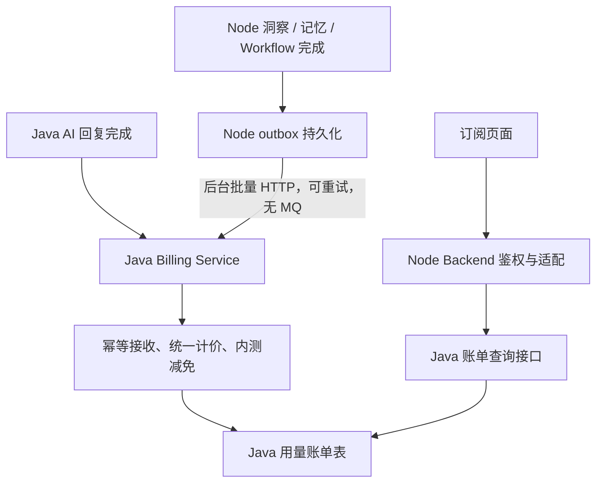

# AI 积分计费方案对齐

> 商业口径已确认；接口与物理表设计待双方确认。内测免费覆盖全部四类能力，不扣余额、不做额度拦截、不追溯扣费。

## 积分与模型倍率

| 能力 | 计费单位 | 基础积分 |
|---|---|---:|
| AI 回复 | 成功生成一次回复，半托管与全托管一致 | 1 |
| 会话洞察 | 一个逻辑会话的自动分析 | 4 |
| 用户记忆提炼 | 一个用户的一次成功提炼任务项 | 1.5 |
| Workflow 意图识别 | 一个成功的节点执行实例 | 0.1 |
| Workflow 大模型节点 | 一个成功的节点执行实例 | 1 |
| Workflow AI 资料收集 | 一个成功的节点执行实例 | 1 |

模型表通过 `credit_multiplier` 配置倍率，使用整数基点表示：`100 = 1x`、`150 = 1.5x`、`200 = 2x`。例如 Lite 为 `100`、Turbo 为 `150`、Pro 为 `200`。

```text
应计积分 = 基础积分 × (credit_multiplier / 100)
内测减免 = 应计积分
实扣积分 = 0
```

- 回复成功生成即计量，未发送也计量；同一结果拆成多条消息不重复计量。
- 同一逻辑会话的实时更新、最终分析、内部重试合计只计费一次；用户主动重刷另算一次。
- 洞察混用模型时，按事先确定的对外档位计价，不叠加内部模型倍率；实际 Token 按模型分别保留。
- 记忆成功分析但无变更也计量；未调用模型就跳过、任务失败不收费。
- Workflow 未执行分支不计量，循环每次执行分别计量；内部重试不重复收费。
- 编辑器试运行记录用量，首期标记调试减免，不扣积分。
- Token 用于内部成本核算，不直接使客户单次价格浮动；失败成本仍保留在业务运行记录中。

## 最简核心表

表结构与协议由我们设计，Java 团队确认并实现 Java 表的部署、接口和写入。以下为逻辑名称，物理命名按仓库规范落定。

| 所属方 | 表 | 内容 |
|---|---|---|
| Node | `ai_usage_outbox` | 稳定事件键、uid、事件载荷、投递状态、重试时间、次数、租约及错误 |
| Java | `ai_usage_bill` | 用量事实、业务对象、计费档位、价格快照、应计/减免/实扣积分、减免原因和时间 |

Java 账单按租户与业务事件键唯一去重，保存基础积分、整数基点倍率和价格版本快照。积分采用定点表示，精度与舍入方式在协议中统一。业务时间遵循 UTC+8。

基础价格与节点价格先由 Java 集中配置，模型倍率放模型表的 `credit_multiplier` 字段。模型 API 与跨服务计费契约统一传递整数基点原值，字段名使用 `creditMultiplier` 或 `credit_multiplier`；只有 UI 展示层换算为 `credit_multiplier / 100`。除非具体接口另行约定，不返回 `1.5` 这类小数倍率。暂不建独立用量表、价格表、账期汇总表或积分流水表。汇总先查询账单明细；正式扣费阶段再评估复用现有积分账户与流水。

## 流程与归属



Node 不计算正式积分、不写 Java 账单表，Java 不调用 Node。业务成功与 outbox 的持久化必须保证一致，投递故障不重新执行模型任务。批量响应逐条区分接收、重复、拒绝；超时后使用原事件键重发。

自动洞察的计费键应按逻辑会话稳定，不能每个分析 job 都生成新账单；主动重刷使用独立业务操作键。记忆按 run item，Workflow 按节点执行实例去重。内部调用成本与客户计费事件分开，自动洞察后续更新的成本不能因账单去重被丢弃。

## 并行交付

- 我们：表设计、上报/查询协议、Node 用量接入、outbox、真实 HTTP 客户端、订阅页面与契约测试。
- Java：确认设计，实现账单表、回复计量、批量幂等接收、计价减免和查询接口。
- 接口未就绪：可先采集，投递默认关闭；模拟 Java 仅用于测试，不能确认生产事件已投递。账单入口暂不开放，不显示伪造账单或零用量。
- 免费期归属由 Java 按业务发生时间与受控政策确认，不按接收时间补扣，也不信任调用方任意指定减免。

实施步骤与验收见[联调准备计划](../../plans/2026-09-10-ai-credit-billing.md)。
