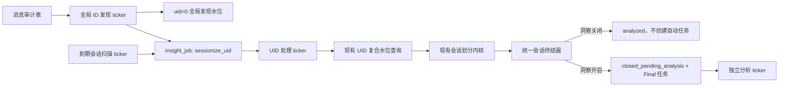

# 会话基础数据持续生成技术设计

- 日期：2026-07-22
- 状态：已实现，待发布
- 上游需求：`docs/specs/insights-always-on-sessionization.md`
- 适用代码：`apps/backend`、`packages/contracts`、`apps/web`

## 1. 设计结论

本期在不改动现有 UID 内消息排序与会话边界算法的前提下，替换其外层调度方式：

1. 全局发现器按 `xy_wap_embed_msg_audit_info.id` 单一自增水位扫描新落库消息。
2. 发现器按 UID 去重，在现有 `xy_wap_embed_insight_job` 中合并临时 `sessionize_uid` 任务。
3. UID Worker 继续使用现有 `idx_sync (uid, msgtime, id)`、现有复合处理水位和现有会话划分规则。
4. `insight_enabled` 不再决定是否执行 UID 会话划分，只决定是否创建和执行自动 LLM 任务。
5. 会话到期关闭与新消息触发的旧会话关闭统一使用同一个事务终结器。
6. 总览接口显式返回 `basic | insight` 模式；基础模式直接基于逻辑会话表提供统计和原始消息查看。
7. 本期不实现逻辑会话物理清理、迟到消息回挂、自动历史补切或自动补 Final。

全局 ID 发现只替换调度入口。以下 UID 内核心语义保持不变：

- 增量读取仍按 `(msgtime, id)` 排序。
- 消息有效性仍由现有 `buildInsightMessageInput()` 判断。
- 业务准入仍由 `findPlatformConversation()` 关联 `biz_status = 1` conversation 判断。
- 会话边界仍使用当前空闲时长、最长持续时长和客户消息开会话规则。
- 存量 `canceled` 的复用规则和手动重刷行为保持兼容。

## 2. 现有实现与改造边界

### 2.1 当前调用链

`InsightsWorkerService.runOnce()` 当前依次执行：

1. 为已开启洞察的 UID 补 `maintain_insight_uid` 永久任务。
2. 回收过期任务。
3. 处理 `sync_messages` 历史重刷。
4. 处理 `cleanup_disabled_insights`。
5. 领取 UID 永久维护任务并执行一次增量扫描。
6. 领取自动分析或手动重刷任务并调用模型。
7. 归档终态任务。

单一 non-overlapping ticker 会使长时间 LLM 调用阻塞下一轮消息发现。本期将消息发现、UID 处理和分析任务拆成独立执行预算，但仍可运行在同一 Worker 进程内。

### 2.2 复用代码

优先复用以下现有实现：

- `listIncrementalMessages()` 的 UID 复合水位查询。
- `sessionizeMessage()`、`resolveSessionId()` 的消息输入和边界判断。
- `findPlatformConversation()` 的业务会话准入。
- `getSessionizationConfig()` 的自定义配置与默认配置回退。
- `buildInsightMessageInput()` 的有效消息、发送方和边界语义。
- 现有 `analyze_session`、`reanalyze_session`、分析运行与快照发布流程。

必须调整的外层行为：

- 废弃 `maintain_insight_uid` 任务类型，删除其 seed、固定 10 秒重排和关闭洞察后删除任务逻辑。
- 在现有任务表中增加按需创建、空闲即删除的 `sessionize_uid` 任务类型。
- 删除新建 `cleanup_disabled_insights` 任务的逻辑，并停止领取该任务。
- `maintainUid()` 不再因 `insight_enabled = 0` 直接返回。
- always-on 路径直接使用已经持久化的具体 UID 水位，不再调用基于 `lastEnableTime` 和 3 天回看的 `resolveIncrementalStart()`。
- Live 调度和自动分析执行增加独立的洞察开关检查。
- `closeSession()` 与 `createAnalyzeJob()` 合并为统一事务终结器。
- Live 快照发布改为条件更新，不能把已结束会话改回 `open`。

## 3. 目标运行架构



`insights-worker-runtime.ts` 启动三个互不阻塞的 non-overlapping ticker：

| ticker | 职责 | 不得执行 |
| --- | --- | --- |
| discovery | 初始化/推进全局 ID 水位，合并 `sessionize_uid` | 会话划分、LLM |
| sessionization | 到期扫描、领取 UID 工作、增量切分、会话终结 | LLM |
| analysis | 历史重刷、自动/手动分析、任务回收与归档 | 全局发现 |

每个 ticker 仍通过数据库锁支持多实例运行。进程内拆分的目的不是增加业务状态，而是避免模型调用或热点 UID 阻塞消息发现。

当前可切片 UID 总量不到 1000。`sessionize_uid:{uid}` 的固定幂等键保证热任务表内每 UID 最多一行，现有任务索引和 `SKIP LOCKED` 领取路径足以承载该规模，因此不新增 `xy_wap_embed_sessionization_uid_work`。

当前 `uidSessionConfigCache`、`uidFeatureConfigCache` 改为单次 UID claim 的局部上下文，不再作为可被三个 ticker 并发读写的 Service 实例字段。

discovery ticker 只读取全局水位和消息审计表，不调用 `getSessionizationConfig()`、`getFeatureConfig()`，也不持有任何租户配置缓存。租户配置只允许在 sessionization claim 或 analysis 任务的局部上下文内读取，避免三个 ticker 之间共享过期配置。

## 4. 数据模型

### 4.1 复用现有任务表

本期不新增 UID 工作表。`xy_wap_embed_insight_job` 增加以下任务约定：

| 字段 | `sessionize_uid` 取值 |
| --- | --- |
| `job_type` | `sessionize_uid` |
| `target_type` | `uid` |
| `target_id` | UID 的十进制字符串 |
| `uid` | 租户 ID |
| `analysis_scope` | `all`，仅为兼容现有非空字段 |
| `idempotency_key` | `sessionize_uid:{uid}` |
| `status` | `pending` 或 `running` |
| `run_after` | 立即执行或失败退避时间 |
| `locked_by` | 每次领取生成的唯一 claim token |
| `lease_until` | 现有任务租约到期时间 |

现有约束和索引直接复用：

```text
UNIQUE KEY uk_insight_job_idempotency (idempotency_key)
KEY idx_insight_job_claim (target_type, job_type, status, run_after, priority, id)
KEY idx_insight_job_expired_lease (status, lease_until, id)
```

`sessionize_uid` 是可合并的临时工作项，不是需要保留执行历史的业务任务：

- 同一 UID 在热任务表最多一行。
- 存在消息或到期会话时为 `pending` / `running`。
- 权威复查确认没有工作时直接删除。
- 处理失败时保持 `pending` 并退避，不进入 `succeeded`、`failed` 或任务归档。

实现时只需更新 `docs/db/schema.sql` 和 `apps/backend/src/db/schema.ts` 的 `job_type` 注释，以及 Repository 的任务类型定义；不需要新表 DDL、Kysely 表类型或写表白名单。

### 4.2 继续复用水位表

`xy_wap_embed_insight_sync_cursor` 同时保存两类不同水位：

| 行 | `cursor_msgtime` | `cursor_audit_id` | 用途 |
| --- | --- | --- | --- |
| `source = xy_wap_embed_msg_audit_info, uid = 0` | 固定为 `0` | 全局已发现最大 ID | 全局发现 |
| 同一 source，具体 UID | 已处理消息时间 | 同时间下已处理 ID | UID 内增量处理 |

全局行的 `create_time` 记录本次 always-on 切换时间，并作为没有具体 UID 水位时的统一消息时间基线。发布前受控 SQL 必须新建或显式重新初始化该行，不能沿用来源不明的旧 `uid = 0` 行。

首次发现一个没有具体水位的 UID 时，发现事务先写入：

```text
cursor_msgtime = cutover_at 对应的毫秒时间戳
cursor_audit_id = 本发现批次开始时的全局 cursor_audit_id
```

然后再合并 `sessionize_uid` 任务。这样 UID Worker 不会触发现有的 3 天默认回看，也不会自动扫描上线前消息。

`cutover_at` 的时间转换必须与现有数据库连接保持一致：

- 切换事务使用数据库 `CURRENT_TIMESTAMP` 取得 `DATETIME`。
- mysql2 按项目固定的 `timezone = "+08:00"` 将该值读取为 JavaScript `Date`，再用 `Date.getTime()` 写入 Unix epoch 毫秒。
- 平台 `msgtime` 和 `cursor_msgtime` 都按 Unix epoch 毫秒比较；实现不得把 `DATETIME` 字符串交给进程默认时区重新解析。

这里使用“统一消息时间基线 + 精确落库 ID 边界”，不把具体水位改成该 UID 首条消息的 `id - 1`：

- 全局发现器按 ID 连续扫描。一个新 UID 首次出现在当前批次时，批次开始水位已经覆盖此前全部已发现 ID，因此它是该 UID 首条已发现消息之前的可靠落库边界。
- 具体 UID 水位按 `(msgtime, id)` 排序，`id - 1` 不是该复合顺序的有效前驱。用首次发现消息的 `msgtime` 和 `id - 1` 作为水位，会跳过后续落库但 `msgtime` 更早的记录，改变现有 UID Worker 行为。
- UID Worker 第一次领取后可以处理该 UID 在切换基线之后的全部可见消息，包括发现器尚未扫描到的更大 ID；这是允许的提前追平，不是上线前历史回扫。

因此，“首次发现”只负责创建水位和唤醒任务，不重新定义该 UID 的业务时间起点。批次开始 ID 只在 `msgtime = cutover_at` 时参与同时间排序；对于 `msgtime > cutover_at` 的消息，是否读取由复合水位的第一维决定。

切换时仍由旧 `maintain_insight_uid` 链路维护的 UID 保留原有具体水位值和原 `create_time`，用于追平旧链路在途消息。其它 UID 即使存在曾经开启洞察时留下的旧水位，也在切换时统一推进到上述基线，避免首次唤醒时自动回扫上线前历史；该更新不改写旧行的 `create_time`。只有首次插入具体 UID 水位行时，才显式写入 `create_time = cutover_at`。

`id > global_baseline_id` 但客户端 `msgtime < cutover_at` 的记录会被全局发现并唤醒 UID，但现有复合水位查询不会读取，最终形成空唤醒。这属于本期明确不处理的迟到消息边界，不得为了纳入这类消息而改变初始水位或 UID 排序。

新链路要求“存在 `sessionize_uid` 任务时一定存在具体 UID 水位行”。处理时如果水位仍然缺失，应保留任务并失败退避，不能回退到 `getInitialInsightWorkerCursor()`。可靠数据覆盖起点不直接等同于旧行 `create_time`，统一按第 9.5 节的保守规则计算。

### 4.3 退役任务类型

切换后停止创建和领取：

- `maintain_insight_uid`：原按洞察开关 seed、每 10 秒循环的永久 UID 任务。
- `cleanup_disabled_insights`：原关闭洞察后把 `open` 会话改为 `canceled` 的任务。

确认旧任务没有 `running` 实例后，从热任务表清退剩余记录。它们属于退役的运维调度任务，不要求伪装成成功业务任务后归档。

## 5. 全局 ID 发现

### 5.1 切换初始化

启用新发现器前，在受控切换事务中：

1. 停止旧 `maintain_insight_uid` 和 `cleanup_disabled_insights` 的新领取。
2. 等待正在运行的旧 UID 任务结束。
3. 读取消息表当前 `MAX(id)` 为 `global_baseline_id`。
4. 记录数据库当前时间为 `cutover_at`。
5. 初始化全局水位为 `cursor_audit_id = global_baseline_id`、`cursor_msgtime = 0`，并使该行 `create_time = cutover_at`。
6. 对切换时仍由旧链路维护的 UID 保留已有复合水位；其它 UID 的残留旧水位统一推进到切换基线。
7. 为切换时仍由旧链路维护的 UID 各合并一次 `sessionize_uid`，用于追平旧链路在途消息。

新链路只发现 `id > global_baseline_id` 的记录；第 7 步属于旧链路续跑，不是历史补切。

### 5.2 单批发现事务

Repository 新增：

```ts
discoverMessageUids(input: {
  batchSize: number;
  now: Date;
}): Promise<{
  discoveredMessages: number;
  discoveredUids: number;
  cursorAuditId: number;
  skipped: boolean;
}>;
```

该方法在一个事务中执行：

1. Worker 发现管线启动时先校验 `source + uid = 0` 全局水位行已经由受控切换步骤创建；缺失时以 `GLOBAL_SESSIONIZATION_CURSOR_NOT_INITIALIZED` 失败并告警，禁止自动插入 `cursor = 0` 后回扫全表。
2. 单批事务使用 `SELECT ... FOR UPDATE SKIP LOCKED` 领取该全局水位行。未返回行时再做一次只读存在性检查：行存在表示其它实例持锁，本轮返回 `skipped = true`；行不存在表示初始化丢失，抛出上述错误。不得把“锁竞争”和“水位缺失”都静默当成空批次。
3. 执行：

```sql
SELECT id, uid
FROM xy_wap_embed_msg_audit_info
WHERE id > :cursor_audit_id
ORDER BY id ASC
LIMIT :batch_size;
```

4. 在应用内按 UID 去重。
5. 对没有具体水位的 UID 插入切换基线，已有行不更新。
6. 以固定幂等键批量合并 `sessionize_uid` 任务。
7. 将全局 `cursor_audit_id` 更新为本批最后一条记录的 `id`，`cursor_msgtime` 继续写 `0`。
8. 提交事务。

空批次不创建任务，也不必更新全局水位行。全局水位必须在全部任务合并成功后才能推进，任一语句失败时整个事务回滚。

### 5.3 任务合并规则

任务不存在时插入：

```text
status = pending
run_after = now
idempotency_key = sessionize_uid:{uid}
```

命中唯一幂等键时：

- `pending`：保持 `pending`；已有失败退避时保留 `run_after`，避免新消息绕过故障退避形成热循环。
- `running`：保持 `running`、`locked_by` 和 `lease_until`，不抢占正在处理的 claim。
- `sessionize_uid` 正常情况下不得存在 `succeeded` 或 `failed` 行；发现此类异常行时记录告警并恢复为 `pending`，不能让其永久阻塞同 UID 的固定幂等键。

合并操作即使不改变字段，也必须参与发现事务并对唯一任务行完成数据库级冲突处理，不能在事务外先查后写。

### 5.4 不保存目标水位

`sessionize_uid` 不保存 `(target_msgtime, target_audit_id)` 或消息唤醒版本：

- 任务只表达“这个 UID 可能有工作”。
- 具体应处理哪些消息完全由现有 UID `(msgtime, id)` 水位和 `listIncrementalMessages()` 决定。
- Worker 可以顺带处理全局发现器尚未扫描到的更新消息；之后发现器再看到这些 ID，只会产生一次幂等空唤醒。
- `msgtime` 早于具体 UID 已处理水位的迟到消息即使触发唤醒，现有 UID 查询仍不会读取；本期不改变该历史行为。

## 6. `sessionize_uid` 执行协议

### 6.1 领取

Repository 在现有 UID 任务领取方法上增加 `sessionize_uid` 分支：

1. 使用 `idx_insight_job_claim` 选择 `target_type = uid`、`job_type = sessionize_uid`、`status = pending` 且 `run_after <= now` 的任务。
2. 使用 `FOR UPDATE SKIP LOCKED` 支持多实例并行。
3. 条件更新为 `running`，`attempt_count = attempt_count + 1`。
4. `locked_by` 写入每次领取唯一的 claim token，不能继续使用固定 `node-worker`。
5. 写入 5 分钟 `lease_until`，覆盖默认单批 200 条消息的执行预算。
6. 返回 `jobId`、`uid` 和 claim token。

租约过期仍由现有 `reclaimExpiredRunningJobs()` 恢复为 `pending`。claim token 本身作为 fencing identity，不新增 `lease_version` 字段。

5 分钟仅适用于 `sessionize_uid`；现有分析和历史重刷任务继续沿用原租约口径。

### 6.2 单次执行预算

首版保持当前预算：单次领取最多读取一批 200 条消息。后续可以根据指标增加批次数，但不修改 UID 查询、消息排序和会话边界算法。

`listIncrementalMessages()` 不增加任务目标上界。如果本批读取满额，或者批次后探测到具体 UID 水位之后仍有消息，任务立即恢复 `pending`、`run_after = now`，不再固定等待 10 秒。

### 6.3 UID 内消息处理

本期不改造 UID Worker 内部消息处理协议。领取 `sessionize_uid` 后直接复用现有流程：

1. 从具体 UID 的 `(msgtime, id)` 水位调用现有 `listIncrementalMessages()`。
2. 批量查询已有 `uid + source_message_id` 归属并跳过已处理消息。
3. 对剩余消息继续调用现有 `sessionizeMessage()`、`findPlatformConversation()`、`resolveSessionId()` 和 `appendSessionMessage()`。
4. 批次完成后按最后一条消息更新具体 UID 复合水位。
5. 洞察开启时执行现有 open-session Live 补偿扫描；随后处理该 UID 的到期会话。

消息读取顺序、会话边界、迟到消息、消息归属写入和水位推进的现有实现均保持不变。本期不新增逐消息 claim 校验、transaction-scoped repository、消息与水位原子重写或 `sync_messages` 的新互斥协议。

### 6.4 到期处理与完成

单批消息处理后：

1. 使用具体 UID 当前复合水位探测是否仍有未处理消息。
2. 仍有消息时不关闭会话，直接进入完成事务并恢复 `pending`。
3. 没有未处理消息时，查询并终结该 UID 当前到期的 `open` 会话。
4. 进入完成事务，锁定任务行并校验 claim token。
5. 在持有任务行锁时再次权威查询：具体 UID 水位后是否仍有消息，以及是否仍有到期 `open` 会话。
6. 任一存在时清空 claim、恢复 `pending`、`run_after = now`；两者都不存在时删除任务行。

完成事务和唤醒事务都修改同一个固定幂等任务行，竞态结果如下：

- 发现器或到期扫描先合并：Worker 随后锁行并通过权威查询看到实际工作，恢复 `pending`。
- Worker 先锁行并删除：发现器或到期扫描等待锁后重新插入 `pending`。
- 新消息已经提交但发现器尚未扫描：Worker 的 UID 权威查询直接看到消息并恢复 `pending`。

因此不需要 `target_*`、`close_requested`、`close_request_version` 或额外唤醒版本。

### 6.5 失败与租约

- 可重试失败：按 claim token 条件恢复 `pending`，清空租约，记录错误并延迟重试。
- 成功完成一轮处理：重置连续失败信息；如果仍有工作则立即 `pending`。
- 达到告警阈值：继续保留 `pending` 和退避，不进入会被归档的终态；即使该 UID 没有下一条消息，也必须保留原唤醒。
- 人工重试：只清除错误和退避、设置 `run_after = now`，不得重置具体 UID 水位。
- 租约过期：现有回收器恢复任务；旧 Worker 在完成阶段因 claim token 不匹配而不能删除或重排当前任务。

## 7. 到期扫描与会话终结

### 7.1 到期扫描

扫描继续使用现有索引：

```sql
SELECT uid
FROM xy_wap_embed_logical_session
WHERE status = 'open'
  AND next_close_at <= :now
ORDER BY next_close_at ASC
LIMIT :batch_size;
```

按 UID 去重后，以 `sessionize_uid:{uid}` 合并任务。不存在时插入 `pending`；已经 `pending` 或 `running` 时保持现有状态、退避、claim token 和租约。

### 7.2 关闭前追平检查

到期关闭前，使用现有 `idx_sync` 做 UID 级未处理消息探测：

```sql
SELECT id
FROM xy_wap_embed_msg_audit_info
WHERE uid = :uid
  AND (
    msgtime > :cursor_msgtime
    OR (msgtime = :cursor_msgtime AND id > :cursor_audit_id)
  )
ORDER BY msgtime, id
LIMIT 1;
```

存在记录时不关闭会话，把任务恢复为 `pending` 继续现有增量查询。不存在记录时，再查询该 UID 当前仍满足 `next_close_at <= now` 的 open 会话并调用统一终结器。

该保护只覆盖现有 UID Worker 能识别的复合水位之后消息；`msgtime` 早于具体 UID 水位的迟到消息仍属于本期非目标。

### 7.3 到期唤醒竞态

到期任务不保存 `close_requested`：

- Worker 完成前会在任务行锁内权威复查到期会话。
- 扫描器在 Worker 删除后发现到期会话，会重新插入任务。
- 扫描器在 Worker 完成前合并任务，Worker 仍以实际 `next_close_at` 查询结果决定是否续跑。
- 本轮没有找到仍到期的会话时可以删除任务；未来新到期由下一轮索引扫描重新唤醒。

### 7.4 统一终结器

Repository 新增：

```ts
finalizeOpenSession(input: {
  closeReason: "idle_timeout" | "hard_max_duration";
  endedAt: number;
  sessionId: string;
  uid: number;
}): Promise<"already_closed" | "closed_for_analysis" | "closed_without_analysis">;
```

该方法必须运行在调用方事务中：

1. `SELECT logical_session ... FOR UPDATE`。
2. 会话不是 `open` 时幂等返回 `already_closed`。
3. 读取最新 feature config；没有配置行按 `insight_enabled = false`。
4. 始终写入 `ended_at`、真实 `close_reason`、`next_close_at = NULL`。
5. 保留 `current_snapshot_id`，不得因关闭洞察清空 Live 快照。
6. 洞察关闭：写 `status = analyzed`，不创建任务。
7. 洞察开启：写 `status = closed_pending_analysis`，并在同一事务插入唯一 Final 自动任务。

Final 自动任务使用稳定幂等键：

```text
analyze_session:{uid}:{sessionId}:final
```

`run_after` 使用：

```text
ended_at + analysis_delay_minutes * 60_000
```

稳定键保证同一会话不会因终结器重试创建多条 Final 自动任务。终结器插入命中已有任务时沿用现有任务状态，不额外插入新行。

- `pending` / `running` / `succeeded`：复用已有任务，不创建第二条。
- `failed`：沿用现网终态语义，不因会话终结器重试自动新建或复活任务；需要再次分析时走现有手动 `reanalyze_session`。
- 现网没有 `dead` 状态，本期不新增。

现有 `parseJobMode()` 使用 `idempotency_key.split(":").at(3)` 读取 `final`，稳定键继续保持第 4 段为 mode。

以下两条路径都调用该终结器，不能再自行组合 `closeSession()` 和 `createAnalyzeJob()`：

- 到期扫描后的 UID 内关闭。
- 新消息发现上一会话已越过边界时的关闭。

## 8. 自动分析成本闸门与快照发布

### 8.1 自动任务创建

- Live：只有 `insight_enabled = 1` 才调用 `shouldCreateLiveAnalyzeJob()`；Repository 内再次检查开关，处理开关竞态。
- Final：只由统一终结器的洞察开启分支创建。
- 手动 `reanalyze_session`：不增加洞察开关限制。

### 8.2 模型调用前复查

`processAnalyzeJob()` 在第一次模型交互前读取最新开关。第一次模型交互包括 Live gate，不能只在完整分析前检查。

自动任务发现洞察已关闭时：

| 任务 | 处理 |
| --- | --- |
| Live `analyze_session` | 不调用模型，任务终态化；逻辑会话保持 `open` |
| Final `analyze_session` | 不调用模型；`closed_pending_analysis -> analyzed`；保留当前快照指针 |
| `reanalyze_session` | 按现有手动重刷执行 |

Final 跳过和任务终态化在一个事务中完成，并记录 `INSIGHT_DISABLED`，便于成本与排障统计。

开关检查之后已经发起的模型请求允许完成，不增加中断协议。

### 8.3 Live 写回保护

当前 `saveAnalysisResult()` 会对 Live 结果无条件写 `status = open`。修改为：

```sql
UPDATE xy_wap_embed_logical_session
SET current_snapshot_id = :snapshot_id,
    status = 'open'
WHERE id = :session_id
  AND uid = :uid
  AND status = 'open';
```

受影响行数为 0 时：

- 已生成快照和分析运行仍作为历史结果保留。
- 不更新当前快照指针。
- 不修改逻辑会话状态。

自动 Final 发布只更新 `closed_pending_analysis`；手动重刷允许按现有规则更新已结束会话的当前快照，但不得重新打开会话。

## 9. 契约与后端查询

### 9.1 新增模式契约

`packages/contracts/src/insights/dto.ts` 增加：

```ts
type InsightMode = "basic" | "insight";

type InsightCapabilitiesResponse = {
  mode: InsightMode;
  insightAvailable: boolean;
  canManageInsights: boolean;
};
```

新增只读接口：

```text
GET /api/server/insights/capabilities
```

该接口只要求正常数据页鉴权，不要求管理员权限。语义：

- `mode` 只由最新 `insight_enabled` 推导；无配置行时为 `basic`。
- `insightAvailable` 只表示是否允许管理员开启 AI 洞察。
- `canManageInsights` 由当前账号角色推导。

总览和会话列表响应同时返回 `mode`，避免单个接口被脱离页面上下文使用时误解字段。
基础模式总览响应只返回五项基础指标、基础趋势和环比；AI 分析、问题解决度、待办等聚合字段改为可选，并由服务端省略，不能仅依赖前端隐藏。

### 9.2 会话列表契约

`InsightAnalysisStatus` 增加 `skipped`。列表项增加：

```ts
messageCount: number;
customerMessageCount: number;
agentMessageCount: number;
sessionState: "open" | "ended";
analysisPhase?: "live" | "final";
```

AI 字段改为可空或可选：

- `summarySessionTitle`
- `problemSummary`
- `resolutionStatus`

基础模式不使用默认空文案伪造上述结果。

### 9.3 状态派生优先级

Repository 查询必须同时选择：

- `logical_session.status AS logical_session_status`
- `snapshot.status AS snapshot_status`
- `snapshot.phase AS snapshot_phase`
- 当前租户有效的 `live_analysis_enabled`；无策略行时沿用现有默认值 `true`
- 三个消息计数字段

应用层按以下顺序映射：

1. `closed_pending_analysis` -> `analyzing`；已有 Live 快照时仍返回 AI 字段和 `analysisPhase = live`。
2. `analyzed/canceled + current_snapshot_id IS NULL` -> `skipped`。
3. `open + current_snapshot_id IS NULL + live_analysis_enabled = true` -> `analyzing`。
4. `open + current_snapshot_id IS NULL + live_analysis_enabled = false` -> 不返回 `analysisStatus`，仅通过 `sessionState = open` 表示会话仍在进行。
5. 其余有快照记录 -> 快照状态；`analysisPhase` 取快照 phase。

`analyzed + Live` 返回 Live 的快照状态和 `analysisPhase = live`，不得映射为 `skipped`。

分析状态筛选同步改为：

```text
analyzing:
  logical_session.status = closed_pending_analysis
  OR (
    logical_session.status = open
    AND current_snapshot_id IS NULL
    AND effective_live_analysis_enabled = true
  )

skipped:
  logical_session.status IN (analyzed, canceled)
  AND current_snapshot_id IS NULL
```

其它状态继续匹配当前快照状态。

### 9.4 基础与洞察查询

总览五项基础指标继续直接使用：

- `logical_session` 行数
- `message_count`
- `customer_message_count`
- `agent_message_count`
- `count(distinct conversation_id)`

基础模式会话列表仍从 `logical_session` 左连接快照查询，但只返回和展示基础字段。关键词改为匹配客户/客服名称或稳定 ID；不匹配摘要、问题或其它 AI 字段。

基础模式携带以下 AI 专属筛选时，Service 在进入 Repository 前抛出：

```text
INSIGHT_FILTER_NOT_AVAILABLE_IN_BASIC_MODE
```

- `analysisStatus`
- `resolutionStatus`
- `problemScope`
- `tagId`
- `intentId`
- `entityId`

AI 详情、筛选项、证据上下文、质量、待处理和业务洞察接口在基础模式返回统一 `INSIGHT_NOT_ENABLED`，不得返回历史 AI 结果或全零业务结果。待办创建与状态修改同样受此约束。前端正常情况下会先由 capability context 拦截，不发出这些请求。会话原始消息接口、管理员配置接口和既有手动重刷不受该守卫影响。

### 9.5 对比覆盖范围

Repository 新增 `getSessionizationCoverageStart(uid)`，同时读取具体 UID 水位行和 `uid = 0` 全局水位行的 `create_time`，按以下保守口径返回：

```text
coverageStartAt = max(uidCursor.create_time, globalCursor.create_time)
```

全局水位 `create_time` 即 `cutover_at`。因此切换前已经存在水位的老租户也不会仅因旧 cursor 创建得早，就被认定在关闭洞察期间仍有连续切片；本期只有 always-on 切换后的区间被视为可靠连续覆盖。后续如果增加可证明连续性的独立覆盖元数据，再单独放宽该口径。

`getOverview()` 只有在上一等长区间起点不早于覆盖起点时才计算环比：

```text
comparisonAvailable = previousRange.from >= coverageStartAt
```

覆盖不足时：

- `comparisonAvailable = false`
- 不计算 `deltaRate`
- 前端统一显示“暂无对比数据”

本期不增加 30 天或其它查询范围限制。

### 9.6 原始消息查看

基础模式点击会话时直接使用现有会话消息接口：

```text
GET /api/server/insights/sessions/:sessionId/messages
```

该接口基于逻辑会话归属和现有 scope 校验，不要求当前快照存在。基础详情面板使用列表中的会话元数据加原始消息，不请求 AI 详情接口。

## 10. 前端接入

### 10.1 统一模式上下文

在会话洞察模块增加 `InsightsCapabilityProvider`：

1. 首次进入任一洞察路由时请求 capabilities。
2. 区分 loading、error、basic、insight 四种状态。
3. 向布局和页面提供 `mode`、`insightAvailable`、`canManageInsights`、`refresh()`。
4. 设置页更新总开关成功后调用 `refresh()`，无需等待后台任务清理。

当前 insights 路由是多个并列路由。实现时在 Router 中增加一个共享父级 layout route，子路由通过 `Outlet` 复用 provider，避免每个页面重复请求。

### 10.2 导航与页面守卫

- 总览：两种模式都可访问。
- 服务质检、待处理、业务洞察：基础模式仍显示导航；页面内容替换为共享开启页。
- 洞察配置：继续沿用管理员权限；基础模式管理员仍可编辑服务会话规则。
- 未授权开启 AI：开启按钮禁用，但基础总览和服务会话规则不受影响。

共享开启页按 capability 显示操作：

- 管理员且 `insightAvailable = true`：进入洞察配置。
- 管理员但未授权：显示当前账号未开通。
- 非管理员：提示联系管理员开启。

### 10.3 基础总览

基础模式只渲染：

- 五个基础指标。
- 对应趋势与有效环比。
- 基础筛选和会话列表。
- 原始消息详情。

不请求 filter-options，不渲染解决度、AI 诊断、AI 摘要、分析状态和维度筛选。

洞察模式继续渲染现有完整页面，并增加：

- “已跳过分析”状态。
- 已结束但 `analysisPhase = live` 时的“实时结果/未生成最终洞察”标识。

### 10.4 设置页分区

“洞察策略”保留一个页面，拆成两个信息分区：

1. 服务会话规则：空闲结束、最长持续时间；始终生效。
2. AI 洞察规则：最终分析延迟、Live 策略、有效消息门槛、置信度等；仅在洞察开启时生效。

关闭洞察时不禁用 AI 规则编辑，只显示当前未生效状态。总开关说明改为只描述 AI 洞察，不再出现“同步会话”或“完成切片”。

## 11. 代码改造清单

### 11.1 Backend Worker

`apps/backend/src/modules/insights/insights-worker.ts`

- 将 `runOnce()` 拆成 discovery、sessionization、analysis 三个可独立调用的入口。
- 移除 `seedUidMaintenanceJobs()` 和 `runCleanupDisabledInsightsJob()`。
- 用 `claimNextSessionizationUidJob()` 替换永久 UID 任务领取；任务无工作时删除，有工作时立即恢复 `pending`。
- 将 `maintainUid()` 改为 `processUidSessionization()`，去除洞察开关早退，保留现有 UID 查询和会话划分算法。
- always-on 路径移除 `resolveIncrementalStart()`，缺失具体 UID 水位时失败重试，不做 3 天默认回看。
- 启动时校验 `uid = 0` 全局水位；发现查询区分锁竞争和水位缺失。
- 增加唯一 claim token和完成阶段消息/到期会话权威复查。
- 两条关闭路径统一调用 `finalizeOpenSession()`。
- 自动分析在首次模型交互前复查开关。

`apps/backend/src/modules/insights/insights-worker.repository.ts`

- 增加全局发现事务、`sessionize_uid` 合并/领取/完成/失败方法。
- 增加统一终结器和自动任务跳过事务。
- Final 自动任务使用稳定的 `...:final` 幂等键，mode 仍位于第 4 段。
- 修正 Live/Final 快照条件发布。

`apps/backend/src/modules/insights/insights-worker-runtime.ts`

- 启动三个独立 ticker。
- 为 discovery batch、UID claim 数、UID 单次预算和 analysis concurrency 分别配置默认值。
- `INSIGHTS_WORKER_UID_ALLOWLIST` 不进入发现或切片判断。

### 11.2 Backend API

`apps/backend/src/modules/insights/insights.repository.ts`

- 查询逻辑会话状态、消息计数和快照 phase。
- 修正状态映射和筛选；`open + NULL` 仅在有效 Live 策略开启时属于 analyzing。
- 增加基础模式 actor keyword 查询。
- 增加具体 UID cursor 与全局 cutover 取较晚值的可靠覆盖起点查询。

`apps/backend/src/modules/insights/insights.service.ts`

- 增加 capabilities。
- 为总览响应增加 mode 和 comparisonAvailable。
- 增加基础模式 AI 筛选与 AI 页面接口守卫。

`apps/backend/src/modules/insights/insights.routes.ts`

- 注册 capabilities 路由。
- 保持现有数据权限和管理员设置权限。

`apps/backend/src/modules/insights/insights.repository.ts`

- 更新 feature config 时不再创建 `cleanup_disabled_insights`。

### 11.3 Contracts 与 Web

`packages/contracts/src/insights/dto.ts`

- 增加 mode、capabilities、comparisonAvailable、skipped、analysisPhase 和基础列表字段。

`apps/web/src/router/index.tsx`

- 增加 insights 父级 layout route 和 provider。

`apps/web/src/pages/chat/insights/insights-layout.tsx`

- 根据 capability 展示导航状态和共享开启页入口。

`apps/web/src/pages/chat/insights/insights-overview-page.tsx`

- 拆分基础/洞察渲染和请求集合。

`apps/web/src/pages/chat/insights/insights-settings-page.tsx`

- 修改总开关文案并拆分规则分区。

## 12. 切换与兼容

### 12.1 启用闸门

本期不新增 always-on 专用环境变量。现有 `INSIGHTS_WORKER_ENABLED` 继续控制整个洞察 Worker 是否运行；启用后同时启动 discovery、sessionization 和 analysis 三条独立管线。

新发现器的安全闸门是 `source = xy_wap_embed_msg_audit_info, uid = 0` 全局水位行。该行缺失时 discovery 明确失败并告警，不会回退为从 `id = 0` 扫描；sessionization 和 analysis 管线仍可独立运行。线上尚无客户，本期不提供迁移脚本，由发布前受控 SQL 初始化全局水位并清退旧任务。

### 12.2 切换顺序

1. 部署兼容 DTO、状态映射、API 和前端。
2. 更新现有任务类型、Repository 和测试夹具；不新增数据表或白名单条目。
3. 停止现有 Worker 实例，避免切换过程中继续领取旧 UID 任务。
4. 确认旧任务没有 `running` 实例后，从热任务表清退 `maintain_insight_uid` 和尚未执行的 `cleanup_disabled_insights`，不再 seed 或领取。
5. 通过受控 SQL 初始化 `global_baseline_id`、`cutover_at` 和全局水位；本期不提供切换脚本。
6. 为有旧链路在途积压的 UID 合并一次 `sessionize_uid` 临时任务。
7. 部署并启动新 Worker，先使用单实例和低并发。
8. 验证水位、工作积压、基础数据和 LLM 成本后逐步扩并发。

### 12.3 回滚

- 先停止新发现、到期扫描和 `sessionize_uid` 领取，等待当前 claim 结束。
- 不删除具体 UID 水位、逻辑会话或已生成快照；临时任务可以保留供恢复后继续执行。
- 必须恢复旧调度时，只为 `insight_enabled = 1` 的 UID 重建永久任务，并从具体 UID 当前水位继续。
- API 和前端保持能识别 `skipped` 与 Live-only 已结束会话，不能回滚到旧状态映射。

## 13. 监控

### 13.1 发现层

- 消息表 `MAX(id) - global cursor_audit_id`
- 发现批次大小、UID 数、查询耗时
- 空批次数和全局水位锁竞争次数
- UID 空唤醒数和比例

### 13.2 UID 工作层

- `sessionize_uid` pending/running 数量
- 最老 pending 等待时间
- 每分钟处理消息、创建会话和关闭会话数
- 每 UID 水位落后、租约过期、claim token 拒绝和重试次数
- 完成阶段因消息或到期会话仍存在而立即续跑的次数
- 连续失败达到告警阈值的 UID 数

### 13.3 成本与容量

- `insight_enabled = 0` 下自动任务创建数和自动模型调用数，目标均为 0
- 因关闭洞察跳过的自动任务数
- 逻辑会话和消息归属表每日新增、总行数与容量
- 单 UID 增长分布和异常热点

## 14. 测试设计

### 14.1 Worker 单元与 Repository 测试

必须覆盖：

1. 全局发现只使用 `id > cursor`，并在 `sessionize_uid` 合并成功后推进全局水位。
2. 多实例只有一个发现事务能锁定全局行；锁竞争返回 skipped，`uid = 0` 行缺失则报 `GLOBAL_SESSIONIZATION_CURSOR_NOT_INITIALIZED`，两者不能混淆。
3. 合并已经 `running` 的任务时不覆盖 claim token、租约或状态。
4. Worker 运行期间出现新消息时，完成阶段权威查询使任务继续 `pending`；Worker 先删除时发现器能够重新插入。
5. 具体 UID 仍按 `(msgtime, id)` 查询和推进；首次发现 UID 时使用切换基线，不能用首条发现消息的 `id - 1` 代替复合水位。
6. 无有效 conversation 的消息只推进 UID 水位。
7. 消息归属重复时不重复增加计数。
8. 失租 Worker 的完成事务被 claim token 校验拒绝，不能误删或重排当前任务。
9. 到期扫描和 Worker 完成并发时不会丢失仍然到期的会话，也不需要关闭请求版本。
10. UID 无消息且无到期会话时删除临时任务，不写成功终态或归档记录。
11. UID 仍有消息或到期会话时立即恢复 `pending`，不固定等待 10 秒。
12. `sessionize_uid` 失败后保留同一任务并退避；没有后续新消息时仍能继续重试。
13. 洞察关闭时自然关闭为 `analyzed` 并保留 Live 指针。
14. 洞察开启时关闭与 Final 任务原子提交，且 `run_after` 正确；幂等键使用稳定的 `...:final`。
15. 自动任务在模型调用前发现开关关闭时不调用 Live gate 或完整模型。
16. 晚到 Live 结果不覆盖已结束会话当前指针。
17. 手动重刷仍可发布 Final，并复用原逻辑会话。
18. `cutover_at` 按 mysql2 `+08:00` 读取并转换为 epoch 毫秒；`id > baseline` 但 `msgtime < cutover_at` 的消息只产生空唤醒。
19. discovery ticker 不读取或缓存 sessionization/feature config。

### 14.2 API 与契约测试

- capabilities 的 mode、权限与 allowlist 组合。
- `analyzed + NULL -> skipped`。
- `analyzed + Live -> Live-only`。
- `closed_pending_analysis + Live -> analyzing + live fields`。
- `open + NULL` 在 Live 开启时映射为 analyzing，在 Live 关闭时不返回 analysisStatus。
- basic 模式 AI 筛选错误码。
- basic 总览基础指标和 actor keyword。
- 覆盖起点取具体 UID cursor 与全局 cutover 的较晚值；comparisonAvailable 为 false 时不返回误导性 rate。
- 原始消息接口不依赖快照。

### 14.3 Web 行为测试

- 基础总览不请求 AI filter-options，不展示 AI 卡片和筛选。
- 基础模式进入 AI 页面显示统一开启页。
- 管理员、未授权管理员、非管理员的开启动作不同。
- 更新总开关后 capability 刷新并立即切换模式。
- 洞察模式显示 skipped 和 Live-only 状态。
- 设置页服务会话规则与 AI 规则分区及生效状态正确。

### 14.4 构建与校验

实施完成后至少运行：

```text
corepack pnpm --filter @chatai/contracts build
corepack pnpm --filter @chatai/backend build
corepack pnpm --filter @chatai/backend test <affected-tests>
corepack pnpm --filter @chatai/web test <affected-tests>
corepack pnpm --filter @chatai/web build
git diff --check
```

上线前在真实消息表执行：

```sql
EXPLAIN SELECT id, uid
FROM xy_wap_embed_msg_audit_info
WHERE id > ?
ORDER BY id
LIMIT ?;

EXPLAIN SELECT ...
FROM xy_wap_embed_msg_audit_info
WHERE uid = ?
  AND (msgtime > ? OR (msgtime = ? AND id > ?))
ORDER BY msgtime, id
LIMIT ?;
```

预期分别使用主键范围扫描和 `idx_sync`，不新增消息事实表索引。

## 15. 分阶段开发任务

### 阶段 A：契约与查询兼容

1. 增加 mode、capabilities、skipped、analysisPhase 和基础字段契约。
2. 修正 Repository 状态映射、状态筛选和基础指标查询。
3. 增加 capabilities 与基础模式接口守卫。
4. 前端接入 provider、基础总览和开启页。

该阶段先使应用能够正确解释新终态，但不切换 Worker。

### 阶段 B：临时任务与发现器

1. 增加 `sessionize_uid` 任务类型、唯一 claim token 和任务清退逻辑。
2. 实现全局水位初始化与 ID 发现事务。
3. 实现任务合并、完成权威复查、退避和租约恢复。
4. 增加独立 discovery/sessionization ticker。

### 阶段 C：UID 执行与会话终结

1. 将现有 UID 处理接入 `sessionize_uid`，去除 `insight_enabled` 早退。
2. 保持现有 UID 内部读取、排序和切片算法不变。
3. 实现到期扫描、消息追平检查和完成阶段到期会话复查。
4. 实现统一终结器并替换两条旧关闭路径。

### 阶段 D：LLM 成本闸门

1. 停止 cleanup 任务创建和领取。
2. Live/Final 自动调度增加开关检查。
3. 模型调用前复查开关并终态化跳过任务。
4. 修正 Live/Final 条件发布。

### 阶段 E：灰度切换

1. 完成真实数据 EXPLAIN 和监控面板。
2. 初始化切换水位并终止旧永久任务。
3. 单实例、低并发灰度。
4. 核对消息、会话、状态和自动 LLM 请求。
5. 扩大并发并完成旧代码清理。
