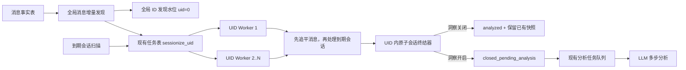

# 会话基础数据持续生成与会话洞察分层需求

- 日期：2026-07-22
- 状态：已实现，待发布
- 适用范围：会话洞察、逻辑会话生成、洞察 Worker
- 核心方案：会话基础数据持续生成，AI 洞察按租户开关运行

## 1. 需求结论

系统应为所有在 ChatAI 工作台中存在有效业务会话、且产生有效消息的 UID 持续生成逻辑会话，不再使用会话洞察开关决定是否进行会话划分。有效业务会话以消息能够关联到 `biz_status = 1` 的 `xy_wap_embed_conversation` 为准。

`insight_enabled` 只控制 LLM 洞察分析：

- 关闭时，系统仍持续生成逻辑会话和基础统计，不再启动新的自动 LLM 请求。
- 开启时，系统在同一份逻辑会话数据之上继续执行现有实时、最终和手动重刷分析。
- Agent 自主进化、用户记忆等下游能力直接消费逻辑会话，不参与会话划分的启停判断。

逻辑会话生成采用“全局消息增量发现 + 活跃 UID 合并调度 + UID 内串行处理”的方式。发现层按消息审计表的全量增量推进水位，允许无效业务消息造成 UID 空唤醒；生成层只为满足上述业务准入和有效消息规则的数据创建逻辑会话。系统不再为每个 UID 保留永久轮询任务。

## 2. 背景

逻辑会话是以下能力的共同基础数据：

1. 会话洞察：基于一轮完整服务生成摘要、问题解决度、质检、标签、意图、实体和待办。
2. Agent 自主进化：基于完整服务过程进行效果反思和改进建议沉淀。
3. 用户记忆：基于用户级连续服务片段提取和维护长期记忆。
4. 基础会话总览：统计会话量、咨询用户数和消息量等无需 LLM 的经营数据。

如果逻辑会话继续依附于会话洞察开关，任何下游能力都必须反向开启会话洞察或额外维护一套启停联动。这会造成业务耦合，也会使基础数据是否存在取决于某项付费 AI 能力。

因此，逻辑会话应被定义为消息事实之上的基础派生数据；会话洞察是使用该数据的一个增值应用。

## 3. 现状基线

### 3.1 当前 Worker 调度

当前实时链路为每个 `insight_enabled = 1` 的 UID 创建一条永久 `maintain_insight_uid` 任务：

- Worker 默认每 3 秒执行一次 tick。
- 每次 tick 最多串行处理 10 个 UID。
- 单个 UID 每次最多读取 1 个消息批次，默认 200 条。
- UID 任务完成后固定延迟 10 秒再次调度。
- 关闭会话洞察后，UID 维护任务被删除，并通过 `cleanup_disabled_insights` 把进行中的会话改为 `canceled`。

该模型适合少量已开启洞察的 UID，不适合扩展到全部租户。直接取消 `insight_enabled` 过滤会产生大量无消息 UID 的空查询，并使活跃 UID 的处理延迟随租户数线性增长。

### 3.2 当前 LLM 调用

默认分析模式为 `multi_step`：

| 场景 | 调用过程 | 正常调用次数 |
| --- | --- | --- |
| 最终完整分析 | 先生成摘要、问题解决度、情绪和待办，再并行执行质检与分类抽取 | 3 次 |
| 实时分析，变化检查未通过 | 仅执行变化检查 | 1 次 |
| 实时分析，变化检查通过 | 变化检查后，执行摘要分析与分类抽取；实时流程不执行质检 | 3 次 |
| 单维度手动重刷 | 仅执行质检或分类对应步骤 | 1 次 |
| 全量手动重刷 | 与最终完整分析一致 | 3 次 |

网络重试和模型不支持结构化响应时的降级重试可能增加实际请求次数。

本需求不调整现有多步 LLM 编排，只保证基础模式不创建或执行自动 LLM 分析任务。

### 3.3 当前配置字段

`xy_wap_embed_sessionization_config.enabled` 当前表示“该租户配置行是否生效”：

- `enabled = 1`：读取租户自定义规则。
- `enabled = 0` 或没有配置行：回退系统默认规则。

该字段当前不是会话划分总开关。本需求保留这一语义，不新增会话划分业务开关，也不使用该字段表达是否存在下游消费者。

## 4. 目标与非目标

### 4.1 产品目标

1. 所有在 ChatAI 工作台中存在有效业务会话并产生有效消息的 UID 都能持续形成稳定的逻辑会话。
2. 关闭会话洞察后不再启动新的自动 LLM 请求。
3. 未开启会话洞察的用户仍能查看基础会话总览。
4. 开启或关闭会话洞察不影响逻辑会话生成，也不影响 Agent 进化和用户记忆读取基础会话。
5. 保持现有逻辑会话状态字段和手动历史重刷机制兼容。
6. Worker 的空轮询成本不随全量租户数线性增长，并支持按 UID 分片和多实例并行。

### 4.2 非目标

本期不包含：

- 逻辑会话和消息关联数据的物理删除、保留周期或清理任务。
- Agent 自主进化页面、文案或开关联动。
- 用户记忆的产品形态、抽取策略和消费状态管理。
- 自动补分析在洞察关闭期间已经结束的历史会话。
- 修改现有手动历史重刷的触发方式、范围或 LLM 编排。
- 新增消息队列、CDC 或其它基础设施强依赖。
- 重构逻辑会话数据库状态枚举。
- 基础模式下的摘要、情绪、问题判断、标签、意图、实体、质检或其它基础语义分析。
- 上线前历史消息的自动补切；实时链路从上线水位开始积累数据。

## 5. 产品模式与能力边界

系统根据 `insight_enabled` 形成两种展示和处理模式，但两种模式共用同一套逻辑会话。

| 能力 | 基础模式：会话洞察关闭 | 洞察模式：会话洞察开启 |
| --- | --- | --- |
| 逻辑会话持续生成 | 支持 | 支持 |
| 会话划分规则 | 使用租户有效配置，否则使用默认配置 | 使用租户有效配置，否则使用默认配置 |
| 会话数、咨询用户数、消息数 | 支持 | 支持 |
| 基础趋势和环比 | 支持 | 支持 |
| 基础会话列表和原始消息查看 | 支持 | 支持 |
| 实时 LLM 分析 | 不执行 | 按现有策略执行 |
| 最终 LLM 分析 | 不执行 | 按现有策略执行 |
| 摘要、问题解决度、情绪、待办 | 不展示 | 展示 |
| 标签、意图、实体、质检 | 不展示 | 按能力子开关和配置展示 |
| 历史重刷 | 保持现有手动能力，不新增自动触发或开关拦截 | 保持现有手动能力，不新增自动触发或开关拦截 |

### 5.1 商业化定位

1. 逻辑会话生成和基础总览属于所有租户可用的基础数据能力，不作为会话洞察付费开关的一部分。
2. 摘要、诊断、质检、标签、意图、实体、待办等 LLM 结果属于会话洞察增值能力，仍受现有产品授权和 `insight_enabled` 控制。
3. 基础总览提供真实可用的数据价值，同时保留 AI 能力入口，使用户可以在已有会话数据上理解开启洞察后的增量价值。
4. Agent 自主进化和用户记忆可以分别定义自己的授权和计费方式，但其授权状态不参与逻辑会话是否生成的判断。
5. `insightAvailable` 及 `INSIGHTS_WORKER_UID_ALLOWLIST` 只控制租户是否可以开启 AI 洞察，不限制基础逻辑会话生成、基础总览或服务会话规则配置。
6. 基础总览不因租户是否购买或开启会话洞察而额外截断查询范围；本期沿用现有接口的时间范围和权限规则，数据容量通过监控管理，物理清理与保留周期另案设计。

## 6. 核心业务规则

### 6.1 会话生成

1. 会话生成不读取 `insight_enabled` 作为准入条件。
2. 消息到达后，继续复用现有消息类型、发送者角色、有效消息和会话归属规则。
3. 同一 UID 内必须按消息复合水位顺序处理，避免并发创建重复会话或打乱边界。
4. 不同 UID 可以由不同 Worker 实例并行处理。
5. 会话规则读取 `enabled = 1` 的租户配置；没有有效配置时使用系统默认值。
6. 会话洞察、Agent 自主进化和用户记忆均不得反向控制会话生成。
7. 会话生成的业务准入以消息能否关联到 `biz_status = 1` 的 `xy_wap_embed_conversation` 为准；无法关联到有效业务会话的审计消息只推进发现与租户处理水位，不生成逻辑会话。
8. 全局发现层按审计消息自增主键 `id` 推进，不在发现 SQL 中重复实现消息角色、类型和内容有效性规则。UID Worker 继续使用现有 `(msgtime, id)` 复合水位和消息输入构建规则，判断 `included_for_ai`、`meaningful_for_boundary` 和是否允许由客户消息创建会话。

### 6.2 会话关闭

会话达到空闲时长或最长持续时长后，由独立的到期会话关闭任务处理。关闭时读取当前最新的 `insight_enabled`：

| 关闭时洞察状态 | 数据处理 | LLM 处理 |
| --- | --- | --- |
| 已开启 | `open -> closed_pending_analysis`，保留当前快照指针 | 原子创建最终 `analyze_session` 任务，`run_after = ended_at + analysis_delay_minutes` |
| 未开启 | `open -> analyzed`，保留已有当前快照指针 | 不创建分析任务；本来没有快照时自然形成 `analyzed + current_snapshot_id = NULL` |

租户不存在 `xy_wap_embed_insight_feature_config` 配置行时，`insight_enabled` 按 `false` 处理，不得因为配置缺失而默认开启自动分析。

“关闭会话”和“创建最终分析任务”必须在同一事务中完成，避免出现会话已关闭但没有分析任务，或分析任务已创建但会话仍为 `open` 的中间状态。

两种关闭分支都必须写入实际的 `ended_at`、`close_reason` 和 `next_close_at = NULL`。`close_reason` 只能使用本次会话的真实边界原因 `idle_timeout` 或 `hard_max_duration`；关闭洞察本身不再终结会话，因此新链路不得写入 `insight_disabled`。

### 6.3 “已跳过分析”的表达

不新增逻辑会话数据库状态。应用层按以下条件派生分析状态：

```text
logical_session.status = analyzed
AND logical_session.current_snapshot_id IS NULL
=> analysisStatus = skipped（已跳过分析）
```

不得再把上述记录映射为“分析中”。

存量 `canceled + current_snapshot_id IS NULL` 仅作为兼容数据同样映射为 `skipped`；新链路不再写入 `canceled`。

基础模式的会话列表不展示分析状态；洞察开启后，如果历史列表中出现这类会话，应显示“已跳过分析”。手动重刷成功并写入新的当前快照后，状态按快照结果正常展示。

`skipped` 只能由已经持久化的终态派生，不能因为当前 `insight_enabled = 0`，就在查询时把仍为 `closed_pending_analysis` 的会话动态映射为“已跳过分析”。后者仍表示任务正在等待或执行，只是在基础模式下不向用户展示分析状态。

如果 `status = analyzed` 且 `current_snapshot_id` 指向 `phase = live` 的快照，表示会话保留了关闭前已经生成的实时结果，但没有生成最终洞察。该记录不得映射为 `skipped`，也不得计入“最终分析完成”；洞察模式下应继续展示已有结果，并标记为“实时结果”或“未生成最终洞察”。

### 6.4 开启会话洞察

1. 只更新 `insight_enabled = 1` 及现有启用时间字段。
2. 不创建或启动会话生成任务，因为会话生成已经持续运行。
3. 当前仍为 `open` 的会话继续运行；如果其关闭时洞察仍开启，则进入最终分析。
4. 开启动作不扫描已结束会话，也不为其新建最终分析任务。该规则覆盖“已跳过分析”、仅有 Live 快照、当前快照失败或过期，以及其它尚无 Final 当前快照的已结束会话。
5. 重新开启时已经处于 `closed_pending_analysis` 的会话继续沿用原有任务状态，不重复创建最终任务。
6. 如需为已结束会话生成 Final 快照，继续使用现有手动历史重刷功能。

### 6.5 关闭会话洞察

1. 只更新 `insight_enabled = 0`，不停止会话生成。
2. 不关闭、不取消当前 `open` 会话，也不再创建 `cleanup_disabled_insights` 任务。
3. 当前会话自然达到关闭条件后进入 `analyzed` 终态；原本没有快照时派生为“已跳过分析”，已有 Live 快照时保留当前指针并展示已有实时结果。
4. 尚未开始执行的普通自动 `analyze_session` 任务在模型调用前复查开关；如果已关闭，则跳过模型调用并记录原因：
   - 实时分析任务只结束任务本身，逻辑会话继续保持 `open`。
   - 最终分析任务将 `closed_pending_analysis` 会话标记为 `analyzed`，但不得清空已有 `current_snapshot_id`；仅当会话原本没有快照时形成 `analyzed + current_snapshot_id = NULL`。
5. 已经开始模型调用的任务不强制取消，允许按现有逻辑完成。
6. `reanalyze_session` 属于用户主动触发的现有重刷链路，不新增开关拦截或取消逻辑。
7. 关闭开关不清理已经生成的历史快照和维度数据；基础模式只是不展示 AI 结果。
8. 开关关闭后，前端立即切换为基础模式并隐藏分析状态，不等待排队任务逐条完成；数据库状态仍按实际任务进度流转，不通过查询层伪造 `skipped`。
9. 手动 `reanalyze_session` 是明确的主动调用例外，关闭洞察后仍可能产生 LLM 调用；“关闭后不再启动 LLM”仅指实时和最终自动分析。

### 6.6 历史重刷兼容

1. 对已经存在消息归属或逻辑会话的数据，重刷必须复用已有逻辑会话，不得为 `analyzed + current_snapshot_id = NULL` 创建第二份逻辑会话；对尚无任何归属的历史消息，保留现有补切行为。
2. `analyzed + current_snapshot_id = NULL` 是可重刷的合法会话状态。
3. 重刷成功后更新该逻辑会话的当前快照指针。
4. 本需求不自动触发重刷，不改变现有重刷入口、任务范围和维度级重刷逻辑。

现有 `canceled` 会话不做批量迁移，新链路也不再产生该状态。历史 `canceled` 数据可以继续在基础总览中按已结束会话展示；仅当 `current_snapshot_id IS NULL` 时，分析状态兼容映射为“已跳过分析”，已有快照时继续按快照结果展示。它不进入第 6.8 节的下游自动消费范围。兼容行为明确如下：

1. 后续有效客户消息仍处于原会话边界内时，沿用现有逻辑把 `canceled` 重新打开为 `open`；重新打开后按新链路自然终结，届时可以进入下游消费范围。
2. 后续消息已经越过原会话边界时，原 `canceled` 保持不变；符合开会话条件的客户消息创建新的逻辑会话，旧会话仍不自动消费。
3. 没有后续消息的存量 `canceled` 不做迁移、不自动重刷，也不纳入下游自动消费。

### 6.7 数据范围与历史覆盖

1. 本期不新增基础模式的日期范围、查询跨度或会话详情访问限制，前后端继续沿用现有总览接口的时间范围和权限规则。
2. 本期不删除任何逻辑会话、消息关联或洞察结果，也不实现保留周期和清理任务。
3. 后续物理清理方案独立设计；清理逻辑不反向检查 Agent 进化或用户记忆是否已经消费。
4. 上线前的历史消息不自动补切。已有逻辑会话可以继续展示；此前没有生成逻辑会话的租户从上线切换水位开始逐步积累数据。
5. 服务端必须区分“上一等长区间真实为零”和“该区间早于租户可靠会话数据覆盖起点”。可靠覆盖起点取“具体 UID 水位创建时间”和“always-on 部署切换时间”的较晚者；即使老租户切换前已有水位，也不默认认为关闭洞察期间不存在数据空洞。上一等长区间不完整时不得计算环比，接口返回对比不可用，前端显示“暂无对比数据”。

### 6.8 下游消费契约

Agent 自主进化、用户记忆等下游能力按以下条件识别一个已经结束、可以消费的逻辑会话：

```text
logical_session.ended_at IS NOT NULL
AND logical_session.status IN ('closed_pending_analysis', 'analyzed')
```

下游消费不得依赖 `current_snapshot_id` 是否存在，也不得等待 LLM 分析完成。具体要求：

1. `closed_pending_analysis` 表示会话已经结束，只是洞察分析仍在等待或执行；基础会话已经可供下游消费。
2. `analyzed + current_snapshot_id = NULL` 表示洞察已跳过，基础会话同样可消费。
3. 下游使用逻辑会话 ID 和消息归属表读取稳定切片，自行维护消费水位、幂等和失败重试。
4. 下游处理失败不得回滚会话关闭、阻塞会话生成或改变洞察任务状态。
5. 逻辑会话表不增加 Agent 进化、用户记忆等消费者的消费完成标记。

## 7. 产品交互

### 7.1 导航与访问

1. “会话洞察 - 总览”对基础模式和洞察模式都开放。
2. 服务质检、待处理、经营分析等依赖洞察快照的导航入口继续保留，并显示未开启状态；进入后展示统一的会话洞察开启页，不展示全零图表或空列表。
3. 管理员在开启页可以进入“洞察配置”开启会话洞察和预先配置洞察策略。
4. 非管理员在开启页只提示需要管理员开启，不提供越权入口。
5. 非管理员保持现有配置页权限限制。
6. 所有基础数据和原始消息继续遵守现有租户、子账号和会话访问权限，不因总览开放而扩大数据范围。
7. 工作台“洞察”入口和基础总览不受 `insightAvailable` 或洞察 UID allowlist 限制；未获得洞察授权的租户仍可进入基础总览，但不能开启 AI 洞察。

### 7.2 基础模式总览

基础模式只展示由逻辑会话本身直接计算的数据。

#### 数据卡片

- 会话数。
- 咨询用户数。
- 总消息数。
- 客户消息数。
- 客服消息数。

#### 趋势和对比

- 支持按天查看上述五项指标。
- 保持当前区间与上一等长区间的对比口径。
- 默认时间范围沿用现有总览交互，不因基础模式新增限制。
- 只有当前区间和上一等长区间都处于可靠会话数据覆盖范围内时才展示环比；覆盖不完整时显示“暂无对比数据”，不能把缺失历史当作真实零值计算百分比。

#### 会话列表

基础列表至少包含：

- 客户。
- 接待客服。
- 总消息数，以及客户/客服消息数。
- 会话开始时间和结束时间；进行中会话明确显示“进行中”。
- 查看原始会话消息的操作入口。

基础列表不展示：

- AI 摘要。
- AI 诊断和问题解决状态。
- 分析状态筛选。
- 标签、意图、实体、质检筛选。
- 待办、风险和其它快照维度。

基础模式的搜索范围调整为客户和客服信息，不提供“搜索摘要”。

### 7.3 洞察模式总览

洞察开启后，在基础数据之上继续展示现有 AI 指标、筛选项、摘要、问题解决度和详情内容。现有已分析会话的展示不因本需求改变。

对于洞察关闭期间以 `analyzed + current_snapshot_id = NULL` 结束、且尚未手动重刷的会话：

- 基础字段正常展示。
- AI 字段为空。
- 分析状态显示“已跳过分析”，不得显示“分析中”。

对于洞察关闭期间以 `analyzed + phase = live` 结束的会话，重新开启后继续展示已有 Live 快照中的 AI 字段，并明确标记为“实时结果”或“未生成最终洞察”。重新开启本身不自动补充 Final 快照；需要最终洞察时由管理员使用现有手动重刷功能。

如果重新开启洞察时仍存在真实的 `closed_pending_analysis` 会话，则继续按现有任务状态显示“等待分析”或“分析中”，不能因为中途关闭过开关而改写为“已跳过分析”。

### 7.4 洞察开关

开关仍位于“洞察配置”，名称保持“会话洞察”。用户文案必须准确表达该开关只控制 AI 分析。

建议说明文案：

> 开启后，系统会基于服务会话生成摘要、诊断、质检等 AI 洞察。关闭后仍会持续统计基础会话数据。

关闭成功反馈应表达为：

> 会话洞察已关闭，基础会话数据将继续更新。

不得再使用“关闭后停止同步会话”“暂停会话切分”等表述。

### 7.5 洞察策略

不新增独立的“会话切片”页面或开关。保留现有“洞察策略”信息结构，并在同一页内使用面向业务的名称组织配置：

1. 服务会话规则：多久无新消息视为一次服务结束、一次服务最长持续时间。
2. 洞察生成规则：会话结束后多久生成最终洞察、是否提前洞察未结束会话及检查敏感度。
3. 分析与结果规则：有效消息门槛用于决定是否调用模型；AI 置信度阈值用于模型返回后的问题结果降级和待办抑制，不作为模型调用准入条件。

页面必须把“服务会话规则”和“AI 洞察规则”形成清晰的信息分区，并标注各自的生效条件：

- 服务会话规则始终对后续会话生效，不随 `insight_enabled` 失效；说明文案表达为“控制一次服务何时结束及基础会话统计，关闭会话洞察后仍会生效”。
- 洞察生成、分析和结果规则标注“仅在开启会话洞察后生效”。关闭洞察时仍允许管理员预先配置，不整体置灰或禁止编辑。

基础模式下，管理员仍可进入“洞察配置 - 洞察策略”并编辑服务会话规则；非管理员继续只具备数据页访问权限。未获得 `insightAvailable` 授权时，服务会话规则仍可编辑，只有“开启会话洞察”操作被禁止，AI 规则保持可预配置并明确标记当前未生效。

用户侧不使用“全局会话切片”“下游消费者”等技术词，也不在该页面解释 Agent 自主进化或用户记忆的内部依赖关系。

## 8. Worker 总体架构



该架构保留 UID 级分片和并行能力，但不为没有新消息的 UID 创建永久任务。当前可切片 UID 总量不到 1000，现有 `xy_wap_embed_insight_job` 的任务领取、唯一幂等键、租约和 `FOR UPDATE SKIP LOCKED` 已能承载最多每 UID 一条临时任务，不新增独立 UID 工作表。

### 8.1 全局消息增量发现

使用现有表 `xy_wap_embed_insight_sync_cursor` 保存全局发现水位：

```text
source = xy_wap_embed_msg_audit_info
uid = 0
cursor_audit_id = 已发现的最大审计表自增主键 ID
cursor_msgtime = 0，仅为兼容现有表结构保留，不参与全局发现判断
```

发现查询按自增主键 ID 水位前进：

```sql
WHERE id > :cursor_audit_id
ORDER BY id ASC
LIMIT :batch_size
```

`xy_wap_embed_msg_audit_info.id` 是自增主键。全局发现只负责识别新落库记录及其 UID，不按 `msgtime` 排序。消息的业务时间顺序仍由具体 UID Worker 使用现有 `(msgtime, id)` 复合水位处理。

全局发现器由洞察 Worker 的独立调度步骤周期性执行，与 UID 处理、到期扫描和 LLM 分析使用独立的单轮批次或执行时长预算。调度周期使用 Worker 部署配置，默认可以沿用现有 Worker tick，但不得因为某个 UID 或 LLM 长任务而阻塞下一轮发现。

多个 Worker 实例可以同时触发全局发现，但同一时刻只能有一个实例持有 `source + uid = 0` 全局水位行的事务锁并提交发现批次。未获得锁的实例跳过本轮或在下个 tick 重试；获得锁后必须重新读取最新水位，不能使用事务外缓存的旧水位。无需额外部署单点 Leader。

每个批次必须在同一数据库事务内完成：

1. 锁定并读取 `uid = 0` 的全局水位。
2. 读取下一批消息，只提取发现所需的 `id` 和 `uid`。
3. 按 UID 去重，以固定幂等键 `sessionize_uid:{uid}` 向现有任务表合并临时 UID 任务。
4. 没有具体水位的 UID 使用本发现批次开始时的全局 ID 水位与 `cutover_at` 初始化；该 ID 是其首条已发现消息之前的连续落库边界。切换时仍由旧链路维护的 UID 保留原水位，其余残留旧水位在切换时统一推进到上线基线。
5. 将全局 `cursor_audit_id` 更新为本批最后一条记录的 `id`。
6. 提交事务。

不得先推进全局 ID 水位再写入或合并 `sessionize_uid` 任务，否则进程崩溃时会永久丢失唤醒。全局水位只比较消息审计表 `id`，不保存或推导具体 UID 的 `(msgtime, id)` 处理目标。

全局发现水位和具体 UID 处理水位用途不同：前者保证新落库记录能够触发 UID 唤醒，后者保持现有按消息业务时间切分的行为。本期只替换全局发现水位，不修改具体 UID Worker 的增量读取、切片顺序和迟到消息处理逻辑。

### 8.2 临时 UID 任务

复用 `xy_wap_embed_insight_job`，新增任务类型 `sessionize_uid`：

| 字段 | 取值 |
| --- | --- |
| `job_type` | `sessionize_uid` |
| `target_type` | `uid` |
| `target_id` | UID 的十进制字符串 |
| `uid` | 租户 ID |
| `idempotency_key` | `sessionize_uid:{uid}` |
| `status` | 复用现有 `pending`、`running` |
| `run_after` | 立即执行或失败退避时间 |
| `locked_by` | 每次领取生成的唯一 claim token |
| `lease_until` | 单次领取 5 分钟租约，覆盖默认 200 条消息处理预算 |

同一个 UID 在热任务表中最多存在一条 `sessionize_uid`。该任务只表示“该 UID 当前可能有消息或到期会话需要处理”，不保存目标消息水位、关闭请求标志或独立版本号。任务处理完成且权威复查确认无工作后直接删除，不进入普通洞察任务的成功归档。

原 `maintain_insight_uid` 任务类型及以下行为全部废弃：

- 按 `insight_enabled = 1` 周期性 seed UID。
- UID 无工作时仍固定每 10 秒恢复 `pending`。
- 关闭洞察后删除 UID 维护任务。

`sessionize_uid` 是由消息发现或到期扫描按需唤醒的临时任务，不是 `maintain_insight_uid` 的改名或语义复用。

### 8.3 UID 处理

1. Worker 复用现有 `xy_wap_embed_insight_job` 的 `FOR UPDATE SKIP LOCKED` 路径领取 `pending` 的 `sessionize_uid`；单次领取使用 5 分钟租约，处理期间每 1 分钟按 `job_id + status = running + locked_by` 条件续租，真正失活且租约过期的任务由现有任务回收逻辑恢复为 `pending`。
2. `locked_by` 必须从固定的 `node-worker` 改为每次领取唯一的 claim token。任务完成事务锁定并校验 `job_id + status = running + locked_by`；校验失败时不得删除或重排当前任务。
3. 同一 UID 任意时刻只能有一个有效写入者；不同 UID 可以并行。
4. 已处理水位继续写入 `xy_wap_embed_insight_sync_cursor` 的对应 `source + uid` 记录。
5. Worker 从租户水位开始复用现有增量查询和会话生成逻辑，不增加任务目标上界。单次任务可以顺带处理全局发现器尚未推进到的更新消息。
6. UID 内消息读取、`sessionizeMessage()`、消息归属写入、会话统计和复合水位推进继续沿用现有实现，本期不重构其事务边界。
7. 现有 `uid + source_message_id` 唯一约束继续作为消息归属幂等防线。
8. 单次抢占设置批次数或执行时长上限，避免单个热点 UID 长时间占用 Worker。
9. claim token 用于任务领取、周期续租、消息间检查点、水位推进前检查和完成阶段 fencing；不扩展到每条业务写入的数据库事务。
10. 消息批次处理后，先用现有 UID 复合水位查询探测是否还有未处理消息。仍有消息时不执行到期关闭，直接把任务恢复为 `pending`、`run_after = now`。
11. 没有未处理消息时，在同一 UID 写入权下重新查询并处理该 UID 当前到期的 `open` 会话。
12. 完成事务重新锁定任务行并执行两项权威复查：UID 水位后是否仍有消息、当前是否仍有到期 `open` 会话。任一存在时立即恢复 `pending`；两者都不存在时删除任务。
13. 可重试失败将同一任务恢复为 `pending` 并退避，不把任务写成会被归档的终态。即使该 UID 后续不再产生消息，原唤醒也必须能够继续重试。

### 8.4 到期会话扫描与 UID 内关闭

到期扫描独立查找候选会话，但不直接修改逻辑会话状态：

```sql
WHERE status = 'open'
  AND next_close_at <= :now
ORDER BY next_close_at ASC
LIMIT :batch_size
```

扫描结果按 UID 去重，并以同一个 `sessionize_uid:{uid}` 幂等键合并临时任务。任务不存在时插入 `pending`；任务已经是 `pending` 或 `running` 时保留当前状态、`run_after`、claim token 和租约。

UID Worker 领取后必须先追平该 UID 当前可见的全部增量消息，再重新查询会话是否仍然到期。新消息已经延后 `next_close_at` 时不得关闭旧会话。

现有 `(status, next_close_at)` 索引继续使用。到期扫描和消息发现合并同一个临时任务，从而共享 UID 领取互斥。处理完成前的权威复查代替 `close_requested` 及版本号：

- Worker 完成事务先锁任务行、后复查消息与到期会话。
- 如果 Worker 先删除任务，扫描器或发现器随后重新插入。
- 如果扫描器或发现器先合并任务，Worker 随后的权威复查可以看到实际工作并恢复 `pending`。

### 8.5 统一会话终结器

以下两条路径必须调用同一个 insight-aware 原子终结器：

1. UID Worker 追平消息后发现会话已经到期。
2. 处理一条新消息时发现上一逻辑会话已经超过空闲时长或最长持续时长，需要先关闭旧会话再创建新会话。

终结器在事务内锁定逻辑会话、读取最新洞察开关并执行条件更新：

- 洞察开启：`open -> closed_pending_analysis`，保留已有当前快照指针，同时创建唯一的最终自动分析任务；任务的 `run_after = ended_at + analysis_delay_minutes`。
- 洞察关闭：`open -> analyzed`，保留已有当前快照指针，不创建分析任务；仅在本来没有快照时形成 `analyzed + current_snapshot_id = NULL`。
- 会话已经不是 `open`：幂等返回，不重复创建任务。

终结器无论走哪个洞察分支，都必须写入真实的 `ended_at`、`close_reason` 和 `next_close_at = NULL`。最终任务因开关复查而跳过时，也只能更新状态和跳过原因，不得清空已有快照指针。

任何路径都不得在终结器之外无条件创建最终分析任务。

### 8.6 LLM 分析调度

1. 实时分析调度仍只扫描或响应 `insight_enabled = 1` 的会话。
2. 最终分析只由“关闭时洞察开启”的会话产生。
3. 自动分析任务在模型调用前再次检查洞察开关，防止关闭后继续消耗模型调用。
4. 手动 `reanalyze_session` 保持现有行为。
5. 会话生成、到期关闭和 LLM 分析应拆为独立执行预算，历史重刷或长时间模型调用不得阻塞消息发现。
6. 实时分析结果写回时不得把已经结束的会话重新改为 `open`：
   - 只有 `status = open` 时才能更新当前快照指针。
   - 会话已经进入 `closed_pending_analysis` 或 `analyzed` 时，晚到的实时快照只保留为历史运行结果，不成为当前快照，也不修改会话状态。
7. `analysisDelayMinutes` 只控制会话结束后最终任务何时可领取，不参与全局 ID 发现或 UID 消息水位判断。

### 8.7 全局 ID 发现与 UID 消息顺序

全局发现和 UID 处理使用两类不同水位：

1. 全局发现使用自增主键 `id`，负责发现新落库记录并唤醒 UID。
2. 具体 UID Worker 继续使用 `(msgtime, id)` 复合水位，负责按业务消息时间读取和切分。
3. 全局发现器看到更大的 `id` 时必须唤醒对应 UID，但不得直接修改具体 UID 的处理水位或会话状态。
4. 本期不调整现有 UID Worker 对 `msgtime` 早于已处理水位的迟到消息行为，也不新增终态会话重开或自动回挂能力。

平台主动历史补录或其它 `msgtime` 早于具体 UID 已处理水位的记录会被全局 ID 发现器看到并产生 UID 唤醒，但现有 UID Worker 不会自动把它回挂到已经越过的切片区间。此类数据继续通过现有手动重刷处理：

1. 消息已经存在逻辑会话归属时，重刷复用原逻辑会话。
2. 消息尚无归属时，沿用现有补切规则；不得重新打开或静默修改已经终结的逻辑会话。
3. 本期不新增按消息时间区间把未归属历史消息回挂至终态会话的能力。
4. 不允许只新增消息归属而不更新会话统计和时间字段，否则会造成消息明细、基础统计和下游切片不一致。

## 9. 数据与接口要求

### 9.1 现有表职责

| 表 | 本需求中的职责 |
| --- | --- |
| `xy_wap_embed_msg_audit_info` | 只读消息事实源 |
| `xy_wap_embed_insight_sync_cursor` | `uid = 0` 的 `cursor_audit_id` 保存全局 ID 发现水位；具体 UID 继续保存 `(cursor_msgtime, cursor_audit_id)` 处理水位 |
| `xy_wap_embed_sessionization_config` | 保存租户会话规则；`enabled` 只表示配置是否生效 |
| `xy_wap_embed_logical_session` | 保存逻辑会话和基础统计 |
| `xy_wap_embed_logical_session_message` | 保存消息与逻辑会话的稳定归属 |
| `xy_wap_embed_insight_feature_config` | `insight_enabled` 只控制 LLM 洞察 |
| `xy_wap_embed_insight_job` | 保存自动分析、手动重刷以及临时 `sessionize_uid` 任务；不再保存永久 `maintain_insight_uid` 任务 |

### 9.2 源表索引前置条件

上线前必须确认消息事实表同时具备：

```text
(id)                     -- 自增主键，支撑全局消息发现
(uid, msgtime, id)       -- 支撑 UID 内增量读取
```

当前消息表的自增主键 `id` 支撑 `WHERE id > :cursor_audit_id ORDER BY id` 的全局范围扫描，现有 `idx_sync (uid, msgtime, id)` 支撑 UID Worker。该方案不要求新增 `(msgtime, id, uid)` 或 `(uid, id)` 索引。

上线前仍需在真实数据量下执行 `EXPLAIN`，确认全局发现查询使用主键范围扫描，UID 查询继续使用 `idx_sync`，且不存在全表扫描或额外排序。`xy_wap_embed_msg_audit_info` 属于平台只读事实表，本模块不得修改该表结构。

### 9.3 ID 精度

全局消息 ID 和具体 UID 复合水位中的 ID 虽然来自 MySQL `BIGINT UNSIGNED`，但按本项目容量约定不会触及 `Number.MAX_SAFE_INTEGER`，接口契约和 Worker 内存结构允许继续使用 JavaScript `number`，不要求改造成十进制字符串或 `bigint`。

水位比较要求如下：

- 全局发现只按数据库数值语义比较单一 `id`。
- 具体 UID Worker 仍按 `(msgtime, id)` 字典序比较完整水位。
- 不得把全局 ID 水位当作具体 UID 的处理水位，也不得把 UID 复合水位反向写入全局水位。

### 9.4 API 模式标识

总览接口应向所有有数据页权限的用户返回当前模式，例如：

```ts
mode: "basic" | "insight"
```

前端不得依赖管理员配置接口判断展示模式。

### 9.5 总览与会话列表契约

总览响应增加统一的对比可用性标识：

```ts
comparisonAvailable: boolean;
```

当上一等长区间未被可靠会话数据完整覆盖时返回 `false`；此时服务端不计算误导性的环比变化率，前端显示“暂无对比数据”。该状态不能通过把上一周期数值填成 `0` 来替代。

会话列表需要补充不依赖快照的基础字段：

```ts
messageCount: number;
customerMessageCount: number;
agentMessageCount: number;
sessionState: "open" | "ended";
analysisPhase?: "live" | "final";
```

`analysisStatus` 增加应用层值 `skipped`。AI 摘要、问题和解决度字段在无快照时保持可空，不能用默认文案伪造分析结果。

状态与指标口径如下：

- `analyzed + current_snapshot_id IS NULL`：`analysisStatus = skipped`，`analysisPhase` 为空；存量 `canceled + current_snapshot_id IS NULL` 使用相同兼容映射。
- `closed_pending_analysis`：`analysisStatus = analyzing`，其优先级高于当前快照状态；如果已经存在 Live 快照，仍返回该快照的 AI 字段和 `analysisPhase = live`，表示已有实时结果但最终分析仍在等待或执行。
- `open + current_snapshot_id IS NULL`：只有当前有效的 `live_analysis_enabled = true` 时，洞察模式才返回 `analysisStatus = analyzing`；Live 关闭时不返回分析状态，只使用 `sessionState = open` 表示会话仍在进行。基础模式始终不展示该状态。
- 除上述生命周期状态外，当前快照存在时，`analysisStatus` 取快照的 `ready`、`partial`、`failed` 或 `stale` 状态，`analysisPhase` 取快照的 `live` 或 `final`。
- `analysisPhase = live` 且逻辑会话已经结束：表示“已有实时结果但未生成最终洞察”，不能映射为 `skipped` 或“最终分析完成”。
- “已分析”“最终洞察完成”等指标只统计 `analysisPhase = final` 且快照状态符合对应口径的会话。
- `skipped` 不进入已分析、分析中、质检完成、经营分析结果、问题解决度或待办等 AI 指标；这些页面和接口仍以当前快照及其维度数据为准。
- 洞察模式的分析状态筛选需要单独支持 `skipped`。“待分析”只匹配 `closed_pending_analysis`，以及 `live_analysis_enabled = true` 时的 `open + current_snapshot_id IS NULL`；`analyzed + current_snapshot_id IS NULL` 只能匹配 `skipped`，永远不得进入“待分析”。“已完成”“部分完成”“分析失败”“已过期”只筛选当前 Final 快照，不命中仅有 Live 结果的会话。

基础指标口径：

- 会话及消息按逻辑会话 `started_at` 归入统计日期；跨日会话的整段消息计入会话开始日。
- “咨询用户数”沿用当前实现，定义为 `count(distinct conversation_id)`，表示发生咨询的去重会话联系人/群会话数，不等同于跨会话合并后的自然人用户数。

### 9.6 服务端模式校验

当 `mode = basic` 时：

- 时间范围、查询跨度、列表分页和通过 `sessionId` 访问详情继续沿用现有接口规则，不因基础模式增加额外限制。
- 携带 AI 专属筛选条件时，服务端返回 400 和统一错误码 `INSIGHT_FILTER_NOT_AVAILABLE_IN_BASIC_MODE`，不得静默忽略参数。
- 所有查询继续执行现有租户、子账号和会话访问权限校验；基础总览开放不扩大数据权限。
- 基础模式只开放基础总览、基础会话列表和会话原始消息；AI 详情、筛选项、证据上下文、质量、待处理和业务洞察接口统一返回 `INSIGHT_NOT_ENABLED`。管理员配置和既有手动重刷继续沿用现有规则。

### 9.7 工程元数据

本方案不新增数据表，也不修改 `xy_wap_embed_msg_audit_info`。实现 `sessionize_uid` 时需要同步：

- `docs/db/schema.sql`。
- `apps/backend/src/db/schema.ts` 中现有任务表的 `job_type` 注释。
- Worker Repository 的任务类型联合、领取和测试夹具。

`xy_wap_embed_insight_job` 已在 Node 写表白名单中，不需要增加 `apps/backend/src/db/writable-tables.ts` 条目，也不需要执行新表 DDL。

## 10. 幂等、并发与异常处理

### 10.1 不丢消息唤醒

- 全局水位和 `sessionize_uid` 任务合并必须在同一事务提交。
- 发现器遇到正在运行的任务时保留其 claim token、租约和状态。
- UID Worker 不能仅因为本批消息处理完毕就删除任务；完成事务必须锁定任务行，并权威查询具体 UID 水位后的消息和当前到期会话。
- 完成事务与发现器或到期扫描通过同一任务行串行：Worker 先删除则后续唤醒重新插入，唤醒先提交则 Worker 复查实际数据后继续 `pending`。

### 10.2 不重复切分

- `uid + source_message_id` 的消息归属唯一约束继续作为最终幂等防线。
- Worker 重放已处理批次时继续按现有批量归属查询识别已有消息并跳过。
- 同一 UID 不允许并发执行两个会话生成任务。

### 10.3 失败重试

- 可重试错误复用任务行的 `attempt_count`、`run_after`、`error_code` 和 `error_message` 记录退避。
- 活跃 `running` 任务按固定间隔条件续租；续租失败的 Worker 在下一条消息、水位推进或会话关闭前停止写入。真正失活且租约过期的任务由现有任务回收逻辑恢复为 `pending`。
- 单个 UID 连续失败不能阻塞其它 UID 和全局水位发现。
- `sessionize_uid` 失败时不得进入 `succeeded` 或 `failed` 后归档，也不得删除任务；使用有上限的退避持续重试，并在达到告警阈值后通知运维。
- 人工重试只清除退避并恢复立即执行，不得重置具体 UID 处理水位。

### 10.4 开关竞态

- 会话关闭以关闭事务中读取到的最新开关为准。
- 自动分析以模型调用前的再次检查为最终成本闸门。
- 已开始的模型调用允许完成，不做强制中断。

## 11. 监控与运维指标

至少提供以下指标：

### 消息发现

- 全局 `cursor_audit_id`。
- 消息表当前最大 `id` 与全局发现水位的差值。
- 从消息落库到对应 `sessionize_uid` 任务合并的发现延迟。
- 每批发现消息数和活跃 UID 数。
- 实际关联到有效业务会话的消息数、进入逻辑会话的消息数，以及仅推进水位但未切片的消息数。
- 每轮被唤醒但没有产生任何会话消息归属的 UID 数和比例。
- 全局发现查询耗时。

### UID 处理

- `pending` / `running` UID 数。
- 最老待处理 UID 等待时长。
- 各 UID 水位延迟分布。
- 每分钟处理消息数、生成会话数。
- UID 失败次数、租约过期次数和热点 UID 处理时长。
- 连续失败超过告警阈值的 UID 数和持续时间。
- claim token 校验失败而被拒绝的失租写入次数。

### 会话关闭

- 已到期但仍为 `open` 的会话数。
- 最老超期时长。
- 每分钟关闭会话数。
- 洞察开启关闭数与跳过分析数。
- 保留 Live 快照但未生成最终洞察的已结束会话数。

### 数据容量

- `xy_wap_embed_logical_session` 和 `xy_wap_embed_logical_session_message` 的每日新增行数、总行数和数据容量。
- 单 UID 与全局的逻辑会话、消息归属增长分布，识别异常热点租户。
- 数据表容量和增长速率达到预警阈值时告警。本期监控容量风险，但不实现自动删除、保留周期或清理任务。

### LLM 成本边界

- 自动分析任务创建数。
- 因 `insight_enabled = 0` 跳过的自动任务数。
- 洞察关闭后新启动的自动 LLM 请求数必须为 0；不包含关闭前已经发出的请求和用户主动触发的手动重刷。

## 12. 上线方案

### 12.1 上线前

1. 使用真实数据执行 `EXPLAIN`，确认全局发现查询使用消息表自增主键范围扫描，UID 查询继续使用 `idx_sync (uid, msgtime, id)`。
2. 确认现有任务表容量、`uk_insight_job_idempotency` 和 `idx_insight_job_claim` 可用；本期不创建 UID 工作表。
3. 上线兼容版本：接口、DTO 和前端先支持 `mode`、`skipped`、基础字段和存量 `canceled` 映射，但暂不启用新的会话关闭语义。
4. 分别记录两类部署基线：`global_baseline_id` 为切换时消息表最大自增 ID；`uid_processing_baseline` 为切换时未由旧链路维护的 UID 统一使用的 `(msgtime, id)` 处理起点。
5. 仅保留切换时仍由旧 `maintain_insight_uid` 链路维护的 UID 水位；其它 UID 的残留旧水位在切换时统一推进到 `uid_processing_baseline`。
6. 完成 Worker 关键指标和告警。

### 12.2 灰度

1. 首先以单 Worker、小并发运行全局发现和 UID 处理。
2. 核对消息发现数、会话消息唯一性、UID 水位推进和到期关闭延迟。
3. 验证基础模式没有创建新的自动分析任务，也没有启动新的自动 LLM 请求。
4. 再逐步提高 UID Worker 并发和批次处理预算。

### 12.3 切换

1. 停止 seed 和领取新的 `maintain_insight_uid`、`cleanup_disabled_insights`，等待已经运行的 UID 维护任务完成，形成切换屏障；旧新 UID Worker 不得重叠运行。
2. 对切换时已开启洞察的 UID，保留其现有具体 UID 复合水位，并各合并一次 `sessionize_uid` 临时任务以追平旧链路在途消息。这部分属于旧链路续跑，不是历史补切。
3. 对切换时未由旧链路维护的租户，无论是否残留历史具体水位，都以 `uid_processing_baseline` 作为新链路处理起点，不回扫上线前消息。
4. 初始化 `source = xy_wap_embed_msg_audit_info, uid = 0` 的 `cursor_audit_id = global_baseline_id`，`cursor_msgtime = 0`。
5. 确认没有旧任务仍为 `running` 后，从热任务表清退 `maintain_insight_uid` 和尚未执行的 `cleanup_disabled_insights`；这两类运维任务不再重新 seed，也不要求进入业务任务归档。
6. 启用全局发现、`sessionize_uid` 临时任务领取和到期会话扫描。
7. LLM 分析 Worker 继续处理现有分析与重刷任务。

### 12.4 回滚

回滚分为两级：

1. Worker 回滚：停止新的全局发现、到期扫描和 `sessionize_uid` 领取，不删除具体 UID 水位与已生成数据；临时任务可以保留，恢复时从现有水位继续。API 和前端必须保留兼容版本，继续正确展示 `skipped`。
2. 恢复旧 UID 轮询：仅在必须恢复旧调度时，为 `insight_enabled = 1` 的 UID 重新 seed `maintain_insight_uid`，并以新链路最后成功的具体 UID 水位继续；不能回滚到不认识 `skipped` 的旧接口或前端版本。

已写入的 `analyzed + current_snapshot_id = NULL`、逻辑会话和消息关联不做数据逆变换。完整回滚前必须停止并等待新 UID Worker 退出，避免旧新调度同时写同一 UID。

## 13. 验收标准

### 13.1 产品验收

1. 新租户未开启洞察时，产生有效客户消息后能够形成逻辑会话。
2. 未开启洞察的会话达到关闭条件后进入 `analyzed`；原本没有快照时形成 `analyzed + current_snapshot_id = NULL`，关闭前已有 Live 快照时保留当前指针。
3. 基础模式总览能够展示会话、用户和消息五项指标及趋势。
4. 基础模式会话列表不出现“分析中”、空 AI 诊断或伪摘要。
5. 开启洞察后，未来关闭的会话按现有逻辑生成 AI 洞察。
6. 开启洞察不自动分析此前已经结束但没有 Final 当前快照的历史会话，包括已跳过分析和仅有 Live 快照的会话。
7. 对已跳过分析或仅有 Live 快照的会话执行现有手动重刷后，复用原逻辑会话并产生 Final 快照。
8. 关闭洞察不关闭当前会话，后续消息仍能正常归入逻辑会话。
9. 基础模式沿用现有时间范围和详情访问规则，不新增查询范围限制。
10. 上一等长区间早于可靠会话数据覆盖起点时，总览显示“暂无对比数据”，不返回基于缺失历史计算的环比百分比。
11. 无 `insightAvailable` 授权的租户仍能进入基础总览，管理员可以编辑服务会话规则，但不能开启 AI 洞察。
12. 洞察关闭后，管理员仍能预配置 AI 洞察规则，并能明确识别这些规则当前未生效。
13. 关闭洞察前已经生成 Live 快照的会话自然结束后，仍保留并展示已有结果，同时标记为实时结果而非最终洞察。
14. 关闭洞察前已有 Live 快照的会话结束后，再次开启洞察不会自动补充 Final 快照；只有执行现有手动重刷后才生成 Final 快照。

### 13.2 成本验收

1. `insight_enabled = 0` 的 UID 不创建新的实时或最终自动 LLM 分析任务，也不启动新的自动 LLM 请求。
2. 已排队但未开始的普通自动分析任务在关闭洞察后不调用模型。
3. 手动重刷保持现有调用行为，产品与运维口径明确它属于可能产生 LLM 调用的主动例外。
4. 会话生成过程不依赖 LLM、Embedding 或基础语义分析。

### 13.3 Worker 验收

1. 没有新消息的 UID 不存在周期性消息查询。
2. 单个 UID 的消息严格串行处理，不同 UID 可以并行。
3. Worker 在全局水位更新前崩溃，不会丢失对应 UID 唤醒。
4. UID Worker 运行期间出现新消息，完成当前批次后仍会通过权威复查继续处理，不依赖任务中的目标水位或唤醒版本。
5. Worker 重试同一批消息不会生成重复消息归属。
6. 热点 UID 积压时不会阻塞其它 UID。
7. 到期会话扫描不依赖该 UID 是否刚好有新消息，但真正关闭前必须确认具体 UID 复合水位之后已无可处理消息。
8. 一条已经提交、尚未完成切分的消息不会导致旧会话被提前关闭或被错误分配到新会话。
9. 多实例运行时同一 UID 和同一到期会话不会被并发处理。
10. Worker 失去租约后会在消息间检查点、水位推进或会话关闭前停止，并因唯一 claim token 校验而无法完成、删除或重排旧任务。
11. 处理新消息触发的边界关闭与到期扫描触发的关闭使用同一终结器，并遵守相同洞察开关逻辑。
12. 晚到的实时分析结果不会把已经结束的会话重新改为 `open`，也不会覆盖最终快照。
13. UID Worker 处理到期会话期间再次出现到期会话时，完成阶段的权威复查或下一次到期扫描会保留后续处理，不依赖关闭请求版本。
14. `msgtime` 早于具体 UID 已处理水位的历史补录能够被全局 ID 发现器识别并唤醒 UID，但本期不改变现有 UID Worker 的消费行为；手动重刷不会重新打开或静默修改终态会话。
15. 多实例同时触发全局发现时，只有持有 `uid = 0` 水位行事务锁的实例能够提交批次，其他实例不会基于旧水位重复写入或覆盖新水位。
16. `sessionize_uid` 连续失败时保留同一任务并退避重试；即使没有后续新消息也不会因全局水位已推进而永久丢失本次工作。
17. 全量审计消息可以唤醒 UID，但无法关联有效业务会话或不符合消息有效性规则的数据只推进水位，不生成逻辑会话或错误更新边界。
18. 洞察开启时最终任务的 `run_after` 等于 `ended_at + analysis_delay_minutes`，不会在会话关闭后立即调用模型；稳定幂等键为 `analyze_session:{uid}:{sessionId}:final`。
19. Final 自动任务 `max_attempts = 2`，首次失败后仅重试 1 次；第二次失败进入终态。
20. 洞察关闭分支仍写入真实的 `idle_timeout` 或 `hard_max_duration` 关闭原因，不写入 `insight_disabled`。

### 13.4 回归范围

必须覆盖：

- 会话边界：空闲关闭、最长时长关闭、新消息开新会话。
- 开关切换：打开、关闭、关闭后再打开、任务排队期间关闭、模型运行期间关闭。
- 开关快照竞态：已有 Live 快照后关闭、最终任务排队期间关闭、关闭后自然终结、重新开启后查看历史结果。
- 状态映射：`analyzed + NULL -> skipped`、已结束会话保留 Live 快照、Live 与 Final 指标隔离。
- 总览：基础和洞察两种模式、现有时间范围兼容、对比覆盖不足降级、列表字段和筛选隐藏。
- 权限：基础总览与服务会话规则不受洞察 allowlist 限制，开启 AI 洞察仍受 `insightAvailable` 控制。
- 历史重刷：跳过会话与仅有 Live 快照的会话复用、全量和维度重刷。
- Worker：全局 ID 发现调度与 `uid = 0` 锁、审计消息空唤醒、有效业务会话准入、全局 ID 水位、UID 复合水位、`sessionize_uid` 幂等合并、claim token、租约回收、完成阶段权威复查、lost wakeup、防重复和关闭竞态。
- 现有最终分析、实时分析和多步 LLM 编排。

## 14. 相关实现位置

- Worker 编排：`apps/backend/src/modules/insights/insights-worker.ts`
- Worker 数据访问：`apps/backend/src/modules/insights/insights-worker.repository.ts`
- 洞察查询与状态映射：`apps/backend/src/modules/insights/insights.repository.ts`
- 洞察服务与接口：`apps/backend/src/modules/insights/insights.service.ts`
- LLM 多步调用：`apps/backend/src/modules/insights/llm-provider.ts`
- 接口契约：`packages/contracts/src/insights/dto.ts`
- 总览页面：`apps/web/src/pages/chat/insights/insights-overview-page.tsx`
- 洞察配置：`apps/web/src/pages/chat/insights/insights-settings-page.tsx`
- 数据库结构：`docs/db/schema.sql`
