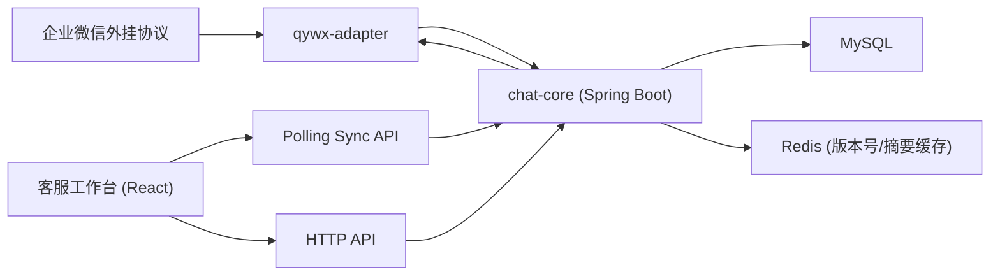

# AI 客服工作台设计方案

- 日期：2026-04-19
- 状态：Review Pending
- 适用范围：企业微信外挂协议接入的 AI 客服工作台
- 推荐方案：`Spring Boot + MySQL + Redis + HTTP Polling + qywx-adapter`

## 1. 背景

当前目标是建设一个 AI 客服工作台，前期主要接入企业微信，通过外挂协议获取聊天记录，并支持员工在工作台中直接回复客户消息。

项目约束如下：

- 前期在线坐席规模预计为几十人，但需要为后期几百坐席预留扩展位。
- 技术栈应尽量简单、易维护、易排障。
- 现有后端团队主栈为 `Java / Spring Boot`。
- 页面核心体验要求是消息尽可能实时展示，同时支持可靠发送、未读提醒和会话排序更新。

## 2. 目标与非目标

### 2.1 目标

第一期系统需要稳定支持以下能力：

1. 企业微信新消息到达后，工作台尽可能实时展示。
2. 员工可在工作台直接回复消息，并看到发送成功或失败状态。
3. 当前未打开的会话如果有新消息，左侧会话列表要更新未读数并自动上浮。
4. 一个员工可管理多个企微账号，通过单一增量轮询接口即可获取其权限范围内的账号、会话和当前聊天窗口变化。
5. 支持多个员工共享账号权限，但通过会话归属机制避免多人同时回复同一客户。
6. 方案需兼容现有 `Spring Boot` 多实例集群，并可继续支撑更高并发和更多坐席规模。

### 2.2 非目标

第一期不把以下能力作为硬性范围：

- 客服内部协同聊天
- 正在输入状态
- 客户已读回执
- AI 自动回复
- 复杂路由调度、排班和绩效体系
- Kafka 级别的大规模事件平台

这些能力需要在第一期核心闭环稳定后按阶段叠加。

## 3. 方案结论

推荐采用如下技术方案：

```text
前端：React 19 + Vite + Antd + axios
后端：Spring Boot
实时链路：HTTP 增量轮询 + HTTP 上行动作
存储：MySQL
缓存与版本：Redis 集群
企微接入：独立 qywx-adapter 适配层
```

明确不推荐第一期采用的方案：

- 不建议整体切换为 `Node` 主栈。原因是语言切换收益不足以覆盖维护成本。
- 不建议第一期直接使用 `WebSocket` 作为唯一实时通道。原因是当前需求可以由轮询满足，过早引入长连接会增加复杂度。
- 不建议第一期引入微服务拆分和 Kafka。规模和复杂度都不匹配。

## 4. 为什么选择纯轮询而不是长连接

当前需求的核心是：

- 页面能在几秒内感知企微新消息
- 员工在浏览器发起发送动作
- 页面感知发送成功或失败
- 会话列表未读数和排序实时更新

这些场景下，纯轮询方案的边界更自然：

- 一个增量轮询接口负责刷新账号角标、会话列表变化、当前打开会话的新消息和发送状态变化
- 其他 HTTP 接口负责初始化数据、历史分页、发送消息、会话领取等命令式操作

该方案的优点：

- 实现简单，后端和前端都容易排障
- 不需要额外维护 SSE 或 WebSocket 长连接
- 更适配现有 Spring Boot 多实例集群和常规网关体系
- 查询、发送、已读、领取等行为仍然是标准接口，不需要设计复杂消息协议
- 后期若确实出现更强实时诉求，仍可在不推翻业务模型的前提下迁移到 `SSE` 或 `WebSocket`

纯轮询方案的前提是：

- 允许 `2-5s` 级别的页面刷新延迟
- 只做增量拉取，不做高频全量刷新
- 前台页面和后台页面采用不同轮询频率

本方案明确不采用基于时间戳的增量游标，而采用 `version / seq` 机制，避免多实例场景下的漏数据、重复数据和边界不稳定问题。

## 5. 产品模型

系统设计必须把“企微账号权限”和“会话归属”拆开，否则后续会出现多人串话和统计失真问题。

### 5.1 企微账号权限

账号权限决定某个员工是否有资格查看某个企微账号下的会话。

特点：

- 一个员工可绑定多个企微账号
- 一个企微账号也可授权给多个员工
- 账号权限只决定“可见/可操作资格”，不直接决定某个客户会话由谁处理

### 5.2 会话归属

会话归属决定某个具体客户会话当前由哪个员工负责。

推荐规则：

1. 新会话默认进入公共池。
2. 员工首次回复时自动领取会话，或显式点击领取后才可发送。
3. 已归属会话的新消息只推给负责人；主管若有查看权限可额外接收只读事件。
4. 未归属会话的新消息可以推给有资格接待该企微账号的在线员工。
5. 会话支持后续转接、释放、重新分配。

第一期建议采用最简单的归属策略：

```text
查看会话允许
发送消息前自动领取
领取成功后成为负责人
负责人之外的人默认不可发送
```

## 6. 总体架构



模块职责：

### 6.1 qywx-adapter

负责所有外挂协议相关能力：

- 接收或拉取企微聊天记录
- 发送企微消息
- 感知企微账号登录状态、在线状态、异常状态
- 将外挂协议字段转换为内部标准事件

该层必须与核心业务隔离，避免外挂协议不稳定直接污染工作台主服务。

### 6.2 chat-core

负责客服工作台核心业务：

- 员工、企微账号、权限和会话归属
- 会话列表和消息历史查询
- 未读数维护
- 发送任务受理与状态流转
- 版本号推进、摘要聚合和轮询结果组装

### 6.3 MySQL

作为业务唯一可信数据源，保存：

- 企微账号信息
- 客户信息
- 会话信息
- 消息内容
- 会话归属
- 未读和已读状态
- 发送任务和失败原因

### 6.4 Redis

第一期是推荐依赖，主要用于：

- 生成全局递增 `version`
- 存储会话摘要缓存和账号角标聚合数据
- 支撑多实例下的增量同步
- 降低轮询直接打 MySQL 重查询的压力

### 6.5 Polling Sync API

负责为员工提供单一增量轮询入口。该接口不返回全量数据，只返回自上次游标以来的变化，包括：

- 账号角标变化
- 当前账号下会话列表变化
- 当前打开会话的新消息
- 消息发送状态变化

页面刷新后仍以 HTTP 初始化接口和 MySQL 数据为准，轮询接口只负责增量同步。

## 7. 轮询策略

轮询必须以员工维度聚合，而不是分别对账号、会话、消息开多个高频轮询。

### 7.1 轮询原则

前端进入工作台后周期性调用：

```text
GET /api/workbench/poll
  ?since_version=123
  &current_account_id=A1
  &active_conversation_id=A1-1
  &active_message_seq=456
```

后端通过登录态识别当前员工，并根据以下上下文返回增量：

- 当前员工可见企微账号的未读角标变化
- 当前账号下会话摘要变化
- 当前打开会话自 `active_message_seq` 以来的新消息
- 当前员工已发送消息的状态变化

### 7.2 为什么不用时间戳做游标

不推荐：

```text
updated_at > since_timestamp
```

原因：

- 同一毫秒内多条变化可能撞时间戳
- 多实例和读写延迟下边界不稳定
- `>` 容易漏数据，`>=` 容易重复数据

因此推荐：

```text
全局增量游标：since_version / next_version
当前会话消息游标：active_message_seq
```

## 8. 打开页面与使用流程

### 8.1 打开或刷新工作台

```text
1. GET /api/me
2. GET /api/qywx-accounts
3. GET /api/workbench/conversations?accountId=A1&page=1&pageSize=30
4. GET /api/workbench/conversations/A1-1/messages?limit=30
5. GET /api/workbench/poll?since_version=0&current_account_id=A1&active_conversation_id=A1-1&active_message_seq=最近一条消息seq
```

说明：

- 首次进入工作台时，账号列表、当前账号会话列表、当前会话最近消息通过普通接口拉取
- 页面随后进入增量轮询
- 轮询周期建议为前台 `2-3s`，后台 `10-30s`

### 8.2 切换企微账号

```text
GET /api/workbench/conversations?accountId=A2&page=1&pageSize=30
```

切换账号时：

- 重新拉该账号下的会话列表
- 若自动定位到某个会话，再拉该会话最近消息
- 轮询参数中的 `current_account_id` 和 `active_conversation_id` 立即切换到新上下文

### 8.3 打开某个会话

```text
GET /api/workbench/conversations/{conversationId}/messages?before_seq=...&limit=30
POST /api/workbench/conversations/{conversationId}/read
```

打开会话后：

- 拉取历史消息
- 清空当前员工对该会话的未读数
- 轮询参数里的 `active_conversation_id` 和 `active_message_seq` 切换到当前会话
- 之后该会话若继续收到消息，由轮询接口的 `active_conversation_messages` 增量追加

### 8.4 员工发送消息

前端先本地插入一条临时消息：

```json
{
  "clientMessageId": "local_1710000000000_ab12",
  "senderType": "agent",
  "contentType": "text",
  "content": "您好",
  "status": "sending"
}
```

随后发送：

```text
POST /api/workbench/messages/send
```

后端返回受理结果后，不阻塞等待外挂协议最终结果；消息最终状态在下一次轮询时通过 `message_status_changes` 回收。

## 9. 轮询响应模型

第一期建议只保留一个增量轮询接口，统一返回以下几类变化。

### 9.1 轮询接口

```text
GET /api/workbench/poll
  ?since_version=123
  &current_account_id=A1
  &active_conversation_id=A1-1
  &active_message_seq=456
```

### 9.2 返回字段

- `next_version`
- `account_changes`
- `conversation_changes`
- `active_conversation_messages`
- `message_status_changes`

示例：

```json
{
  "next_version": 123490,
  "account_changes": [
    {
      "accountId": "A3",
      "unreadCount": 5,
      "lastMessageTime": 1714300002800
    }
  ],
  "conversation_changes": [
    {
      "type": "upsert",
      "id": "A1-5",
      "accountId": "A1",
      "contactName": "张三",
      "contactAvatar": "https://...",
      "unreadCount": 3,
      "lastMessage": "请问发货了吗",
      "lastMessageTime": 1714300002800
    }
  ],
  "active_conversation_messages": [
    {
      "id": "msg_888",
      "convId": "A1-1",
      "content": "请问发货了吗",
      "direction": "in",
      "createdAt": 1714300002800,
      "seq": 889
    }
  ],
  "message_status_changes": [
    {
      "messageId": "msg_777",
      "clientMessageId": "local_1710000000000_ab12",
      "convId": "A1-1",
      "status": "failed",
      "reason": "企微账号离线"
    }
  ]
}
```

### 9.3 前端消费规则

前端按以下规则处理：

1. `account_changes` 用来更新最左侧企微账号角标。
2. `conversation_changes` 用来更新当前账号会话列表的未读数、摘要和排序；`type=remove` 时移出列表。
3. `active_conversation_messages` 直接追加到右侧当前聊天窗口。
4. `message_status_changes` 用来把本地 `sending` 消息更新为 `sent` 或 `failed`。
5. 前端每次处理完成后，把 `next_version` 和最新 `active_message_seq` 存起来，作为下一次轮询参数。

## 10. HTTP API 设计

以下接口为第一期核心接口。

### 10.1 员工与账号

```text
GET /api/me
GET /api/qywx-accounts
```

### 10.2 会话列表

```text
GET /api/workbench/conversations?accountId=A1&page=1&pageSize=30
```

返回字段建议：

- `conversationId`
- `accountId`
- `customerId`
- `customerName`
- `avatar`
- `lastMessage`
- `lastMessageTime`
- `unreadCount`
- `assignedEmployeeId`
- `status`

### 10.3 会话详情

```text
GET /api/workbench/conversations/{conversationId}/messages?before_seq=...&limit=30
POST /api/workbench/conversations/{conversationId}/read
```

### 10.4 增量轮询

```text
GET /api/workbench/poll?since_version=123&current_account_id=A1&active_conversation_id=A1-1&active_message_seq=456
```

### 10.5 会话归属

```text
POST /api/workbench/conversations/{conversationId}/claim
POST /api/workbench/conversations/{conversationId}/release
POST /api/workbench/conversations/{conversationId}/transfer
```

第一期最小可只保留：

```text
POST /api/workbench/conversations/{conversationId}/claim
```

并在发送消息前自动触发领取逻辑。

### 10.6 消息发送

```text
POST /api/workbench/messages/send
```

发送请求体示例：

```json
{
  "clientMessageId": "local_1710000000000_abcd",
  "contentType": "text",
  "content": "您好，请问有什么可以帮您？"
}
```

返回示例：

```json
{
  "messageId": "msg_9002",
  "clientMessageId": "local_1710000000000_abcd",
  "status": "accepted"
}
```

## 11. 数据模型

第一期建议核心表如下。

### 11.1 qywx_account

字段建议：

- `id`
- `external_account_id`
- `name`
- `avatar`
- `status`
- `login_status`
- `last_online_at`
- `created_at`
- `updated_at`

### 11.2 employee_account_permission

字段建议：

- `id`
- `employee_id`
- `account_id`
- `role`
- `created_at`

作用：描述员工与企微账号权限关系。

### 11.3 customer

字段建议：

- `id`
- `external_customer_id`
- `name`
- `avatar`
- `remark`
- `created_at`
- `updated_at`

### 11.4 conversation

字段建议：

- `id`
- `account_id`
- `customer_id`
- `assigned_employee_id`
- `status`
- `last_message_id`
- `last_message_time`
- `conversation_version`
- `created_at`
- `updated_at`

唯一约束建议：

```text
unique(account_id, customer_id)
```

### 11.5 conversation_employee_state

用于存储员工视角的会话状态。

字段建议：

- `id`
- `conversation_id`
- `employee_id`
- `unread_count`
- `last_read_message_id`
- `is_pinned`
- `is_hidden`
- `updated_at`

### 11.6 message

字段建议：

- `id`
- `conversation_id`
- `account_id`
- `customer_id`
- `sender_type`
- `sender_employee_id`
- `content_type`
- `content`
- `status`
- `client_message_id`
- `external_message_id`
- `message_seq`
- `send_time`
- `fail_reason`
- `created_at`
- `updated_at`

说明：

- 入站消息依赖 `external_message_id` 去重
- 出站消息依赖 `client_message_id` 做幂等

### 11.7 message_send_task

字段建议：

- `id`
- `message_id`
- `status`
- `retry_count`
- `next_retry_at`
- `last_error`
- `created_at`
- `updated_at`

### 11.8 workbench_version_cursor

该表不是必须落库，也可以完全由 Redis 生成和管理。

字段或逻辑建议：

- `global_version`
- `conversation_id`
- `conversation_version`
- `account_id`
- `employee_id`

作用：

- 支撑 `since_version -> next_version` 增量轮询
- 支撑多实例下的有序变化同步
- 避免时间戳边界问题

## 12. 状态机与幂等

### 12.1 消息状态

服务端消息状态建议：

```text
queued
sending
sent
failed
```

前端本地可以额外维护：

```text
pending
```

用于请求尚未受理前的临时展示。

### 12.2 增量同步与幂等策略

必须明确以下去重规则：

1. 客户入站消息：`accountId + externalMessageId`
2. 员工发送消息：`employeeId + clientMessageId`
3. 轮询游标：`since_version + next_version`

前端更新消息时：

- 若已拿到正式 `messageId`，优先按 `messageId` 匹配
- 若仍处于本地临时阶段，则按 `clientMessageId` 匹配
- 当前会话增量消息按 `message_seq` 递增处理

## 13. 核心业务链路

### 13.1 客户发来消息

```text
1. qywx-adapter 收到企微消息
2. 转换为内部标准事件
3. chat-core 校验 accountId / customerId / externalMessageId
4. MySQL 事务写入 message，更新 conversation
5. 根据会话归属和账号权限计算目标员工
6. 递增账号和会话相关的 `version`
7. 前端在下一次轮询时拉到 `account_changes / conversation_changes / active_conversation_messages`
```

### 13.2 员工发送消息

```text
1. 前端本地插入 sending 消息
2. POST /api/workbench/messages/send
3. 后端校验员工账号权限
4. 如果会话未归属，尝试自动领取
5. 写入 message 和 message_send_task，状态为 `queued`
6. 接口立即返回 `accepted`
7. 后台异步调用 qywx-adapter 发送
8. 更新发送状态为 `sent` 或 `failed`
9. 递增版本号，等待前端下一次轮询拉回状态变化
```

### 13.3 会话领取

```text
1. 员工显式领取或首次回复触发自动领取
2. 后端通过事务或乐观锁更新 assigned_employee_id
3. 成功后递增会话版本
4. 其他员工工作台在下一次轮询时更新可操作状态
```

## 14. 前端实现建议

前端保持现有 `React 19 + Vite + Antd` 栈，不需要重构基础框架。

建议增加一个轻量状态层，例如 `Zustand`，管理以下数据：

- `accounts`
- `conversationListsByScope`
- `activeAccountId`
- `activeConversationId`
- `messagesByConversationId`
- `pollState`
- `sinceVersion`
- `activeMessageSeq`
- `pendingMessages`

实现原则：

1. 初始渲染和分页都通过 HTTP 获取。
2. 轮询接口只做增量更新，不做全量真相来源。
3. 页面刷新或游标失效后，通过重新拉列表和详情完成补偿。
4. 前端不根据轮询结果直接信任权限变化，所有发送仍由后端最终校验。
5. 前台页面使用 `2-3s` 轮询，后台页面降频到 `10-30s`。
6. 所有轮询都建议增加随机抖动，避免整点打满集群。

## 15. 扩容与部署

### 15.1 当前部署基线

结合现网约束，第一期默认部署基线应为：

```text
chat-core: Spring Boot 多实例集群
qywx-adapter: 独立部署，建议至少多实例或按账号分片部署
MySQL: 集群模式
Redis: 集群模式
轮询请求由各应用实例无状态处理，Redis 保存版本号和摘要缓存
```

说明：

- 不再假设任何单实例部署前提。
- 不依赖任何长连接。
- 网关和负载均衡层只需支持普通 HTTP 请求放量。
- 轮询接口应尽可能命中 Redis 摘要缓存，避免高频重 SQL。

### 15.2 第一阶段推荐的稳妥版本

第一阶段推荐直接按集群形态落地：

```text
Spring Boot 多实例
qywx-adapter 多实例或分片部署
MySQL 集群
Redis 集群
```

原因：

- 与现有 Java 部署模式一致，不引入新的基础设施假设
- 可以直接支撑员工维度的高频增量轮询
- 可以在不改主架构的情况下继续提升实例数和连接数

### 15.3 后期几百坐席

建议演进为：

```text
chat-core 多实例
qywx-adapter 多实例或按账号分片
Redis Pub/Sub 或 Redis Stream 广播版本变化和缓存失效
MySQL 持久化
对象存储保存图片、文件和语音
```

### 15.4 网关与限流要求

轮询部署时需要注意：

- 为轮询接口设置合理限流和监控
- 前台轮询周期建议 `2-3s`，后台页 `10-30s`
- 接口应支持快速返回空增量响应
- 轮询结果应尽量命中 Redis，历史消息分页再查 MySQL
- 多实例下不要依赖本机内存维护同步游标

## 16. 安全与可靠性

### 16.1 权限控制

- 轮询接口不接受前端传入任意 `employeeId`
- 所有员工身份由登录态解析
- 所有发送接口都必须再次校验员工是否拥有账号权限以及会话操作权

### 16.2 一致性原则

- 以 MySQL 为最终真相来源
- 轮询接口失败不影响主流程，客户端按下一个周期重试
- 前端刷新后必须能通过 HTTP 恢复正确状态

### 16.3 失败重试

- 对外挂协议发送失败，记录 `message_send_task`
- 可基于错误类型决定是否允许自动重试
- 第一阶段先支持人工重试即可，自动重试可作为第二阶段增强

## 17. 分阶段实施

### 17.1 Phase 1：核心闭环

交付内容：

- 企微账号列表
- 会话列表
- 消息详情
- 单接口增量轮询
- 员工发送文本消息
- 消息发送成功/失败状态展示
- 左侧未读数和会话上浮
- 会话首次回复自动领取

### 17.2 Phase 2：稳定性增强

交付内容：

- 图片、文件、语音消息
- 发送失败重试
- 企微账号离线告警
- 游标失效补偿
- 多窗口状态同步
- 手动转接与释放会话
- 操作审计

### 17.3 Phase 3：效率与运营

交付内容：

- 自动分配
- 快捷回复
- 客户标签
- 搜索与筛选增强
- 主管看板
- AI 辅助回复

## 18. 最终推荐

本项目第一期最佳方案如下：

```text
使用 Spring Boot 作为核心客服系统
通过独立 qywx-adapter 接入企业微信外挂协议
浏览器与后端之间采用单接口增量轮询和普通 HTTP 动作接口
MySQL 作为唯一可信数据源
Redis 作为当前集群内版本号和摘要缓存层
产品上明确区分账号权限和会话归属，通过公共池 + 自动领取避免多人串话
```

这套方案在当前阶段能用最低复杂度满足实时消息展示、消息发送状态、未读数更新和后续扩展需求，符合“简单、稳、好维护”的目标。
