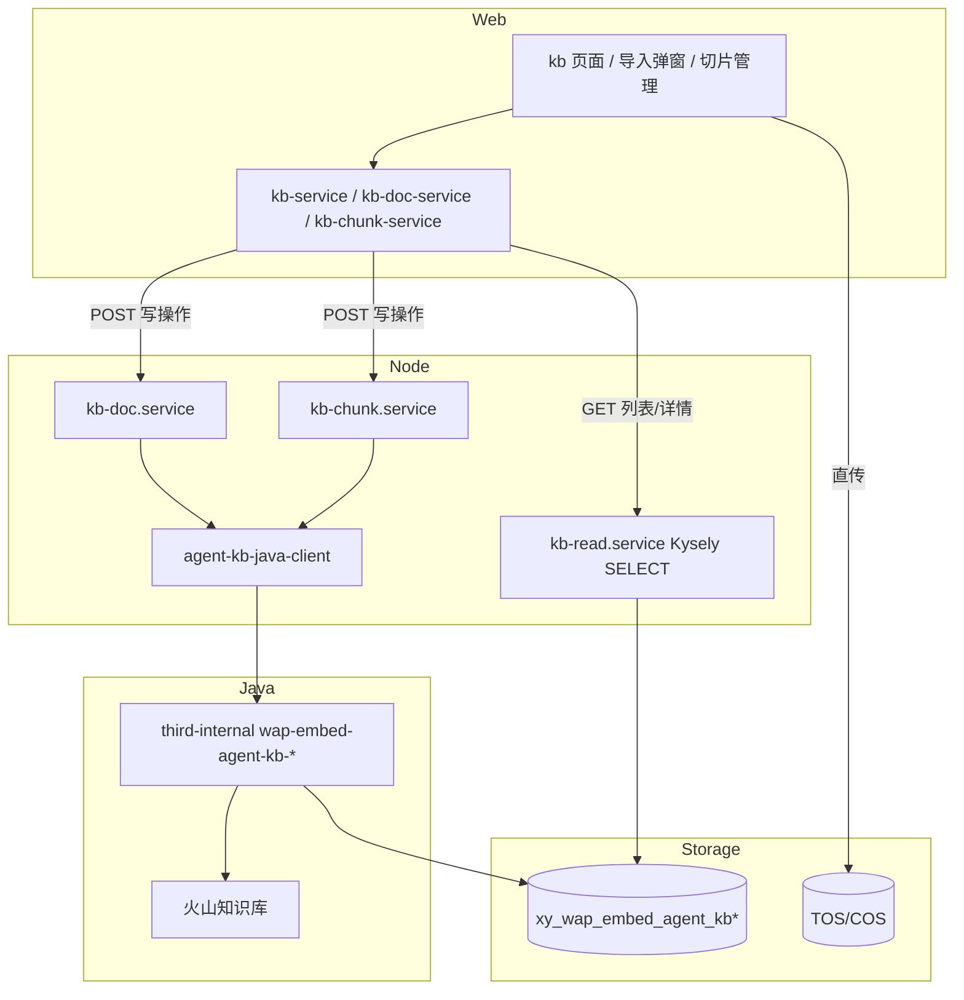

# AI 托管知识库平台集成设计（读表 + Java 写接口）

## 目标

将 AI 托管知识库从 `kb-mock-data.ts` 迁移到真实数据：

1. **读路径**：知识库 / 文档 / 切片列表与详情由 Node 通过 Kysely **只读**查询三张平台表。
2. **写路径**：创建/删除文档、手动增删改切片由 Node 代理调用 Java `third-internal` 接口；Node **不直接 INSERT/UPDATE/DELETE** 平台表。
3. **上传路径**：文件仍由前端 COS/TOS 直传（`type: kb` 凭证），创建文档时只传 `docUrl` + 元信息。

本文是 [kb 文档导入 design](./2026-06-23-knowledge-document-import-design.md) 的上位 spec：导入交互、策略语义映射、TOS 直传细节仍以该文档为准；本文补齐 **全量读写边界、表字段映射、Chunk 管理、Doc 删除、列表读接口**。

## 命名与模块边界

沿用既有约定（见文档导入 spec）。**硬规则：`knowledge` 一律缩写为 `kb`**——新代码、契约、路由、类型、mock store 中禁止出现 `knowledge*` 前缀（智能回复遗留路径见下表「例外」）。

| 统一术语 | 说明 |
| --- | --- |
| `kb` / `kbId` | 知识库（`xy_wap_embed_agent_kb`） |
| `kb-doc` / `docId` | 知识库内单条知识（文档/FAQ/图片，`xy_wap_embed_agent_kb_doc`） |
| `kb-chunk` / `chunkId` | 文档切片（`xy_wap_embed_agent_kb_chunk`） |
| `docType` | `1` FAQ、`2` 文档、`3` 图片 |

| 禁止（新模块） | 改用 |
| --- | --- |
| `knowledgeBaseId` | `kbId` |
| `knowledgeBase` / `KnowledgeBase*` | `kb` / `Kb*` |
| `KnowledgeRecord` / `KnowledgeChunk` | `KbDoc*` / `KbChunk*` |
| `addMockKnowledgeRecord` 等 | `addMockKbDoc` 等 |
| `knowledge-documents` | `kb-docs` |

**例外（仅隔离说明，不扩展、不复用）**：智能回复遗留 `knowledge-*` 路由与 `workbench-java-client` 内 knowledge 方法；已发布 spec 文件名 `knowledge-document-import-design.md` 暂保留，新文档统一 `kb-*` 命名。

**路由前缀**

- Node 公开：`/api/server/ai-hosting/kbs/*`、`/api/server/ai-hosting/kb-docs/*`、`/api/server/ai-hosting/kb-chunks/*`
- Java 内部：`/third-internal/wap-embed-agent-kb-*/*`

**代码落点**

| 层 | 路径 |
| --- | --- |
| Contracts | `packages/contracts/src/ai-hosting/kb.ts`、`kb-doc.ts`、`kb-chunk.ts` |
| Backend 读 | `apps/backend/src/modules/ai-hosting/kb-read.service.ts` |
| Backend 写 | `apps/backend/src/modules/ai-hosting/kb-doc.service.ts`、`kb-chunk.service.ts` |
| Java Client | `apps/backend/src/modules/ai-hosting/agent-kb-java-client.ts`（独立于 `workbench-java-client`） |
| DB 查询 | `apps/backend/src/db/queries/agent-kb*.ts` |
| Web 适配 | `apps/web/src/pages/chat/ai-hosting/api/kb-service.ts`、`kb-doc-service.ts`、`kb-chunk-service.ts` |

**隔离要求**：不扩展智能回复遗留 `knowledge-*` 路径（见上表例外）；`xy_wap_embed_agent_kb*` 三表 **不在** `writable-tables.ts` 白名单，Node 仅 SELECT。

## 数据模型

### 表与职责

| 表 | 用途 | Node 权限 |
| --- | --- | --- |
| `xy_wap_embed_agent_kb` | 知识库集 | 只读 |
| `xy_wap_embed_agent_kb_doc` | 知识文档 | 只读 |
| `xy_wap_embed_agent_kb_chunk` | 文档切片 | 只读 |

### Codegen 现状（已确认）

| 项 | 状态 |
| --- | --- |
| MySQL 库表 | **已存在**（平台侧已建） |
| `apps/backend/scripts/codegen-db.config.json` | **尚未纳入** |
| `apps/backend/src/db/schema.ts` Kysely 类型 | **尚未生成** |
| `writable-tables.ts` | **不纳入**（Node 只读，写走 Java） |

PR1 第一步：将三表名加入 `codegen-db.config.json`，在可连 `DATABASE_URL` 的环境执行 `pnpm backend:db:codegen` 生成类型，再编写 SELECT 查询。

写入、逻辑删、同步状态变更均由 Java 侧完成；前端通过手动刷新列表感知状态变化（`sync_status` 轮询见「待确认项」）。

### 文档类型 `doc_type`

| DB `doc_type` | 含义 | 前端 `type` | 创建入口 |
| --- | --- | --- | --- |
| `1` | FAQ | `qa` | `ImportQaDialog` |
| `2` | 文档 | `document` | `ImportDocumentDialog` |
| `3` | 图片 | `image` | `ImportImageDialog` |

### 文档同步状态 `sync_status` → 前端展示

| DB `sync_status` | 含义 | 前端 `status` | 展示文案 |
| --- | --- | --- | --- |
| `-1` | 未同步 | `queued` | 排队中 |
| `0` | 成功 | `completed` | 已完成 |
| `1` | 失败 | `failed` | 失败 |
| `2` | 排队中 | `queued` | 排队中 |
| `3` | 更新中 | `parsing` | 解析中 |
| `5` | 删除中 | `parsing` | 删除中 |
| `6` | 处理中 | `parsing` | 处理中 |

失败时附带 `sync_error_msg`（截断至 200 字展示）。

### 切片来源 `source` → 是否可编辑

| DB `source` | 含义 | 前端 `source` | 可编辑 | 可删除 |
| --- | --- | --- | --- | --- |
| `1` | 手动添加 | `manual` | 是（text/faq） | 是（联动云端 deletePoint） |
| `2` | 批量上传/文档解析 | `system` | **否** | 是（仅本地逻辑删） |
| `3` | 聊天侧边栏 | `sidebar` | 视 `type` | 是 |

Java 约束：**系统生成切片（`chunk_source=system`）不可编辑**，对应 DB `source = 2`。

### 切片类型

Java `chunkType`：`text` / `faq` / `image`（**仅 text、faq 支持手动新增**）。

| Java `chunkType` | 适用 `doc_type` | `title` 语义 | `content` 语义 |
| --- | --- | --- | --- |
| `text` | `2` 文档 | 切片标题（可选，≤256） | 切片正文 |
| `faq` | `1` FAQ | 问题（≤256） | 答案 |
| `image` | `3` 图片 | — | 不支持手动新增 |

DB `type` 字段为火山返回的细粒度类型（`text`、`faq`、`doc-image` 等）；Node 读接口额外输出归一化 `chunkType` 供 UI 分支。

### 操作人 `operatorId`

所有 Java 写接口必填 `operatorId`，取当前登录子账号 ID（`ownerUserId` / JWT `subUserId`），Node 从 session 注入，前端不传。

## 策略 ID 映射

**仅文档创建（`docType = 2`）**需要策略：前端传语义配置（`parseMode` + `chunkStrategy` + `chunkParams`），Node 在 `kb-doc-strategy-mappers.ts` 映射为 **火山资源 ID**（`kb-strategy-*`），作为 Java `volcStrategyResourceId` 入参。

**FAQ（`docType = 1`）、图片（`docType = 3`）创建时不传 `volcStrategyResourceId`**，由 Java 侧按 `docType` 使用默认策略。

> 当前 Java 对接实测：`volcStrategyResourceId` 直接传 `kb-strategy-*` 字面量；语义 key（如 `chat_kd_common_2000`）仅作对照，Node 不传给 Java。

### 文档导入策略映射（`docType = 2`）

| parseMode | chunkStrategy | chunkParams | 语义 key（对照） | 火山资源 ID（Node 传 Java） |
| --- | --- | --- | --- | --- |
| `standard` | `length` | `maxLength: 2000` | `chat_kd_common_2000` | `kb-strategy-233abb0cd67b8429` |
| `standard` | `length` | `maxLength: 1000` | `chat_kd_common_1000` | `kb-strategy-bb86846bd8964b93` |
| `standard` | `length` | `maxLength: 500` | `chat_kd_common_500` | `kb-strategy-309dc4df244db26d` |
| `standard` | `separator` | `separator: newline` | `chat_kd_common_n` | `kb-strategy-c0593b44acfbc5e8` |
| `enhanced` | `length` | `maxLength: 2000` | `chat_kd_ocr_2000` | `kb-strategy-e1e2a815d50c4692` |
| `enhanced` | `length` | `maxLength: 1000` | `chat_kd_ocr_1000` | `kb-strategy-d4a3777d577b8e32` |
| `enhanced` | `length` | `maxLength: 500` | `chat_kd_ocr_500` | `kb-strategy-51899c0babcd5d25` |
| `enhanced` | `separator` | `separator: newline` | `chat_kd_ocr_n` | `kb-strategy-76c06c05cf06ac2c` |

实现落点：`kb-doc-strategy-mappers.ts`（已存在，映射结果为 `kb-strategy-*`；**仅** `docType = 2` 调用）。

### FAQ / 图片创建

| `docType` | `volcStrategyResourceId` | 说明 |
| --- | --- | --- |
| `1` FAQ | **不传** | 批量导入 FAQ，无前端切片配置 |
| `3` 图片 | **不传** | 仅传 `name`、`description`、`docUrl`、`docSuffix` |

Node 调 Java `wap-embed-agent-kb-doc/create` 时，FAQ/图片 Form **省略** `volcStrategyResourceId` 字段。

## 架构总览



## 响应规范

kb 模块涉及两层 envelope，**不要混用**。

### Node 公开接口 `/api/server/ai-hosting/*`

与全站 `/api/server/*` 一致，使用 `@chatai/contracts` 的 `apiSuccess()` 与统一错误处理（见 `apps/web/src/lib/request.ts`）。

**成功**（HTTP 2xx）：

```json
{
  "success": true,
  "data": {}
}
```

**失败**（HTTP 4xx / 5xx）：

```json
{
  "success": false,
  "error": {
    "code": "KB_DOC_NOT_FOUND",
    "message": "知识不存在"
  }
}
```

路由返回 `return apiSuccess(payload)`；业务/鉴权/上游失败抛 `BadRequestError` / `ForbiddenError` / `BadGatewayError` 等，由 Fastify 错误插件序列化为上述结构。**Node 公开响应不含 `errorMsg` 顶层字段**（与 Java 区分）。

### Java 内部接口 `/third-internal/*`

与现有 `workbench-java-client` 一致（`JavaApiResponse`），**禁止**在 spec 或实现中改用 `{ code, message, data }` 写法：

```json
{
  "success": true,
  "error": 0,
  "errorMsg": "",
  "data": {}
}
```

| 字段 | 类型 | 说明 |
| --- | --- | --- |
| `success` | `boolean` | 部分接口与 `error` 并用；以 `error === 0` 为准判定成功 |
| `error` | `number` | `0` 表示成功；非 0 为业务错误码 |
| `errorMsg` | `string` | 失败时的可读文案；成功时通常为空字符串 |
| `data` | 各接口定义 | 业务载荷，如 `Long` docId、`Boolean` 删除结果 |

`agent-kb-java-client` 复用与 `workbench-java-client` 相同的 envelope 判定（`success === true` 或 `error === 0`）；解析失败或 `error !== 0` 时映射为 Node 502 / 业务错误，**不把 Java envelope 原样返回给浏览器**。

## Node 公开接口（读）

鉴权：Bearer JWT + session。所有读接口按 `uid`（子账号归属租户）过滤，`status = 1`。

### 知识库列表

```
GET /api/server/ai-hosting/kbs?page=&pageSize=&query=
```

响应项（`KbListItem`）：

| 字段 | 来源列 | 说明 |
| --- | --- | --- |
| `kbId` | `id` | 字符串 |
| `name` | `name` | |
| `description` | `remark` | |
| `createdAt` | `create_time` | ISO / 本地格式化由前端处理 |
| `updatedAt` | `update_time` | |

### 知识库详情（可选，首期列表字段已够可省略）

```
GET /api/server/ai-hosting/kbs/:kbId
```

### 知识文档列表

```
GET /api/server/ai-hosting/kbs/:kbId/docs?page=&pageSize=&query=&docType=
```

响应项（`KbDocListItem`）：

| 字段 | 来源列 | 说明 |
| --- | --- | --- |
| `docId` | `id` | |
| `kbId` | `kb_id` | |
| `name` | `name` | |
| `docType` | `doc_type` | 归一化为 `qa` / `document` / `image` |
| `docSuffix` | `doc_suffix` | |
| `docUrl` | `doc_url` | 对象路径，展示 URL 走 `buildMediaAssetUrl` |
| `description` | `remark` | |
| `sliceCount` | `point_num` | 可 null（处理中） |
| `status` | `sync_status` | 见上映射 |
| `statusMessage` | `sync_error_msg` | 失败时 |
| `createdAt` | `create_time` | |
| `updatedAt` | `update_time` | |

### 知识文档详情

```
GET /api/server/ai-hosting/kb-docs/:docId
```

在列表字段基础上增加 `volcDocId`（只读排障，前端默认不展示）。

### 切片列表

```
GET /api/server/ai-hosting/kb-docs/:docId/chunks?page=&pageSize=&query=
```

响应项（`KbChunkListItem`）：

| 字段 | 来源列 | 说明 |
| --- | --- | --- |
| `chunkId` | `id` | |
| `docId` | `doc_id` | |
| `kbId` | `kb_id` | |
| `chunkType` | `type` 归一化 | `text` / `faq` / `image` / … |
| `source` | `source` | `manual` / `system` / `sidebar` |
| `title` | `title` | FAQ 时为问题 |
| `content` | `content` | FAQ 时为答案；可截断预览 |
| `description` | `description` | 图片描述 |
| `editable` | 派生 | `source === manual` 且 `chunkType` ∈ {text, faq} |
| `createdAt` | `create_time` | |
| `updatedAt` | `update_time` | |

搜索：`query` 匹配 `title`、`content`（LIKE，走 `idx_uid_title`）。

## Node 公开接口（写）

写接口统一由 Node 注入 `uid`、`operatorId`；前端 body 不传这两项。

### 上传凭证（已有）

```
POST /api/server/ai-hosting/kb-docs/upload-credential
```

见文档导入 spec；`type: kb`。

### 创建知识文档（扩展）

```
POST /api/server/ai-hosting/kb-docs/create
```

**文档（`docType = 2`）**：沿用 `KbDocCreateRequest`（含 `parseMode`、`chunkStrategy`、`chunkParams`）。

**FAQ（`docType = 1`）** — 新增契约 `KbDocCreateFaqRequest`：

```ts
{
  kbId: string;
  name: string;
  docUrl: string;
  docSuffix: string; // 固定 faq 或 xlsx 规则见导入弹窗
  description?: string;
}
```

**图片（`docType = 3`）** — 新增 `KbDocCreateImageRequest`：

```ts
{
  kbId: string;
  name: string;
  docUrl: string;
  docSuffix: string;
  description: string; // 图片描述，参与检索
}
```

Node 流程：

1. 校验归属与字段
2. 文档类（`docType = 2`）：`resolveVolcStrategyResourceId` → 写入 Java Form 的 `volcStrategyResourceId`（`kb-strategy-*`）；FAQ/图片：**不传**该字段
3. 调 Java `wap-embed-agent-kb-doc/create`（Form）
4. 返回 `{ docId: string }`

### 删除知识文档

```
POST /api/server/ai-hosting/kb-docs/:docId/delete
```

无 body。Node 调 Java `wap-embed-agent-kb-doc/del`。

错误码透传：

| Java / 业务 | Node 错误码 | 用户提示 |
| --- | --- | --- |
| `DOC_NOT_FOUND` | `KB_DOC_NOT_FOUND` | 知识不存在 |
| `VDB_CALL_FAILED` | `AI_HOSTING_INTERNAL_API_FAILED` | 删除失败，请稍后重试 |

### 新增切片

```
POST /api/server/ai-hosting/kb-chunks
```

```ts
{
  docId: string;
  chunkType: "text" | "faq";
  title?: string;   // faq 时必填（问题）
  content: string;  // faq 时为答案
}
```

校验：

- `title` 最长 256
- `docId` 归属当前 `uid`
- 父文档 `doc_type` 与 `chunkType` 匹配（文档→text，FAQ→faq）
- 图片文档拒绝手动新增

Java：`POST /third-internal/wap-embed-agent-kb-chunk/add`

### 编辑切片

```
POST /api/server/ai-hosting/kb-chunks/:chunkId/update
```

```ts
{
  title?: string;
  content: string;
}
```

Node 先查库校验 `source !== system`（`source = 2` 拒绝）；Java：`POST .../update`（仅 title/content）。

### 删除切片

```
POST /api/server/ai-hosting/kb-chunks/:chunkId/delete
```

Java：`POST .../del`（manual 联动云端 deletePoint；system 仅本地逻辑删）。

## Java 内部接口摘要

Envelope 见上文「响应规范 · Java 内部接口」：`{ success, error, errorMsg, data }`，`error === 0` 为成功。

### Chunk

| 接口 | 说明 | data |
| --- | --- | --- |
| `POST /third-internal/wap-embed-agent-kb-chunk/add` | 手动新增 text/faq | `Long` chunkId |
| `POST /third-internal/wap-embed-agent-kb-chunk/update` | 编辑 title/content | `Boolean` |
| `POST /third-internal/wap-embed-agent-kb-chunk/del` | 删除 | `Boolean` |

### Doc

| 接口 | 说明 | data |
| --- | --- | --- |
| `POST /third-internal/wap-embed-agent-kb-doc/create` | 创建 FAQ/文档/图片 | `Long` docId |
| `POST /third-internal/wap-embed-agent-kb-doc/del` | 删除文档 | `Boolean` |

**create 请求（Form）**

| 字段 | 文档 | FAQ | 图片 |
| --- | --- | --- | --- |
| `uid` | Node 注入 | 同左 | 同左 |
| `kbId` | 是 | 是 | 是 |
| `docType` | `2` | `1` | `3` |
| `docUrl` | TOS 路径 | 同左 | 同左 |
| `docSuffix` | 是 | 是 | 是 |
| `name` | 是 | 是 | 是 |
| `description` | 可选 | 可选 | 建议必填 |
| `volcStrategyResourceId` | `kb-strategy-*`（必填） | **不传** | **不传** |
| `operatorId` | Node 注入 | 同左 | 同左 |

## 前端改造要点

| 页面/组件 | 现状 | 目标 |
| --- | --- | --- |
| `kb-list-page` | mock | `GET kbs` |
| `kb-detail-page` | mock | `GET kbs/:kbId/docs`；三种导入成功后刷新列表 |
| `kb-doc-detail-page` | mock chunks | `GET kb-docs/:docId/chunks`；增删改接写接口 |
| `ImportDocumentDialog` | `importKbDoc` 已接 Node | 去掉 mock 列表插入，改刷新 API |
| `ImportQaDialog` / `ImportImageDialog` | 仅 COS + mock 插入 | 增加 `createKbDoc`（docType 1/3） |
| `add-chunk-dialog` / `edit-chunk-dialog` | mock store | `kb-chunk-service` |

**ID 类型**：DB/Java 为 `bigint`，契约与路由 param 统一 **字符串**，避免 JS 精度问题。

**路由 param（已确认）**：页面路由统一使用 `:kbId`，在 **PR1** 一并替换现有 `:knowledgeBaseId`：

```
/chat/ai-hosting/kb/:kbId
/chat/ai-hosting/kb/:kbId/docs/:docId
```

涉及 `apps/web/src/router/index.tsx`、`kb-detail-page`、`kb-doc-detail-page` 及链接跳转；`useParams()` 解构字段名同步改为 `kbId`。

**渐进迁移**：可先接读接口替换列表，写接口就绪后逐个替换导入与切片操作；期间读接口与 mock 勿长期双写。

## 错误处理（补充）

| 场景 | HTTP | 错误码 | 用户提示 |
| --- | --- | --- | --- |
| kb/doc/chunk 不存在或 uid 不匹配 | 404 | `KB_NOT_FOUND` / `KB_DOC_NOT_FOUND` / `KB_CHUNK_NOT_FOUND` | 资源不存在 |
| 编辑 system 切片 | 403 | `KB_CHUNK_NOT_EDITABLE` | 系统切片不可编辑 |
| 图片文档手动加切片 | 400 | `INVALID_KB_CHUNK_TYPE` | 当前文档不支持手动新增切片 |
| Java 调用失败 / `error !== 0` | 502 | `AI_HOSTING_INTERNAL_API_FAILED` | 优先使用 Java `errorMsg`，否则默认文案 |
| Node 参数校验 | 400 | `INVALID_*` | 校验失败文案 |

## 测试要求

### Contracts

- `kb.ts`：列表/详情 DTO
- `kb-chunk.ts`：增删改请求/响应
- 扩展 `kb-doc.ts`：FAQ/图片创建、删除

### Backend

- `agent-kb-java-client.test.ts`：Form/JSON 序列化、响应 mapper
- `kb-read.service.test.ts`：uid 隔离、status 过滤、sync_status 映射
- `kb-doc.routes.test.ts`：create 三类型（文档含策略 key、FAQ/图片不含 `volcStrategyResourceId`）、delete
- `kb-chunk.routes.test.ts`：add/update/del、system 不可编辑

### Web

- `ai-hosting-pages.test.tsx`：列表/切片流程改 mock API
- 导入弹窗：创建成功后列表刷新（不再 `addMockKbDoc` 等 mock 插入）

## 实现切片与 PR 拆分建议

### 建议拆分（4 个 PR，按依赖顺序）

| PR | 范围 | 可独立验证 | 依赖 |
| --- | --- | --- | --- |
| **PR1 读层 + 契约** | 三表加入 `codegen-db.config.json` 并 `pnpm backend:db:codegen`；Kysely SELECT、`GET kbs` / `docs` / `chunks`、`kb-service` 接列表页；**路由 param 统一为 `:kbId`** | 库表已有，codegen + 读接口可联调 | 无 |
| **PR2 Doc 写 + Java Client 基础** | `agent-kb-java-client` create/del、`POST kb-docs/create` 接 Java（替换 mock）、三导入弹窗创建 + 删除文档 | Java create/del 可用 | PR1 可选（仅写可不依赖读） |
| **PR3 Chunk 写** | `kb-chunk` 路由 + Java add/update/del、切片详情页接线 | Chunk 接口可用 | PR1（列表展示真实切片） |
| **PR4 清理** | 移除 `kb-mock-data`；mock 类型 / store 字段统一 `kb*`（如 `KnowledgeRecord`→`KbDoc*`、`knowledgeBaseId` 字段→`kbId`） | 全链路回归 | PR1–PR3 |

### 是否需要拆分？

**建议拆分**，理由：

1. **读/写解耦**：表结构稳定后，PR1 可先让产品看到真实列表；写接口 Java 未就绪时不阻塞读层。
2. **风险面**：Java Client + 三种 `docType` 创建与 Chunk 三路写操作混在一起难 review；当前分支已含 COS 上传，再叠全量写接口 PR 过大。
3. **与现有 PR 关系**：`feat/agent-management-kb-upload` 已完成 TOS 直传与导入 UI，**PR2 宜在其上追加 Java create**，而非另起炉灶。
4. **可合并的情况**：若 Java 五个写接口同时就绪且人力紧，可将 **PR2 + PR3 合并为「KB 写操作」**，但不建议与 PR1 合并。

### 不建议拆得过细

- 不必为 FAQ / 图片 / 文档各开一个 PR（共用 `agent-kb-java-client.createKbDoc`，仅 `docType` 与是否传 `volcStrategyResourceId` 不同）。
- 不必 Chunk 增删改各一 PR（同一 service + 路由模块）。

## 非目标

- Node 直写 `xy_wap_embed_agent_kb*` 表
- 知识库集（`xy_wap_embed_agent_kb`）的创建/编辑/删除（平台或其他接口维护）
- 切片内容 Markdown/HTML 预览渲染（`md_content` / `html_content`）
- XXL-Job 进度推送、失败重试 UI
- 智能回复遗留 `knowledge-*` 模块下线（非本 kb 模块）

## 待确认项

| 项 | 说明 |
| --- | --- |
| `sync_status` 列表轮询 | 首期**不实现**；`sync_status` 为排队/处理中时是否自动轮询 docs 列表（如 5s），待产品确认 |
| `operatorId` 类型 | Java 文档写 `string`，DB 为 `int`，以 Java 实际校验为准 |

## 与现有 spec 关系

| 文档 | 关系 |
| --- | --- |
| [kb 文档导入 design](./2026-06-23-knowledge-document-import-design.md)（文件名暂保留 `knowledge`） | 文档导入 UI、parseMode、TOS 直传、策略 8 组映射；P0 mock 章节在 PR2 完成后作废 |
| 本文 | 全平台读表 + 全量写接口 + Chunk 管理 + PR 拆分 |
