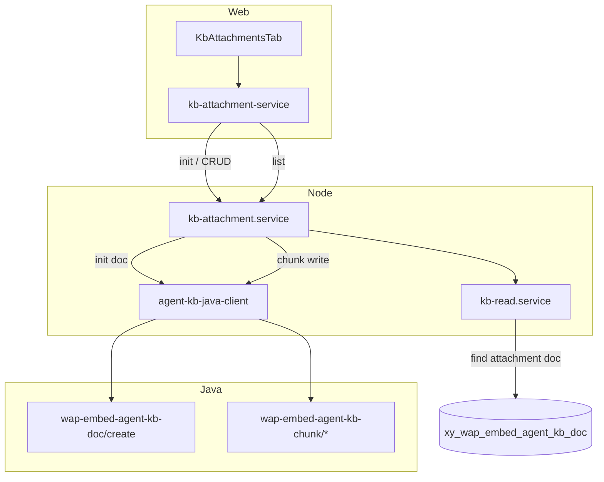

# 知识库附件库联调设计

## 目标

将知识库详情页「附件」Tab 从当前 **localStorage + 本地 state 占位** 联调到真实数据：

1. **初始化**：每个知识库首次使用时创建一条 `docType = 4`（附件）的虚拟文档，作为该库附件切片容器。
2. **CRUD**：每条附件对应附件文档下的一条 **手动切片（chunk）**，通过 Java chunk 写接口持久化；读列表走 Java chunk 分页接口。
3. **字段承载**：切片新增 `attachmentType` + `attachmentContent`（Object），用于挂载图片 / 视频 / 文件 / 链接 / 小程序。
4. **批量删除**：**首版不做**；无专用批量接口、不做删除后轮询；后续若做，仍为循环单删 + 刷新列表（单次最多 20 条）。

本文是 [AI 托管知识库平台集成设计](./2026-06-23-agent-kb-platform-integration-design.md) 的增量 spec，仅覆盖 **附件库** 场景；FAQ / 文档 / 图片 doc 与 chunk 行为不变。

## 现状

| 项 | 状态 |
| --- | --- |
| 前端 UI | `KbAttachmentsTab` / `KbAddAttachmentDialog` / `KbAttachmentsTable` 已完成，数据为组件内 mock |
| 初始化态 | `localStorage` key `kb-attachments-init:{kbId}`，未调后端 |
| 附件类型枚举 | `KB_ATTACHMENT_TYPE`：1 图片、2 视频、3 文件、4 链接、5 小程序 |
| 附件 payload 结构 | 复用快捷回复 `QuickReplyDraftAttachment` / `WorkbenchQuickReplyAttachment` |
| 后端 chunk 写路径 | 已有 `agent-kb-java-client` + `kb-chunk.service`，**未**传 `attachmentType` / `attachmentContent` |
| `docType = 4` | 平台/Java 已支持；Node contracts 与 mapper **尚未**纳入 |

## 命名与模块边界

沿用 `kb` 缩写与既有落点：

| 层 | 路径 |
| --- | --- |
| Contracts | `packages/contracts/src/ai-hosting/kb-attachment.ts`（新增）、扩展 `kb.ts` / `kb-chunk.ts` |
| Backend 读 | `kb-read.service.ts`（附件 doc 查询、chunk 列表复用 Java page） |
| Backend 写 | `kb-attachment.service.ts`（新增：init / create / update / delete） |
| Java Client | `agent-kb-java-client.ts`（chunk add/update/page 增字段；doc create 支持 `docType = 4`） |
| Web 适配 | `apps/web/src/pages/chat/ai-hosting/api/kb-attachment-service.ts`（新增） |
| Web UI | `kb-attachments-tab.tsx` 等，替换 mock 为 API |

**路由前缀**

- Node 公开（新增）：`/api/server/ai-hosting/kbs/:kbId/attachments/*`、`/api/server/ai-hosting/kb-attachments/*`
- Java 内部（变更）：`/third-internal/wap-embed-agent-kb-chunk/*`（3 个接口增字段）；`/third-internal/wap-embed-agent-kb-doc/create`（`docType = 4`）

## 数据模型

### 文档类型扩展

| DB `doc_type` | 含义 | 前端 `docType` | 说明 |
| --- | --- | --- | --- |
| `1` | FAQ | `qa` | 不变 |
| `2` | 文档 | `document` | 不变 |
| `3` | 图片 | `image` | 不变 |
| `4` | 附件 | `attachment` | **新增**；每个 `kbId` 至多一条活跃附件 doc |

**约束**

- 附件 doc **不在**知识列表 Tab 展示（读 doc 列表时 `docType != attachment`，或 UI 过滤）。
- 附件 doc 名称固定，如 `__kb_attachment__`（Node 写死，前端不可改）。
- 附件 doc **不提供**手动删除入口；随知识库生命周期由平台侧管理（首期 Node 不暴露删除附件 doc API）。

### 附件 doc 初始化

调用已有 Java doc 创建接口，**无需上传文件、不走 TOS 直传**；仅使用固定占位链接创建虚拟 doc。

```
POST /third-internal/wap-embed-agent-kb-doc/create  (Form)
```

| 字段 | 值 | 说明 |
| --- | --- | --- |
| `uid` | Node 注入 | |
| `kbId` | 当前知识库 | |
| `docType` | `4` | 附件 |
| `docSuffix` | `txt` | **固定** |
| `docUrl` | `https://b5.bokr.com.cn/dist/demo.txt` | **固定占位 URL**，写入 `kb-attachment.constants.ts` |
| `docSize` | `0` | 无真实文件 |
| `name` | `__kb_attachment__` | Node 写死 |
| `operatorId` | Node 注入 | |
| `description` | 可省略 | |
| `volcStrategyResourceId` | **不传** | 同 FAQ / 图片 |

**同步状态**：init 创建附件 doc 后，前端需轮询该 doc 的 `sync_status`，**间隔 5s**；Node 通过现有 doc 读接口返回真实状态（映射为 `queued` / `parsing` / `completed` / `failed`），**不得**在前端硬编码为 `completed`。

- `queued` / `parsing`：附件 Tab 展示同步中态，禁用添加/编辑/删除
- `completed`：进入正常附件列表（可能为空）
- `failed`：展示失败态；若平台支持，可提供重试入口（复用 doc retry）

Node 流程：

1. 查 `xy_wap_embed_agent_kb_doc`：`kb_id = ? AND doc_type = 4 AND status = 1`
2. 已存在 → 返回 `{ docId, initialized: true, status }`（幂等）
3. 不存在 → 调 Java create → 返回 `{ docId, initialized: true, status }`

**前端**：点击「开始初始化」调 Node init 接口；若 `status` 未完成则每 5s 轮询 doc 状态，完成后进入附件列表态。

### 附件 = 切片

每个知识库附件 doc 下，**一条附件 = 一条手动 chunk**：

| 前端 `KbAttachmentItem` | Chunk / Java 字段 | 说明 |
| --- | --- | --- |
| `id` | `chunkId` | 字符串化 `id` |
| `attachmentType` | `attachmentType` | 1–5 |
| `description` | `content` | 检索用描述文案 |
| `title` + `payload` | `title` + `attachmentContent` | 见下节 |
| `createdAt` | `createTime` | Java page 返回 |
| `fileSizeLabel` / `subtitle` | 从 `attachmentContent` 派生 | 只读展示 |

**`chunkType`**：附件 doc 下手动新增时使用 **`text`**（与平台「仅 text/faq 可手动新增」一致；附件语义由 `attachmentType` 区分）。若联调时 Java 要求其他值，以平台反馈为准。

**`source`**：手动添加固定为 `manual`（DB `source = 1`），可编辑、可删除。

## 新增字段定义（Java / Node 契约）

### `attachmentType`

| 值 | 含义 | 前端 `KB_ATTACHMENT_TYPE` |
| --- | --- | --- |
| `1` | 图片 | `IMAGE` |
| `2` | 视频 | `VIDEO` |
| `3` | 文件 | `FILE` |
| `4` | 链接 | `LINK` |
| `5` | 小程序 | `MINI_PROGRAM` |

TypeBox：`KbAttachmentTypeSchema = Union(1, 2, 3, 4, 5)`

### `attachmentContent`

**类型：`Object`（JSON）**，非字符串。

空对象 `{}` 仅用于占位/初始化场景；**正常创建/编辑附件时必须为非空对象**，且结构与快捷回复附件 payload 对齐，便于复用现有素材选择与预览组件。

推荐结构（与 `WorkbenchQuickReplyAttachment` 一致）：

```ts
type KbAttachmentContent = {
  type: "image" | "file" | "h5" | "weapp"; // 视频与文件均为 type=file，业务类型看 attachmentType
  materialCollectionId?: string;
  msgInfoId?: string;
  msgid?: string;
  content: Record<string, unknown>; // 各类型字段同 quick-reply-content.ts
};
```

**`attachmentType` → `attachmentContent.type` 映射**

| attachmentType | content.type | 必填字段（Node 校验，复用 quick-reply 规则） |
| --- | --- | --- |
| 1 图片 | `image` | `content.fileUrl` |
| 2 视频 | `file` | `materialCollectionId`、`msgInfoId`、`content.fileName`、`content.fileUrl` |
| 3 文件 | `file` | 同视频 |
| 4 链接 | `h5` | `materialCollectionId`、`msgInfoId`、`content.title`、链接 URL 字段之一 |
| 5 小程序 | `weapp` | `materialCollectionId`、`msgInfoId` |

**视频 / 文件区分**：`attachmentContent.type` 均为 `file`；检索、推荐与 UI Tab 筛选 **仅依赖 `attachmentType`**（2 视频 vs 3 文件），不在 payload.type 上再区分。

**条件必填（业务约定）**

| 场景 | attachmentType | attachmentContent |
| --- | --- | --- |
| 普通附件 CRUD | 必填 | 必填，且通过上表校验 |
| 非附件 chunk（FAQ/文档） | 不传 / omit | 不传 / omit |
| 附件 doc 占位 doc 创建 | — | —（不涉及 chunk） |

**互斥**：FAQ/文档/图片 doc 下的 chunk **不得**携带 `attachmentType` / `attachmentContent`；附件 doc 下的 chunk **必须**同时携带且合法。

## Java 内部接口变更

Envelope 不变，见上位 spec。

### 1. 手动新增切片

```
POST /third-internal/wap-embed-agent-kb-chunk/add
```

**请求新增字段**

| 字段 | 类型 | 必填 | 说明 |
| --- | --- | --- | --- |
| `attachmentType` | Integer | 条件必填 | 见上 |
| `attachmentContent` | Object | 条件必填 | JSON 对象 |

其余字段不变：`uid`、`docId`、`chunkType`、`title`、`content`、`operatorId`。

附件库调用示例：

```json
{
  "uid": 9001,
  "docId": 12345,
  "chunkType": "text",
  "title": "产品说明书.pdf",
  "content": "产品安装说明附件",
  "attachmentType": 3,
  "attachmentContent": {
    "type": "file",
    "materialCollectionId": "mc-1",
    "msgInfoId": "msg-1",
    "content": {
      "fileName": "产品说明书.pdf",
      "fileUrl": "https://..."
    }
  },
  "operatorId": "101"
}
```

### 2. 手动编辑切片

```
POST /third-internal/wap-embed-agent-kb-chunk/update
```

**请求新增字段**：同 add。

**校验规则（Java 侧，Node 镜像校验）**

- 原 chunk 无附件字段 → 不允许仅 update 单侧字段（type/content 必须成对出现或成对省略）。
- 原 chunk 有附件 → 新增/全量更新时 `attachmentType` 与 `attachmentContent` 成对必填。
- **仅改描述**：允许只传 `content`（描述），**不传** `attachmentContent`；Java 保留原附件 payload。
- `attachmentType` 变更时，`attachmentContent` 结构必须与新类型匹配。
- 系统切片（`source = 2`）仍不可编辑（上位 spec 不变）。

### 3. 分页查询切片

```
POST /third-internal/wap-embed-agent-kb-chunk/page
```

**请求新增字段**

| 字段 | 类型 | 必填 | 说明 |
| --- | --- | --- | --- |
| `attachmentType` | Integer | 否 | 按附件类型过滤；附件列表 Tab 切换时传入 1–5 |

**响应 list 项新增字段**

| 字段 | 类型 | 说明 |
| --- | --- | --- |
| `attachmentType` | Integer \| null | 无附件时为 null |
| `attachmentContent` | Object \| null | 无附件时为 null |

其余字段不变。Node `mapJavaChunkPageItem` 增加附件字段映射；附件列表读路径 **仅消费带 `attachmentType` 的项**。

### 4. 删除切片

```
POST /third-internal/wap-embed-agent-kb-chunk/del
```

**无变化**。单条删除走此接口；批量删除首版不做，后续仍为多次调用此接口。

## Node 公开接口

鉴权、envelope、错误码与上位 spec 一致。写接口 Node 注入 `uid`、`operatorId`。

### 初始化附件库

```
POST /api/server/ai-hosting/kbs/:kbId/attachments/init
```

无 body。

响应：

```ts
{
  docId: string;
  initialized: boolean; // 本次新建 true；已存在也为 true
  status: "queued" | "parsing" | "completed" | "failed"; // 附件 doc 当前 sync 态
}
```

### 附件列表（分页）

```
GET /api/server/ai-hosting/kbs/:kbId/attachments?page=&pageSize=&query=&attachmentType=
```

| Query | 说明 |
| --- | --- |
| `attachmentType` | **必填**，1–5，对应当前类型 Tab |
| `query` | 可选，匹配 chunk `title` / `content`（描述） |
| `page` / `pageSize` | 分页，默认 `pageSize = 20` |

Node 内部：

1. 解析附件 docId（无 doc → 404 `KB_ATTACHMENT_NOT_INITIALIZED`）
2. 调 Java chunk page（`docId`、`page`、`pageSize`、`attachmentType`；`title`/`content` 传 `query`）
3. 映射为 `KbAttachmentListItem[]`

响应项 `KbAttachmentListItem`：

```ts
{
  chunkId: string;
  attachmentType: 1 | 2 | 3 | 4 | 5;
  title: string;           // 由 attachmentContent 派生，同现有 getKbAttachmentTitle
  description: string;     // chunk content
  attachmentContent: KbAttachmentContent;
  fileSizeLabel?: string;
  subtitle?: string;
  createdAt: string;
  updatedAt: string;
}
```

**类型 Tab 筛选**：切换 Tab 时带对应 `attachmentType` **重新请求** Java page（服务端过滤，非前端过滤）。

**未初始化**：返回 404 + `KB_ATTACHMENT_NOT_INITIALIZED`，前端展示初始化引导（替代 localStorage 判断）。

### 新增附件

```
POST /api/server/ai-hosting/kbs/:kbId/attachments
```

```ts
{
  attachmentType: 1 | 2 | 3 | 4 | 5;
  description: string;      // → chunk content，minLength 1
  attachmentContent: KbAttachmentContent;
  title?: string;           // 可选；缺省时 Node 从 attachmentContent 派生
}
```

Node → Java chunk add。

响应：`{ chunkId: string }`

### 编辑附件

```
POST /api/server/ai-hosting/kb-attachments/:chunkId/update
```

```ts
{
  description: string;
  attachmentContent?: KbAttachmentContent; // 仅改描述时可省略
  title?: string;
}
```

**不可修改** `attachmentType`（前端编辑弹窗不改变类型 Tab；若需改类型走删除 + 新建）。

- **仅改描述**：只传 `description`（→ chunk `content`），省略 `attachmentContent`。
- **重选素材**：传 `description` + `attachmentContent`（及可选 `title`）。

Node 校验：chunk 归属当前 uid 的附件 doc；`source !== system`。

### 删除附件

```
POST /api/server/ai-hosting/kb-attachments/:chunkId/delete
```

无 body。Node → Java chunk del。

### 批量删除（首版不做）

**当前阶段不实现**。无 Node 批量路由、无 `batchDeleteKbAttachments` helper、删除后**不做轮询**（仅 init 同步态需要 5s 轮询）。前端「批量删除」按钮保留，暂不绑定删除逻辑。

后续若启用，约定仍为：

```ts
async function batchDeleteKbAttachments(chunkIds: string[]): Promise<void>
```

1. 入参 `chunkIds.length` 必须 `1..20`
2. **顺序**调用单条 delete
3. 全部成功后 **再请求一次列表** 刷新 UI（非轮询）
4. 任一条失败：默认停止并 toast，保留已选状态

## 前端交互约定

### 初始化

- 移除 `localStorage` `kb-attachments-init:{kbId}`
- `GET attachments` 404 → 展示 `KbAttachmentsInitState`
- 点击「开始初始化」调 init 成功后，若 `status` 为 `queued` / `parsing`，进入同步中态并 **每 5s** 轮询 doc 状态（复用 `GET /api/server/ai-hosting/kb-docs/:docId` 或等价读接口），直至 `completed` 或 `failed`
- `completed` 后进入列表（可能为空）；轮询期间不展示类型 Tab / 添加 / 批量操作

### 列表与分页

- 默认 `pageSize = 20`
- 类型 Tab 切换：带 `attachmentType` 重新拉取第 1 页，**清空勾选**
- 搜索：debounce 后带 `query` + 当前 `attachmentType` 重新拉取

### 跨页勾选与批量删除（首版不做）

- 首版仅联调**单条删除**；勾选、跨页 `selectedIds`、批量删除逻辑**暂不实现**
- **「批量删除」按钮保留展示**（与现有 UI 一致），点击不触发删除；无选中项时仍保持 disabled
- 后续批量删除：循环单删 + 列表刷新，**不做**删除进度/结果轮询

### 添加 / 编辑

- 继续复用 `KbAddAttachmentDialog` + 素材库 / 本地上传
- 提交前将 `QuickReplyDraftAttachment` 转为 `KbAttachmentContent` 写入请求
- 图片本地上传：仍走 COS/TOS 直传后再组装 `attachmentContent`（与快捷回复发送前上传一致）

## 架构总览



## 错误码

| 场景 | Node 错误码 | 用户提示 |
| --- | --- | --- |
| 附件库未初始化 | `KB_ATTACHMENT_NOT_INITIALIZED` | 请先初始化附件库 |
| 附件 doc 不存在 | `KB_ATTACHMENT_DOC_NOT_FOUND` | 附件库异常，请稍后重试 |
| chunk 不存在 | `KB_CHUNK_NOT_FOUND` | 附件不存在 |
| 系统切片不可编辑 | `KB_CHUNK_NOT_EDITABLE` | 系统切片不可编辑 |
| 附件字段校验失败 | `KB_ATTACHMENT_INVALID` | 附件数据不完整 |
| Java 上游失败 | `AI_HOSTING_INTERNAL_API_FAILED` | 操作失败，请稍后重试 |

## 实现顺序（建议 PR 切分）

| PR | 内容 |
| --- | --- |
| 1 | contracts：`KbAttachmentContent`、`docType: attachment`、chunk 请求/响应扩展 |
| 2 | backend：`agent-kb-java-client` + mappers + `kb-attachment.service` + routes + 测试 |
| 3 | web：`kb-attachment-service` + `KbAttachmentsTab` 联调 + 移除 mock/localStorage |
| 4 | 联调回归：init / CRUD / 分页 / 各附件类型 |

## 测试要点

**Backend**

- Java client：add/update/page body 含 `attachmentType` + `attachmentContent` object；page 请求透传 `attachmentType` 过滤
- init 幂等：已有 doc_type=4 不重复 create；返回当前 doc `status`
- init / 轮询：`sync_status` 映射正确；`completed` 前列表接口可 409 或前端不调用
- mapper：`attachmentContent` null / object 正确映射到 `KbAttachmentListItem`
- 校验：互斥规则、quick-reply 附件字段校验复用

**Web**

- 未初始化 → init → 同步中轮询（5s）→ 空列表 → 添加 → 列表展示
- 类型 Tab 切换触发服务端过滤（带 `attachmentType` 重新请求）
- 编辑仅描述（不传 `attachmentContent`）与重选素材两种路径
- 单条删除后列表刷新

## 已确认项

| # | 项 | 结论 |
| --- | --- | --- |
| 1 | 附件 doc 固定 `docUrl` | `https://b5.bokr.com.cn/dist/demo.txt`，常量落 `kb-attachment.constants.ts` |
| 2 | 初始化是否上传 | **不需要**；`docSize = 0`，无 TOS 直传 |
| 3 | chunk page `attachmentType` 过滤 | **支持**；Node 列表接口透传，Tab 切换走服务端过滤 |
| 4 | 视频 / 文件 payload 区分 | `attachmentContent.type` 均为 `file`；**仅依赖 `attachmentType`**（2 vs 3） |
| 5 | 附件 doc `sync_status` | **需要轮询**，间隔 **5s**；`completed` 前展示同步中态，不开放附件 CRUD |
| 6 | 编辑仅改描述 | **允许**只传 `content`，不传 `attachmentContent` |
| 7 | 批量删除 | **首版不做**；按钮**保留展示**、暂不联调；无批量接口、删除后**不轮询** |

## 与上位 spec 的差异摘要

| 项 | 原 spec | 本 spec |
| --- | --- | --- |
| `docType` | 1 / 2 / 3 | 新增 `4` → `attachment` |
| Chunk 字段 | title / content | 附件场景 + `attachmentType` / `attachmentContent` |
| 附件 Tab | 未定义 | 独立 init + 基于 chunk CRUD |
| 批量删除 | 未定义 | **首版不做**；后续循环单删，无轮询 |
