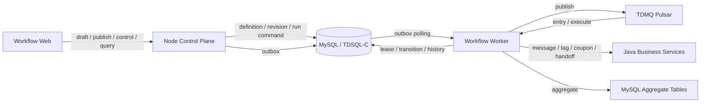

# 营销 Workflow 1.0 执行引擎设计

- 日期：2026-07-10
- 状态：Draft
- 适用范围：营销 Workflow 的后端控制面、执行面、持久化和消息调度
- 前端现状：`apps/web/src/pages/chat/workflow` 已完成画布、节点、变量、发布和前端 Repository 抽象，当前数据仍为内存 Mock
- 容量目标：1.0 支持百万级日进入，并保持向小几千万级日进入扩展的结构基础

## 1. 背景

营销 Workflow 是面向客户生命周期的长期运行流程。单个客户从进入到结束可能持续几天至数周，流程由事件或规则触发，并经过等待、条件分支和业务动作节点。

首批节点类型已经收敛为：

- `start`
- `wait`
- `branch`
- `message`
- `tag`
- `coupon`
- `handoff`
- `end`

节点的最终业务字段、必填规则和部分外部接口仍在梳理，但这不影响先确定执行引擎的基础语义、可靠性边界和持久化模型。

前期评估过以下路线：

1. Java 自研通用执行引擎
2. 私有化部署 Temporal 或 Inngest
3. Node.js 自研专用营销状态机
4. 参考 Novu 的 Node Worker + 持久化 Job + Redis 队列模式

1.0 优先降低依赖复杂度和运维复杂度，同时保留百万级至小几千万级日进入的演进能力。因此不引入通用 durable workflow 平台，也不以 Redis 保存长期运行状态。

## 2. 决策摘要

1.0 采用以下技术组合：

```text
Node.js 24 LTS + TypeScript
+ Fastify / Kysely
+ 腾讯云高可用 MySQL 或 TDSQL-C
+ 现有腾讯云 TDMQ Pulsar
+ 独立 Workflow Worker 进程
```

核心决策：

- 使用 Node.js 实现专用、单令牌、无环营销状态机。
- MySQL 是 Workflow 定义、运行状态、长期等待、幂等和恢复数据的唯一事实来源。
- TDMQ Pulsar 只负责触发事件和执行任务的异步投递、削峰、重投与死信，不保存最终业务状态。
- Redis 不作为 1.0 必需依赖；即使复用现有 Redis，也只能用于缓存或辅助限流，不能参与正确性保证。
- 长期等待保存为数据库中的 `due_at`，不使用进程内 Timer、Redis ZSet、BullMQ delayed job 或 MQ 长延迟消息作为事实来源。
- 采用 at-least-once 投递与端到端幂等，不承诺 exactly-once。
- 首次启用产生 Revision 1；首次启用后只有执行语义变化的发布才产生新的不可变 Revision，运行实例始终固定在进入时的 Revision。
- 1.0 不引入 Temporal、Inngest、CKafka、ClickHouse 或专用归档服务。

## 3. 目标与非目标

### 3.1 目标

- 支撑事件触发、等待、分支、业务动作和结束的完整运行路径。
- Worker 或 MQ 重复投递时不重复执行不可逆业务动作。
- Worker、MQ 或下游服务短暂故障后可以自动恢复。
- 发布新版本不会改变正在运行的客户实例。
- 支持流程暂停、恢复和停止，且语义明确。
- 支持按 Workflow、Revision、客户和运行实例查询近期执行记录。
- 在单执行数据库集群上先落地，同时保持逻辑分片和未来物理分库能力。
- 引擎核心与 Web UI、MQ SDK、数据库实现和具体节点配置 UI 解耦。

### 3.2 非目标

- 通用 BPMN 或任意代码工作流。
- 并行分支、Join、循环、子流程、补偿事务和人工审批。
- 运行中实例自动迁移到新 Revision。
- 毫秒级营销调度。
- 使用 MQ 或 Redis 实现 exactly-once。
- 1.0 建设统一客户事件平台或实时数仓。
- 1.0 在执行引擎内完成复杂客户分群计算。
- 1.0 提供“试运行”；现有产品定位不需要运行模拟环境。
- 在节点字段未确定前预先固化全部节点业务配置。

## 4. Workflow 图语义

### 4.1 图约束

后端发布校验必须至少保证：

- 恰好一个 `start` 节点。
- 恰好一个 `end` 节点。
- `start` 和 `end` 不允许删除、复制或重命名。
- 所有可执行节点均可从 `start` 到达。
- `end` 必须可从 `start` 到达。
- 图必须无环。
- 图深度不超过 20 层，与当前前端约束保持一致。
- 普通节点可接收多个上游连接。
- 普通节点只有一个默认出口，该出口最多连接一条边。
- `branch` 的每个分支 Handle 是独立出口，每个出口最多连接一条边。
- `end` 可接收多条路径。
- 所有分支出口必须连接到后续节点。

多条边进入同一个节点只表示多条互斥路径在该节点汇合，不表示 Join。由于 1.0 每个运行实例只有一个活跃令牌，节点不会等待其他上游路径。

### 4.2 单令牌执行

每个 `workflow_run` 在任意时刻最多存在一个有效待执行任务。分支节点只选择一个出口，不复制运行令牌。

该约束是 1.0 不采用通用 Workflow 引擎的基础。未来一旦引入并行分支或 Join，必须重新评估执行模型和 Temporal。

### 4.3 首批节点执行语义

| kind | 1.0 执行语义 |
| --- | --- |
| `start` | 只定义进入规则；运行实例创建后从其唯一出口继续，不执行外部动作 |
| `wait` | 计算唤醒时间并创建数据库待执行任务；普通等待精度为 1 分钟 |
| `branch` | 按有序条件选择第一个命中出口，否则进入默认出口；不得执行任意 JavaScript |
| `message` | 调用消息业务服务，使用稳定幂等键 |
| `tag` | 调用标签业务服务，使用稳定幂等键 |
| `coupon` | 调用优惠券业务服务，使用稳定幂等键 |
| `handoff` | 调用人工接管业务服务，使用稳定幂等键 |
| `end` | 将运行实例标记为完成，不产生下一任务 |

`branch` 当前前端仍使用演示性质的字符串字段。正式后端不得直接执行该字符串，也不得使用 `eval` / `new Function`。业务字段确定后应发布结构化条件 AST 或受控表达式 DSL，并由 `packages/contracts` 校验。

### 4.4 Phase 3 已确认业务契约

Phase 3 只开放 `start`、`wait` 和 `end`。包含 `branch`、`message`、`tag`、`coupon` 或 `handoff` 的草稿可以继续编辑，但发布检查必须返回运行能力错误，且不能启用。Phase 4 每接通一种正式节点契约和下游 Adapter，再将该节点加入后端运行能力列表。

Start 支持以下标准事件：

```text
contact.friend_added
customer.tag_added
message.received
```

“消息包含关键词”是 `message.received` 的结构化筛选条件，不新增事件类型。一个 Start 可以同时配置多种触发方式，触发方式之间为 OR；多个托管账号、标签和关键词内部也均为 OR。同一条事件可以命中多个 active Workflow，并为每个命中的 Workflow 独立创建 Run。同一事件在同一 Workflow 内通过 `eventId` 去重。

Start 必须选择至少一个托管账号，不支持 all。所选账号统一作用于该 Start 的全部触发方式。入口事件携带 `accountId` 用于托管账号范围匹配。当前 Entry Adapter 使用平台字段 `third_external_userid` 生成不透明 `subjectId`，并同时保留 `thirdUserId` 作为触发上下文；引擎不理解该字段来源，也不按托管账号隔离营销对象。同一客户通过不同托管账号触发同一 Workflow 时，共享进入次数限制。

关键词规则为：多个关键词命中任意一个；使用普通子字符串匹配；去除关键词首尾空格；英文字母忽略大小写；只匹配文本消息；不执行正则、语音转写、图片识别或文件识别；空关键词禁止发布。

重复进入策略为：

```ts
type WorkflowEntryPolicy =
  | { mode: "never" }
  | { mode: "lifetime_limit"; maxEntries: number }
  | {
      mode: "rolling_window";
      maxEntries: number;
      windowSize: number;
      windowUnit: "hour" | "day";
    };
```

`maxEntries` 包含首次进入，UI 默认值为 2。Run 成功创建即计入，所有终态和非终态 Run 均计入，跨 Revision、暂停和恢复均不重置。滚动窗口基于 Run 的数据库 `create_time`，不使用事件 `occurredAt`。进入检查必须在数据库事务内按 `uid + workflowId + subjectId` 串行化，不能以先查询后插入的应用层逻辑实现。

Wait 在 Phase 3 支持相对等待 `N 分钟 / N 小时 / N 天`，N 为正整数。`dueAt` 以进入 Wait 节点时的执行时间计算，Scheduler 使用分钟时间桶，不承诺秒级调度。固定日期、工作日、自然周期和营销发送时段不在 Phase 3 范围内。

Phase 3 不接真实好友、标签和消息数据源。开发和 test01 通过标准入口事件 Smoke Producer 验证完整链路，真实数据源后续通过 `EntrySourceAdapter` 归一化，不修改 Entry Consumer 和执行引擎。Smoke Producer 可以根据传入 `workflowId` 只读数据库中的已启用 Trigger Binding，构造匹配事件并投递，但标准 MQ 消息不得携带 `workflowId` 或绕过 Trigger Binding。

dev 与 test01 使用独立 Topic 和 Subscription：

| 环境 | Entry Topic | Task Topic | Subscription |
| --- | --- | --- | --- |
| dev | `topic-workflow-entry-dev` | `topic-workflow-task-dev` | `consumer-chatai-worker-env-dev` |
| test01 | `topic-workflow-entry-test01` | `topic-workflow-task-test01` | `consumer-chatai-worker-env-test01` |

Entry 和 Task 位于不同 Topic，可以复用同一 Subscription 名称而保持独立消费游标；Subscription 类型为 Shared。腾讯云按该消费组自动创建对应的 `-RETRY` 和 `-DLQ` Topic。普通 CI 只使用 Fake Broker，不连接腾讯云；真实 TDMQ 只运行手动 Smoke。Pulsar 地址、Token、Namespace、Topic 和 Subscription 全部通过环境变量注入，禁止写入仓库。

真实 Pulsar 模式必须配置 `WORKFLOW_PULSAR_CLUSTER_ID` 和 `WORKFLOW_PULSAR_NAMESPACE`。Worker 将短 Topic 名统一规范化为 `persistent://<cluster-id>/<namespace>/<topic>`，并对 Entry、Task 和显式 DLQ Topic 使用相同规则，避免依赖 Pulsar 默认 namespace。

Workflow Worker 作为独立 `apps/workflow-worker` 进程和镜像部署，不复用 API Server 或现有 Insights Worker。初期单实例启用 Entry Consumer、Task Consumer、Scheduler、Outbox Publisher 和 Reconciler，后续可通过角色开关独立扩容。Phase 3 可观测性使用结构化日志和独立健康检查，不引入 Prometheus 或 OpenTelemetry 依赖。

## 5. 总体架构



系统分为控制面和执行面：

- 控制面负责定义、草稿、发布、权限、启停和查询，不执行长期任务。
- 执行面负责触发进入、任务调度、状态推进、业务动作、重试和恢复。

## 6. 部署与代码边界

### 6.1 运行单元

1.0 只新增一个独立 Workflow Worker 部署单元：

```text
apps/backend
  HTTP 控制面

apps/workflow-worker
  Scheduler
  Outbox Publisher
  Pulsar Consumer
  Node Executor
  Reconciler
```

Scheduler、Outbox Publisher、Executor 和 Reconciler 是 Worker 内部模块，不拆成独立微服务。它们使用同一个镜像，通过配置控制是否启用某个角色，以便后续按压力独立扩容。

Worker 不得嵌入 Fastify HTTP 服务进程。HTTP 发布、重启或流量峰值不能影响执行任务。

### 6.2 代码模块

建议新增：

```text
packages/contracts/src/workflow/
  definition.ts
  execution.ts
  events.ts
  repository.ts

packages/workflow-engine/
  graph.ts
  compiler.ts
  state-machine.ts
  node-executor.ts
  errors.ts

apps/backend/src/modules/workflow/
  workflow.routes.ts
  workflow.service.ts
  workflow.repository.ts
  workflow-publisher.ts

apps/workflow-worker/src/
  scheduler/
  outbox/
  consumer/
  executor/
  reconciler/
  adapters/
```

`packages/workflow-engine` 只包含确定性纯逻辑，不直接依赖 Fastify、Kysely、Pulsar SDK 或 Java Client。

## 7. DSL、发布与版本

### 7.1 三层模型

必须区分：

1. `WorkflowDraft`：画布编辑数据，包括节点位置、Viewport 和 UI 所需字段。
2. `WorkflowRevision`：首次启用及启用后的发布所生成的不可变执行快照。
3. `WorkflowRun`：某个客户基于固定 Revision 创建的运行实例。

前端当前的 `WorkflowDslDocument` 可以作为迁移基础，但正式发布时后端必须重新校验并编译执行图，不能信任浏览器提交的 `executionGraph`。

### 7.2 执行定义

首次启用或启用后的发布所生成的 Revision 至少包含：

```ts
type WorkflowExecutionSpec = {
  schemaVersion: number;
  workflowId: string;
  revision: number;
  entryNodeId: string;
  terminalNodeId: string;
  nodes: Array<{
    id: string;
    kind: WorkflowNodeKind;
    nodeSchemaVersion: number;
    config: Record<string, unknown>;
  }>;
  edges: Array<{
    id: string;
    source: string;
    sourceOutletId: string;
    target: string;
  }>;
};
```

Viewport、坐标、卡片样式、Metric、Summary、图标和 UI Runtime 回调不得进入执行定义。

### 7.3 版本规则

- Workflow 从未启用时，保存草稿只增加 `draft_version`。
- Workflow 从未启用时，发布只执行完整校验并记录 `validated_draft_version`，不创建 Revision。
- 首次启用要求 `validated_draft_version === draft_version`，并以当前草稿创建 Revision 1。
- Workflow 首次启用后，后端以 Compiler 生成的执行定义判断发布语义；执行语义变化时创建下一 Revision，Revision 单调递增。
- 仅 Viewport、节点坐标等编辑器布局变化时继续保存 Draft，但复用当前 Revision，不替换不可变 Revision 快照。
- Active 状态发布后继续保持 Active；Paused 状态发布后继续保持 Paused。
- Stopped 或已逻辑删除的 Workflow 不允许继续发布。
- Revision 发布后不可修改，只能发布下一 Revision。
- 新进入客户使用当前已发布 Revision。
- 已运行客户继续使用原 Revision。
- 1.0 不支持运行中 Revision 迁移。
- 发布使用乐观锁，客户端必须提交其读取到的草稿版本或 Revision 条件。
- DSL Schema Version 与 Node Schema Version 分开演进。

## 8. 运行状态机

### 8.1 Workflow 状态

```ts
type WorkflowRuntimeStatus =
  | "inactive"
  | "active"
  | "paused"
  | "stopped";
```

- `inactive`：从未启用，不存在 Revision，不接受进入。
- `active`：接受新进入并调度到期任务。
- `paused`：不接受新进入，不派发新的到期任务；已经开始执行的单个节点允许结束。
- `stopped`：不可恢复；不接受新进入，现有运行实例异步取消。

逻辑删除不复用 `runtime_status`，统一使用 `biz_status = 0`。这样 Stopped Workflow 仍可查询、审计和逻辑删除，而已删除 Workflow 默认不出现在产品列表中。

### 8.2 Run 状态

```ts
type WorkflowRunStatus =
  | "queued"
  | "running"
  | "waiting"
  | "completed"
  | "failed"
  | "cancelled";
```

- `queued`：已创建，等待首个执行任务。
- `running`：正在推进节点。
- `waiting`：等待时间到期。
- `completed`：到达 `end`。
- `failed`：达到不可重试失败条件。
- `cancelled`：Workflow 停止或人工取消。

### 8.3 Task 状态

```ts
type WorkflowTaskStatus =
  | "pending"
  | "leased"
  | "dispatched"
  | "running"
  | "completed"
  | "cancelled"
  | "dead";
```

任务必须携带单调递增的 `task_version`。所有状态更新都以当前状态和版本作为条件，防止过期 Worker 覆盖新状态。

标准状态转换为：

```text
pending
  -> leased       Scheduler 认领到期任务
  -> dispatched   已在同一事务写入 Outbox
  -> running      Consumer 取得执行租约
  -> completed    节点执行和下一状态已提交
```

失败分支：

```text
running -> pending    业务可重试错误，写入新的 due_at
running -> dead       达到最大重试次数或不可恢复失败
任意非终态 -> cancelled
```

Consumer 的执行租约与 Scheduler 的调度租约使用同一组 `lease_owner / lease_expires_at` 字段，但处于不同 Task 状态。`running` 租约过期后，Reconciler 将任务恢复为可再次派发状态；旧 Worker 即使随后恢复，也会因 `task_version` 已变化而无法提交结果。

Reconciler 同时对长期停留在 `dispatched` 且当前版本 Outbox 已发送的任务补写同版本 Outbox。该操作不提升 `task_version`，避免正常 MQ 积压中的消息被持续作废。Task 执行有最大尝试次数，耗尽后 Task 与 Run 进入失败终态；Outbox 达到最大投递次数时，如果对应 Task 仍处于同版本 `dispatched` 状态，则原子地将 Task 与 Run 标记为失败。若 Task 已被 Consumer 认领、完成或取消，则只终止该旧 Outbox，不回滚业务状态。

## 9. 数据模型

以下为逻辑模型。实际 DDL 应在节点业务契约确定后单独评审，但表职责、唯一约束和关键索引属于本 Spec 决策。

### 9.0 数据库统一规范

Workflow 新表必须遵守现有 `docs/db/schema.sql` 约定：

- 表名统一使用 `xy_wap_embed_workflow_*` 前缀。
- 每张表必须使用无业务含义的 `id BIGINT UNSIGNED NOT NULL AUTO_INCREMENT` 作为主键。
- 每张表必须包含 `create_time DATETIME NOT NULL DEFAULT CURRENT_TIMESTAMP`。
- 每张表必须包含 `update_time DATETIME NOT NULL DEFAULT CURRENT_TIMESTAMP ON UPDATE CURRENT_TIMESTAMP`。
- 租户字段统一使用 `uid BIGINT UNSIGNED NOT NULL`。
- 操作人字段优先使用 `op_sub_uid BIGINT UNSIGNED`，关联 `xy_wap_embed_sub_user.id`。
- Workflow 逻辑删除使用 `biz_status TINYINT NOT NULL DEFAULT 1`，`1` 表示正常，`0` 表示已删除。
- 业务唯一性通过 UNIQUE KEY 表达，不能用业务字段代替自增主键。
- 数据库 BIGINT ID 在 TypeScript API 和 MQ 契约中统一序列化为十进制字符串，避免 JavaScript Number 精度丢失。
- 除归档表明确保留原主键的特殊场景外，不允许省略 AUTO_INCREMENT 主键。

### 9.1 `xy_wap_embed_workflow_definition`

保存租户内 Workflow 身份和当前控制状态。

关键字段：

```text
id
uid
name
runtime_status
biz_status
draft_schema_version
draft_json
draft_version
validated_draft_version
published_revision
op_sub_uid
create_time
update_time
```

关键约束：

- `id` 为无业务含义自增主键。
- 草稿保存通过 `draft_version` 乐观锁。
- `draft_json` 是可变编辑态，不能被 Worker 直接执行。
- `published_revision` 在首次启用前为 NULL。
- 默认查询必须包含 `uid` 和 `biz_status = 1`。
- 建议索引 `(uid, biz_status, update_time, id)`。

### 9.2 `xy_wap_embed_workflow_revision`

保存不可变发布快照。

```text
id
workflow_id
uid
revision
dsl_schema_version
draft_json
execution_spec_json
spec_hash
publish_sub_uid
publish_time
create_time
update_time
```

关键约束：

- `id` 为无业务含义自增主键。
- `(uid, workflow_id, revision)` 唯一。
- 发布后禁止 UPDATE 执行内容。

### 9.3 `xy_wap_embed_workflow_trigger_binding`

保存发布后编译出的入口索引，避免每个事件扫描全部 Workflow。

```text
id
uid
event_type
workflow_id
revision
filter_spec_json
status
create_time
update_time
```

关键约束：

- `id` 为无业务含义自增主键。
- 业务匹配索引至少包含 `(uid, event_type, status, workflow_id)`。

Start 节点的最终配置尚未确定，因此 `filter_spec_json` 的业务字段暂不在本 Spec 固化。触发匹配必须是结构化规则，不得执行任意脚本。

### 9.4 `xy_wap_embed_workflow_run`

保存每个客户的当前运行状态。

```text
id
uid
workflow_id
revision
subject_id
entry_event_id
shard_id
status
current_node_id
sequence
context_json
next_execute_at
lock_version
terminal_reason
create_time
update_time
completed_at
```

关键索引：

```text
(uid, workflow_id, revision, status, create_time)
(uid, subject_id, status, create_time)
(shard_id, status, next_execute_at)
```

`subject_id` 是引擎不解析的不透明字符串，其唯一业务范围为 `uid + subject_id`。平台、托管账号或外部联系人 ID 的组合方式由 Trigger Adapter 决定。

是否允许同一客户重复进入由 Start 规则决定；对应唯一约束必须在 Start 契约确定后设计，不能仅依赖应用查询防重。

### 9.5 `xy_wap_embed_workflow_task`

保存当前执行、等待唤醒和重试任务。

```text
id
uid
run_id
workflow_id
revision
node_id
node_kind
sequence
task_type
shard_id
bucket_time
due_at
status
task_version
attempt
lease_owner
lease_expires_at
last_error_code
create_time
update_time
```

关键索引：

```text
(shard_id, status, bucket_time, due_at, id)
(run_id, status, sequence)
(lease_expires_at, status)
```

同一 Run 在同一 `sequence` 只能存在一个有效任务。

### 9.6 `xy_wap_embed_workflow_node_execution`

保存产品可查询的节点执行结果和业务动作账本。

```text
id
uid
run_id
node_id
node_kind
sequence
status
idempotency_key
input_snapshot_json
output_json
error_code
error_message
started_at
completed_at
create_time
update_time
```

关键约束：

- `(uid, run_id, sequence)` 唯一。
- `idempotency_key` 在业务动作范围内唯一。

不要记录内部每次轮询和每次租约刷新。仅保存用户可理解、审计或恢复所需的节点执行数据。

### 9.7 `xy_wap_embed_workflow_outbox`

保存数据库事务提交后必须投递的消息。

```text
id
uid
aggregate_type
aggregate_id
event_type
payload_json
status
attempt
next_attempt_at
create_time
sent_at
update_time
```

业务状态更新和 Outbox INSERT 必须位于同一个数据库事务。

### 9.8 `xy_wap_embed_workflow_inbox`

保存已消费消息 ID，吸收 MQ 重复投递。

```text
id
consumer
message_id
uid
processed_at
expires_at
create_time
update_time
```

关键约束：

- `id` 为无业务含义自增主键。
- `(consumer, message_id)` 唯一。

### 9.9 `xy_wap_embed_workflow_daily_metric`

1.0 使用 MySQL 汇总表提供基础统计，不引入 ClickHouse。

```text
id
uid
workflow_id
revision
node_id
metric_date
entered_count
completed_count
failed_count
create_time
update_time
```

关键约束：

- `id` 为无业务含义自增主键。
- `(uid, workflow_id, revision, node_id, metric_date)` 唯一。

汇总由异步消费者批量更新，不能在热执行事务中对同一统计行高频加锁。

## 10. 消息契约

MQ 消息只携带定位和并发校验字段，不携带完整 Workflow Context 或节点配置：

```ts
type WorkflowTaskMessage = {
  messageId: string;
  uid: string;
  shardId: number;
  runId: string;
  taskId: string;
  taskVersion: number;
  occurredAt: string;
};
```

Worker 收到消息后必须从数据库读取当前 Task、Run 和 Revision。消息中的版本只用于快速拒绝明显过期任务，数据库状态才是权威。

进入命令至少包含：

```ts
type WorkflowEntryCommand = {
  accountId: string;
  eventId: string;
  eventType: string;
  occurredAt: string;
  uid: string;
  subjectId: string;
  thirdUserId: string;
  triggerPayload: Record<string, unknown>;
};
```

`eventId` 必须在入口层去重，防止同一业务事件创建多个 Run。

### 10.1 Pulsar Topic 与 Subscription

每个环境至少区分两个业务 Topic：

```text
workflow-entry
workflow-task
```

- `workflow-entry` 承载标准化客户进入事件。
- `workflow-task` 承载已经由数据库和 Outbox 创建的执行任务。
- TDMQ 根据消费组自动管理 `-RETRY` 和 `-DLQ` Topic，承载重投和达到最大基础设施重投次数的异常消息。
- Topic 必须按环境和租户部署边界使用统一前缀，禁止测试和生产共用 Topic。
- Task 消息使用 `runId` 作为 Message Key，便于相同 Run 稳定路由。
- 若当前 TDMQ Pulsar 版本和 Node SDK 已验证支持 Key_Shared，可使用 Key_Shared Subscription 保持同 Key 消息顺序；否则使用 Shared Subscription，并依赖数据库 Task Version 吸收乱序。
- 无论使用哪种 Subscription，业务正确性都不能依赖 MQ 顺序。
- Consumer 只在最终数据库事务提交后 ACK。
- Consumer 在取得 Task 执行权前发生短暂基础设施错误时使用 Negative ACK 或不 ACK，由 TDMQ Pulsar 执行重投。
- Producer 可以开启 Pulsar 批量发送，但每个 Task 保持独立 Message ID 和业务 `messageId`。

## 11. 核心执行流程

### 11.1 发布

1. 控制面读取当前草稿。
2. 通过共享 Compiler 清理 UI 字段并生成执行定义。
3. 后端重新执行图校验和节点配置校验。
4. 从未启用时，发布只更新 `validated_draft_version`，不插入 Revision。
5. 首次启用时再次确认 `validated_draft_version === draft_version`，在事务中插入 Revision 1、更新 `published_revision`、创建 Trigger Binding，并将状态改为 Active。
6. 首次启用后的发布先比较当前与已发布执行定义；语义未变化时复用当前 Revision，语义变化时在事务中插入下一 Revision、更新 `published_revision` 并替换 Trigger Binding；Active 或 Paused 状态保持不变。
7. 发布并发冲突返回明确的 Revision Conflict，不覆盖其他编辑。

### 11.2 客户进入

1. Trigger Consumer 通过 `(uid, event_type)` 查询有效 Trigger Binding。
2. 结构化规则匹配通过后检查 Workflow 是否 `biz_status = 1` 且 `runtime_status = active`。
3. 在事务中完成入口 Inbox 去重、重复进入规则校验、Run 创建、首个 Task 创建和 Outbox 写入。
4. Outbox Publisher 将首个 Task 投递 TDMQ Pulsar。

### 11.3 普通节点推进

1. Consumer 读取 Inbox 和当前 Task 状态，但不能在执行外部动作前提交 Inbox 成功记录。
2. 校验 Task 状态、版本、Run 当前节点、Workflow `biz_status` 和运行状态。
3. 通过 `status + task_version` 条件更新取得 Task 执行租约。
4. 调用对应 Node Executor。
5. 在最终事务中写 Inbox、Node Execution、更新 Run、完成当前 Task、创建下一 Task 和 Outbox。
6. MQ 消息只有在最终数据库事务完成后才确认。

若消息重复并发到达，只有一个 Consumer 能取得 Task 执行租约。若 Worker 在取得租约后崩溃，Inbox 尚未完成，MQ 重投和 Reconciler 可以在租约过期后恢复执行。

### 11.4 Wait

1. 根据配置和统一时区规则计算 `due_at`。
2. `bucket_time` 向下取整至分钟。
3. Run 进入 `waiting`，创建 `pending` Task，不立即写 MQ Outbox。
4. Scheduler 按 `shard_id + bucket_time` 扫描到期任务。
5. Scheduler 通过租约批量认领，并在事务中写 Outbox。
6. Outbox Publisher 使用 Pulsar Producer Batching，但每个 Task 保持独立业务消息 ID，避免批次内部分失败难以恢复。

### 11.5 Branch

1. 从 Runtime Context 解析系统变量、客户变量、触发变量和前序节点输出。
2. 按配置顺序计算分支条件。
3. 选择第一个命中路径，否则选择唯一默认路径。
4. 将 `matchedPathId` 和 `matchedPathLabel` 写入节点输出。
5. 通过 Source Outlet 定位下一节点。

同一输入、同一 Revision 的分支计算必须确定性一致。

### 11.6 Action

1. 在调用下游前创建或读取 Node Execution。
2. 幂等键固定为：

```text
uid + runId + nodeId + sequence
```

3. 每次重试必须使用同一个幂等键。
4. 下游成功后记录输出并创建下一 Task。
5. 下游明确失败时按错误类型决定重试或失败。
6. 下游超时属于结果未知，必须使用同一幂等键重试，不能生成新业务请求 ID。

Java 消息、标签、优惠券和转人工接口必须接受该幂等键，或提供等价的业务去重能力。没有下游幂等能力时，系统无法保证超时重试不产生重复副作用，禁止以“MQ 不重复”规避该问题。

## 12. Scheduler 与逻辑分片

### 12.1 逻辑分片

1.0 从第一天写入逻辑分片：

```text
shard_id = hash(uid + subjectId) % 256
```

256 个逻辑分片先映射到同一个执行数据库集群。Scheduler 实例通过数据库租约领取一组逻辑分片，禁止所有实例扫描全局到期索引。

逻辑分片数不等于物理数据库数。未来扩容时调整逻辑分片到物理库的映射，不改变外部 Run ID 和 Workflow 契约。

### 12.2 扫描规则

- 只扫描当前实例持有的逻辑分片。
- 只扫描当前分钟及有限补偿窗口。
- 使用 Keyset 条件，不使用 OFFSET 深分页。
- 每批认领数量可配置。
- 租约使用数据库时间，避免 Worker 本地时钟漂移。
- 认领后写 Outbox，不直接依赖进程内内存完成投递。

## 13. 一致性、投递和幂等

### 13.1 一致性模型

系统不实现分布式事务，采用：

```text
数据库本地事务
+ Transactional Outbox
+ MQ at-least-once
+ Consumer Inbox
+ Node Execution 幂等账本
+ 下游业务幂等
```

### 13.2 Outbox

- 业务事务中只写 Outbox，不直接调用 MQ。
- Publisher 成功发送后将 Outbox 标记为已发送。
- 发送成功但标记失败会造成重复发送，由 Inbox 和 Task Version 吸收。
- MQ 不可用时 Outbox 积压，不回滚已提交业务状态。

### 13.3 Inbox

- Inbox 完成记录与对应业务状态更新必须在同一最终事务。
- 不得在外部 Action 执行前提交 Inbox 成功记录，否则 Worker 崩溃会永久吞掉尚未执行的任务。
- Task 消息的并发防重首先依赖 Task 执行租约和版本，Inbox 用于识别“状态已经成功提交但 MQ 尚未 ACK”的重复消息。
- Entry 消息没有外部副作用，可以在创建 Run 的单个数据库事务中同时完成 Inbox 去重。
- Inbox 只防止同一消息 ID 重复处理，不能替代业务幂等。
- Inbox 数据设置保留期，过期清理不得早于 MQ 最大重投和人工重放窗口。

### 13.4 重试分工

- Consumer 在取得 Task 执行权之前发生的短暂基础设施错误，通过 Pulsar Negative ACK 或 ACK Timeout 重投。
- 业务 Action 返回明确的可重试错误时，Worker 在数据库中将 Task 恢复为 `pending` 并写入退避后的 `due_at`，随后 ACK 当前 MQ 消息。
- 下游超时属于结果未知，也进入数据库 Retry Task，并保持原 `idempotency_key`。
- 不可重试业务错误将 Task 标记为 `dead`，Run 标记为 `failed`，随后 ACK MQ 消息。
- 未被分类的异常允许由 TDMQ Pulsar 重投；超过 Consumer Dead Letter Policy 配置的最大次数后进入 DLQ 并触发告警。
- 同一个失败不能同时创建数据库 Retry Task 并让原 MQ 消息继续重试，避免形成双重重试流。

### 13.5 并发控制

- Run 使用 `lock_version` 乐观锁。
- Task 使用 `task_version + status` 条件更新。
- Scheduler 使用租约，不使用 Redis 锁。
- 同一 Run 的多个消息并发到达时只允许一个状态推进成功。
- 过期 Task 消息直接确认并记录 Debug 指标，不作为系统错误重试。

## 14. 暂停、恢复与停止

### 14.1 暂停

- 暂停后拒绝创建新 Run。
- Scheduler 不派发该 Workflow 的新到期任务。
- 已经进入单个 Node Executor 的任务允许执行完毕。
- 已经进入 MQ 但尚未取得执行租约的任务，在 Consumer 发现 Workflow 已暂停后恢复为 `pending` 并 ACK 当前消息，等待恢复后重新派发；不得通过 MQ 持续重试等待恢复。
- 1.0 不承诺中断已经发出的下游 HTTP 请求。
- 暂停不逐条更新所有 Run，避免大规模写放大。

### 14.2 恢复

- 恢复后重新接受新进入。
- 已经过期的 Wait Task 按原顺序尽快补执行。
- 发送时间窗口由节点或 Start 业务规则再次约束，不能因恢复绕过营销时段限制。

### 14.3 停止

- 停止不可恢复。
- 控制面立即阻止新 Run 和新任务派发。
- 后台按逻辑分片异步将活跃 Run 和 Task 标记为 `cancelled`。
- 停止操作本身需要可查询进度，不能在 HTTP 请求中同步更新数百万 Run。

### 14.4 逻辑删除

- 所有 Workflow 无论是否启用，都只允许逻辑删除：将 `biz_status` 更新为 `0`，禁止物理 DELETE。
- 只有 `owner` 和 `admin` 可以执行删除。
- 删除后立即拒绝新 Run。
- Scheduler 在认领和派发任务前必须校验 `biz_status = 1`。
- Consumer 在取得执行租约和调用下游 Action 前必须再次校验 `biz_status = 1`。
- 检测到 Workflow 已删除时，当前未执行 Task 和 Run 转为 `cancelled`，并 ACK 对应 MQ 消息。
- Reconciler 后台按逻辑分片收敛已删除 Workflow 的其他活跃 Run 和 Task；正确性不能依赖一次同步全量更新。
- 已经调用或已经发往下游的请求不撤回，也不承诺中断。
- 已删除 Workflow 默认不出现在产品列表，1.0 不提供恢复入口，但定义、Revision 和执行记录继续保留。

## 15. 故障处理

| 故障 | 预期行为 |
| --- | --- |
| Worker 在取得执行租约前崩溃 | MQ 重投，任务重新执行 |
| Worker 在取得执行租约后、业务动作前崩溃 | 租约到期后由 Reconciler 恢复，MQ 重投后重新执行 |
| Worker 在业务动作后、状态提交前崩溃 | 使用相同幂等键重试下游动作 |
| Worker 在事务提交后、MQ ACK 前崩溃 | MQ 重投，Inbox / Task Version 判定为已处理 |
| MQ 不可用 | Outbox 积压；业务状态保留，恢复后补投 |
| 数据库不可用 | Worker 停止确认消息，由 MQ 重试；不得转为内存执行 |
| Scheduler 崩溃 | 分片租约到期后由其他实例接管 |
| Outbox Publisher 崩溃 | 未发送记录由其他实例继续扫描 |
| 下游返回可重试错误 | 写入数据库 Retry Task，ACK 当前 Pulsar 消息，保持同一幂等键 |
| 下游返回不可重试错误 | Node Execution 和 Run 进入失败，记录业务错误码 |
| 消息进入死信 | 产生告警并保留人工重放入口，重放仍使用原 Task ID |
| Workflow 被暂停 | 不派发新任务；执行中的节点按暂停语义收敛 |
| Workflow 被逻辑删除 | Worker 在下一个执行边界取消 Run / Task；已经发往下游的请求不撤回 |

Reconciler 至少负责：

- 回收过期 Task 租约。
- 检查长期未发送 Outbox。
- 检查 `running` 超时的 Node Execution。
- 检查 Run 当前节点与有效 Task 不一致。
- 统计并告警死信、重复拒绝和版本冲突。

## 16. 数据保留与基础统计

1.0 不引入 ClickHouse，必须主动限制执行库历史增长：

- 活跃 Run 全量保留。
- 已结束 Run 的默认保留期由产品确认，建议先按 30 天设计。
- Node Execution 仅保留产品需要的近期明细，建议 7 至 30 天。
- Inbox、已发送 Outbox 和已完成 Task 使用独立保留策略。
- 大表按时间分区或可快速清理的物理结构设计。
- 基础节点指标异步写入 `workflow_daily_metric`。
- 禁止请求时扫描 Node Execution 全表计算看板指标。

当近期明细、运行检索或统计需求超过 MySQL 能力时，再引入 ClickHouse 和 COS 归档，不提前成为 1.0 发布依赖。

## 17. 容量模型与升级门槛

### 17.1 容量认知

日进入量不是唯一容量指标。设计和压测必须同时记录：

- 日进入 Run 数。
- 平均和 P99 图深度。
- 每个 Run 的平均 Action 数。
- 平均运行周期和活跃 Run 总数。
- Wait Task 总数和每分钟到期峰值。
- 触发事件峰值。
- 下游动作吞吐上限。
- 近期执行记录保留天数。

例如日进入 1000 万、平均运行 14 天，会形成约 1.4 亿活跃 Run。此时数据库活跃状态规模比平均入口 QPS更重要。

### 17.2 1.0 扩容顺序

1. 增加 Workflow Worker 副本、Pulsar Partition 和消费并发。
2. 调整逻辑分片租约和 Scheduler 批大小。
3. 优化数据库索引、表分区和连接池。
4. 将读查询迁移到只读副本或专用查询投影。
5. 当单执行集群持续接近写入、索引或存储上限时，将执行面迁移到 TDSQL 分布式版或应用分库。
6. 当事件需要多系统长期回放时，再评估 CKafka。
7. 当统计与明细查询超过 MySQL 能力时，再引入 ClickHouse。

不得因为预估规模提前同时引入分布式数据库、Kafka、Redis 和 ClickHouse；也不得在容量已经被验证不足后继续依赖单库侥幸扩容。

## 18. 可观测性

必须提供以下指标：

- `workflow_entry_total`
- `workflow_run_status_total`
- `workflow_task_due_lag_seconds`
- `workflow_task_execution_duration_seconds`
- `workflow_task_retry_total`
- `workflow_task_dead_total`
- `workflow_outbox_pending_total`
- `workflow_outbox_oldest_age_seconds`
- `workflow_lease_recovery_total`
- `workflow_node_execution_total{kind,status}`
- `workflow_action_duration_seconds{kind}`
- Pulsar Subscription Backlog、Unacked Messages 和 Redelivery Count
- Node Event Loop Lag
- 数据库连接池使用率和慢查询

日志必须包含：

```text
uid
workflowId
revision
runId
taskId
nodeId
sequence
messageId
idempotencyKey
```

日志不得输出完整客户资料、消息正文、优惠券密钥或其他敏感内容。

## 19. 安全与租户隔离

- 所有业务表和 Repository 查询必须带 `uid`。
- Workflow 模块只允许 `owner` 和 `admin` 查看、编辑、启用、发布、暂停、恢复、停止和逻辑删除；其他角色不可访问。
- MQ 消息必须带租户 ID，但消费者仍需以数据库记录验证租户归属。
- Workflow Context 只保存执行必需的数据，优先保存客户 ID 和受控快照，不复制完整客户档案。
- 密钥和渠道凭证不得写入 Workflow Revision；节点配置只保存资源引用。
- 变量解析必须经过白名单 Registry，不允许任意对象路径访问。
- Trigger Payload 和节点输出必须有大小限制和结构校验。
- 手工重放、取消和查看运行明细需要独立权限。

## 20. 测试与发布门槛

### 20.1 单元测试

- 图编译和发布校验。
- 各节点 Executor 的状态转移。
- Branch 确定性和默认分支。
- Wait 时间和时区计算。
- Run / Task 状态机非法转移。
- 幂等键稳定性。

### 20.2 集成测试

- MySQL 事务、Outbox 和 Inbox。
- 乐观锁与 Task Version 冲突。
- Scheduler 多实例租约竞争。
- Pulsar 重复、乱序、Negative ACK、ACK Timeout 和死信。
- 下游成功、明确失败和结果未知超时。
- 发布、暂停、恢复、停止与执行并发。

### 20.3 故障测试

- 在下游调用后强杀 Worker。
- 在数据库提交后、MQ ACK 前强杀 Worker。
- 暂停 MQ、数据库和下游服务后恢复。
- 人工制造过期租约和卡住 Outbox。
- 验证重复消息不会重复发消息、发券或打标签。

### 20.4 容量测试

容量测试必须基于目标业务分布，而不是只压入口接口：

- 立即执行链路。
- 大量数天 Wait 后同分钟唤醒。
- 多租户热点和单大租户热点。
- 下游限流导致的持续积压。
- 运行详情写入和历史清理并发。
- 至少一次完整的长时间稳定性测试。

改动 `apps/backend`、`packages/contracts` 或新增 Worker package 后，必须按仓库 AGENTS 约定运行对应 build、相关测试和受影响消费方 build。

## 21. 分阶段交付

### Phase 1：契约与纯引擎

- 将正式 Workflow DSL 和执行契约迁移到共享 package。
- 建立后端 Compiler 和发布校验。
- 实现纯状态机和首批 Node Executor 接口。
- 暂用内存 Adapter 验证状态转移，不接真实业务动作。

### Phase 2：控制面与持久化

- 实现 Definition、Revision、发布和权限 API。
- 建立 Run、Task、Node Execution、Outbox、Inbox 表。
- 前端 Repository 从 Mock 切换到真实 API。
- 仅通过内部 Service 和测试 Fixture 创建 Run，不开放真实 Trigger 或产品“试运行”入口。

### Phase 3：Worker 与 TDMQ Pulsar

- 实现独立 Worker、Scheduler、Outbox Publisher 和 Reconciler。
- 接入 Pulsar Subscription、重投、死信和监控。
- 接入 Start 触发与 Wait 调度。
- 只允许启用 `start`、`wait`、`end`，通过开发 Fixture 配置 Start 资源选项。
- 提供只读 Workflow 配置并投递标准事件的 Smoke Producer，不提供公开测试触发 API。

### Phase 4：业务动作

- 逐个接入消息、标签、优惠券和转人工 Java API。
- 每个下游接口先确认幂等协议，再开放节点发布。
- 接入变量解析和结构化 Branch 条件。

### Phase 5：容量与灰度

- 完成故障和容量测试。
- 小租户灰度，观察 Task Lag、Outbox、重试和数据库热点。
- 按指标扩展 Worker 和数据库能力。

## 22. 延后能力与重新评估条件

| 能力 | 1.0 决策 | 重新评估条件 |
| --- | --- | --- |
| Temporal | 不引入 | 出现并行、Join、循环、子流程、复杂 Signal 或补偿事务 |
| Inngest | 不引入 | 不作为当前路线的升级目标 |
| CKafka | 不引入 | 客户事件需要多系统消费、长期保留和历史回放 |
| Redis 调度 | 禁止 | 不重新评估为长期事实来源 |
| Redis 限流 | 延后 | 多 Worker 需要精确共享租户/渠道配额 |
| ClickHouse | 延后 | MySQL 无法承担运行明细和聚合查询 |
| COS 归档 | 延后 | 法规或产品要求长期保留完整执行历史 |
| 分布式执行数据库 | 延后 | 单集群容量测试或生产指标达到明确升级阈值 |

## 23. 待业务确认项

以下项目不阻塞基础引擎建设，但会阻塞对应节点正式发布：

- Branch 条件 AST、运算符、空值和类型转换语义。
- Message、Tag、Coupon、Handoff 的具体配置和 Java API。
- 各动作节点的重试分类和最大重试策略。
- 下游业务接口的幂等协议。
- Run 和 Node Execution 的产品查询保留期。
- 1.0 实际目标日进入量、峰值倍数和最长运行周期。

这些字段确认后通过 Node Definition、共享契约和 Executor Registry 扩展，不改变本 Spec 确定的控制面、状态机、可靠性和基础设施边界。

## 24. 验收标准

- Web 草稿可以保存到真实后端，并通过乐观锁避免覆盖。
- 从未启用时发布只完成后端编译和校验，不创建 Revision。
- 首次启用生成 Revision 1；启用后只有执行语义变化的发布生成新的、不可变且可查询的 Revision，纯布局变化复用当前 Revision。
- 新 Run 固定 Revision，后续发布不影响已有 Run。
- 首批节点可以通过统一 Executor Registry 执行，不在 Worker 中散落 `switch` 业务逻辑。
- Wait 使用数据库时间桶，重启所有 Node 进程后仍可恢复。
- MQ 重复、乱序和 Worker 崩溃不会造成重复业务动作。
- 下游超时重试使用同一幂等键。
- 暂停不创建新 Run、不派发新任务，恢复后可继续执行。
- 停止通过异步操作取消活跃 Run，不阻塞 HTTP 请求。
- 删除只更新 `biz_status`，Worker 在每个执行边界校验并取消未执行任务，不物理删除数据。
- Scheduler 可多实例运行且不会重复认领导致状态破坏。
- Outbox 积压、Task Lag、重试、死信和租约恢复均有指标和告警。
- 核心正确性不依赖 Redis、进程内状态或 MQ 长延迟消息。
- 容量测试证明目标流量下数据库、MQ、Worker 和下游动作均有明确余量。
