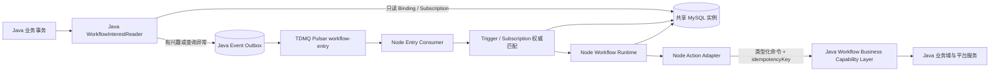

# 营销 Workflow 当前实现与 Java 协作落地方案

- 日期：2026-08-05
- 最后更新：2026-08-06
- 状态：Meeting Draft
- 适用对象：Java 平台团队、ChatAI Node 团队、产品与测试
- 会议目标：让团队快速理解当前 Workflow 已完成的设计和实现，确定 Java / Node 边界，并形成可以立即领取的开发任务
- 关联文档：[营销 Workflow 1.0 执行引擎设计](./2026-07-10-marketing-workflow-execution-engine-design.md)

## 0. 术语表

| 术语 | 所有者 | 通俗解释 |
| --- | --- | --- |
| Workflow | Node | 用户在营销画布中配置的一条营销主体旅程，由 Start、Wait、Branch、Action、End 等节点组成。 |
| Workflow Type | Node | 新建 Workflow 时选择的稳定业务类型，例如客户 SOP、会员 SOP、ChatAI SOP。它决定主 Subject Type、可选 Start 事件、允许的节点、系统变量和业务能力边界，不是单纯的前端分类。 |
| Workflow Capability Profile | Node 定义，双方遵守 | Workflow Type 对应的能力策略，描述允许的事件、节点、变量和 Java operation。最终可用能力还要与租户产品权益和已配置资源取交集。 |
| Workflow Draft | Node | 当前可编辑的画布草稿，包含节点配置、连线和画布位置。Draft 可以反复修改，不能被 Worker 直接执行。 |
| Node Workflow Kernel | Node | Workflow 的持久化编排内核，负责 Revision、Binding、Run、Task、等待、分支、变量、重试、恢复和执行历史。 |
| Java Workflow Business Capability Layer | Java | Java 向 Workflow 提供的业务能力边界，负责消息、订单、标签、客户、优惠券、人工接管等查询、校验和实际业务动作。 |
| Java Event Outbox | Java | Java 所属的业务事件发件箱，通常是一张数据库表加异步 Publisher。Java 在保存新消息、订单等业务事实的同一事务中插入事件记录，随后可靠投递到 Pulsar `workflow-entry`。 |
| Node Workflow Outbox | Node | Node 已有的 Workflow 内部任务发件箱，对应 `xy_wap_embed_workflow_outbox`。Node 在推进 Run/Task 的同一事务中写入记录，随后投递到 Pulsar `workflow-task`。它不能与 Java Event Outbox 共用。 |
| Entry Event | Java 生产，Node 消费 | 可以触发 Start 或唤醒 Wait Event 的标准业务事件，例如 `message.received`、`order.created`、`audience.entered`。通过 Pulsar `workflow-entry` 传递。 |
| `eventId` | Java 生成，Node 使用 | 业务事件的稳定唯一标识。同一业务事实重试和重复投递时必须保持不变，Node 用它防止同一 Workflow 重复创建 Run。 |
| Revision | Node | Workflow 每次正式启用或执行语义发生变化时生成的不可变执行快照。新 Run 使用最新 Revision，已经运行的 Run 始终固定使用进入时的 Revision。 |
| Trigger Binding / Binding | Node | 从已发布 Revision 的 Start 节点编译出的触发索引，记录某个 Workflow Revision 可能消费哪些 `subjectType + eventType` 以及完整触发条件。Java 只用它做粗粒度存在性查询，Node 负责最终匹配。 |
| Run | Node | 某个 `subjectType + subjectId` 成功进入某个 Workflow 后产生的一次运行实例。同一主体重复进入同一 Workflow 会形成不同 Run，但必须满足 Start 的重复进入规则。 |
| Task | Node | Run 当前等待执行或即将执行的最小调度单元，记录节点、状态、执行版本、`due_at`、租约和重试次数。1.0 中一个 Run 同一时刻最多有一个有效 Task。 |
| Node Execution | Node | 某个节点在某个 Run 中的一次执行账本，保存受控输入、输出、幂等键、开始/完成时间和错误结果，用于审计与排障。 |
| Wait | Node | 固定时长或固定时间点等待。Node 将截止时间保存为 Task 的 `due_at`，不使用进程内 Timer，也不要求 Pulsar 保存长期延迟状态。 |
| Wait Event | Node 编排，Java 生产事件 | 等待当前 Subject 发生指定业务事件，例如 ChatAI SOP 等待新消息；事件到达或等待超时分别走不同出口。 |
| Event Subscription | Node 写，Java 只读 | Wait Event 运行到等待状态后产生的动态订阅，精确到 `uid + subjectType + subjectId + eventType`。Java 用它判断某条事件是否可能需要投递，Node 用数据库 CAS 决定事件到达和超时哪个分支成功。 |
| Retry | Node 调度，Java 配合幂等 | 节点遇到可重试错误或结果未知时，Node 将重试时间持久化到数据库并再次调度。业务动作重试必须复用相同 `idempotencyKey`。 |
| `idempotencyKey` | Node 生成，Java 执行 | 业务动作的稳定幂等键，建议由 `uid + runId + nodeId + sequence` 组成。Java 收到相同键的重复请求时必须返回第一次执行的同一业务结果。 |
| Inbox | Node | 已消费 MQ 消息的幂等记录。Inbox 与 Run/Task 状态更新在同一事务提交，用于吸收 Pulsar 重复投递和 ACK 前崩溃。 |
| Scheduler | Node | 扫描 MySQL 中已经到期的 Pending Task，认领任务并在同一事务写入 Node Workflow Outbox。 |
| Reconciler | Node | 后台修复器，负责回收过期租约、恢复停滞任务、补偿未发送 Outbox、取消不可用 Workflow 的 Run/Task，并清理历史数据。 |
| `subjectType` | Java 生成，Node 校验 | 主体身份命名空间，例如 `wecom_contact`、`miniapp_member`、`chatai_contact`。每种 Workflow Type 在 1.0 中只绑定一个主 Subject Type。 |
| `subjectId` | Java 生成，Node 视为不透明值 | 在 `uid + subjectType` 范围内稳定的营销对象 ID。Java 负责将它映射到对应业务主体和资源，Node 不解析其组成，也不要求不同业务域共用统一 ID。 |
| Product Entitlement | Java/产品权威，Node 展示和校验 | 租户购买或开通的产品能力，例如 ChatAI 席位、发券能力。它与 Workflow Type 分离，不能通过新增 Workflow Type 表达套餐差异。 |
| at-least-once | 双方 | 事件或任务可能被重复投递，但不能静默丢失。系统通过 `eventId`、Inbox、Task Version 和 `idempotencyKey` 吸收重复。 |
| fail-open | Java Interest Reader | Java 查询 Workflow 兴趣失败、超时或无法判断时，仍然写 Event Outbox 并投递事件。允许多投，不允许因优化逻辑故障漏投。 |

两类 Outbox 的关系：

```text
Java 业务事实
  -> Java Event Outbox
  -> Pulsar workflow-entry
  -> Node Entry Consumer
  -> Run / Task
  -> Node Workflow Outbox
  -> Pulsar workflow-task
  -> Node Task Consumer
```

## 1. 本文要解决的问题

营销 Workflow 的前端画布、Node 控制面和基础执行引擎此前主要由一人持续推进。团队其他成员尚未完整参与这套设计，因此这次协作不能只讨论“Java 发什么消息”，而需要先建立共同上下文。

本文依次回答：

1. 当前已经实现了什么，哪些能力只是 UI，哪些已经可以执行。
2. 为什么业务事件由 Java 产生，而 Workflow 语义继续由 Node 负责。
3. Java 如何在不理解 Workflow 图的情况下，减少无效事件投递。
4. 在 Java 与 Node 共用一个 MySQL 实例的前提下，如何直接读表，不建设额外的兴趣同步服务。
5. 客户 SOP、会员 SOP 和 ChatAI SOP 如何使用不同主体身份、Start 事件和节点能力。
6. Start 触发和 Wait Event 唤醒分别如何工作。
7. Java 业务接口和 Node 执行引擎如何实现幂等、重试和错误分类。
8. 会后 Java、Node、产品和测试分别可以立即推进什么。

## 2. 执行摘要

**最终推荐架构：Node Workflow Kernel + Java Workflow Business Capability Layer。** 这不是重写现有方案，而是在保留 Node 持久化执行内核的基础上，将业务查询、业务动作、业务资源校验和业务身份解析统一收敛到 Java。

本方案的核心结论如下：

1. **新建 Workflow 时必须选择 Workflow Type。** 1.0 首批为客户 SOP、会员 SOP、ChatAI SOP；类型决定主 Subject Type、可选事件、节点目录和变量目录。
2. **Workflow Type 是不可变执行契约，不是 UI 筛选。** 创建后不允许转换类型；选错时通过新建或复制创建另一类型，避免已有节点、Revision 和 Run 语义失效。
3. **不建设强制统一的跨域客户 ID。** Runtime 身份统一使用 `subjectType + subjectId`，其中 `subjectId` 只需在 `uid + subjectType` 内稳定。
4. **Java 是全部业务事件的权威生产方。** 包括新增好友、客户打标、新消息、订单、人群进入等外部或 ChatAI 自有事件。
5. **Node Workflow 只消费标准化事件。** Node 不轮询 Java 业务表，不自行推断业务事实。
6. **Java 不解析 Workflow 图，也不创建 Run。** Workflow、Revision、Trigger Binding、Run、Task、变量、分支、重入策略和执行历史都由 Node 负责。
7. **Java 可以在投递 Pulsar 前直接读取 Workflow 表做粗过滤。** 由于双方使用同一个 MySQL 实例，1.0 不建设兴趣同步 API、兴趣变更消息或分布式缓存。
8. **静态 Start 兴趣直接读取现有 `xy_wap_embed_workflow_trigger_binding`。** Binding 增加可索引的 `subject_type`，不再创建一张重复的静态兴趣表。
9. **动态 Wait Event 需要新增独立订阅表。** 等待某个主体的新消息是 Run 级动态状态，不能从静态 Trigger Binding 推导，也不应让 Java 解析 Task 或 Revision JSON。
10. **Java 的读表结果只是流量优化，不是最终正确性判断。** Java 只判断“有没有可能需要这个事件”；Node 收到事件后仍按当前有效 Trigger Binding 或 Wait Event Subscription 做权威匹配。
11. **读表异常必须 fail-open。** 无法判断时仍写入 Java Outbox 并投递事件，不能因为优化组件故障而静默丢失营销事件。
12. **事件和动作都采用 at-least-once + 幂等。** Java 使用 Transactional Outbox 发布事件；Node 用事件 ID 防止重复进入，用稳定 `idempotencyKey` 调用 Java 动作接口。
13. **节点可用性是三者交集。** Workflow Type 的语义能力、租户 Product Entitlement、已配置业务资源必须同时满足；不能把席位和套餐差异编码成更多 Workflow Type。
14. **当前真正可执行的节点只有 `start / wait / end`。** 其他节点虽然已经完成较多前端配置，但在 Compiler、Executor 或类型化 Java Capability Adapter 完成前仍必须禁止启用。
15. **Node 不再承载平台业务规则。** Node 只解析变量、形成类型化业务命令、调用 Java 并保存受控输出；Java 完成业务查询、权限与资源校验、身份解析和实际副作用。
16. **不能建设接收原始节点配置的万能 Java 执行器。** Java 能力可以共用信封和错误格式，但每种 operation 必须有独立、可验证的输入输出契约。

## 3. 当前实现概览

### 3.1 已完成的产品与前端能力

Workflow 是 `apps/web/src/pages/chat/workflow` 下的独立大型模块，菜单仍归属智能体模块。非测试环境已经通过 HTTP Repository 访问 Node 后端，不再依赖纯前端 Mock。

当前已经具备：

- Workflow 列表、创建、重命名、描述和状态展示。
- 全屏营销画布、平移缩放、小地图、自动布局和连续添加节点。
- 节点与边的选择、删除、拖拽、连接、撤销和重做。
- 固定且不可删除的唯一 Start 和 End。
- 节点设置面板、设置工作区展开模式和只读版本预览。
- 系统变量、客户变量、触发变量和前序节点输出选择。
- 图校验、节点配置校验、发布检查和运行能力检查。
- 草稿自动保存、乐观锁、发布、不可变 Revision 和历史版本恢复。
- Workflow 数据概览、进入记录和节点执行步骤查询页面。

当前前端节点目录已注册 17 种节点：

| kind | 产品名称 | 当前定位 |
| --- | --- | --- |
| `start` | 开始 | 触发入口，不可新增、删除或重命名 |
| `wait` | 等待 | 固定时长或指定天数后的固定时刻 |
| `wait-event` | 等待事件 | 当前产品方向为等待客户新消息或超时 |
| `branch` | 条件分支 | 根据变量执行结构化条件判断 |
| `message` | 消息发送 | 自定义消息或发送前序节点文本输出 |
| `message-query` | 消息查询 | 按动态或固定时间范围查询消息 |
| `tag` | 客户打标 | 修改客户标签 |
| `coupon` | 发券 | 发放权益 |
| `handoff` | 转人工 | 转人工并配置客服提示和对客话术 |
| `agent` | 转 Agent | 转入指定 Agent |
| `llm` | 大模型 | 模型、提示词、输入参数和结构化输出 |
| `order-query` | 订单查询 | 查询客户订单 |
| `tag-query` | 标签查询 | 查询客户标签 |
| `customer-update` | 修改客户资料 | 修改客户属性 |
| `ai-collect` | AI 收集资料 | 基于会话收集结构化资料 |
| `ai-intent` | AI 意图识别 | 基于消息或文本输入进行多分支意图判断 |
| `end` | 结束 | 唯一终点，不可新增、删除或重命名 |

### 3.2 已完成的 Node 控制面

`apps/backend/src/modules/workflow` 已实现真实 MySQL Repository 和以下 `/api/server/workflows/*` 能力：

- Workflow 创建、列表、详情、重命名和元数据修改。
- 草稿保存和 `draft_version` 乐观锁。
- 发布校验、首次启用、再次发布和不可变 Revision。
- Active、Paused、Stopped 和逻辑删除状态。
- Revision 列表和恢复到可编辑草稿。
- Workflow 数据概览、进入记录和单条运行详情。

首次启用或发布新 Revision 时，Node 会在同一 MySQL 事务中：

1. 插入不可变 `workflow_revision`。
2. 失效旧 Trigger Binding。
3. 插入当前 Revision 的 Trigger Binding。
4. 更新 Definition 的 `published_revision` 和运行状态。

### 3.3 已完成的执行面

当前已有独立 `apps/workflow-worker`，并实现：

- TDMQ Pulsar 和 Fake Broker 适配。
- Entry Consumer 和 Task Consumer。
- MySQL Run、Task、Node Execution、Inbox 和 Outbox。
- Scheduler 对长期等待任务的数据库扫描和派发。
- Task 租约、版本栅栏、失败重试和 Reconciler 恢复。
- 入口事件去重和主体重复进入策略。
- 节点输出与完整 Run Context 大小限制。
- 结构化日志、健康检查和 MySQL UTC+8 部署校验。

现有 Entry Consumer 的核心路径是：

```text
Pulsar Entry Event
  -> 校验 WorkflowEntryCommand
  -> 按 uid + subjectType + eventType 读取 Active Trigger Binding
  -> 执行结构化触发规则匹配
  -> 对每个命中的 Workflow 独立创建 Run
  -> 写入首个 Task 和 Node Outbox
```

### 3.4 尚未完成的边界

以下事项不能被“前端已经画出来”掩盖：

- `WORKFLOW_RUNTIME_SUPPORTED_NODE_KINDS` 当前仍只有 `start / wait / end`。
- 其余节点不能因为 UI 已完成就直接加入运行白名单。
- 当前真实业务事件尚未由 Java 接入 `workflow-entry` Topic。
- Workflow Worker 环境配置当前只接受 `dev / test01`，生产环境枚举、Topic 和部署参数尚未接入。
- 当前入口契约只覆盖 `contact.friend_added`、`customer.tag_added` 和 `message.received`，并强制所有事件携带 `accountId`、`thirdUserId`，无法自然表达订单和人群事件。
- 当前 Definition、Revision、Trigger Binding 没有 Workflow Type，前端节点目录也没有统一的类型能力策略。
- 当前 Run、Entry Guard 和 Wait Event 设计只有 `subject_id`，无法区分不同主体域中的同值 ID。
- 当前运行记录查询固定把 `subject_id` 当作 `third_external_userid` 回填客户信息，无法展示会员或其他主体。
- Wait Event 目前只有前端模型，没有运行时动态订阅表和竞争处理。
- Message、Tag、Coupon、Handoff 等动作节点没有完整 Java Capability 契约。
- Message Query、Order Query、Tag Query 和客户资料修改需要 Java 查询或动作接口。
- Branch、LLM、AI Intent 等节点仍需要正式 Compiler 配置和 Executor。

## 4. Java 与 Node 的系统边界

### 4.1 Java 负责业务事实和业务能力

Java 负责：

- 识别并产生新增好友、打标签、新消息、订单和人群变化等业务事件。
- 为每个事件生成稳定的 `eventId`。
- 将业务事实映射为明确的 `subjectType + subjectId`，并保证该组合在租户内稳定。
- 通过 Java Transactional Outbox 可靠投递 TDMQ Pulsar。
- 提供消息、订单、标签、客户资料、优惠券、人工接管和 Agent 路由等查询与动作能力。
- 根据 `subjectType + subjectId` 解析对应客户、会员、会话、托管账号和最终业务对象。
- 权威校验业务资源是否存在、是否可用以及当前租户是否有权使用。
- 对具有副作用的 API 按 Node 提供的 `idempotencyKey` 幂等执行。
- 返回稳定的业务错误码，并区分可重试、终态和结果未知。

### 4.2 Node 负责 Workflow 语义

Node 负责：

- Workflow Draft、发布校验、不可变 Revision 和 Trigger Binding。
- Workflow Type、Subject Type、能力矩阵和类型不可变规则。
- 根据 Workflow Type 提供 Start 事件、节点目录、系统变量和发布能力校验。
- 事件的最终触发匹配，一个事件扇出到多个 Workflow。
- 入口幂等、主体重复进入策略和 Run 创建。
- Run、Task、长期等待、租约、重试、恢复和历史记录。
- Wait Event 动态订阅及事件和超时之间的竞争。
- 变量解析、节点输出、条件分支和图路由。
- 将节点配置和变量解析为类型化业务命令，生成 `idempotencyKey` 并调用 Java Capability Adapter。
- 校验 Workflow 图和命令结构，但不复制 Java 领域规则。
- 决定何时把一种节点加入运行支持白名单。

### 4.3 明确禁止的耦合

Java 不应：

- 读取或解析 `draft_json`、`execution_spec_json`、节点图和条件 AST。
- 解析 `filter_spec_json` 后自行完成关键词、标签或复杂触发条件匹配。
- 在业务事件中写入 `workflowId`、`revision`、`runId` 或指定目标 Workflow。
- 把 Java 的业务事件直接标记为某个 `workflowType`，或由 Java 决定目标 Workflow 类型。
- 创建或修改 Workflow Run、Task、Revision、Trigger Binding。
- 根据 Workflow 节点配置决定重试和流程路由。
- 接收原始 `nodeConfig` 后自行解释任意节点。

Node 不应：

- 直接修改 Java 所属的业务表。
- 通过轮询业务表推断新消息、新订单或客户变化。
- 复制 Java 的客户、订单或会话领域规则。
- 绕过 Java API 直接查询或修改 Java 所属平台表。
- 在没有 Java 幂等保证时对具有副作用的接口盲目重试。
- 仅靠前端隐藏节点来执行 Workflow Type 能力限制，绕过后端保存和发布校验。

## 5. 目标架构



这里有两个不同层次的判断：

1. **Java 粗过滤：** 只判断当前是否存在任何可能需要该事件的 Start 或 Wait Event，不判断具体 Workflow。
2. **Node 权威匹配：** 读取当前有效绑定或订阅，执行完整条件、重入和并发校验。

Java 粗过滤允许误报，即多发一条事件；不允许因为缓存、SQL 异常或错误解析造成漏报。

### 5.1 与现有方案相比的调整

| 能力 | 现有实现或倾向 | 推荐调整 |
| --- | --- | --- |
| Draft、Revision、Binding | Node | 保持 Node，不迁移 |
| Run、Task、Wait、Retry | Node | 保持 Node，不迁移 |
| Branch、变量和路由 | Node | 保持 Node，不迁移 |
| 业务事件 | 尚未接真实来源 | Java 统一生产并通过 Outbox 投递 |
| 业务数据查询 | 需要逐节点适配 | Java 提供领域查询能力，Node 只解析查询参数 |
| 业务副作用 | Node Action Adapter 尚未接通 | Java 权威执行，Node 只编排和重试 |
| 资源与权限校验 | 容易在 Node 重复实现 | Java 权威校验，Node 只校验结构和引用完整性 |
| Workflow 类型和能力目录 | 当前未建模 | Node 维护不可变 Workflow Type 和共享能力策略，前后端共同校验 |
| 客户/会员/会话/账号映射 | 当前默认都是 ChatAI 客户 | Java 根据 `subjectType + subjectId` 解析对应业务主体 |
| 动作幂等 | 仅有 Node 稳定键 | Node 生成键，Java 保存并复用业务结果 |

因此，调整后的 Node 厚度主要来自 Durable Workflow 本身，而不是平台业务代码。不能为了进一步减少 Node 文件数量，把 Run、Task、Wait、Branch 或重试状态拆到 Java；那会形成两套状态机和跨服务状态对账。

### 5.2 Workflow Type 与主体身份模型

新建 Workflow 的第一步是选择 Workflow Type。产品展示名称和内部稳定值建议为：

| 产品名称 | `workflowType` | 主 `subjectType` | 主体 ID 示例 |
| --- | --- | --- | --- |
| 客户 SOP | `customer_sop` | `wecom_contact` | 企微客户 ID |
| 会员 SOP | `member_sop` | `miniapp_member` | 小程序会员 ID |
| ChatAI SOP | `chatai_sop` | `chatai_contact` | `external_third_userid` 或后续确认的 ChatAI 联系人 ID |

表中的 ID 只是当前业务示例，不写入 Workflow Runtime 的解析规则。Runtime 只认可：

```ts
type WorkflowSubject = {
  type: "wecom_contact" | "miniapp_member" | "chatai_contact";
  id: string;
};
```

身份唯一性范围是：

```text
uid + subjectType + subjectId
```

不要求同一个自然人在客户域、会员域和 ChatAI 域中使用相同 ID，也不要求 Workflow 1.0 先建设统一身份图谱。

Workflow Type 创建后不可修改。它必须同时写入 Definition，并在发布时固化到不可变 Revision 或 Execution Spec。已经运行的 Run 始终使用进入时 Revision 中的类型和主体语义。

建议显式落库或固化以下字段：

```text
workflow_definition.workflow_type
workflow_revision.workflow_type
workflow_revision.subject_type
workflow_trigger_binding.subject_type
workflow_run.subject_type
workflow_entry_guard.subject_type
workflow_event_subscription.subject_type
```

当前尚无生产历史数据，应该在业务接入前一次性调整模型，不保留把所有主体误当成 ChatAI 客户的兼容分支。

### 5.3 Workflow Capability Profile

每种 Workflow Type 对应一份共享能力策略：

```ts
type WorkflowCapabilityProfile = {
  workflowType: "customer_sop" | "member_sop" | "chatai_sop";
  subjectType: "wecom_contact" | "miniapp_member" | "chatai_contact";
  allowedEntryEventTypes: string[];
  allowedNodeKinds: string[];
  systemVariableCatalog: string[];
  allowedJavaOperations: string[];
};
```

首批能力方向建议为：

| Workflow Type | 典型 Start 事件 | 典型节点能力 | 明确不提供的当前能力 |
| --- | --- | --- | --- |
| 客户 SOP | 添加好友、进入客户人群、客户打标 | Wait、Branch、客户标签、客户资料、Coupon 等 | 当前 ChatAI Message、Message Query、Wait Message、Handoff、Agent |
| 会员 SOP | 会员注册、进入会员人群、订单创建/支付 | Wait、Branch、Order Query、会员标签、Coupon 等 | 当前 ChatAI Message、Message Query、Wait Message、Handoff、Agent |
| ChatAI SOP | 新消息、进入 ChatAI 人群，以及能稳定映射到 ChatAI Subject 的业务事件 | 全部流程控制、消息、会话、Agent、AI 和已支持的营销动作 | 仍受租户权益、资源配置和 Runtime 白名单限制 |

这里描述的是能力边界，不是最终字段清单。产品和业务团队仍需冻结每种类型的首批事件、节点和系统变量。

当前 `message`、`message-query`、`wait-event`、`handoff` 和 `agent` 节点表达的是 ChatAI 会话能力。未来如果客户 SOP 支持企微触达，应增加明确的企微消息 operation 或节点能力，不能复用同一个名称后在 Java 内部猜测渠道。

### 5.4 最终可用能力计算

前端节点目录和 Start 事件列表都必须按以下规则计算：

```text
Workflow Capability Profile
  INTERSECT 租户 Product Entitlement
  INTERSECT 当前已配置且可用的业务资源
  INTERSECT 当前 Runtime 支持白名单
```

各层责任：

- 前端只展示当前可使用的事件和节点，并对缺少权益或资源给出产品可理解的状态。
- Node Backend 在创建、保存、发布时再次校验 Workflow Type、事件和节点兼容性，不能只依赖前端隐藏。
- Java 在发布资源校验和执行时权威检查套餐权益、资源权限及业务状态。
- Workflow Type 只表达主体域和语义能力，不能为了不同套餐、席位或资源状态持续增加类型。

这允许未开通 ChatAI 席位的租户继续使用客户 SOP 或会员 SOP，同时保证 ChatAI 消息、转人工和转 Agent 等能力不会被错误加入这些流程。

### 5.5 跨主体域边界

一个 Run 只绑定一个主 `subjectType + subjectId`。跨域能力不能通过拼接 ID 或让 Runtime 猜测关联关系完成。

例如会员 SOP 未来需要向该会员关联的企微客户发消息，应采用以下任一种显式方式：

- Java Capability 根据明确 operation 和业务规则解析关联主体，并在找不到唯一关联时返回稳定错误。
- 增加“查询关联客户”之类的类型化查询节点，将关联主体作为明确输出供后续节点使用。

同一个订单事实如果可以同时映射为会员和企微客户，可以由 Java 生成多个稳定的 Workflow Subject 投影事件。每个投影都必须拥有稳定、可去重的 `eventId`；Node 不在运行时自行跨域扩散事件。

## 6. 标准事件契约

### 6.1 目标事件信封

现有 `WorkflowEntryCommand` 需要改为可扩展的标准事件信封。当前功能尚未发布，不需要保留无实际数据依据的旧格式兼容代码。

建议契约：

```ts
type WorkflowDomainEvent<TPayload extends Record<string, unknown>> = {
  schemaVersion: 1;
  eventId: string;
  eventType: string;
  uid: number;
  subjectType: "wecom_contact" | "miniapp_member" | "chatai_contact";
  subjectId: string;
  occurredAt: string;
  source: string;
  context?: {
    accountId?: string;
    conversationId?: number;
    channelId?: string;
  };
  payload: TPayload;
};
```

字段语义：

| 字段 | 责任方 | 规则 |
| --- | --- | --- |
| `schemaVersion` | 双方 | 从 1 开始；不兼容变更才升级 |
| `eventId` | Java | 同一业务事实重试时必须稳定，最长 128 字符 |
| `eventType` | 双方 | 由事件目录统一管理，禁止临时自由拼接 |
| `uid` | Java | 租户 ID |
| `subjectType` | Java | 事件主体身份命名空间，必须与 Start Binding 或 Wait Event Subscription 的主体类型兼容 |
| `subjectId` | Java | 在 `uid + subjectType` 内稳定、不透明；Node 不解析其组成 |
| `occurredAt` | Java | RFC 3339，必须包含 `Z` 或显式偏移，例如 `+08:00` |
| `source` | Java | 权威事件来源，例如 `chat-message`、`order`、`cdp` |
| `context` | Java | 事件所需的账号、会话或渠道上下文；不得用来替代 Subject 身份 |
| `payload` | 双方 | 由具体 `eventType` 定义的受控字段 |

禁止在事件中携带：

- `workflowId`
- `workflowType`
- `revision`
- `runId`
- 完整 Workflow 配置
- Java 已经判断出的目标流程列表

同一个 Subject 投影事件只投递一次，由 Node 决定它命中零个、一个还是多个兼容 Workflow。一个源业务事实如果明确映射到多个 Subject Type，可以生成多个稳定投影事件，但不能让 Node 在消费时猜测跨域身份。

### 6.2 建议的首批事件目录

产品方向已经收敛为两种 Start 方式：发生事件、进入人群。事件目录必须同时声明适用的 Subject Type，建议会议确认首批最小目录：

| eventType | 类型 | 首批 Subject Type | 权威生产方 | 说明 |
| --- | --- | --- | --- | --- |
| `audience.entered` | 进入人群 | 由人群所属业务域决定 | Java CDP | 某个 Subject 由不在人群变为进入指定人群 |
| `message.received` | 发生事件 | `chatai_contact` | Java 消息域 | ChatAI 联系人产生一条新消息 |
| `order.created` | 发生事件 | 首批建议 `miniapp_member` | Java 订单域 | 会员创建订单，可重复发生；其他 Subject 投影需明确身份映射后再开放 |

当前代码中的 `contact.friend_added` 和 `customer.tag_added` 需要产品确认：

- 如果它们只用于形成客户人群，可以由 CDP 转化为 `wecom_contact` 的 `audience.entered`。
- 如果业务确实要对每次事实独立触发，则继续保留为直接事件。
- 无论选择哪种方式，Java 都只是生产标准事件，不负责匹配具体 Workflow。

### 6.3 事件 ID 生成

`eventId` 必须来自稳定业务事实，不能在每次 MQ 重试时重新生成 UUID。

示例：

```text
message.received:<messageId>
order.created:<orderId>:<subjectType>:<subjectId-or-hash>
audience.entered:<audienceMembershipEventId>:<subjectType>
customer.tag_added:<tagChangeEventId>
```

当同一源事实只产生一个 Subject 投影时，可以继续使用更短的天然业务 ID。只有一个事实映射到多个 Subject Type 时，才需要把投影维度加入稳定事件 ID 或生成等价稳定哈希。

如果源系统没有天然事件 ID，应在 Java 业务事务中先生成并持久化 Outbox ID，后续所有重试复用该值。

### 6.4 Pulsar 约定

- Topic：沿用各环境现有 `workflow-entry` Topic 配置。
- Producer：Java。
- Consumer：独立 Node Workflow Worker。
- Delivery：at-least-once。
- Partition Key：`uid:subjectType:subjectId`。
- Java Outbox 发送成功后再标记已发送。
- Node 完成数据库事务后再 ACK。
- Pulsar 不承担最终状态和业务幂等。

## 7. Java 直接读表的兴趣判断

### 7.1 为什么不建设兴趣同步服务

Java 和 Node 当前使用同一个 MySQL 实例，因此 1.0 可以直接利用数据库事务和索引：

- 不需要 Node 调 Java 的“注册兴趣”API。
- 不需要再发一条“兴趣已更新”消息。
- 不需要双方维护版本号、确认回执和定期全量对账。
- 不需要把正确性放到 Redis 或本地缓存。

代价是 Workflow 表结构中的少量只读字段成为 Java 与 Node 的数据库级契约。因此必须限定 Java 只读的表和字段，不能让 Java 依赖内部 JSON 或运行表结构。

### 7.2 静态 Start 兴趣：直接读现有 Trigger Binding

现有表已经提供静态入口索引：

```text
xy_wap_embed_workflow_definition
xy_wap_embed_workflow_trigger_binding
```

Java 只需要判断租户下是否存在当前 Active Workflow 对该 `subjectType + eventType` 的有效 Binding，不读取 `filter_spec_json`。Node 发布 Revision 时将 Subject Type 从 Workflow Capability Profile 固化到 Binding 的普通索引列。

推荐 SQL：

```sql
SELECT 1
FROM xy_wap_embed_workflow_trigger_binding AS binding
INNER JOIN xy_wap_embed_workflow_definition AS definition
  ON definition.uid = binding.uid
 AND definition.id = binding.workflow_id
 AND definition.published_revision = binding.revision
WHERE binding.uid = :uid
  AND binding.subject_type = :subjectType
  AND binding.event_type = :eventType
  AND binding.status = 1
  AND definition.biz_status = 1
  AND definition.runtime_status = 'active'
LIMIT 1;
```

现有索引：

```text
workflow_trigger_binding:
  (uid, subject_type, event_type, status, workflow_id)

workflow_definition:
  PRIMARY KEY (id)
```

这个查询的语义只是：

> 当前租户是否至少有一个 Active Workflow 可能消费该 Subject Type 的事件。

它故意不判断：

- 托管账号是否匹配。
- 标签、人群或关键词是否匹配。
- 客户是否达到重复进入上限。
- 具体命中哪个 Workflow。

这些条件继续由 Node Trigger Binding Matcher 和入口事务完成。Java 允许因此多投事件，但不会因复制一套匹配规则而产生跨语言不一致。

1.0 的静态粗过滤键因此是 `uid + subjectType + eventType`。如果上线数据证明某个高频事件仍有大量误投，再通过独立评审增加规范化的 `accountId`、`audienceId` 等索引字段；Java 不应直接对 `filter_spec_json` 使用 JSON 查询或复制 Node 匹配代码。

### 7.3 动态 Wait Event 兴趣：新增订阅表

Wait Event 和 Start 不同。只有某个 Run 真正运行到“等待事件”节点后，才需要等待特定 `subjectType + subjectId` 的事件。Java 不应通过连接 Task、Run、Revision 并解析 JSON 来推导该状态。

建议新增：

```sql
CREATE TABLE IF NOT EXISTS xy_wap_embed_workflow_event_subscription (
  id BIGINT UNSIGNED NOT NULL AUTO_INCREMENT COMMENT '主键ID',
  uid BIGINT UNSIGNED NOT NULL COMMENT '租户ID',
  workflow_id BIGINT UNSIGNED NOT NULL COMMENT 'Workflow定义ID',
  revision INT UNSIGNED NOT NULL COMMENT 'Run固定Revision',
  run_id BIGINT UNSIGNED NOT NULL COMMENT 'Run ID',
  task_id BIGINT UNSIGNED NOT NULL COMMENT '对应Wait Event任务ID',
  node_id VARCHAR(128) NOT NULL COMMENT 'Wait Event节点ID',
  event_type VARCHAR(128) NOT NULL COMMENT '等待的标准事件类型',
  subject_type VARCHAR(64) NOT NULL COMMENT '主体身份命名空间',
  subject_id VARCHAR(256) NOT NULL COMMENT '主体类型内不透明ID',
  account_id VARCHAR(128) NULL COMMENT '可选托管账号约束',
  status VARCHAR(32) NOT NULL COMMENT 'waiting、triggered、timed_out、cancelled',
  effective_from DATETIME NOT NULL COMMENT '订阅生效时间',
  expires_at DATETIME NOT NULL COMMENT '最长等待截止时间',
  trigger_event_id VARCHAR(128) NULL COMMENT '命中的入口事件ID',
  create_time DATETIME NOT NULL DEFAULT CURRENT_TIMESTAMP COMMENT '创建时间',
  update_time DATETIME NOT NULL DEFAULT CURRENT_TIMESTAMP ON UPDATE CURRENT_TIMESTAMP COMMENT '更新时间',
  PRIMARY KEY (id),
  UNIQUE KEY uk_workflow_event_subscription_task (uid, task_id, event_type),
  KEY idx_workflow_event_subscription_lookup
    (uid, subject_type, event_type, subject_id, status, expires_at, id),
  KEY idx_workflow_event_subscription_run
    (uid, run_id, status, id)
) COMMENT='营销Workflow动态事件等待订阅表';
```

这张表由 Node 独占写入：

- Run 进入 Wait Event：在创建等待 Task 的同一事务中插入 `waiting` 订阅。
- 事件命中：CAS `waiting -> triggered`，记录 `trigger_event_id`。
- 等待超时：CAS `waiting -> timed_out`。
- Workflow Stop、删除或 Run 取消：`waiting -> cancelled`。
- Reconciler 清理状态与 Task 不一致或已过期的订阅。

Java 动态兴趣查询：

```sql
SELECT 1
FROM xy_wap_embed_workflow_event_subscription AS subscription
INNER JOIN xy_wap_embed_workflow_definition AS definition
  ON definition.uid = subscription.uid
 AND definition.id = subscription.workflow_id
WHERE subscription.uid = :uid
  AND subscription.subject_type = :subjectType
  AND subscription.event_type = :eventType
  AND subscription.subject_id = :subjectId
  AND subscription.status = 'waiting'
  AND subscription.expires_at > CURRENT_TIMESTAMP
  AND (subscription.account_id IS NULL OR subscription.account_id = :accountId)
  AND definition.biz_status = 1
  AND definition.runtime_status IN ('active', 'paused')
LIMIT 1;
```

动态订阅在 Paused 时仍保留兴趣。原因是流程暂停期间发生的主体事件不应在 Java 入口被直接丢弃；Node 可以记录订阅已触发，并将后续执行延迟到恢复后。Stopped 和已删除流程不再保留兴趣。

Wait Event 的事件到达与超时可能并发。Node 必须用单条条件更新竞争 `status = 'waiting'`，只有一个分支能够成功推进 Run。1.0 以数据库成功取得订阅的先后作为竞争结果，不依赖两个 Pulsar Topic 之间的顺序。

### 7.4 Java 的统一判断 SQL

Java 可以执行两个 `EXISTS` 子查询，并在任一命中时写入事件 Outbox：

```sql
SELECT
  EXISTS (
    SELECT 1
    FROM xy_wap_embed_workflow_trigger_binding AS binding
    INNER JOIN xy_wap_embed_workflow_definition AS definition
      ON definition.uid = binding.uid
     AND definition.id = binding.workflow_id
     AND definition.published_revision = binding.revision
    WHERE binding.uid = :uid
      AND binding.subject_type = :subjectType
      AND binding.event_type = :eventType
      AND binding.status = 1
      AND definition.biz_status = 1
      AND definition.runtime_status = 'active'
  )
  OR EXISTS (
    SELECT 1
    FROM xy_wap_embed_workflow_event_subscription AS subscription
    INNER JOIN xy_wap_embed_workflow_definition AS definition
      ON definition.uid = subscription.uid
     AND definition.id = subscription.workflow_id
    WHERE subscription.uid = :uid
      AND subscription.subject_type = :subjectType
      AND subscription.event_type = :eventType
      AND subscription.subject_id = :subjectId
      AND subscription.status = 'waiting'
      AND subscription.expires_at > CURRENT_TIMESTAMP
      AND (:accountId IS NULL
        OR subscription.account_id IS NULL
        OR subscription.account_id = :accountId)
      AND definition.biz_status = 1
      AND definition.runtime_status IN ('active', 'paused')
  ) AS interested;
```

在 Event Subscription 尚未上线前，Java 先只执行第一个静态查询。Wait Event 不得加入运行白名单，直到动态订阅表和第二个查询都完成。

### 7.5 事务与隔离级别

Java 的推荐顺序：

```text
Java 业务事务产生业务事实
  -> 生成稳定 eventId
  -> 使用 READ COMMITTED 视图执行兴趣 EXISTS
  -> interested = true：在同一业务事务写 Java Event Outbox
  -> interested = false：不写 Workflow Event Outbox
  -> 提交业务事务
  -> Java Outbox Publisher 异步发送 Pulsar
```

需要 Java 团队确认当前业务事务隔离级别。如果使用 MySQL 默认 `REPEATABLE READ`，且事务在兴趣查询前已经建立旧快照，可能看不到刚刚启用的 Workflow。建议 Workflow 兴趣查询所在事务使用 `READ COMMITTED`，或确保该查询通过不会复用旧一致性快照的短事务执行。

并发边界按兴趣查询实际读取到的已提交状态定义：查询时尚未 Active 的 Workflow 不消费该事件；已经 Active 的 Workflow 可以消费。Java 不需要对 Workflow 表加锁。

### 7.6 数据库权限

Java 数据库账号只授予以下权限：

```text
SELECT xy_wap_embed_workflow_definition
SELECT xy_wap_embed_workflow_trigger_binding
SELECT xy_wap_embed_workflow_event_subscription
```

Java 不应获得 Workflow 表的 INSERT、UPDATE 或 DELETE 权限。Node 继续拥有 Workflow 表写入权。

如果 Java 和 Node 使用同一实例但不同 Schema，SQL 使用全限定表名，并对上述三张表单独授权。不要因为共用实例就开放整个 Workflow Schema。

Java 应把上述 SQL 收敛在单一 `WorkflowInterestReader` DAO 中，不允许各事件模块自行拼接 Workflow SQL。三张表被 Java 使用的列、状态值和索引构成跨服务数据库契约，后续修改必须经过 Java/Node 联合评审和集成测试。

### 7.7 缓存策略

1.0 默认不加 Java 本地缓存：

- 负缓存会在 Workflow 刚启用时造成短暂漏事件。
- 正缓存过期只会多发事件，但对大量没有 Workflow 的租户帮助有限。
- 当前最重要的是先测量带索引 `EXISTS` 的真实 QPS 和延迟。

当查询压力确实成为瓶颈时再演进：

1. 先增加只读副本或短时正缓存。
2. 如需负缓存，必须同时提供可靠失效通知或启用生效屏障。
3. 无论是否缓存，缓存缺失、过期和异常都按 fail-open 处理。

## 8. Java 事件生产机制

### 8.1 Java Transactional Outbox

Java 不能在业务事务中直接调用 Pulsar 并假设发送成功。推荐：

1. 业务状态变更和 Event Outbox INSERT 位于同一数据库事务。
2. 独立 Java Outbox Publisher 扫描未发送记录。
3. 成功发送后标记已发送。
4. 发送成功但状态回写失败会造成重复投递，由 Node `eventId` 幂等吸收。
5. Pulsar 不可用时只积压 Outbox，不回滚已经提交的业务事实。

如果 Java 当前已有通用 Outbox/CDC 能力，Workflow 复用现有机制，不再新建一套 Publisher。

### 8.2 Java 伪代码

```java
void recordWorkflowEvent(DomainFact fact) {
    WorkflowDomainEvent event = workflowEventMapper.map(fact);

    boolean interested;
    try {
        interested = workflowInterestReader.exists(
            event.getUid(),
            event.getSubjectType(),
            event.getEventType(),
            event.getSubjectId(),
            event.getAccountIdOrNull()
        );
    } catch (Exception error) {
        interested = true; // fail-open
        metrics.increment("workflow_interest_lookup_error");
    }

    if (interested) {
        workflowEventOutboxRepository.insert(event);
    } else {
        metrics.increment("workflow_event_filtered", event.getSubjectType(), event.getEventType());
    }
}
```

### 8.3 不同事件的 payload 示例

新消息：

```json
{
  "schemaVersion": 1,
  "eventId": "message.received:938271",
  "eventType": "message.received",
  "uid": 10001,
  "subjectType": "chatai_contact",
  "subjectId": "external-third-user-123",
  "occurredAt": "2026-08-05T10:30:15+08:00",
  "source": "chat-message",
  "context": {
    "accountId": "managed-account-1",
    "conversationId": 90001
  },
  "payload": {
    "messageId": 938271,
    "messageType": "text",
    "text": "我想了解一下活动"
  }
}
```

进入人群：

```json
{
  "schemaVersion": 1,
  "eventId": "audience.entered:720019",
  "eventType": "audience.entered",
  "uid": 10001,
  "subjectType": "miniapp_member",
  "subjectId": "miniapp-member-123",
  "occurredAt": "2026-08-05T10:31:00+08:00",
  "source": "cdp",
  "payload": {
    "audienceId": 301,
    "membershipEventId": 720019
  }
}
```

订单创建：

```json
{
  "schemaVersion": 1,
  "eventId": "order.created:880012",
  "eventType": "order.created",
  "uid": 10001,
  "subjectType": "miniapp_member",
  "subjectId": "miniapp-member-123",
  "occurredAt": "2026-08-05T10:32:00+08:00",
  "source": "order",
  "payload": {
    "orderId": 880012,
    "amount": 19900,
    "currency": "CNY"
  }
}
```

消息正文属于敏感数据。Java 和 Node 的正常日志不得输出完整 payload；只有节点明确需要时才把受控字段写入 Run Context，并继续受 128 KiB 上限约束。

上述例子中的 Subject ID 都只是示意。Java Mapper 必须基于事件所属业务域选择 Subject Type，不能为了复用事件格式而把会员 ID 填入 `chatai_contact`，也不能依赖 Node 再做身份修正。

## 9. Node 收到事件后的权威逻辑

### 9.1 Start 事件

```text
校验事件 Schema
  -> 按 uid + subjectType + eventType 查询当前 Active Trigger Binding
  -> 完整匹配 account、tag、audience、keyword 等结构化规则
  -> 对每个命中的 Workflow：
       - eventId 幂等检查
       - 重复进入策略检查
       - 创建固定 Revision 的 Run
       - 创建首个 Task 和 Node Outbox
  -> 所有匹配处理完成后 ACK Pulsar
```

同一事件可以同时命中多个 Workflow。唯一约束 `(uid, workflow_id, entry_event_id)` 保证同一事件不会在同一 Workflow 中重复创建 Run。

### 9.2 Wait Event 事件

同一条事件还需要查询动态 Subscription：

```text
按 uid + subjectType + eventType + subjectId 查询 waiting Subscription
  -> 校验 account 和事件配置
  -> CAS 抢占 subscription.status = waiting
  -> 成功者写 trigger_event_id
  -> 完成等待 Task
  -> 根据“事件到达”出口创建下一 Task
  -> 其他重复消息或超时竞争者直接判定为已处理/过期
```

Start Binding 和 Wait Event Subscription 可以同时命中。同一条新消息既可能创建新 Run，也可能唤醒一个或多个已经等待中的 Run，这是允许的业务语义。

### 9.3 最终正确性仍在 Node

即使 Java 粗过滤返回 true，Node 仍可能不创建或不推进 Run，例如：

- 账号、标签、关键词或人群不匹配。
- Workflow 在事件投递后被暂停、停止或删除。
- 当前主体超过重复进入上限。
- 事件已被消费。
- Wait Event 已超时或被另一个重复事件抢占。

这些都属于正常过滤，不应被 Java 当成投递失败。

## 10. Java Workflow Business Capability Layer

Java Business Capability Layer 是 Workflow 与现有 Java 业务域之间的正式边界。它可以由同一个 Java 模块提供统一鉴权、幂等、错误格式、超时和监控，但不能退化为一个接收任意 Workflow 节点 JSON 的通用解释器。

Node 执行业务节点时只做：

```text
解析 Workflow 变量
  -> 形成类型化查询或动作命令
  -> 调用对应 Java Capability
  -> 将 Java 响应映射为受控节点输出
  -> 推进或重试 Workflow Task
```

Java Capability 负责：

```text
解析 subjectType + subjectId 和业务资源
  -> 执行权限与业务状态校验
  -> 查询数据或执行副作用
  -> 保证动作幂等
  -> 返回稳定机器码和受控结果
```

### 10.1 能力目录

首批能力建议使用稳定 operation 名称：

```text
chatai.message.query
chatai.message.send
order.query
customer.tag.query
customer.tag.add
member.tag.query
member.tag.add
customer.update
member.update
coupon.issue
chatai.conversation.handoff
chatai.conversation.transfer-agent
```

可以采用多个类型化 Endpoint，也可以采用一个共享传输入口加 discriminated union。无论采用哪种 HTTP 形式，每个 operation 都必须有独立 DTO、校验规则、幂等要求和输出上限。禁止发送完整 Workflow Revision、原始节点配置或变量表达式给 Java。

每个 operation 还必须声明支持的 Subject Type。例如 `chatai.message.send` 只接受 `chatai_contact`；`customer.tag.add` 只接受 `wecom_contact`；`member.tag.add` 只接受 `miniapp_member`。如果未来一个 operation 真正支持多个主体域，必须在 DTO 和业务语义一致的前提下显式列出，不能在实现中根据 ID 格式猜测。

### 10.2 节点归属

| 节点 | Node 负责 | Java 负责 |
| --- | --- | --- |
| Start | Binding、最终匹配、Run 创建 | 业务事件生产 |
| Wait | dueAt、Scheduler、恢复 | 无 |
| Wait Event | 动态订阅、竞争、超时出口 | 对应事件生产 |
| Branch | 变量解析、条件计算和路由 | 无 |
| Message Query | 时间范围和变量解析 | 仅对 `chatai_contact` 解析会话并查询消息 |
| Message | 内容和附件命令组装、Workflow 重试 | 仅对 `chatai_contact` 解析发送目标并实际发送消息 |
| Order Query | 查询参数和输出映射 | 按 operation 支持的 Subject Type 查询并校验订单 |
| Tag Query | 查询参数和输出映射 | 按客户或会员 operation 查询标签 |
| Tag | 类型化命令和 Workflow 重试 | 按客户或会员 operation 校验标签并幂等打标 |
| Customer Update | 类型化命令和 Workflow 重试 | 按 Subject Type 校验字段并幂等修改资料 |
| Coupon | 类型化命令和 Workflow 重试 | 校验权益并幂等发券 |
| Handoff | 类型化命令和 Workflow 重试 | 仅对 `chatai_contact` 校验会话状态并幂等转人工 |
| Agent | 类型化命令和 Workflow 重试 | 仅对 `chatai_contact` 校验 Agent 并幂等转接会话 |
| LLM | 提示词、变量、模型调用和输出校验 | 非 Java 业务域 |
| AI Intent | 多模态输入、模型判断和分支路由 | 提供消息查询能力 |
| AI Collect | 模型收集和结构化输出 | 提供消息查询/资料写入能力 |
| End | Run 完成 | 无 |

### 10.3 统一命令信封

所有具有副作用的 Java 接口都必须接受稳定幂等键：

```text
idempotencyKey = uid + runId + nodeId + sequence
```

请求公共字段建议为：

```ts
type WorkflowActionRequest<TPayload> = {
  uid: number;
  subjectType: "wecom_contact" | "miniapp_member" | "chatai_contact";
  subjectId: string;
  idempotencyKey: string;
  payload: TPayload;
  trace?: {
    workflowId: number;
    revision: number;
    runId: number;
    nodeId: string;
    sequence: number;
  };
};
```

`trace` 仅用于排障，Java 不得以这些字段决定业务逻辑。业务事件本身仍然禁止携带 Workflow 定位字段。

具体 `payload` 由 operation 决定。例如 `chatai.message.send` 只能包含已经解析完成的文本、附件引用和发送选项，不能包含提示词 token、变量 selector 或 Message 节点完整配置。

查询能力不要求 `idempotencyKey`，但必须有明确的分页/数量上限和稳定输出 DTO。动作能力必须使用上述信封并实现幂等。

Java 幂等语义：

- 相同 `idempotencyKey` 和相同请求重复调用，返回第一次执行的同一业务结果。
- 相同 `idempotencyKey` 但请求主体不同，返回明确冲突错误。
- Java 超时不代表业务未执行；Node 使用同一幂等键重试。
- Java 内部不得在无上限情况下叠加另一套长期重试。

### 10.4 错误分类

双方需要统一错误契约：

| 分类 | 示例 | Node 行为 |
| --- | --- | --- |
| `success` | 已发送、已打标、幂等重复成功 | 提交节点成功 |
| `retryable` | 限流、临时不可用、依赖超时 | 数据库创建 Retry Task |
| `terminal` | 参数非法、资源不存在、业务明确拒绝 | 节点和 Run 失败 |
| `unknown` | HTTP 超时、连接断开且结果未知 | 使用同一幂等键重试 |

Java 应返回稳定机器码，不允许 Node 根据中文错误文案判断是否重试。

### 10.5 资源校验边界

发布时，Node 负责校验 Workflow 图、节点字段、变量引用、Workflow Type 与节点/事件兼容性，以及资源 ID 的结构；对于账号、标签、优惠券、Agent 等 Java 领域资源，Node 通过 Java 批量校验能力确认其当时存在且可用。

执行时 Java 必须再次做权威校验，因为资源可能在发布后被删除、停用或改变权限。发布校验只能改善用户体验，不能替代执行时的业务校验。

Node 不应为了减少一次 Java 调用而复制这些资源的存在性、权限或状态规则。Java 返回的资源失效错误属于稳定终态错误，由 Node 记录到节点执行结果。

## 11. 时间、顺序和重复语义

### 11.1 时区

- 所有应用服务器、MySQL Server 和 MySQL Session 继续遵守 UTC+8 部署契约。
- Node Backend 和 Workflow Worker 的 mysql2 连接保持 `timezone: "+08:00"`。
- Java 连接 Workflow 表时也必须明确使用 UTC+8 Session。
- MySQL `DATETIME` 表示 UTC+8 wall-clock time。
- MQ 的 `occurredAt` 必须使用带偏移的 RFC 3339 字符串。
- 业务代码不得在 mysql2 或 JDBC 已完成转换后再手工加减 8 小时。

### 11.2 顺序

- Pulsar Partition Key 使用 `uid:subjectType:subjectId`，提高同一主体事件稳定路由概率，并避免不同身份域中的同值 ID 被错误聚合。
- 正确性不能依赖 MQ 严格顺序。
- Start 通过事件 ID 和数据库事务幂等。
- Wait Event 通过 Subscription CAS 解决事件与超时竞争。
- 同一 Run 通过 Task Version 和租约防止并发推进。

### 11.3 重复和重放

- Java Outbox 或 Pulsar 重投可以产生重复消息。
- 同一业务事实的同一 Subject 投影必须复用同一 `eventId`。
- Node 允许同一事件命中不同 Workflow，但禁止它在同一 Workflow 中重复创建 Run。
- 人工重放必须保留原 `eventId`，除非产品明确要求把它当作一个全新业务事件。
- Java 在兴趣查询为 false 时不会写 Workflow Event Outbox，因此 1.0 不支持未来启用 Workflow 后回放此前所有被过滤事件。

## 12. 故障处理

| 场景 | 处理方式 |
| --- | --- |
| 兴趣 SQL 返回无记录 | Java 不写 Workflow Event Outbox |
| 兴趣 SQL 超时或异常 | fail-open，Java 仍写 Outbox并告警 |
| Java 业务事务回滚 | 业务事实和对应 Outbox 一起回滚 |
| Pulsar 不可用 | Java Outbox 积压，恢复后补投 |
| Node 收到非法事件 | NACK，达到上限后进入 Entry DLQ |
| Node 数据库不可用 | 不 ACK，由 Pulsar 重投 |
| 事件重复投递 | Node 入口幂等或 Subscription CAS 吸收 |
| Workflow 投递后暂停/停止 | Node 按当前状态拒绝新进入或取消运行 |
| Java 动作接口超时 | Node 保持同一 idempotencyKey 重试 |
| Java 返回终态错误 | Node 记录安全错误码并终止 Run |

## 13. 可观测性与灰度

### 13.1 Java 指标

- `workflow_interest_lookup_total{subjectType,eventType,result}`
- `workflow_interest_lookup_duration_ms`
- `workflow_interest_lookup_error_total`
- `workflow_event_filtered_total{subjectType,eventType}`
- `workflow_event_outbox_pending_total`
- `workflow_event_outbox_oldest_age_seconds`
- `workflow_event_publish_total{subjectType,eventType,result}`

### 13.2 Node 指标

- `workflow_entry_received_total{subjectType,eventType}`
- `workflow_entry_binding_matched_total{workflowType,eventType}`
- `workflow_entry_run_started_total`
- `workflow_entry_deduplicated_total`
- `workflow_entry_policy_rejected_total`
- `workflow_event_subscription_total{subjectType,eventType,status}`
- 现有 Task、Outbox、Retry、Dead 和 Lease Recovery 指标继续保留。

### 13.3 灰度顺序

建议 Java Interest Reader 先支持两个模式：

1. `observe`：执行兴趣查询并记录“本应过滤”的指标，但所有事件仍写 Outbox。
2. `enforce`：确认 SQL 延迟、命中率和 Node 收到量符合预期后，才真正跳过无兴趣事件。

灰度按 `uid` 开启。任何查询异常都自动降级为发布事件，不需要人工切换。

日志只记录 `eventId`、`eventType`、`uid`、`subjectType`、`subjectId` 的脱敏值和处理结果，不记录完整消息正文、客户资料或订单详情。

## 14. 立即可执行的分工

### 14.1 联合契约任务

| 任务 | 主责 | 配合 | 产出与验收 |
| --- | --- | --- | --- |
| 冻结 Workflow Type | 产品、Node | Java | 确认 `customer_sop`、`member_sop`、`chatai_sop` 的产品名称、主 Subject Type 和不可转换规则 |
| 冻结 Capability Profile | 产品、Node | Java | 每种类型明确 Start 事件、节点、系统变量和 Java operation，不把套餐差异编码成类型 |
| 确认 Product Entitlement | 产品、Java | Node | 明确席位、发券等权益的权威来源以及创建、发布、执行时校验方式 |
| 确认首批事件目录 | 产品 | Java、Node | 按 Subject Type 明确 `audience.entered`、`message.received`、`order.created` 及好友/标签去留 |
| 确认 Subject 映射 | Java | Node | 每种事件都能得到稳定的 `subjectType + subjectId`，并明确同一事实多 Subject 投影规则 |
| 冻结事件 Schema v1 | Node | Java | TypeBox 和 Java DTO 使用相同 `subjectType`、字段限制和 JSON Fixture |
| 确认 Business Capability Layer | Java | Node | 确认能力目录、统一信封以及禁止传递原始 nodeConfig |
| 冻结错误码分类 | Java | Node | 每个动作接口明确 success/retryable/terminal/unknown |
| 冻结资源校验边界 | Java | Node、产品 | 明确哪些资源发布时批量校验、执行时再次权威校验 |
| 确认数据库权限 | 运维/DBA | Java、Node | Java 账号仅能 SELECT 三张 Workflow 兴趣相关表 |
| 确认 Pulsar 环境参数 | 运维 | Java、Node | Topic、Token、Namespace、分区和订阅可联调 |

### 14.2 Java 任务包

**J1：WorkflowInterestReader**

- 实现按 `uid + subjectType + eventType` 的静态 Trigger Binding `EXISTS` 查询。
- 预留动态 Event Subscription 查询。
- 配置查询超时、fail-open 和指标。
- 支持 `observe / enforce` 灰度模式。
- 验收：无 Workflow、Active、Paused、Stopped、删除、SQL 异常场景行为符合本文。

**J2：标准事件 Mapper 与 Workflow Subject**

- 为首批事件建立 Java DTO 和 Mapper。
- 统一 `uid`、`subjectType`、`subjectId`、`occurredAt`、`source`。
- 明确客户、会员和 ChatAI 联系人的主体 ID 来源及稳定性。
- 同一业务事实需要投影到多个 Subject Type 时，为每个投影生成稳定事件 ID。
- 每种事件提供稳定 `eventId` 生成规则。
- 验收：同一业务事实和同一 Subject 投影重复处理产生完全相同的事件信封。

**J3：Java Event Outbox 和 Pulsar Producer**

- 复用或实现 Transactional Outbox。
- 投递 `workflow-entry` Topic，Key 为 `uid:subjectType:subjectId`。
- 支持积压、重试、发送状态和告警。
- 验收：模拟发送成功后状态回写失败，Node 只创建一次 Run。

**J4：首批业务事件接入**

- 按会议确认的 Subject Type 和顺序接入 `message.received`、`audience.entered`、`order.created`。
- 每个事件接入 Interest Reader 和 Outbox。
- 验收：无兴趣时不投递，有兴趣或查询异常时投递。

**J5：Workflow Business Capability Layer**

- 建立统一请求信封、鉴权、错误格式、监控和动作幂等基础能力。
- 为每个 operation 定义独立 DTO 和允许的 Subject Type，拒绝原始 Workflow 节点配置。
- 优先实现 `chatai.message.query` 和 `chatai.message.send`。
- 再推进 Order、Tag、Customer Update、Coupon、Handoff 和 Agent 能力。
- 分开定义 customer/member/chatai 领域 operation，不根据 `subjectId` 格式猜测业务域。
- 提供账号、标签、优惠券和 Agent 等资源的批量校验能力。
- 验收：超时后使用相同幂等键重试不会重复产生副作用。

### 14.3 Node 任务包

**N1：Workflow Type 与 Capability Profile**

- 在共享契约中定义 `customer_sop / member_sop / chatai_sop` 和对应 Subject Type。
- 建立唯一的 Capability Profile 注册表，包含允许的事件、节点、系统变量和 Java operation。
- 新建 Workflow 时先选择类型，并将 `workflow_type` 持久化到 Definition。
- 类型创建后不可修改；复制 Workflow 时允许选择目标类型，但必须重新校验并移除不兼容配置。
- 前端按 Profile、Product Entitlement、资源状态和 Runtime 白名单展示事件及节点。
- Backend 在创建、保存和发布时执行同一语义校验，拒绝绕过前端写入的不兼容节点。
- 验收：客户/会员 SOP 无法保存 ChatAI 消息或 Agent 节点，ChatAI SOP 在权益满足时可以使用。

**N2：Subject 模型和标准事件契约升级**

- 将现有三事件强耦合 Schema 改为带 `subjectType + subjectId` 的可扩展信封和事件级 payload。
- 为 Definition、Revision、Trigger Binding、Run、Entry Guard 增加或固化类型字段，并更新唯一键和查询索引。
- 将 Pulsar Shard/Partition 输入改为 `uid + subjectType + subjectId`。
- 删除无真实历史数据依据的旧格式兼容分支。
- 更新 Entry Consumer、测试和 Smoke Producer。
- 将运行记录中的固定客户查询改为按 Subject Type 选择展示解析器。
- 验收：订单和人群事件不需要伪造 `accountId` 或 `thirdUserId`，不同 Subject Type 的同值 ID 不会相互串扰。

**N3：Start 触发模型对齐**

- 将 Start 产品模型对齐为“发生事件 / 进入人群”。
- 只展示当前 Workflow Type 允许的 Start 事件。
- 为首批事件生成带 `subject_type` 的 Trigger Binding。
- 保持 Java 只做 `subjectType + eventType` 粗过滤，Node 做完整规则匹配。
- 验收：一条事件只匹配主体类型兼容的 Workflow，并可以正确扇出多个 Workflow。

**N4：Wait Event Runtime**

- 增加带 `subject_type` 的 Event Subscription DDL、Kysely 类型、Node 可写表白名单和 Repository。
- 实现进入等待、事件触发、超时、暂停、停止和恢复语义。
- 实现 Triggered / Timed Out 两个出口的原子竞争。
- 仅允许 Capability Profile 中声明的事件和主体类型进入等待。
- 验收：重复事件、不同主体类型同值 ID、事件和超时并发、Worker 崩溃后恢复都只推进正确 Run 一次。

**N5：Java Capability Adapter Port**

- 定义与 Java operation 一一对应的类型化查询和动作 Adapter，并携带明确 Subject Type。
- 将变量和节点配置解析为业务命令，禁止把原始 nodeConfig 透传给 Java。
- 实现超时、AbortSignal、错误分类和输出裁剪。
- 保持 4 KiB 节点输出和 128 KiB Run Context 上限。
- 发布时校验 operation 是否属于 Workflow Capability Profile，并通过 Java 批量校验领域资源。
- 验收：不兼容的 Subject Type 在 Node 调用前被拦截，Java 超时走同一幂等键的数据库 Retry Task。

**N6：按节点逐个开放 Runtime**

- 每个节点依次完成：正式 Schema、Compiler、Executor、Adapter、输出变量、类型兼容、发布校验和测试。
- 完成一个节点后才加入 `WORKFLOW_RUNTIME_SUPPORTED_NODE_KINDS`。
- 禁止一次性放开所有 UI 节点。
- 推荐顺序：Branch -> ChatAI Message Query -> ChatAI Message -> Wait Event -> Tag/Order Query -> 其他动作 -> AI 节点。

**N7：生产可观测性和 Entry DLQ 恢复**

- 增加 Workflow Worker 生产环境配置、Topic 和部署参数。
- 补齐带 Subject Type / Workflow Type 低基数标签的真实 Entry Source 指标和 DLQ 告警。
- 建立保留原 `eventId`、`subjectType` 和 `subjectId` 的内部重投工具。
- 验收：Entry 消息进入 DLQ 后可追踪、可告警、可安全重投。

### 14.4 测试任务包

- 建立 Java 事件 DTO 与 Node TypeBox 的共享 JSON Fixture。
- 覆盖三种 Workflow Type 的允许/禁止事件、节点、变量和 operation 矩阵。
- 覆盖 Workflow Type 创建后不可修改，以及绕过前端保存不兼容节点时 Backend 拒绝。
- 覆盖不同 Subject Type 使用相同 `subjectId` 时的 Binding、Run、Entry Guard 和 Subscription 隔离。
- 覆盖 Interest Reader 的 Active、Paused、Stopped、删除和 fail-open。
- 覆盖 Java Outbox 重发与 Node 入口幂等。
- 覆盖一个事件命中多个 Workflow。
- 覆盖 Wait Event 事件/超时竞争和暂停恢复。
- 覆盖 Java 动作超时后的同幂等键重试。
- 使用 Fake Broker 跑 CI，使用 test01 TDMQ 做手动 Smoke。

## 15. 推荐迭代顺序

### Iteration A：Workflow Type 与 Subject 基础模型

目标：先建立客户 SOP、会员 SOP、ChatAI SOP 的稳定语义，避免真实事件接入后再迁移身份和运行数据。

范围：

- Workflow Type 和 Capability Profile 共享契约。
- 新建 Workflow 先选类型，类型创建后不可转换。
- Definition、Revision、Trigger Binding、Run、Entry Guard 的类型字段和索引。
- 前端节点/事件目录过滤，以及 Backend 保存/发布校验。
- 运行记录按 Subject Type 展示主体信息。

### Iteration B：事件入口闭环

目标：Java 能可靠投递第一个真实事件，Node 能创建真实 Run。

范围：

- 带 `subjectType + subjectId` 的事件 Schema v1。
- Java Interest Reader 按 `subjectType + eventType` 静态查询。
- Java Event Outbox/Pulsar Producer。
- 一个首批事件，建议 `message.received`。
- Node Entry Consumer 和真实 Trigger Binding 联调。
- Observe -> Enforce 灰度。

### Iteration C：第一个业务动作闭环

目标：建立 Java Business Capability Layer 的公共边界，并让真实事件进入后完成一次实际业务动作。

范围：

- 优先选择 Message 或 Tag 作为第一个 Action。
- Java 统一命令信封、错误契约和幂等基础能力。
- 第一个类型化查询/动作 API，不能接收原始节点配置。
- Node Action Adapter、错误分类和 Retry Task。
- Start -> Wait -> Action -> End 端到端验证。

### Iteration D：等待事件闭环

目标：ChatAI SOP 可以等待联系人新消息，并从事件到达或超时出口继续。

范围：

- 带 `subject_type` 的 Event Subscription 表。
- Java 动态兴趣查询。
- Node Wait Event Executor、竞争和恢复。
- Pause、Stop、重复消息和超时联调。

### Iteration E：按业务优先级开放其他节点

按产品字段冻结程度逐个接入 Branch、Query、Action 和 AI 节点。每个节点独立通过发布门槛，不把 UI 完成误认为 Runtime 完成。

## 16. 明天会议必须确认的事项

会议结束前至少形成以下明确结论：

1. 正式确认客户 SOP、会员 SOP、ChatAI SOP 的产品名称和稳定 `workflowType`。
2. 确认三种类型各自的主 `subjectType`、Subject ID 来源、唯一性和解析责任方。
3. 冻结首版 Capability Profile：每种类型允许的 Start 事件、节点、系统变量和 Java operation。
4. 确认 Workflow Type 与 Product Entitlement 分离，以及无 ChatAI 席位时允许使用的自动化能力。
5. 首批真实事件及其权威 Java 模块，并明确每个事件适用的 Subject Type。
6. 新增好友、客户打标是直接事件还是统一转化为对应 Subject Type 的 `audience.entered`。
7. 同一个业务事实映射到多个 Subject Type 时的事件投影和稳定 `eventId` 规则。
8. Java 是否已有可复用的 Transactional Outbox。
9. Java 业务事务能否为兴趣查询使用 `READ COMMITTED`。
10. Java 读取 Workflow 表的 Schema 名、数据库账号和授权方式。
11. test01 的 Pulsar Topic、Producer 权限和联调负责人。
12. 正式确认 `Node Workflow Kernel + Java Workflow Business Capability Layer` 为目标边界。
13. 第一个 Java Capability 选择 `chatai.message.*` 还是 customer/member Tag，并冻结 operation DTO 和 Subject Type。
14. Java Capability 的统一信封、幂等、错误码、权益和资源校验格式。
15. 明确禁止 Java 接收原始 nodeConfig，禁止 Node 复制 Java 业务规则。
16. Iteration A 的 Java、Node、产品、测试负责人和完成日期。

## 17. 上线验收线

真实事件入口进入生产灰度前必须满足：

- 新建 Workflow 必须选择 Workflow Type，类型已固化到 Definition 和不可变 Revision，不能原地转换。
- Start 事件、节点、变量和 Java operation 已按 Capability Profile 校验，Backend 能拒绝绕过前端的不兼容配置。
- Event、Binding、Run、Entry Guard、Wait Event Subscription 和 Partition Key 都使用明确的 `subjectType + subjectId` 语义。
- 不同 Subject Type 的同值 ID 已通过隔离测试，运行记录可按 Subject Type 正确展示主体信息。
- Java 事件生产使用 Outbox，不在业务事务中裸发 MQ。
- Interest Reader 已完成 Observe 数据验证，查询异常 fail-open。
- Java 不读取 Workflow JSON，业务事件不携带 Workflow Type 或目标 Workflow ID。
- Node 只向 Java 发送类型化业务命令，不透传原始节点配置和变量表达式。
- Java 对业务资源和业务副作用进行权威校验，并对动作实现幂等。
- Node 事件 Schema 严格校验，非法消息进入独立 Entry DLQ。
- 事件 ID 稳定，重复投递不会重复创建同一 Workflow Run。
- Node 最终匹配仍校验 Active Definition 和当前 Revision Binding。
- Java 和 Node 的 MySQL Session 均满足 UTC+8 契约。
- test01 完成真实 Pulsar、重复投递、暂停/停止和数据库短暂异常 Smoke。
- 至少有 Interest、Java Outbox、Pulsar Backlog、Entry Consumer 和 Run 创建指标。
- 仅正式接通 Compiler、Executor 和类型化 Java Capability Adapter 的节点可以启用。

## 18. 代码定位

| 能力 | 当前代码 |
| --- | --- |
| 前端 Workflow 模块 | `apps/web/src/pages/chat/workflow` |
| 前端 17 种节点注册 | `apps/web/src/pages/chat/workflow/nodes/registry.ts` |
| Workflow HTTP 控制面 | `apps/backend/src/modules/workflow/workflow.routes.ts` |
| 发布和 Trigger Binding 生成 | `apps/backend/src/modules/workflow/workflow.service.ts` |
| Revision/Binding 事务写入 | `apps/backend/src/modules/workflow/workflow-mysql.repository.ts` |
| 当前事件契约 | `packages/contracts/src/workflow/trigger.ts` |
| 当前运行节点白名单 | `packages/contracts/src/workflow/dto.ts` |
| 图编译与运行校验 | `packages/workflow-engine/src/compiler.ts`、`graph.ts` |
| 节点执行器 | `packages/workflow-engine/src/node-executor.ts` |
| Run/Task/Outbox/Inbox | `packages/workflow-runtime` |
| Entry Consumer | `apps/workflow-worker/src/entry-consumer.ts` |
| Pulsar Adapter | `apps/workflow-worker/src/broker/pulsar.ts` |
| 当前 Workflow DDL | `docs/db/schema.sql` |

本文描述的是在当前实现上继续推进的目标边界。具体事件 payload、Java API 字段和节点配置一旦由双方确认，应先更新共享契约和本文，再进入实现，避免再次形成前端、Node 和 Java 三套不同语义。
