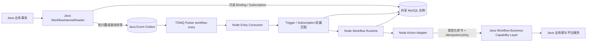

# 营销 Workflow 当前实现与 Java 协作落地方案

> Revision 运行语义更新：本文中“已运行 Run 始终固定使用进入时 Revision”的描述已由 [Workflow 在途 Run 前向 Revision 路由设计](./2026-08-14-workflow-live-revision-routing-design.md) 替代。Java 与 Node 的职责边界、不可变 Revision、Trigger Binding 和 Capability Contract 继续有效。

- 日期：2026-08-05
- 最后更新：2026-08-14
- 状态：Meeting Draft
- 适用对象：Java 平台团队、ChatAI Node 团队、产品与测试
- 会议目标：让团队快速理解当前 Workflow 已完成的设计和实现，确定 Java / Node 边界，并形成可以立即领取的开发任务
- 关联文档：[营销 Workflow 1.0 执行引擎设计](./2026-07-10-marketing-workflow-execution-engine-design.md)
- 最新入口契约：[Workflow Interest Reader 与入口事件身份契约](./2026-08-11-workflow-interest-reader-design.md)

> **2026-08-11 确认更新：**首批企微事件不再按 Subject Type 拆成多条消息。`contact.friend_added`、`contact.tag_added` 各自只生产一条源事件，携带 `workUserId`、`externalUserId` 以及可用的 `seatId`、`thirdExternalUserId`；Node 匹配 Binding 后再确定每个 Run 的唯一 Subject。本文中旧的“Entry Event 顶层固定一个 `subjectType + subjectId`”“Java 按 `subjectType + eventType` 查询”“同一事实按 Subject 投影多条消息”“Partition Key 固定为 `uid:subjectType:subjectId`”等入口细节，均由最新入口契约替代。Java 实现 Interest Reader 时必须以该文档为准。

> 本文其它“当前实现”描述仍保留 2026-08-06 的会议基线语义；本次只更新已经重新确认的 Entry Event、Subject 解析和 Interest Reader 边界。

## 0. 术语表

| 术语 | 所有者 | 通俗解释 |
| --- | --- | --- |
| Workflow | Node | 用户在营销画布中配置的一条营销主体旅程，由 Start、Wait、Branch、Action、End 等节点组成。 |
| Workflow Type | Node | 新建 Workflow 时选择的稳定业务类型，例如 WeCom SOP、ChatAI SOP，以及后续开放的 Member SOP。它决定主 Subject Type、可选 Start 事件、允许的节点、系统变量和业务能力边界，不是单纯的前端分类。 |
| Workflow Capability Profile | Node 定义，双方遵守 | Workflow Type 对应的语义能力策略，描述允许的事件、节点和用户变量。它不表达 Runtime 实现进度、部署能力或租户产品权益。 |
| Workflow Runtime Support | Node | 当前 Node Runtime 是否已经完整实现某种节点语义，包括 Schema、Compiler、Executor、输出、失败处理、恢复和测试。它不代表 Java 或当前环境已经接通。 |
| Workflow Production Availability | Node 权威判断 | Workflow Capability Profile、Runtime Support、Event Catalog Support、Product Entitlement 和业务资源状态的最终交集。 |
| Workflow Draft | Node | 当前可编辑的画布草稿，包含节点配置、连线和画布位置。Draft 可以反复修改，不能被 Worker 直接执行。 |
| Node Workflow Kernel | Node | Workflow 的持久化编排内核，负责 Revision、Binding、Run、Task、等待、分支、变量、重试、恢复和执行历史。 |
| Java Workflow Business Capability Layer | Java | Java 向 Workflow 提供的业务能力边界，负责消息、订单、标签、客户、优惠券、人工接管等查询、校验和实际业务动作。 |
| Java Event Outbox | Java | Java 所属的业务事件发件箱，通常是一张数据库表加异步 Publisher。Java 在保存新消息、订单等业务事实的同一事务中插入事件记录，随后可靠投递到 Pulsar `workflow-entry`。 |
| Node Workflow Outbox | Node | Node 已有的 Workflow 内部任务发件箱，对应 `xy_wap_embed_workflow_outbox`。Node 在推进 Run/Task 的同一事务中写入记录，随后投递到 Pulsar `workflow-task`。它不能与 Java Event Outbox 共用。 |
| Entry Event | Java 生产，Node 消费 | 可以触发 Start 或唤醒 Wait Event 的标准业务事实。事件携带来源身份和可用的 Subject 引用；Node 匹配具体 Binding 后才确定每个 Run 的唯一 Subject。通过 Pulsar `workflow-entry` 传递。 |
| `eventId` | Java 生成，Node 使用 | 业务事件的稳定唯一标识。同一业务事实重试和重复投递时必须保持不变，Node 用它防止同一 Workflow 重复创建 Run。 |
| Revision | Node | Workflow 每次正式启用或执行语义发生变化时生成的不可变执行快照。Task 固定使用到达当前节点时的 Revision；节点完成后，Run 按最新发布 Revision 解析下一跳。 |
| Trigger Binding / Binding | Node | 从已发布 Revision 的 Start 节点编译出的触发索引，记录 Event Type、目标 Subject Type 和完整 `filter_spec_json`。Binding 按 Revision 和 Event Type 持久化；本期因 Start Event 单选，当前 Revision 实际只有一条。Java 预匹配、Node 最终匹配和 Subject 解析都以当前 Revision Binding 为准。 |
| Run | Node | 某个 `subjectType + subjectId` 成功进入某个 Workflow 后产生的一次运行实例。同一主体重复进入同一 Workflow 会形成不同 Run，但必须满足 Start 的重复进入规则。 |
| Task | Node | Run 当前等待执行或即将执行的最小调度单元，记录节点、状态、执行版本、`due_at`、租约和重试次数。1.0 中一个 Run 同一时刻最多有一个有效 Task。 |
| Node Execution | Node | 某个节点在某个 Run 中的一次执行账本，保存受控输入、输出、幂等键、开始/完成时间和错误结果，用于审计与排障。 |
| Wait | Node | 固定时长或固定时间点等待。Node 将截止时间保存为 Task 的 `due_at`，不使用进程内 Timer，也不要求 Pulsar 保存长期延迟状态。 |
| Wait Event | Node 编排，Java 生产事件 | 等待当前 Subject 发生指定业务事件，例如 ChatAI SOP 等待新消息；事件到达或等待超时分别走不同出口。 |
| Event Subscription | Node 写，Java 只读 | Wait Event 运行到等待状态后产生的动态订阅，精确到 `uid + subjectType + subjectId + eventType`。Java 用它判断某条事件是否可能需要投递，Node 用数据库 CAS 决定事件到达和超时哪个分支成功。 |
| Retry | Node 调度，Java 配合幂等 | 节点遇到可重试错误或结果未知时，Node 将重试时间持久化到数据库并再次调度。业务动作重试必须复用相同 `idempotencyKey`。 |
| `idempotencyKey` | Node 生成，Java 执行 | 业务动作的稳定幂等键，建议由 `uid + runId + nodeId + sequence` 组成。Java 收到相同键的重复请求时必须返回第一次执行的同一业务结果。 |
| Inbox | Node | 已消费 MQ 消息的幂等记录。Inbox 与 Run/Task 状态更新在同一事务提交，用于吸收 Pulsar 重复投递和 ACK 前崩溃。 |
| Scheduler | Node | 扫描 MySQL 中已经到期的 Pending Task，认领任务并在同一事务写入 Node Workflow Outbox。 |
| Reconciler | Node | 后台修复器，负责回收过期租约、恢复停滞任务、补偿未发送 Outbox、取消不可用 Workflow 的 Run/Task，并清理历史数据。 |
| `subjectType` | Node Workflow Type 决定 | 主体身份命名空间，例如 `wecom_contact`、`miniapp_member`、`chatai_contact`。每种 Workflow Type 在 1.0 中只绑定一个主 Subject Type。 |
| `subjectId` | Node 从已校验事件字段解析 | 在 `uid + subjectType` 范围内稳定的营销对象 ID。WeCom SOP 使用 `externalUserId`，ChatAI SOP 使用 `thirdExternalUserId`；同一 Entry Event 可以为不同 Binding 提供不同候选 Subject。 |
| `workUserId` | Java 生成，Node 匹配 | 企微成员 ID。添加好友和打标签事件统一按该字段匹配 ChatAI SOP 与 WeCom SOP。 |
| `seatId` | Java 生成，Node 匹配或使用 | ChatAI 席位 ID。新消息事件按该字段匹配；每个有效席位唯一绑定一个 `workUserId`，同一租户下一个 `workUserId` 最多有一个有效席位。 |
| `externalUserId` | Java 生成，Node 解析 | 企微好友数字业务 ID，必须是 JavaScript 安全整数范围内的正整数；Node 投影为 Runtime `subjectId` 时转成十进制字符串。 |
| `thirdExternalUserId` | Java 生成，Node 解析 | ChatAI 席位好友 ID，是 ChatAI SOP 的 Subject ID。旧名 `external_third_userid` 不再使用。 |
| Product Entitlement | Java/产品权威，Node 展示和校验 | 租户购买或开通的产品能力，例如 ChatAI 席位、发券能力。它与 Workflow Type 分离，不能通过新增 Workflow Type 表达套餐差异。 |
| at-least-once | 双方 | 事件或任务可能被重复投递，但不能静默丢失。系统通过 `eventId`、Inbox、Task Version 和 `idempotencyKey` 吸收重复。 |
| fail-open | Java Interest Reader | Java 查询 Workflow 兴趣失败、超时或无法判断时，仍然写 Event Outbox 并投递事件。允许多投，不允许因优化逻辑故障漏投。 |

两类 Outbox 的关系：

```text
Java 业务事实
  -> Java Event Outbox
  -> Pulsar workflow-entry
  -> Node Entry Consumer
  -> Run / Task
  -> Node Workflow Outbox
  -> Pulsar workflow-task
  -> Node Task Consumer
```

## 1. 本文要解决的问题

营销 Workflow 的前端画布、Node 控制面和基础执行引擎此前主要由一人持续推进。团队其他成员尚未完整参与这套设计，因此这次协作不能只讨论“Java 发什么消息”，而需要先建立共同上下文。

本文依次回答：

1. 当前已经实现了什么，哪些能力只是 UI，哪些已经可以执行。
2. 为什么业务事件由 Java 产生，而 Workflow 语义继续由 Node 负责。
3. Java 如何在不理解 Workflow 图的情况下，减少无效事件投递。
4. 在 Java 与 Node 共用一个 MySQL 实例的前提下，如何直接读表，不建设额外的兴趣同步服务。
5. WeCom SOP 和 ChatAI SOP 如何使用不同主体身份、Start 事件和节点能力，以及如何为后续 Member SOP 保留稳定类型。
6. Start 触发和 Wait Event 唤醒分别如何工作。
7. Java 业务接口和 Node 执行引擎如何实现幂等、重试和错误分类。
8. 会后 Java、Node、产品和测试分别可以立即推进什么。

## 2. 执行摘要

**最终推荐架构：Node Workflow Kernel + Java Workflow Business Capability Layer。** 这不是重写现有方案，而是在保留 Node 持久化执行内核的基础上，将业务查询、业务动作、业务资源校验和业务身份解析统一收敛到 Java。

本方案的核心结论如下：

1. **新建 Workflow 时必须选择 Workflow Type。** 本期开放 WeCom SOP 和 ChatAI SOP；`member_sop` 只提前进入稳定枚举，不可创建、配置或发布。类型决定主 Subject Type、可选事件、节点目录和变量目录。
2. **Workflow Type 是不可变执行契约，不是 UI 筛选。** 创建后不允许转换类型；选错时通过新建或复制创建另一类型，避免已有节点、Revision 和 Run 语义失效。
3. **不建设强制统一的跨域客户 ID。** Runtime 身份统一使用 `subjectType + subjectId`，其中 `subjectId` 只需在 `uid + subjectType` 内稳定。
4. **Java 是全部业务事件的权威生产方。** 包括新增好友、客户打标、新消息、订单、人群进入等外部或 ChatAI 自有事件。
5. **Node Workflow 只消费标准化事件。** Node 不轮询 Java 业务表，不自行推断业务事实。
6. **Java 不解析 Workflow 图，也不创建 Run。** Workflow、Revision、Trigger Binding、Run、Task、变量、分支、重入策略和执行历史都由 Node 负责。
7. **Java 可以在投递 Pulsar 前直接读取 Workflow 表做精确来源过滤。** 由于双方使用同一个 MySQL 实例，1.0 不建设兴趣同步 API、兴趣变更消息或分布式缓存。
8. **静态 Start 兴趣读取 `xy_wap_embed_workflow_trigger_binding` 和结构化 Match 子表。** 添加好友、打标签按 `workUserId`，新消息按 `seatId`；Java 不解析 JSON。
9. **动态 Wait Event 需要新增独立订阅表。** 等待某个主体的新消息是 Run 级动态状态，不能从静态 Trigger Binding 推导，也不应让 Java 解析 Task 或 Revision JSON。
10. **Java 的读表结果只是流量优化，不是最终正确性判断。** Java 只判断“有没有可能需要这个事件”；Node 收到事件后仍按当前有效 Trigger Binding 或 Wait Event Subscription 做权威匹配。
11. **读表异常必须 fail-open。** 无法判断时仍写入 Java Outbox 并投递事件，不能因为优化组件故障而静默丢失营销事件。
12. **事件和动作都采用 at-least-once + 幂等。** Java 使用 Transactional Outbox 发布事件；Node 用事件 ID 防止重复进入，用稳定 `idempotencyKey` 调用 Java 动作接口。
13. **生产可用性是五层交集。** Workflow Type 语义、Runtime 完整实现、Event Catalog 支持、租户 Product Entitlement 和已配置业务资源必须同时满足；不能把实现进度或套餐差异编码成更多 Workflow Type。
14. **Runtime 实现完成不等于生产启用。** 当前真正可执行的节点只有 `start / wait / end`；其他节点即使完成前端配置或 Node Runtime，也必须等所需事件源或 Java operation 在当前环境明确启用后才能发布。
15. **Node 不再承载平台业务规则。** Node 只解析变量、形成类型化业务命令、调用 Java 并保存受控输出；Java 完成业务查询、权限与资源校验、身份解析和实际副作用。
16. **不能建设接收原始节点配置的万能 Java 执行器。** Java 能力可以共用信封和错误格式，但每种 operation 必须有独立、可验证的输入输出契约。

## 3. 当前实现概览

### 3.1 已完成的产品与前端能力

Workflow 是 `apps/web/src/pages/chat/workflow` 下的独立大型模块，菜单仍归属智能体模块。非测试环境已经通过 HTTP Repository 访问 Node 后端，不再依赖纯前端 Mock。

当前已经具备：

- Workflow 列表、创建、重命名、描述和状态展示。
- 全屏营销画布、平移缩放、小地图、自动布局和连续添加节点。
- 节点与边的选择、删除、拖拽、连接、撤销和重做。
- 固定且不可删除的唯一 Start 和 End。
- 节点设置面板、设置工作区展开模式和只读版本预览。
- 系统变量、客户变量、触发变量和前序节点输出选择。
- 图校验、节点配置校验、发布检查和运行能力检查。
- 草稿自动保存、乐观锁、发布、不可变 Revision 和历史版本恢复。
- Workflow 数据概览、进入记录和节点执行步骤查询页面。

当前前端节点目录已注册 17 种节点：

| kind | 产品名称 | 当前定位 |
| --- | --- | --- |
| `start` | 开始 | 触发入口，不可新增、删除或重命名 |
| `wait` | 等待 | 固定时长或指定天数后的固定时刻 |
| `wait-event` | 等待事件 | 当前产品方向为等待客户新消息或超时 |
| `branch` | 条件分支 | 根据变量执行结构化条件判断 |
| `message` | 消息发送 | 自定义消息或发送前序节点文本输出 |
| `message-query` | 消息查询 | 按动态或固定时间范围查询消息 |
| `tag` | 客户打标 | 修改客户标签 |
| `coupon` | 发券 | 发放权益 |
| `handoff` | 转人工 | 转人工并配置客服提示和对客话术 |
| `agent` | 转 Agent | 转入指定 Agent |
| `llm` | 大模型 | 模型、提示词、输入参数和结构化输出 |
| `order-query` | 订单查询 | 查询客户订单 |
| `order-bind` | 关联订单 | 把订单号关联到当前客户 |
| `tag-query` | 标签查询 | 查询客户标签 |
| `customer-update` | 修改客户资料 | 修改客户属性 |
| `ai-collect` | AI 收集资料 | 基于会话收集结构化资料 |
| `ai-intent` | AI 意图识别 | 基于消息或文本输入进行多分支意图判断 |
| `end` | 结束 | 唯一终点，不可新增、删除或重命名 |

### 3.2 已完成的 Node 控制面

`apps/backend/src/modules/workflow` 已实现真实 MySQL Repository 和以下 `/api/server/workflows/*` 能力：

- Workflow 创建、列表、详情、重命名和元数据修改。
- 草稿保存和 `draft_version` 乐观锁。
- 发布校验、首次启用、再次发布和不可变 Revision。
- Active、Paused、Stopped 和逻辑删除状态。
- Revision 列表和恢复到可编辑草稿。
- Workflow 数据概览、进入记录和单条运行详情。

首次启用或发布新 Revision 时，Node 会在同一 MySQL 事务中：

1. 插入不可变 `workflow_revision`。
2. 失效旧 Trigger Binding。
3. 插入当前 Revision 的 Trigger Binding。
4. 更新 Definition 的 `published_revision` 和运行状态。

### 3.3 已完成的执行面

当前已有独立 `apps/workflow-worker`，并实现：

- TDMQ Pulsar 和 Fake Broker 适配。
- Entry Consumer 和 Task Consumer。
- MySQL Run、Task、Node Execution、Inbox 和 Outbox。
- Scheduler 对长期等待任务的数据库扫描和派发。
- Task 租约、版本栅栏、失败重试和 Reconciler 恢复。
- 入口事件去重和主体重复进入策略。
- 节点输出与完整 Run Context 大小限制。
- 结构化日志、健康检查和 MySQL UTC+8 部署校验。

现有 Entry Consumer 的核心路径是：

```text
Pulsar Entry Event
  -> 校验 WorkflowEntryEvent
  -> 按 uid + subjectType + eventType 读取 Active Trigger Binding
  -> 执行结构化触发规则匹配
  -> 对每个命中的 Workflow 独立创建 Run
  -> 写入首个 Task 和 Node Outbox
```

### 3.4 尚未完成的边界

以下事项不能被“前端已经画出来”掩盖：

- `WORKFLOW_RUNTIME_SUPPORTED_NODE_KINDS` 当前仍只有 `start / wait / end`。
- 其余节点不能因为 UI 已完成就直接加入运行白名单。
- 当前真实业务事件尚未由 Java 接入 `workflow-entry` Topic。
- Workflow Worker 环境配置当前只接受 `dev / test`，生产环境枚举、Topic 和部署参数尚未接入。
- 当前入口契约只覆盖 `contact.friend_added`、`contact.tag_added` 和 `message.received`，并强制所有事件携带 `accountId`、`thirdUserId`，无法自然表达订单和人群事件。
- 当前 Definition、Revision、Trigger Binding 没有 Workflow Type，前端节点目录也没有统一的类型能力策略。
- 当前 Run、Entry Guard 和 Wait Event 设计只有 `subject_id`，无法区分不同主体域中的同值 ID。
- 当前运行记录查询固定把 `subject_id` 当作 `third_external_userid` 回填客户信息，无法展示会员或其他主体。
- Wait Event 目前只有前端模型，没有运行时动态订阅表和竞争处理。
- Message、Tag、Coupon、Handoff 等动作节点没有完整 Java Capability 契约。
- Message Query、Order Query、Tag Query 和客户资料修改需要 Java 查询或动作接口。
- Branch、LLM、AI Intent 等节点仍需要正式 Compiler 配置和 Executor。

## 4. Java 与 Node 的系统边界

### 4.1 Java 负责业务事实和业务能力

Java 负责：

- 识别并产生新增好友、打标签、新消息、订单和人群变化等业务事件。
- 为每个事件生成稳定的 `eventId`。
- 将业务事实映射为明确的 `subjectType + subjectId`，并保证该组合在租户内稳定。
- 通过 Java Transactional Outbox 可靠投递 TDMQ Pulsar。
- 提供消息、订单、标签、客户资料、优惠券、人工接管和 Agent 路由等查询与动作能力。
- 根据 `subjectType + subjectId` 解析对应客户、会员、会话、托管账号和最终业务对象。
- 权威校验业务资源是否存在、是否可用以及当前租户是否有权使用。
- 对具有副作用的 API 按 Node 提供的 `idempotencyKey` 幂等执行。
- 返回稳定的业务错误码，并区分可重试、终态和结果未知。

### 4.2 Node 负责 Workflow 语义

Node 负责：

- Workflow Draft、发布校验、不可变 Revision 和 Trigger Binding。
- Workflow Type、Subject Type、能力矩阵和类型不可变规则。
- 根据 Workflow Type 提供 Start 事件、节点目录、系统变量和发布能力校验。
- 事件的最终触发匹配，一个事件扇出到多个 Workflow。
- 入口幂等、主体重复进入策略和 Run 创建。
- Run、Task、长期等待、租约、重试、恢复和历史记录。
- Wait Event 动态订阅及事件和超时之间的竞争。
- 变量解析、节点输出、条件分支和图路由。
- 将节点配置和变量解析为类型化业务命令，生成 `idempotencyKey` 并调用 Java Capability Adapter。
- 校验 Workflow 图和命令结构，但不复制 Java 领域规则。
- 决定何时把一种节点加入运行支持白名单。

### 4.3 明确禁止的耦合

Java 不应：

- 读取或解析 `draft_json`、`execution_spec_json`、节点图和条件 AST。
- 解释 Draft、节点配置或任意规则 DSL；Java 只允许按 Interest Reader 文档冻结的事件 Filter Schema 解析 `filter_spec_json` 并执行预匹配。
- 在业务事件中写入 `workflowId`、`revision`、`runId` 或指定目标 Workflow。
- 把 Java 的业务事件直接标记为某个 `workflowType`，或由 Java 决定目标 Workflow 类型。
- 创建或修改 Workflow Run、Task、Revision、Trigger Binding。
- 根据 Workflow 节点配置决定重试和流程路由。
- 接收原始 `nodeConfig` 后自行解释任意节点。

Node 不应：

- 直接修改 Java 所属的业务表。
- 通过轮询业务表推断新消息、新订单或客户变化。
- 复制 Java 的客户、订单或会话领域规则。
- 绕过 Java API 直接查询或修改 Java 所属平台表。
- 在没有 Java 幂等保证时对具有副作用的接口盲目重试。
- 仅靠前端隐藏节点来执行 Workflow Type 能力限制，绕过后端保存和发布校验。

## 5. 目标架构



这里有两个不同层次的判断：

1. **Java 粗过滤：** 只判断当前是否存在任何可能需要该事件的 Start 或 Wait Event，不判断具体 Workflow。
2. **Node 权威匹配：** 读取当前有效绑定或订阅，执行完整条件、重入和并发校验。

Java 粗过滤允许误报，即多发一条事件；不允许因为缓存、SQL 异常或错误解析造成漏报。

### 5.1 与现有方案相比的调整

| 能力 | 现有实现或倾向 | 推荐调整 |
| --- | --- | --- |
| Draft、Revision、Binding | Node | 保持 Node，不迁移 |
| Run、Task、Wait、Retry | Node | 保持 Node，不迁移 |
| Branch、变量和路由 | Node | 保持 Node，不迁移 |
| 业务事件 | 尚未接真实来源 | Java 统一生产并通过 Outbox 投递 |
| 业务数据查询 | 需要逐节点适配 | Java 提供领域查询能力，Node 只解析查询参数 |
| 业务副作用 | Node Action Adapter 尚未接通 | Java 权威执行，Node 只编排和重试 |
| 资源与权限校验 | 容易在 Node 重复实现 | Java 权威校验，Node 只校验结构和引用完整性 |
| Workflow 类型和能力目录 | 当前未建模 | Node 维护不可变 Workflow Type 和共享能力策略，前后端共同校验 |
| 客户/会员/会话/账号映射 | 当前默认都是 ChatAI 客户 | Java 根据 `subjectType + subjectId` 解析对应业务主体 |
| 动作幂等 | 仅有 Node 稳定键 | Node 生成键，Java 保存并复用业务结果 |

因此，调整后的 Node 厚度主要来自 Durable Workflow 本身，而不是平台业务代码。不能为了进一步减少 Node 文件数量，把 Run、Task、Wait、Branch 或重试状态拆到 Java；那会形成两套状态机和跨服务状态对账。

### 5.2 Workflow Type 与主体身份模型

新建 Workflow 的第一步是选择 Workflow Type。产品展示名称和内部稳定值建议为：

| 产品名称 | `workflowType` | 主 `subjectType` | 主体 ID 示例 |
| --- | --- | --- | --- |
| WeCom SOP | `wecom_sop` | `wecom_contact` | 企微客户 ID |
| Member SOP（本期不可用） | `member_sop` | `miniapp_member` | 小程序会员 ID |
| ChatAI SOP | `chatai_sop` | `chatai_contact` | `thirdExternalUserId` |

表中的 ID 只是当前业务示例，不写入 Workflow Runtime 的解析规则。Runtime 只认可：

```ts
type WorkflowSubject = {
  type: "wecom_contact" | "miniapp_member" | "chatai_contact";
  id: string;
};
```

身份唯一性范围是：

```text
uid + subjectType + subjectId
```

不要求同一个自然人在客户域、会员域和 ChatAI 域中使用相同 ID，也不要求 Workflow 1.0 先建设统一身份图谱。

Workflow Type 创建后不可修改。Definition 只保存 Workflow Type；发布时将 Workflow Type 和由 Capability Profile 得到的 Subject Type 固化到不可变 Revision 的普通列。Execution Spec 继续只表达执行图，Runtime Revision Record 将两个类型字段与 Execution Spec 一起返回。Run 的 Subject Type 和 Subject ID 在进入后不变；当前 Task 使用自己的 Revision，后续节点按最新发布 Revision 前向路由。

领域契约、Java 事件信封和 DTO 使用可读的字符串值；MySQL 普通列使用稳定的 `TINYINT UNSIGNED` 编码，减少 Run、Entry Guard、Subscription 和联合索引中的重复存储：

| 数据库字段 | 编码 | 领域值 |
| --- | --- | --- |
| `workflow_type` | `1` | `chatai_sop` |
| `workflow_type` | `2` | `wecom_sop` |
| `workflow_type` | `3` | `member_sop`，本期不可用 |
| `subject_type` | `1` | `chatai_contact` |
| `subject_type` | `2` | `wecom_contact` |
| `subject_type` | `3` | `miniapp_member` |

`0` 保留为非法值，编码只允许追加且永久不得复用。Repository 是数字编码与领域字符串之间唯一的转换位置，读到未知编码时直接按数据契约错误处理。`spec_hash` 使用领域字符串计算，并覆盖 Revision 的 Workflow Type、Subject Type 和 Execution Spec。

建议显式落库或固化以下字段：

```text
workflow_definition.workflow_type
workflow_revision.workflow_type
workflow_revision.subject_type
workflow_trigger_binding.subject_type
workflow_run.subject_type
workflow_entry_guard.subject_type
workflow_event_subscription.subject_type
```

当前尚无生产历史数据，应该在业务接入前一次性调整模型，不提供默认类型、旧数据回退或把所有主体误当成 ChatAI 客户的兼容分支。Subject ID 始终是区分大小写的不透明字符串，Node 不执行 trim、大小写转换或数字转换。

### 5.3 Workflow Capability Profile

每种 Workflow Type 对应一份共享能力策略：

```ts
type WorkflowCapabilityProfile = {
  availability: "enabled" | "reserved";
  workflowType: "wecom_sop" | "member_sop" | "chatai_sop";
  subjectType: "wecom_contact" | "miniapp_member" | "chatai_contact";
  allowedEntryEventTypes: string[];
  allowedNodeKinds: string[];
  variableCatalog: string[];
};
```

本期最小事件矩阵已经确定：

| Workflow Type | 允许的 Start eventType |
| --- | --- |
| ChatAI SOP | `message.received`、`contact.friend_added`、`contact.tag_added` |
| WeCom SOP | `contact.friend_added`、`contact.tag_added` |
| Member SOP | 无；Profile 状态为 `reserved` |

本期最小节点矩阵已经确定：

| Workflow Type | 语义上允许的 Node Kind |
| --- | --- |
| ChatAI SOP | 当前目录全部节点：`start`、`wait`、`wait-event`、`branch`、`message`、`message-query`、`handoff`、`agent`、`llm`、`ai-collect`、`ai-intent`、`order-query`、`order-bind`、`tag-query`、`tag`、`customer-update`、`coupon`、`end` |
| WeCom SOP | `start`、`wait`、`branch`、`llm`、`order-query`、`order-bind`、`tag-query`、`tag`、`customer-update`、`coupon`、`end` |
| Member SOP | 无；不可创建、配置或发布 |

WeCom SOP 明确不允许当前依赖 ChatAI 会话语义的 `wait-event`、`message`、`message-query`、`handoff`、`agent`、`ai-collect` 和 `ai-intent`。其中 `ai-intent` 当前接收消息内容或消息 ID，不作为通用文本分类节点开放。

本期所有 Workflow Type 都保证以下公共变量：

```text
subject.id
trigger.eventType
trigger.occurredAt
```

首批 Entry Event 还注册了对应的 `trigger.projection.*` 变量。编辑器和 Compiler
只能暴露当前 Workflow Type 允许、并且在该 Workflow 所有已配置 Start Event 中都保证存在的
字段。例如同时配置 `contact.tag_added` 与 `message.received` 时，`tagId` 和 `messageId`
都不可引用，因为它们分别只存在于其中一类事件。前序节点输出和节点
`enteredAt / exitedAt` 由图结构动态生成，不写入静态 Profile。`enteredAt` 表示 Task
到达该节点的时间，`exitedAt` 表示 Runtime 最终确认节点成功并准备提交结果的实际时间；
重试成功时以最终成功时刻为准。选择器 scope 从
`customer` 统一为 `subject`；删除当前无法跨类型保证的 `system.employeeId` 和
`customer.name`。`eventId` 保留在 Runtime Context 用于幂等，不进入用户变量选择器。

当前 `message`、`message-query`、`wait-event`、`handoff` 和 `agent` 节点表达的是 ChatAI 会话能力。未来如果 WeCom SOP 支持企微触达，应增加明确的企微消息 operation 或节点能力，不能复用同一个名称后在 Java 内部猜测渠道。

`message-query` 是 Node Workflow Worker 内部实现，不经过 Java。查询先按托管账号解析 `third_userid`，再按租户、平台、`third_user_id`、`third_external_id` 和 `msgtime` 查询私聊消息；平台表不由 Node 写入，也不在本节点中增加或修改索引。固定时间选择精确到分钟，开始时间从该分钟的 `00.000` 起算，结束时间包含该分钟直到 `59.999`；动态时间引用保持原始毫秒精度。

### 5.4 Runtime 实现与生产启用的双重门槛

最终 Production Availability 按以下规则计算：

```text
Workflow Capability Profile
  INTERSECT Workflow Runtime Support
  INTERSECT Workflow Event Catalog Support
  INTERSECT Product Entitlement
  INTERSECT required business resources
```

这五层分别回答不同问题：

| 层 | 回答的问题 | 权威来源 |
| --- | --- | --- |
| Capability Profile | 该事件、节点或变量是否属于这个 Workflow Type | 共享 contracts 中的唯一只读 Type Policy |
| Runtime Support | 当前 Node 版本是否能完整编译和执行该节点 | Workflow Engine 的可执行节点注册表 |
| Event Catalog Support | Start 或 Wait Event 使用的事件是否由 Node 认识，并支持该 Workflow Subject Type | Workflow Engine Event Catalog |
| Product Entitlement | 当前租户是否有权创建和运行该 Workflow Type | Java 同步查询接口 |
| Business Resource | 节点引用的账号、Agent、标签、优惠券等是否可用 | Java 资源校验与执行时权威检查 |

#### Runtime Support

`packages/contracts` 只定义节点类型和交换 DTO，不再拥有“节点已经实现”的事实。Workflow Engine 维护唯一的可执行节点注册表，Backend、Compiler 和 Worker 通过同一模块读取；Web 不直接维护或导入运行白名单。

一个节点只有同时完成正式 Schema、Compiler、Executor、输出契约、配置与变量校验、失败分类、重试或恢复语义以及关键回归测试后，才能进入 Runtime Support。1.0 不允许只开放一个节点的部分产品模式：只要编辑器当前暴露的任一模式尚未闭环，整个 Node Kind 仍为 Runtime Unsupported。

#### Event Catalog 与外部依赖

Event Catalog 是 Start 和 Wait Event 的代码侧权威来源，提供 `supports(eventType, subjectType)` 与运行时 `project(event)`。Publish、Enable 和 Resume 必须确认 Revision 使用的每个事件都受 Catalog 支持。`payloadVersion` 只属于 Java 发出的 Entry Event Envelope，用于选择 Payload Schema 和投影器，不冻结到 Workflow Revision。

Node 不再为节点或外部调用维护 `operation.*` 注册表、Deployment Capability、环境白名单或 capability fingerprint。节点能否发布只由 maturity 对应的 Runtime Support 决定；真正调用 Java、数据库或其他系统时，瞬时不可用继续走该节点既有的 timeout、retry、deadline 和恢复语义。LLM 与 AI Intent 已通过 Workflow Worker 的共享火山 Ark Adapter 接通。

事件接入必须遵守硬发布顺序：Java 先发布但不创建相关 Binding、也不产生新事件；Workflow Worker 全量滚动完成并具备新 Catalog 定义后，Backend/Web 才开放新事件配置。旧 Worker 收到未知事件会写 Entry DLQ 后 ACK，不能依赖消息重试等待新 Worker 接手。

#### 统一判断入口与阻断结果

Node Workflow Kernel 提供唯一的 Production Availability 判断模块，发布、启用和恢复通过该模块组合各层门槛。Web 只消费 Backend 返回的 Runtime Support 摘要和最终校验结果，不自行成为权威判断者，也不在打开编辑器时调用 Java Entitlement 或资源接口。

校验一次返回完整 `blockers[]`，每项至少包含阻断维度、`nodeId` 和 `nodeKind`；事件问题额外包含 `eventType`。用户界面只展示简短业务原因，例如“该节点尚未开放”“当前无对应产品权益”“所选资源不可用”；Java 接口名称和内部诊断只进入受控日志。

语义上允许但 Runtime 或 Java 尚未就绪的节点仍可进入 Draft 并完成配置。前端只隐藏 Type Policy 明确禁止的节点；能力摘要请求失败不影响编辑和保存，但 Publish 仍由 Backend fail-closed。

#### 生命周期检查时机

| 边界 | 检查规则 |
| --- | --- |
| Save Draft | 权威执行 Type Policy 和基本数据安全检查；允许配置不完整或尚未生产开放的节点 |
| Publish | 重新检查 Type Policy、配置完整性、Runtime Support、Event Catalog、Entitlement 和资源状态 |
| Enable / Resume | 不复用旧校验结论，重新执行全部生产门槛 |
| Active Workflow 发布新 Revision | 在写入新 Revision 前重新执行全部生产门槛 |
| Entry | 检查候选 Revision 的 Runtime Support、Subject Type 和当前 Entitlement，再决定是否创建 Run |
| Task / Retry / Wait 到期 | 检查当前 Entitlement；节点依赖故障走自身可靠性语义 |

Execution Spec v3 只持久化执行图和节点配置，不持久化当前可用性的布尔结果或能力键。发布审核冻结候选内容，但不能替代 Publish、Enable 和 Resume 时对 Runtime Support、Event Catalog、Entitlement 和资源的实时复查。

#### 版本兼容与下线

Node Schema、Entry Event Envelope 和 Java Inference Request 各自保留真实协议版本。只要当前发布 Revision、活动 Task、Wait Event Subscription、Inference Job 或 Retry/Lease Recovery 仍引用旧 Node Schema 或请求版本，对应 Runtime handler 就不得删除。正常下线先禁止新发布，再等待存量旧节点执行完成；仅被保留期运行历史引用不要求保留可执行 Handler，历史回显使用不可变 Revision 快照。

本次 Execution Spec v2 到 v3 发生在开发阶段，升级时一次性清空全部 Workflow 数据，不提供 v1/v2 长期兼容读取。进入生产后再次升级 Execution Spec，必须提供明确迁移或兼容窗口。

Runtime 对新入口仍校验事件 Subject Type 与 Revision/Binding 一致，但已发布 Revision 和运行中的 Run 不重新套用当前 Type Policy。新增允许能力是兼容扩展；普通版本禁止直接删除或收紧已开放的 Type Policy。收紧必须作为独立迁移处理受影响 Workflow。1.0 不增加 `capabilityPolicyVersion`。

这套门槛允许前端提前完成节点模型，同时保证只有把 maturity 改为 `runtime-ready` 并通过 Worker 生产组合校验后，节点才能进入发布链路。

### 5.5 Product Entitlement 失效语义

本期只把“租户是否有权使用某个 Workflow Type”视为 Workflow Type Entitlement，例如是否有权创建和运行 `chatai_sop` 或 `wecom_sop`。节点所需席位、优惠券、账号和其他资源仍是独立发布与执行门槛，不因为某个节点资源失效就停止同类型的全部 Workflow。

Java 是 Product Entitlement 的唯一权威来源。Node 不接收权益事件，也不建立租户类型级权益投影。Java 提供固定同步接口：

```ts
POST /third-internal/wap-embed-workflow-definition/can-run
body: { uid: number; workflowType: 1 | 2 | 3 }
response: { success: boolean; error?: number; errorMsg?: string; data?: boolean }
```

类型值固定为 ChatAI SOP=1、WeCom SOP=2、Member SOP=3。只有 HTTP 成功、标准 Java 信封 `success === true` 且 `data` 为 boolean 才构成权益结果；`success === false` 时 `error` / `errorMsg` 只用于失败诊断。超时、业务错误或非法响应都表示服务不可用，不能解释成无权益。Java 不返回容量，Node 侧每租户活跃 Run 上限默认 10000，可由部署显式覆盖。

Node 在以下边界查询权益：

- 创建，以及 Draft、布局、名称、描述、审核、发布、恢复、启用和试运行等编辑操作。删除、暂停、停止和读取不受权益限制。
- Entry Event 已找到候选 Binding、准备创建 Run 之前。
- Task、Retry、Wait 到期或其他节点准备继续推进之前。
- Reconciler 从 `workflow_capacity_guard.active_run_count > 0` 按 UID 主键游标读取仍占用容量的租户，并检查三种 Workflow Type。

查询使用进程内约 60 秒 L1 缓存和 Redis 30 分钟共享缓存，key 为 `workflow:entitlement:v1:<uid>:<workflowType>`。并发回源按 key singleflight 合并。Redis 故障时回源 Java；Redis 不是第二权威源。缓存或普通查询返回 `false` 时，任何自动停用前必须绕过缓存再向 Java 确认一次。

检查结果按以下规则处理：

| Java 结果 | Workflow 处理 | 当前操作 |
| --- | --- | --- |
| `data = true` | 不自动修改状态 | 按原状态继续；启用或恢复会清除旧的系统状态原因 |
| `data = false`，且停用前再次确认仍为 `false` | Entry、Task 只把自身 Workflow 改为 `inactive`；Reconciler 只处理该失权类型下仍有未完成 Run 的具体 Workflow ID | Entry 不创建 Run；Task 当前消息 ACK；现有 Reconciler 取消未完成运行资源并释放容量 |
| Java 查询超时或不可用 | 不修改任何 Workflow 状态 | 控制面写操作失败；Entry 不创建 Run；Task 暂缓并重试 |

控制面查询到无权益时只拒绝当前写操作，不修改 Workflow 状态。状态处理不按 `uid + workflowType` 批量修改全部 Definition，不扫描 Definition 全表，也不新增索引。没有 Entry、Task 或活跃 Run 的失权 Workflow 可以长期保持 `active`；这是接受的惰性状态，因为它不占运行容量。`statusReason = entitlement_revoked` 只用于解释，不参与权限判断。

### 5.6 跨主体域边界

一个 Run 只绑定一个主 `subjectType + subjectId`。跨域能力不能通过拼接 ID 或让 Runtime 猜测关联关系完成。

例如会员 SOP 未来需要向该会员关联的企微客户发消息，应采用以下任一种显式方式：

- Java Capability 根据明确 operation 和业务规则解析关联主体，并在找不到唯一关联时返回稳定错误。
- 增加“查询关联客户”之类的类型化查询节点，将关联主体作为明确输出供后续节点使用。

同一个订单事实如果可以同时映射为会员和企微客户，可以由 Java 生成多个稳定的 Workflow Subject 投影事件。每个投影都必须拥有稳定、可去重的 `eventId`；Node 不在运行时自行跨域扩散事件。

## 6. 标准事件契约

> 本节描述首批事件的当前公共边界。逐事件字段、Interest Reader SQL 和 Filter 规则以 [Workflow Interest Reader 与入口事件身份契约](./2026-08-11-workflow-interest-reader-design.md) 为准。

### 6.1 目标事件信封

现有 `WorkflowEntryCommand` 需要改为可扩展的标准事件信封。当前功能尚未发布，不需要保留无实际数据依据的旧格式兼容代码。

冻结契约：

```ts
type JsonValue =
  | null
  | boolean
  | number
  | string
  | JsonValue[]
  | { [key: string]: JsonValue };

type WorkflowEntryEvent = {
  schemaVersion: 1;
  payloadVersion: 1;
  eventId: string;
  eventType: string;
  uid: number;
  occurredAt: string;
  source: "wecom" | "chatai";
  payload: Record<string, JsonValue>;
};
```

字段语义：

| 字段 | 责任方 | 规则 |
| --- | --- | --- |
| `schemaVersion` | 双方 | 公共信封版本，从 1 开始；信封发生不兼容变更时才升级 |
| `payloadVersion` | 双方 | 当前 `eventType` 的 payload 版本，从 1 开始；与信封版本独立演进 |
| `eventId` | Java | 大小写敏感，1-128 字符，在租户内全局唯一；同一业务事实重试时必须稳定 |
| `eventType` | 双方 | 1-128 字符，匹配 `^[a-z][a-z0-9_]*(?:\.[a-z][a-z0-9_]*)+$`，由 Event Catalog 统一管理 |
| `uid` | Java | 租户 ID，必须是 JavaScript 安全整数范围内的正整数 |
| `occurredAt` | Java | 以 `Z` 结尾的 UTC RFC 3339 时间；小数秒可省略，存在时允许 1-9 位；可直接使用 `Instant.toString()` |
| `source` | Java | 当前只能是 `wecom` 或 `chatai`；表示权威事件来源，只用于审计和指标，不参与 Workflow 匹配 |
| `payload` | 双方 | 由具体 `eventType + payloadVersion` 定义的受控对象，并携带 Node 解析候选 Run Subject 所需的事件身份字段 |

公共信封采用关闭对象规则，`additionalProperties: false`，不提供自由扩展的公共 `context`。账号、会话、渠道等非公共字段如果是某种事件所必需，必须进入该事件专属 `payload` 并由对应 Schema 校验。

大小和结构限制：

- `payload` JSON 编码后最大 32 KiB。
- 完整信封 JSON 编码后最大 64 KiB。
- JSON 嵌套深度最大 16。
- 超限或结构非法的事件进入 Workflow Entry DLQ，禁止截断后继续处理。

Java 用 `Instant` 生成和解析 `occurredAt`。Node 接收后统一规范化为三位毫秒的 `.sssZ` 形式，再写入 Run Context。写入 MySQL `DATETIME` 时继续依靠双方 UTC+8 Session 和 Node `timezone: "+08:00"` 的部署契约，业务代码禁止手工加减 8 小时。

禁止在事件中携带：

- `workflowId`
- `workflowType`
- `revision`
- `runId`
- 完整 Workflow 配置
- Java 已经判断出的目标流程列表

首批企微事件的同一个源业务事实只投递一次。事件 payload 可以同时携带 WeCom 与 ChatAI 候选身份；Node 按每条命中 Binding 的 `subject_type` 选择对应 Run Subject，并可以从一条事件创建零个、一个或多个 Workflow Run。

### 6.2 本期最小事件目录

公共 Schema 只校验 `eventType` 是长度合法的小写点分机器名；是否支持由 Workflow Event Catalog 判断。Catalog 中每个条目必须声明 `eventType + payloadVersion`、适用 Subject Type、payload Schema 和受控投影。未知 `eventType` 或不支持的 `payloadVersion` 都进入 Entry DLQ，不能当作“无 Workflow 命中”静默丢弃。

事件目录必须同时声明适用的 Subject Type。本期 Capability Policy 只冻结以下最小目录，具体 payload 仍由后续事件契约决定：

| eventType | 类型 | 首批 Subject Type | 权威生产方 | 说明 |
| --- | --- | --- | --- | --- |
| `message.received` | 发生事件 | `chatai_contact` | Java 消息域 | payload 携带 `seatId`、`thirdExternalUserId` 等身份字段 |
| `contact.friend_added` | 发生事件 | `chatai_contact`、`wecom_contact` | Java 联系人域 | 一个企微事实只投递一次，payload 携带可用的两类候选身份 |
| `contact.tag_added` | 发生事件 | `chatai_contact`、`wecom_contact` | Java 联系人域 | 一个企微事实只投递一次，payload 携带 `tagId` 与候选身份 |

`audience.entered`、订单等事件是后续兼容扩展，本期不进入最小 Policy。无论后续增加哪种事件，Java 都只生产标准事件，不负责匹配具体 Workflow。

`miniapp_member` 是公共 Subject Type 的合法值，因此信封基础校验可以通过；但 `member_sop` 本期不可用，不会存在可命中的 Active Binding 或 Wait Event Subscription。

### 6.3 事件 ID 生成

`eventId` 必须来自稳定业务事实，不能在每次 MQ 重试时重新生成 UUID。Java Event Outbox 首次写入时固化 `eventId` 和完整事件内容，后续重发必须复用二者。

示例：

```text
message.received:<messageId>
order.created:<orderId>:<subjectType>:<subjectId-or-hash>
audience.entered:<audienceMembershipEventId>:<subjectType>
contact.tag_added:<tagChangeEventId>
```

首批事件中，一个源事实只生成一个稳定 `eventId`，不会因为可解析出多个候选 Subject 而拆成多条事件。

如果源系统没有天然事件 ID，应在 Java 业务事务中先生成并持久化 Outbox ID，后续所有重试复用该值。

Pulsar Message ID 只用于识别一次传输，不能代替业务 `eventId`。Pulsar 重投、Java Outbox 重发和人工重放都必须保留原 `eventId`，除非产品明确要求产生一个新的业务事件。

### 6.4 Pulsar 约定

- Topic：沿用各环境现有 `workflow-entry` Topic 配置。
- Producer：Java。
- Consumer：独立 Node Workflow Worker。
- Delivery：at-least-once。
- Partition Key：`contact.*` 使用 `uid:wecom_contact:externalUserId`；`message.received` 使用 `uid:chatai_contact:thirdExternalUserId`。
- Java Outbox 发送成功后再标记已发送。
- Node 完成数据库事务后再 ACK。
- Pulsar 不承担最终状态和业务幂等。
- 同一事件允许同时命中 Start Binding 和 Wait Event Subscription。
- Partition Key 只优化同一源身份的顺序，不作为正确性条件；Start、Wait Event 和 Run 推进仍依赖数据库唯一约束、CAS 和幂等。

### 6.5 版本演进

- 公共信封字段发生不兼容变化时升级 `schemaVersion`；某个事件 payload 发生不兼容变化时只升级该事件的 `payloadVersion`。
- 新版本按 consumer-first 顺序发布：Node 先支持新版本并保持旧版本兼容，Java Producer 再开始发送新版本。
- 旧版本只有在对应 Java Outbox、Pulsar backlog 和 Entry DLQ 均已排空或完成处置后才能移除。
- 当前没有已发布 v0 数据，不保留 `WorkflowEntryCommand` 或其他历史信封兼容分支。

### 6.6 消费结果分类

| 结果 | 处理 |
| --- | --- |
| 非法 JSON、信封或 payload 超限、未知 `schemaVersion`、未知 `eventType`、未知 `payloadVersion`、payload Schema 校验失败 | 持久化或发布到 Entry DLQ 后 ACK 原消息；DLQ 暂时不可用时按临时错误重试 |
| 没有 Start Binding 或 Wait Event Subscription 命中 | 正常 no-op 并 ACK |
| `eventId` 已处理，或 Wait Event Subscription 已被同一事件/超时抢占 | 成功去重并 ACK |
| MySQL、Pulsar 或其他基础设施临时错误 | NACK 或不 ACK，由 Pulsar 按策略重试 |

指标使用低基数结果码，例如 `invalid_json`、`envelope_too_large`、`unsupported_schema_version`、`unknown_event_type`、`unsupported_payload_version`、`payload_invalid`、`no_match`、`deduplicated` 和 `temporary_failure`，禁止把原始异常文案或业务 ID 放进 label。

## 7. Java 直接读表的兴趣判断

Java 与 Node 当前共用 MySQL 实例，因此 1.0 不建设兴趣同步服务、缓存投影或注册 API。

最终实施契约见 [Workflow Interest Reader 与入口事件身份契约](./2026-08-11-workflow-interest-reader-design.md)。本节只冻结架构边界：

- Java 只读 `workflow_definition`、`workflow_trigger_binding` 和 `workflow_event_subscription` 三张表。
- 本期一个 Workflow 只能选择一个 Start Event；发布契约和持久化仍使用 Binding 数组，为未来多事件保留扩展空间。
- Backend 对每租户最多 50 个 active Workflow 做普通计数检查，不使用租户级锁处理极端并发超限。
- Java 按 `uid + eventType` 查询 Binding JOIN Definition，最多读取 50 条 `filter_spec_json`，再按冻结的事件 Filter Schema 在内存预匹配。
- Java 不在 SQL 中拆解 JSON，不读取 Draft、Revision、Execution Spec、Run 或 Task，也不维护 Binding Match 派生表。
- `message.received` 的静态 Start 兴趣与动态 Wait Event Subscription 任一命中即可投递。
- 查询、JSON 解析或未知 Filter 失败时返回 `UNKNOWN` 并 fail-open。
- Node 收到事件后仍使用同一 Binding Filter 做最终权威匹配并创建 Run。
- Java 数据库账号仅授予上述三张表的 `SELECT`，所有查询收敛在单一 `WorkflowInterestReader` DAO。
- 1.0 默认不加 Java 本地缓存；只有真实指标证明数据库查询成为瓶颈后再独立评审。

## 8. Java 事件生产机制

### 8.1 Java Transactional Outbox

Java 不能在业务事务中直接调用 Pulsar 并假设发送成功。推荐：

1. 业务状态变更和 Event Outbox INSERT 位于同一数据库事务。
2. 独立 Java Outbox Publisher 扫描未发送记录。
3. 成功发送后标记已发送。
4. 发送成功但状态回写失败会造成重复投递，由 Node `eventId` 幂等吸收。
5. Pulsar 不可用时只积压 Outbox，不回滚已经提交的业务事实。

如果 Java 当前已有通用 Outbox/CDC 能力，Workflow 复用现有机制，不再新建一套 Publisher。

### 8.2 Java 伪代码

> 本节旧伪代码使用单一 `subjectType + subjectId`，已经被最新入口契约替代。

```java
void recordWorkflowEvent(DomainFact fact) {
    WorkflowEntryEvent event = workflowEventMapper.map(fact);

    boolean interested;
    try {
        interested = workflowInterestReader.exists(
            event.getUid(),
            event.getSubjectType(),
            event.getEventType(),
            event.getSubjectId(),
            event.getAccountIdOrNull()
        );
    } catch (Exception error) {
        interested = true; // fail-open
        metrics.increment("workflow_interest_lookup_error");
    }

    if (interested) {
        workflowEventOutboxRepository.insert(event);
    } else {
        metrics.increment("workflow_event_filtered", event.getSubjectType(), event.getEventType());
    }
}
```

### 8.3 不同事件的 payload 示例

> 本节旧 payload 仅保留为历史讨论样例，不是 Java DTO。首批三个事件必须使用最新入口契约中的字段。

以下示例只说明公共信封结构；具体 payload 字段尚未冻结，不构成本期事件业务契约。`audience.entered` 和 `order.created` 也不在本期最小 Event Catalog 中。

新消息：

```json
{
  "schemaVersion": 1,
  "payloadVersion": 1,
  "eventId": "message.received:938271",
  "eventType": "message.received",
  "uid": 10001,
  "subjectType": "chatai_contact",
  "subjectId": "external-third-user-123",
  "occurredAt": "2026-08-05T02:30:15.000Z",
  "source": "chat-message",
  "payload": {
    "accountId": "managed-account-1",
    "conversationId": 90001,
    "messageId": 938271,
    "messageType": "text",
    "text": "我想了解一下活动"
  }
}
```

进入人群：

```json
{
  "schemaVersion": 1,
  "payloadVersion": 1,
  "eventId": "audience.entered:720019",
  "eventType": "audience.entered",
  "uid": 10001,
  "subjectType": "miniapp_member",
  "subjectId": "miniapp-member-123",
  "occurredAt": "2026-08-05T02:31:00.000Z",
  "source": "cdp",
  "payload": {
    "audienceId": 301,
    "membershipEventId": 720019
  }
}
```

订单创建：

```json
{
  "schemaVersion": 1,
  "payloadVersion": 1,
  "eventId": "order.created:880012",
  "eventType": "order.created",
  "uid": 10001,
  "subjectType": "miniapp_member",
  "subjectId": "miniapp-member-123",
  "occurredAt": "2026-08-05T02:32:00.000Z",
  "source": "order",
  "payload": {
    "orderId": 880012,
    "amount": 19900,
    "currency": "CNY"
  }
}
```

消息正文属于敏感数据。Java 和 Node 的正常日志不得输出完整 payload；只有 Event Catalog 明确投影且节点需要的受控字段才能写入 Runtime 状态，并继续受 128 KiB Run Context 上限约束。

上述例子中的 Subject ID 都只是示意。Java Mapper 必须基于事件所属业务域选择 Subject Type，不能为了复用事件格式而把会员 ID 填入 `chatai_contact`，也不能依赖 Node 再做身份修正。

## 9. Node 收到事件后的权威逻辑

### 9.1 Start 事件

```text
校验事件 Schema
  -> 按 uid + subjectType + eventType 查询当前 Active Trigger Binding
  -> 完整匹配 account、tag、audience、keyword 等结构化规则
  -> 对每个命中的 Workflow：
       - eventId 幂等检查
       - 重复进入策略检查
       - 创建使用当前发布 Revision 的 Run 与首个 Task
       - 创建首个 Task 和 Node Outbox
  -> 所有匹配处理完成后 ACK Pulsar
```

同一事件可以同时命中多个 Workflow。唯一约束 `(uid, workflow_id, entry_event_id)` 保证同一事件不会在同一 Workflow 中重复创建 Run。

### 9.2 Wait Event 事件

同一条事件还需要查询动态 Subscription：

```text
按 uid + subjectType + eventType + subjectId 查询 waiting Subscription
  -> 校验 account、事件配置和事件有效时间
  -> waiting：首条事件与 Timeout 竞争 subscription.status = waiting
       - 首条事件成功：写 trigger_event_id、trigger_occurred_at 和受控 Trigger Projection，状态改为 triggered
       - resume_at = max(recordedAt, eventOccurredAt + Revision 中冻结的固定延迟)
       - 将等待 Task 的 due_at 改为 resume_at，原事件超时立即失效
  -> triggered Subscription 不再参与事件匹配，不记录任何后续事件
  -> resume_at 到达后输出首条 message 和 triggeredAt；超过节点输出上限时静默截断消息尾部
  -> 根据“事件到达”出口创建下一 Task
  -> 未被首条事件抢占的 Timeout 根据“等待超时”出口继续
```

Start Binding 和 Wait Event Subscription 可以同时命中。同一条新消息既可能创建新 Run，也可能唤醒一个或多个已经等待中的 Run，这是允许的业务语义。

### 9.3 Run 触发快照

Start 匹配器可以读取已通过 Schema 校验的完整事件 payload，但创建 Run 时不永久复制原始 payload。Workflow Event Catalog 为每个 `eventType + payloadVersion` 声明受控 projection：

- Run 保存 `eventId`、`eventType`、`payloadVersion`、`occurredAt`、`source` 等公共触发字段，以及允许用户引用的 payload 投影。
- `subjectType` 和 `subjectId` 已是 Run 普通列，不在 Run Context 中重复保存。
- 投影字段必须经过事件专属 Schema 和敏感数据审查，并计入现有 128 KiB Run Context 上限。
- Wait Event 唤醒时也只把 Event Catalog 声明的投影写入该节点输出，不复制完整事件。

这样 Start 和 Wait Event 的规则仍能使用完整事件完成即时匹配，同时避免消息正文、客户资料或订单详情被无边界地复制到长期运行状态。

### 9.4 最终正确性仍在 Node

即使 Java 粗过滤返回 true，Node 仍可能不创建或不推进 Run，例如：

- 账号、标签、关键词或人群不匹配。
- Workflow 在事件投递后被暂停、停止或删除。
- 当前主体超过重复进入上限。
- 事件已被消费。
- Wait Event 已超时或被另一个重复事件抢占。

这些都属于正常过滤，不应被 Java 当成投递失败。

## 10. Java Workflow Business Capability Layer

Java Business Capability Layer 是 Workflow 与现有 Java 业务域之间的正式边界。它可以由同一个 Java 模块提供统一鉴权、幂等、错误格式、超时和监控，但不能退化为一个接收任意 Workflow 节点 JSON 的通用解释器。

Node 执行业务节点时只做：

```text
解析 Workflow 变量
  -> 形成类型化查询或动作命令
  -> 调用对应 Java Capability
  -> 将 Java 响应映射为受控节点输出
  -> 推进或重试 Workflow Task
```

Java Capability 负责：

```text
解析 subjectType + subjectId 和业务资源
  -> 执行权限与业务状态校验
  -> 查询数据或执行副作用
  -> 保证动作幂等
  -> 返回稳定机器码和受控结果
```

### 10.1 能力目录

首批能力建议使用稳定 operation 名称：

```text
chatai.message.query
chatai.message.send
order.query
order.bind
customer.tag.query
customer.tag.update
member.tag.query
member.tag.add
customer.update
member.update
coupon.issue
chatai.conversation.handoff
chatai.conversation.transfer-agent
```

可以采用多个类型化 Endpoint，也可以采用一个共享传输入口加 discriminated union。无论采用哪种 HTTP 形式，每个 operation 都必须有独立 DTO、校验规则、幂等要求和输出上限。禁止发送完整 Workflow Revision、原始节点配置或变量表达式给 Java。

每个 operation 还必须声明支持的 Subject Type。例如 `chatai.message.send` 只接受 `chatai_contact`；`customer.tag.update` 显式接受 `chatai_contact` 与 `wecom_contact`，并按 Subject Type 解析对应客户身份；`member.tag.add` 只接受 `miniapp_member`。如果未来一个 operation 真正支持多个主体域，必须在 DTO 和业务语义一致的前提下显式列出，不能在实现中根据 ID 格式猜测。

### 10.2 节点归属

| 节点 | Node 负责 | Java 负责 |
| --- | --- | --- |
| Start | Binding、最终匹配、Run 创建 | 业务事件生产 |
| Wait | dueAt、Scheduler、恢复 | 无 |
| Wait Event | 动态订阅、竞争、超时出口 | 对应事件生产 |
| Branch | 变量解析、条件计算和路由 | 无 |
| Message Query | 时间范围和变量解析 | 仅对 `chatai_contact` 解析会话并查询消息 |
| Message | 内容和附件命令组装、Workflow 重试 | 仅对 `chatai_contact` 解析发送目标并实际发送消息 |
| Order Query | 查询参数和输出映射 | 按 operation 支持的 Subject Type 查询并校验订单 |
| Order Bind | 类型化命令和 Workflow 重试 | 按订单号把订单关联到当前客户并保证幂等 |
| Tag Query | 查询参数和输出映射 | 按客户或会员 operation 查询标签 |
| Tag | 类型化命令和 Workflow 重试 | 按客户或会员 operation 校验标签并幂等打标 |
| Customer Update | 类型化命令和 Workflow 重试 | 按 Subject Type 校验字段并幂等修改资料 |
| Coupon | 类型化命令和 Workflow 重试 | 校验权益并幂等发券 |
| Handoff | 类型化命令和 Workflow 重试 | 仅对 `chatai_contact` 校验会话状态并幂等转人工 |
| Agent | 类型化命令和 Workflow 重试 | 仅对 `chatai_contact` 校验 Agent 并幂等转接会话 |
| LLM | 解析变量、渲染完整消息列表、校验并映射输出；通过 Workflow Chat Completion Port 提交 Inference Job | Workflow Worker 内的火山 Ark Adapter 解析平台模型、完成模型调用和错误分类 |
| AI Intent | 解析输入、按版本化 Prompt Builder 渲染完整消息、校验结构化结果并映射稳定 Outlet | Workflow Worker 使用代码固定 Endpoint 直接调用火山 Ark，不查询模型表 |
| AI Collect | 模型收集和结构化输出 | 提供消息查询/资料写入能力 |
| End | Run 完成 | 无 |

### 10.3 统一命令信封

所有具有副作用的 Java 接口都必须接受稳定幂等键：

```text
idempotencyKey = uid + runId + nodeId + sequence
```

LLM 和 AI Intent 属于无业务副作用但可能长耗时的 Inference。它们不使用 Action
`idempotencyKey`，而是以同一个 Node Execution Key 作为 `executionKey`。Node 先持久化
Inference Job，再由 Inference Worker 调用 Provider Adapter；Worker 将 `executionKey` 作为稳定请求身份，Node
重试同一 Job 时不得生成新键。Inference Job 已负责调用重试，Job 进入终态后恢复的 Workflow
Task 只消费结果或结束节点，不再叠加第二层调用重试。推理请求同时携带
`contractVersion`，双方按该版本解析下面的判别式载荷。

Workflow 暂停时，未终态的 Inference Job 冻结执行超时预算；恢复时按暂停时长顺延
`deadlineAt` 和 `nextAttemptAt`。已经领取的 Job 撤销租约并退回待领取状态，被暂停中断的尝试
不计入调用次数；旧调用即使晚到也无法通过租约 CAS 写入结果。恢复后沿用同一
`executionKey` 继续执行，避免暂停窗口把 Job 永久做成超时终态。

本期 LLM 与 AI Intent 共用以下 Chat Completion 载荷：

```ts
type WorkflowChatCompletionPayload = {
  kind: "message-list";
  modelTarget:
    | { kind: "catalog-model"; modelId: string }
    | { kind: "endpoint"; endpointId: string };
  messageList: Array<{ role: "system" | "user"; content: string }>;
  reasoningEffort: "minimal" | "low" | "medium" | "high";
  responseFormat:
    | { type: "text" | "markdown" }
    | { type: "json"; fields: Array<{ name: string; type: "string" | "number" | "boolean"; description: string }> };
};
```

LLM 的 `messageList` 由 Node 完整渲染，Workflow Worker Adapter 不解析 Workflow 变量；
目录目标的 `modelTarget.modelId` 是稳定模型身份，Adapter 每次 Attempt 只读取当前有效的
`uid=0` 平台模型行并将其 `endpoint` 写入 Provider 请求。AI Intent 由 Runtime 使用版本化
Prompt Builder 渲染输入、顺序稳定的 `I1` 至 `I10` 意图编码、`fallback` 和可选高级规则，
固定投影 `{ kind: "endpoint", endpointId: "ep-20260227145914-nxcmn" }` 与 `low`，Adapter
直接使用该 Endpoint 且不查询模型表。`reasoningEffort` 直接映射到 Provider 的
`reasoning_effort`，并映射 `thinking.type`。AI Intent 返回严格 JSON
`{ matchedCode, reason }`；Runtime 只接受当前 Revision 已配置的 code 或 `fallback`，在路由前
拒绝未知或畸形结果。所有单节点最终输出受 8 KiB 上限约束。

请求公共字段建议为：

```ts
type WorkflowActionRequest<TPayload> = {
  uid: number;
  subjectType: "wecom_contact" | "miniapp_member" | "chatai_contact";
  subjectId: string;
  idempotencyKey: string;
  payload: TPayload;
  trace?: {
    workflowId: number;
    revision: number;
    runId: number;
    nodeId: string;
    sequence: number;
  };
};
```

`trace` 仅用于排障，Java 不得以这些字段决定业务逻辑。业务事件本身仍然禁止携带 Workflow 定位字段。

具体 `payload` 由 operation 决定。例如 `chatai.message.send` 只能包含已经解析完成的文本、附件引用和发送选项，不能包含提示词 token、变量 selector 或 Message 节点完整配置。

查询能力不要求 `idempotencyKey`，但必须有明确的分页/数量上限和稳定输出 DTO。动作能力必须使用上述信封并实现幂等。

Java 幂等语义：

- 相同 `idempotencyKey` 和相同请求重复调用，返回第一次执行的同一业务结果。
- 相同 `idempotencyKey` 但请求主体不同，返回明确冲突错误。
- Java 超时不代表业务未执行；Node 使用同一幂等键重试。
- Java 内部不得在无上限情况下叠加另一套长期重试。

### 10.4 错误分类

双方需要统一错误契约：

| 分类 | 示例 | Node 行为 |
| --- | --- | --- |
| `success` | 已发送、已打标、幂等重复成功 | 提交节点成功 |
| `retryable` | 限流、临时不可用、依赖超时 | 同步 Capability 创建 Retry Task；Inference Job 更新下次领取时间 |
| `terminal` | 参数非法、资源不存在、按节点契约需终止的业务拒绝 | 节点和 Run 失败 |
| `unknown` | HTTP 超时、连接断开且结果未知 | 使用同一幂等键重试 |

Workflow 调用采用统一的 Java HTTP envelope 失败契约：boolean `success` 是唯一必需的状态字段。业务字段位置按各 Endpoint 已确认的现有契约读取，本次信封统一不顺带迁移 payload；新接口原则上把业务字段放在可选 `data`，legacy 例外在各自 Spec 记录。只有 HTTP 200 进入业务响应判定；网络异常、超时和任意非 HTTP 200 响应表示服务异常，进入 retryable 或 Action 的 unknown 恢复语义。HTTP 200 下 `success === true` 表示业务成功，`success === false` 表示 Java 明确返回的业务拒绝；两者都不能被 `error` / `errorMsg` 的值或形状覆盖。`error` / `errorMsg` 只在失败时作为可选诊断信息采纳，缺失、`null` 或类型异常不改变失败判定。HTTP 200 下的非法 JSON、非法 envelope、非法 `success` 或非法成功数据属于 terminal 契约错误，不重复调用相同请求。

Java 应返回稳定机器码，不允许 Node 根据中文错误文案判断是否重试。

### 10.5 资源校验边界

发布时，Node 负责校验 Workflow 图、节点字段、变量引用、Workflow Type 与节点/事件兼容性，以及资源 ID 的结构；对于账号、标签、优惠券、Agent 等 Java 领域资源，Node 通过 Java 批量校验能力确认其当时存在且可用。

执行时 Java 必须再次做权威校验，因为资源可能在发布后被删除、停用或改变权限。发布校验只能改善用户体验，不能替代执行时的业务校验。

Node 不应为了减少一次 Java 调用而复制这些资源的存在性、权限或状态规则。Java 返回的资源失效错误属于稳定终态错误，由 Node 记录到节点执行结果。

## 11. 时间、顺序和重复语义

### 11.1 时区

- 所有应用服务器、MySQL Server 和 MySQL Session 继续遵守 UTC+8 部署契约。
- Node Backend 和 Workflow Worker 的 mysql2 连接保持 `timezone: "+08:00"`。
- Java 连接 Workflow 表时也必须明确使用 UTC+8 Session。
- MySQL `DATETIME` 表示 UTC+8 wall-clock time。
- MQ 的 `occurredAt` 必须使用以 `Z` 结尾的 UTC RFC 3339 时间，小数秒可省略或使用 1-9 位；Node 接收后统一规范化为三位毫秒的 `.sssZ` 形式。
- 业务代码不得在 mysql2 或 JDBC 已完成转换后再手工加减 8 小时。

### 11.2 顺序

- Pulsar Partition Key 按事件来源域选择稳定身份：`contact.*` 使用 `externalUserId`，`message.received` 使用 `thirdExternalUserId`。
- 正确性不能依赖 MQ 严格顺序。
- Start 通过事件 ID 和数据库事务幂等。
- Wait Event 通过 Subscription CAS 解决事件与超时竞争。
- 同一 Run 通过 Task Version 和租约防止并发推进。

### 11.3 重复和重放

- Java Outbox 或 Pulsar 重投可以产生重复消息。
- 同一业务事实的重试、Outbox 重发和 Pulsar 重投必须复用同一 `eventId`。
- Node 允许同一事件命中不同 Workflow，但禁止它在同一 Workflow 中重复创建 Run。
- 人工重放必须保留原 `eventId`，除非产品明确要求把它当作一个全新业务事件。
- Java 在兴趣查询为 false 时不会写 Workflow Event Outbox，因此 1.0 不支持未来启用 Workflow 后回放此前所有被过滤事件。

## 12. 故障处理

| 场景 | 处理方式 |
| --- | --- |
| 兴趣 SQL 返回无记录 | Java 不写 Workflow Event Outbox |
| 兴趣 SQL 超时或异常 | fail-open，Java 仍写 Outbox并告警 |
| Java 业务事务回滚 | 业务事实和对应 Outbox 一起回滚 |
| Pulsar 不可用 | Java Outbox 积压，恢复后补投 |
| Java Workflow Type Entitlement 接口不可用 | 不改变 Workflow 状态；创建、发布、启用和恢复失败，Entry 或 Task 暂缓重试 |
| Node 收到非法 JSON、超限、未知版本或 payload 校验失败事件 | 写入 Entry DLQ 后 ACK 原消息；DLQ 临时不可用时不 ACK |
| Node 未找到任何 Binding 或 Subscription | 正常 no-op 并 ACK |
| Node 数据库不可用 | 不 ACK，由 Pulsar 重投 |
| 事件重复投递 | Node 入口幂等或 Subscription CAS 吸收 |
| Workflow 投递后暂停/停止 | Node 按当前状态拒绝新进入或取消运行 |
| Java 动作接口超时 | Node 保持同一 idempotencyKey 重试 |
| Java 返回终态错误 | Node 记录安全错误码并终止 Run |

## 13. 可观测性与灰度

### 13.1 Java 指标

- `workflow_interest_lookup_total{subjectType,eventType,result}`
- `workflow_interest_lookup_duration_ms`
- `workflow_interest_lookup_error_total`
- `workflow_event_filtered_total{subjectType,eventType}`
- `workflow_event_outbox_pending_total`
- `workflow_event_outbox_oldest_age_seconds`
- `workflow_event_publish_total{subjectType,eventType,result}`

### 13.2 Node 指标

- `workflow_entitlement_check_total{workflowType,resultCode}`
- `workflow_entitlement_transition_total{workflowType,targetStatus,reason}`
- `workflow_production_availability_check_total{phase,dimension,resultCode}`
- `workflow_event_catalog_block_total{eventType,subjectType,phase}`
- Backend 与 Worker 启动日志输出构建 Commit SHA，用于确认滚动发布版本。
- `workflow_entry_received_total{subjectType,eventType}`
- `workflow_entry_processed_total{eventType,resultCode}`，其中 `resultCode` 仅使用 6.6 定义的低基数结果码
- `workflow_entry_binding_matched_total{workflowType,eventType}`
- `workflow_entry_run_started_total`
- `workflow_entry_deduplicated_total`
- `workflow_entry_policy_rejected_total`
- `workflow_event_subscription_total{subjectType,eventType,status}`
- 现有 Task、Outbox、Retry、Dead 和 Lease Recovery 指标继续保留。

### 13.3 灰度顺序

建议 Java Interest Reader 先支持两个模式：

1. `observe`：执行兴趣查询并记录“本应过滤”的指标，但所有事件仍写 Outbox。
2. `enforce`：确认 SQL 延迟、命中率和 Node 收到量符合预期后，才真正跳过无兴趣事件。

灰度按 `uid` 开启。任何查询异常都自动降级为发布事件，不需要人工切换。

日志只记录 `eventId`、`eventType`、`uid`、`subjectType`、`subjectId` 的脱敏值和处理结果，不记录完整消息正文、客户资料或订单详情。

## 14. 立即可执行的分工

### 14.1 联合契约任务

| 任务 | 主责 | 配合 | 产出与验收 |
| --- | --- | --- | --- |
| 冻结 Workflow Type | 产品、Node | Java | 本期使用 `wecom_sop`、`chatai_sop`；`member_sop` 只保留稳定枚举且不可用，并确认主 Subject Type 和不可转换规则 |
| 冻结 Capability Profile | 产品、Node | Java | 每种类型明确语义上允许的 Start 事件、节点和用户变量，不把 Runtime 进度、Java operation 或套餐差异编码成类型 |
| 冻结事件 Catalog 与发布顺序 | Node、Java | 运维 | 每个事件明确 Event Type、Payload Version 和 Subject Type；Java、Worker、Backend/Web 按硬顺序发布 |
| 对接 Workflow Type Entitlement | Java | Node、产品 | Java 固定接口按 `uid + workflowType` 返回 boolean；Node 使用共享缓存，并在停用前强制回源确认 |
| 确认首批事件目录 | 产品 | Java、Node | 本期固定 `message.received`、`contact.friend_added`、`contact.tag_added` 及其适用 Subject Type |
| 确认 Subject 映射 | Java | Node | 每种事件都能得到稳定的 `subjectType + subjectId`，并明确同一事实多 Subject 投影规则 |
| 冻结事件 Schema v1 | Node | Java | TypeBox 和 Java DTO 使用相同信封、版本、大小限制、时间格式、消费结果和 JSON Fixture |
| 确认 Business Capability Layer | Java | Node | 确认能力目录、统一信封以及禁止传递原始 nodeConfig |
| 冻结错误码分类 | Java | Node | 每个动作接口明确 success/retryable/terminal/unknown |
| 冻结资源校验边界 | Java | Node、产品 | 明确哪些资源发布时批量校验、执行时再次权威校验 |
| 确认数据库权限 | 运维/DBA | Java、Node | Java 账号仅能 SELECT Definition、Trigger Binding 和 Event Subscription 三张 Workflow 兴趣相关表 |
| 确认 Pulsar 环境参数 | 运维 | Java、Node | Topic、Token、Namespace、分区和订阅可联调 |

### 14.2 Java 任务包

**J0：Workflow Type Entitlement 查询**

- 提供 `/third-internal/wap-embed-workflow-definition/can-run` 单个 `uid + workflowType` 权益检查接口。
- 按标准 Java 业务信封返回 boolean `data`。
- 验收：Node 重复查询得到稳定结果，Java 超时不会被误解释为无权益。

**J1：WorkflowInterestReader**

- 按最新入口契约查询 Binding JOIN Definition，最多读取 50 条完整 `filter_spec_json`。
- 在内存中实现添加好友来源、标签和消息关键词的版本化 Filter Matcher。
- 实现 `message.received` 动态 Event Subscription 查询。
- 配置查询超时、fail-open 和指标。
- 支持 `observe / enforce` 灰度模式。
- 验收：无 Workflow、Active、Paused、Stopped、删除、SQL 异常场景行为符合本文。

**J2：标准事件 Mapper 与 Workflow Subject**

- 为首批事件建立 Java DTO 和 Mapper。
- 统一 `uid`、`occurredAt`、`source` 和事件级 payload。
- 企微事件携带 `workUserId`、`externalUserId` 以及可用的 `seatId`、`thirdExternalUserId`。
- 新消息事件携带 `seatId`、`workUserId`、`thirdExternalUserId` 和 `messageId`。
- 同一企微业务事实只生成一条事件，不按 Workflow Type 或 Subject Type 拆分。
- 每种事件提供稳定 `eventId` 生成规则。
- 验收：同一业务事实重复处理产生完全相同的单一事件信封。

**J3：Java Event Outbox 和 Pulsar Producer**

- 复用或实现 Transactional Outbox。
- 投递 `workflow-entry` Topic；企微事件 Key 为 `uid:wecom_contact:externalUserId`，新消息 Key 为 `uid:chatai_contact:thirdExternalUserId`。
- 支持积压、重试、发送状态和告警。
- 验收：模拟发送成功后状态回写失败，Node 只创建一次 Run。

**J4：首批业务事件接入**

- 按本期 Capability Policy 接入 `message.received`、`contact.friend_added`、`contact.tag_added`。
- 每个事件接入 Interest Reader 和 Outbox。
- 验收：无兴趣时不投递，有兴趣或查询异常时投递。

**J5：Workflow Business Capability Layer**

- 建立统一请求信封、鉴权、错误格式、监控和动作幂等基础能力。
- 为每个 operation 定义独立 DTO 和允许的 Subject Type，拒绝原始 Workflow 节点配置。
- 优先实现 `chatai.message.query` 和 `chatai.message.send`。
- 再推进 Order、Tag、Customer Update、Coupon、Handoff 和 Agent 能力。
- 分开定义 customer/member/chatai 领域 operation，不根据 `subjectId` 格式猜测业务域。
- 提供账号、标签、优惠券和 Agent 等资源的批量校验能力。
- 验收：超时后使用相同幂等键重试不会重复产生副作用。

### 14.3 Node 任务包

**N1：Workflow Type 与 Capability Profile**

- 在共享契约中定义 `wecom_sop / member_sop / chatai_sop` 和对应 Subject Type，并保证 `member_sop` 本期不可使用。
- 建立唯一的 Capability Profile 注册表，包含 availability、Subject Type、允许的事件、节点和用户变量。
- 新建 Workflow 时先选择类型，并将 `workflow_type` 持久化到 Definition。
- 类型创建后不可修改；复制 Workflow 时允许选择目标类型，但必须重新校验并移除不兼容配置。
- 前端按 Profile 展示语义目录，并读取 Backend 的 Runtime Support 摘要提前提示；打开编辑器不查询 Java Entitlement 或资源状态。
- Backend 在创建、保存和发布时执行同一语义校验，拒绝绕过前端写入的不兼容节点。
- 所有 Workflow 编辑操作调用 Java Workflow Type Entitlement 接口；读取、删除、暂停和停止不要求权益。
- 在 Entry 和 Task 推进边界检查权益；确认失权后只把当前 Workflow 置为 `inactive`。
- Reconciler 仅扫描仍占容量的租户并处理有未完成 Run 的具体 Workflow，不新增权益事件、Node 权益投影、Definition 全表扫描或索引。
- 将 Runtime Support 收敛到节点契约 maturity，并建立统一 Production Availability、Event Catalog 校验和完整 blockers。
- 本轮不增加 Runtime Node Kind，支持集合保持 `start / wait / end`；Fake Entitlement Adapter 只允许由测试组合根直接注入，不能进入正常 Worker 或 Backend 配置。
- 验收：WeCom SOP 无法保存 ChatAI 消息或 Agent 节点，`member_sop` 无法创建，ChatAI SOP 在权益满足时可以使用。

**N2：Subject 模型和标准事件契约升级**

- 将现有单 Subject Entry Event 改为“源事件 + 事件级身份字段”，删除顶层 `subjectType + subjectId`。
- 冻结 `workUserId`、`seatId`、`externalUserId`、`thirdExternalUserId`，并为首批三类事件建立 Event Catalog Schema。
- 为 Definition、Revision、Trigger Binding、Run、Entry Guard 增加或固化类型字段，并更新唯一键和查询索引。
- 将 Pulsar Partition Key 改为事件来源域中的稳定客户身份。
- 删除无真实历史数据依据的旧格式兼容分支。
- 更新 Entry Consumer、测试和 Smoke Producer。
- 将运行记录中的固定客户查询改为按 Subject Type 选择展示解析器。
- 验收：同一企微事件可以从一条消息分别创建 ChatAI SOP 和 WeCom SOP Run，且每个 Run 的 Subject 正确。

**N3：Start 触发模型对齐**

- 将 Start 产品模型对齐为“发生事件 / 进入人群”。
- 只展示当前 Workflow Type 允许的 Start 事件。
- ChatAI SOP 保存 `seatIds`，WeCom SOP 保存 `workUserIds`，删除通用 `accountIds`。
- 发布时按 Revision 批量写入 Trigger Binding；本期数组长度为 1。ChatAI SOP 的企微事件将 `seatId` 权威解析为 `workUserId`。
- Java 读取完整 Binding Filter 做预匹配，Node 使用同一 Filter 做最终权威匹配并解析 Run Subject。
- 验收：一条企微事件只投递一次，但可正确扇出到不同 Workflow Type。

**N4：Wait Event Runtime**

- 增加带 `subject_type` 的 Event Subscription DDL、Kysely 类型、Node 可写表白名单和 Repository。
- 实现进入等待、事件触发、超时、暂停、停止和恢复语义。
- 实现 Triggered / Timed Out 两个出口的原子竞争。
- 将前端旧标识 `customer.message.received` 直接统一为公共事件 `message.received`，不保留不存在历史数据的别名。
- 首条消息先赢得与 Timeout 的 CAS，订阅行只锁存首条消息投影和业务发生时间；触发后固定延迟默认 30 秒，可配置秒、分、时、天，并从 `eventOccurredAt` 计算，实际恢复时间不早于 `recordedAt`。首次 CAS 成功后不再订阅后续事件，原事件超时立即失效。节点只输出首条 `message` 和 `triggeredAt`，超过节点输出上限时静默截断消息尾部。
- Event Catalog 先从 Java v1 payload 投影 `messageId` 和主体身份；Entry Consumer 读取候选 Binding / Subscription 后按 `messageId` 查询一次消息，复用于 Start 关键词匹配和 Wait Event 首次消息锁存。没有候选消费者时不查询消息。
- Compiler 将事件源的 `capabilityKey + contractVersion` 冻结到 Revision；能力关闭时不触发 Subscription，超时 Task 保持 Pending，恢复后重新调度。
- 仅允许 Capability Profile 中声明的事件和主体类型进入等待。
- 验收：重复事件、不同主体类型同值 ID、事件和超时并发、Worker 崩溃后恢复都只推进正确 Run 一次。

**N5：Branch 执行闭环**

- 将 Branch Condition Schema、Selector、Value Type 和 Operator 语义移出 Web 私有实现，供 Compiler、发布校验和 Runtime 共用。
- Compiler 冻结完整有序 Branch Path、`all / any` 逻辑和条件；Runtime 直接解析 Subject、Trigger、前序输出和节点时间变量。
- 覆盖字符串、数字、布尔、日期、空值及全部当前产品操作符，按顺序选择首个匹配分支，最终由不可删除的默认分支兜底。
- Branch 保持 routing-only，不写 `matchedPathId` 等伪输出；删除当前依赖不存在 `run.context.branchMatches` 的占位机制。
- 验收：Compiler 到 Runtime 的真实 Execution Spec 可以在无外部 Adapter 的情况下稳定路由，并通过全部操作符、默认分支、输出上限和恢复测试。

**N6：Java Capability Port 准备**

- 建立类型化 `CapabilityDefinition<TCommand, TResult>`，每个 operation 独立声明 `capabilityKey + contractVersion`、`action / query / inference`、Command Schema 和 Result Schema。
- Java Capability Port 只接收已校验的类型化命令、明确 `uid + subjectType + subjectId` 和执行元数据；禁止接收 Node、nodeConfig、变量表达式或任意 operation 字符串。
- Action 强制稳定 `idempotencyKey`，Query 不携带下游调用键，Inference Job 使用稳定 `executionKey`；Port 支持 deadline、AbortSignal 和 `retryable / terminal / unknown` 错误分类，Retry 仍由 Workflow Runtime 管理。
- 使用测试专属 Capability Definition 和 Fake Adapter 覆盖命令/结果校验、超时、幂等、三类错误、8 KiB 节点输出和 128 KiB Run Context 上限。
- 从 Core Executor Registry 移除当前 `message / tag / coupon / handoff` 通用 Action 注册；真实 Action 以后按独立 Execution Definition 和 Adapter 逐个开放。
- 本轮不增加任何 Action Runtime Support。

**N7：生产可观测性和 Entry DLQ 恢复**

- 增加 Workflow Worker 生产环境配置、Topic 和部署参数。
- 补齐带 Subject Type / Workflow Type 低基数标签的真实 Entry Source 指标和 DLQ 告警。
- 建立保留原 `eventId`、`subjectType` 和 `subjectId` 的内部重投工具。
- 验收：Entry 消息进入 DLQ 后可追踪、可告警、可安全重投。

### 14.4 测试任务包

- 建立 Java 事件 DTO 与 Node TypeBox 的共享 JSON Fixture。
- 覆盖 WeCom SOP、ChatAI SOP 的本期最小允许/禁止规则，以及 `member_sop` 始终不可用。
- 覆盖 Workflow Type 创建后不可修改，以及绕过前端保存不兼容节点时 Backend 拒绝。
- 覆盖不同 Subject Type 使用相同 `subjectId` 时的 Binding、Run、Entry Guard 和 Subscription 隔离。
- 覆盖 Interest Reader 的 Active、Paused、Stopped、删除和 fail-open。
- 覆盖 Java Outbox 重发与 Node 入口幂等。
- 覆盖一个事件命中多个 Workflow。
- 覆盖 Wait Event 事件/超时竞争和暂停恢复。
- 覆盖首事件 CAS、后续事件失效、重复投递、首事件与超时竞争、事件时间延迟，以及 Trigger Projection 的输出尾部截断。
- 覆盖 Branch 全部当前操作符、`all / any`、首个匹配、默认兜底、变量不可用和 routing-only 输出。
- 覆盖 Capability Port 不接受原始 Node 配置，Action 必须有幂等键，Query 不携带调用键，Inference 使用稳定 `executionKey`，Fake Adapter 不进入生产注册。
- 覆盖 Event Catalog 不支持事件或 Subject Type 时无法 Publish/Enable，以及 Worker 生产组合缺少 `runtime-ready` 执行路径时启动失败。
- 覆盖未知 Event Type/Payload Version fail-closed 进入 Entry DLQ，以及 LLM/AI Intent 均通过真实 Chat Completion Adapter 进入生产执行链路。
- 覆盖旧 Node Schema、Event Payload Version 或 Inference Request Version 仍被活动数据引用时对应 handler 不得移除。
- 覆盖缓存命中、singleflight、`false` 后回源确认、只停用当前 Workflow、Java 查询失败不改状态，以及 capacity guard 有界扫描。
- 覆盖 Java 动作超时后的同幂等键重试。
- CI 通过测试组合根直接注入 Fake Broker；Java 接通后再使用 test TDMQ 和真实 Java 入口做手动 Smoke。

### 14.5 Java 未就绪期间的验证边界

Java 未就绪时可以完成的是 **Node Workflow 子系统验收**，不是 Java 与 Node 的真实端到端验收，也不能据此把依赖 Java 的节点改为 `runtime-ready` 或开放新事件配置。测试范围从公共契约开始，覆盖 Node 的控制面、事件消费、持久化、调度和执行结果；Java 的业务事实生成、身份解析、权益判断、资源规则和真实副作用不在 Fake 中复制。

验证分为四层：

| 层 | 依赖与入口 | 证明什么 | 不能证明什么 |
| --- | --- | --- | --- |
| 共享契约 Fixture | 版本化原始 JSON 和期望结果清单 | Java DTO 与 Node TypeBox 对公共信封、Subject 和错误分类理解一致 | 真实业务 payload 来源和 Java 内部业务规则正确 |
| Package 行为测试 | 确定性 Clock/ID、内存 Repository、测试专属 Executor/Adapter | Compiler、Executor、输出、失败、Retry、幂等和状态机契约正确 | MySQL 事务、Pulsar 传输和进程组合正确 |
| Worker 组合测试 | 测试组合根直接注入 Fake Broker、Fake Event Producer 和测试 Adapter | Consumer 到 Repository、Run/Task/Subscription、路由和恢复的 Node 子系统闭环 | 真实 TDMQ、Java Producer/API、鉴权和环境配置正确 |
| test 联调 Smoke | 真实 Java 入口、TDMQ Pulsar、Node Worker、MySQL、隔离测试租户 | 真实事件或节点依赖已端到端接通 | 不能由任何 Fake 或直投 MQ 工具替代 |

#### 共享 JSON Fixture

语言无关的 Fixture 放在 `packages/contracts/test/fixtures/workflow/`，按契约和版本分目录，至少包含：

```text
entry/v1/valid/*.json
entry/v1/invalid/*.json
trigger-projection/v1/*.json
capability/v1/command/*.json
capability/v1/result/*.json
capability/v1/error/*.json
manifest.json
```

`manifest.json` 为每个输入记录稳定 `fixtureId`、文件路径、预期接受/拒绝结果和低基数结果码。Entry 非法样例至少覆盖 `invalid_json`、`envelope_too_large`、`unsupported_schema_version`、`unknown_event_type`、`unsupported_payload_version` 和 `payload_invalid`；合法样例覆盖不同 Subject Type、时间格式、幂等 `eventId` 和 Trigger Projection 上限。

Fixture 只冻结公共 Entry Event Envelope、Subject 语义、受控 Projection 和 Capability Port 信封。真实 `message.received`、标签、订单等 payload 未经双方确认前，不在 Fixture 中臆造其业务字段。Node 测试可以注册 `test.*` Event Type 和测试专属 Capability Definition，但这些定义只能存在于测试代码，不能进入生产 Event Catalog 或 Runtime Support。Java 后续通过固定版本的仓库检出直接运行同一批 JSON，不允许手工复制后形成两套样例。

#### Package 与 Repository 验证

- Contracts 测试读取原始 JSON，验证 Schema、版本、大小限制和预期结果码；不要用 TypeScript Builder 生成输入后再证明自身正确。
- Workflow Engine 测试从真实 Draft 编译 Execution Spec，并以固定 Clock、ID 和 Runtime Context 验证路由、输出和错误。
- Workflow Runtime 使用内存 Repository 覆盖确定性状态流转，并通过同一 Repository Contract Suite 验证 MySQL 实现的唯一约束、事务、Lease、CAS、Inbox/Outbox 和重试行为。
- 并发测试使用可控屏障触发 Entry 去重、事件/超时竞争和 Worker 接管，不依赖任意 `sleep` 猜测时序。
- 只有通过真实 MySQL 临时 Schema 的 Repository Contract 才能证明数据库语义；Mock Kysely/SQL 结构测试可以保留，但不能替代这一层。

#### Fake 依赖隔离

正常 Backend 和 Worker 组合根只能装配真实 Adapter。Fake 的约束如下：

- `WorkflowWorkerConfig` 不提供 `fake` Broker 运行模式；正常 Worker 入口始终要求完整 Pulsar 配置，缺失时启动失败。
- Fake Broker、Fake Event Producer、Fake Event Catalog、Fake Entitlement Adapter 和 Fake Capability Adapter 放在对应 package 的 `test/support` 或测试专属私有 package，只作为 `devDependency` 使用。
- 生产 `src/index.ts`、package exports、Worker Docker 构建和正常配置解析不得 import、export 或按环境变量选择 Fake；CI 增加生产入口依赖图检查保护这一点。
- 正常 Worker 不提供 Broker 实现选择环境变量。测试直接调用可注入依赖的 Worker 组合函数，并显式传入 Fake。
- Fake Event Producer 只读取共享 Fixture 并发布到注入的 Fake Broker，不查询 Binding、不生成真实业务 payload，也不实现 Java Interest Reader。
- Fake Entitlement Adapter 只按测试脚本返回 boolean 权益结果或超时；Fake Capability Adapter 只返回预设的 success、retryable、terminal、unknown、timeout 和非法结果。
- Fake 不实现消息、订单、标签、权益、身份、资源或副作用规则。测试需要命中某个 Workflow 时直接准备 Binding/Subscription 状态，由 Node 权威匹配逻辑决定结果。

Iteration 1 已从正常 Worker 配置、Broker Factory 和 package exports 中移除 Fake Broker；测试只从 `test/support` 直接注入 Fake，不经过生产组合根。

#### 鉴权与试运行边界

- 不增加 `DISABLE_AUTH`、开发用户、测试专属公开路由或绕过 Session 校验的环境开关。
- Service 和 Route 模块测试可以直接注入 Operator 或替换 `authenticate`，但这不计入鉴权验收。Iteration 1 至少保留一条通过正式 Auth Plugin、签名 JWT 和有效 Session 完成 Create、Save、Publish、Enable 的 App 级集成路径，并覆盖无 Token、失效 Session 和越权租户拒绝。
- 不增加完整 Workflow“试运行”入口或持久化 Mock Run。LLM 节点可通过鉴权后的独立 API 创建短期 Test Attempt；Attempt 使用不可变节点快照和临时输入，不创建 Run、Task、Binding 或生产 Outbox，不执行上下游节点，也不提供历史列表。
- LLM test Attempt 与生产 Run 共用真实 Chat Completion Port 和 Provider Adapter；测试替身仅允许通过测试依赖注入使用，不进入生产 import graph。Attempt 结果标记 `executionMode=real`，并保留独立的取消、TTL、超时和轮询生命周期。
- 自动化测试不调用真实 Java，也不要求真实 Product Entitlement；真实 Java 接口只能出现在 test 联调和后续生产启用验收中。

#### Smoke 工具边界

当前 `smoke-entry.ts` 会读取 Binding 并由 Node 拼接联系人、标签和消息 payload，这会重复未来 Java Event Catalog 的业务语义。迭代实施时应删除该生成逻辑：

- Java 接通后的真实端到端 Smoke 必须从 Java 的受支持测试入口触发，让 Java 生成 Event、写 Outbox 并投递 TDMQ。
- 如保留 Node 直投工具，它只能在 test 的隔离 Topic 上发布一份已校验的共享 Fixture，且强制使用真实 Pulsar；该工具只验证 Broker 传输和 Node Consumer，不计入 Java 联调或事件开放条件。
- Smoke 不是客户功能，不出现在 Web，也不接受 Workflow ID 后替用户生成业务事件。

#### 三次迭代的最低验证集

| 迭代 | Java 缺席时必须通过的 Node 验证 |
| --- | --- |
| Iteration 1 | 正式鉴权下的 Create/Save/Publish/Enable；Workflow Type 不可转换；Member SOP 禁用；跨 Subject Type 隔离；Entitlement success/失效/超时；Runtime Support 门槛；MySQL Repository Contract |
| Iteration 2 | JSON Fixture -> Fake Event Catalog -> Fake Broker -> Entry Consumer -> Run/Wait Subscription -> Event/Timeout -> End；非法事件 DLQ、重复投递、扇出、CAS、暂停/停止、Outbox 重投和崩溃接管 |
| Iteration 3 | 真实 Draft -> Branch Execution Spec -> Runtime 路由；全部操作符、`all / any`、首个匹配、默认分支和恢复；Capability Port 的命令校验、deadline、AbortSignal、Action 幂等、Query 无调用键、错误分类和输出上限 |

三次迭代合并时，测试报告必须明确写“Node subsystem acceptance with test doubles”。只有真实 Java Entry/API、test TDMQ、正式鉴权和隔离租户 Smoke 通过后，才能改为“deployment integration accepted”并开放对应事件或把节点改为 `runtime-ready`。

## 15. Java 未就绪期间的 Node 三迭代顺序

三次迭代按顺序累积，但每次都必须形成可独立合并、可回滚且不依赖长期并行分支的完整变更。Fake Broker、Fake Event Catalog、Fake Entitlement Adapter 和 Fake Capability Adapter 只允许由测试组合根直接注入，不能进入正常 Backend/Worker 组合根。

### Iteration 1：Workflow Type、Subject 与生产门槛底座

目标：先固定所有后续事件、Run 和节点执行依赖的身份及能力语义，不在旧模型上继续叠加 Runtime 节点。

范围：

- `wecom_sop / chatai_sop / member_sop` 与对应 Subject Type 的共享契约；`member_sop` 只保留枚举且不可使用。
- Definition、Revision、Trigger Binding、Run、Entry Guard 的稳定 TINYINT 类型字段、索引和 Repository 转换。
- Workflow Type 不可转换、Capability Profile 唯一注册表、Web 目录和 Backend Save/Publish 校验。
- Java Entitlement Port 及 Fake Adapter；创建、Publish、Enable、Resume、Entry 和 Task 的惰性权益边界。
- Runtime Support 收敛到节点契约 maturity；Production Availability、Event Catalog 校验、完整 blockers 和 Web 只读摘要。
- 删除无生产数据依据的默认类型、旧类型别名和 Subject 回退逻辑。

开放结果：Runtime Support 仍只有 `start / wait / end`。没有真实 Java Entry 时，本轮不形成新的生产端到端链路。

合并验收：contracts、workflow-engine、workflow-runtime、backend、workflow-worker 和 web 的受影响 CI 全部通过；类型不可转换、Member SOP 禁用、跨 Subject Type 隔离、权益 fail-closed、Production Availability 各边界以及当前 Wait 兼容行为均有回归保护。

### Iteration 2：标准 Entry 与 Wait Event Kernel

目标：在没有 Java 真实 Producer 的情况下，用稳定事件接口验证 Node 的事件入口、动态等待和恢复模型。

实施顺序：

1. 版本化 Workflow Entry Event Envelope、Event Catalog、Trigger Projection 和消费结果分类。
2. 源事件身份、Binding Filter、Run Subject 解析、Entry Guard、Partition Key、Inbox 与扇出。
3. Event Subscription 持久化、事件/超时 CAS、暂停/停止/恢复和 Reconciler。
4. Wait Event Compiler、Executor、首事件锁存、触发后固定等待及 Triggered/Timeout 路由。

开放结果：`wait-event` 在全部当前产品模式完成后加入 Runtime Support；对应 Event Type 只有在 Java Producer 接通、Worker Catalog 全量滚动完成后才由 Backend/Web 开放配置。旧 `customer.message.received` 直接删除，不做兼容。

合并验收：Fake Broker 与 Fake Event Catalog 覆盖非法事件、DLQ、重复投递、一个事件扇出多个 Workflow、跨 Subject Type 同值 ID、Entry 幂等、Subscription CAS、事件时间延迟、首事件后失效、输出尾部截断、暂停/停止/恢复和 Worker 崩溃恢复；MySQL Repository 行为与内存实现一致。

### Iteration 3：Branch 闭环与 Java Capability Port

目标：交付第一个不依赖 Java 的新生产 Runtime 节点，并为后续 Action、Query 和 Inference 提供不会泄漏 Workflow 内部模型的类型化接缝。

实施顺序：

1. 将 Branch 条件契约从 Web 收敛到共享 Runtime 定义。
2. Compiler 冻结完整条件，Runtime 完成变量解析、操作符求值、顺序匹配和默认兜底。
3. 建立类型化 Capability Definition、Java Capability Port 和测试专属 Fake Adapter。
4. 移除 Core Registry 中现有通用 Action Executor，不开放任何真实业务 Action。

开放结果：`branch` 完整闭环后加入 Runtime Support，在 Workflow 其他门槛满足时可生产发布。未闭环的 Message、Tag、Coupon、Handoff 等节点保持 Runtime Unsupported。

合并验收：Branch 从真实 Draft 编译到 Runtime 的所有操作符、`all / any`、首个匹配、默认分支、变量不可用、routing-only 和恢复路径均通过；Capability Port 通过类型化 Command/Result、Action 幂等、Query 无调用键、deadline、AbortSignal、错误分类和输出限制测试，且无法接收原始 Node 或 nodeConfig。

### 合并与生产启用分离

- 迭代合并门槛是 Fake 依赖下的完整 CI、数据库 Repository 测试和行为回归。
- Runtime Support 门槛是对应 Node Kind 已满足本节的完整实现与测试要求。
- Production Deployment 门槛是 Java 真实事件源或 API 接通后，另行完成 test Pulsar/API Smoke，再开放对应事件配置或节点 maturity。
- Java 未就绪不能阻止三次 Node 迭代合并，但 Fake 测试绝不能替代生产启用验收。

## 16. 明天会议必须确认的事项

会议结束前至少形成以下明确结论：

1. 正式确认 WeCom SOP、ChatAI SOP 的产品名称和稳定 `workflowType`，以及 `member_sop` 本期只保留枚举。
2. 确认两种本期可用类型的主 `subjectType`、Subject ID 来源、唯一性和解析责任方。
3. 冻结首版 Capability Profile：每种类型语义上允许的 Start 事件、节点和用户变量，并与 Runtime、Deployment 和 Entitlement 门槛分离。
4. 确认 Java Workflow Type Entitlement 固定接口按标准业务信封返回 boolean `data`。
5. 首批真实事件及其权威 Java 模块，并明确每个事件适用的 Subject Type。
6. 新增好友、客户打标是直接事件还是统一转化为对应 Subject Type 的 `audience.entered`。
7. 同一个业务事实映射到多个 Subject Type 时的事件投影和稳定 `eventId` 规则。
8. Java 是否已有可复用的 Transactional Outbox。
9. Java 业务事务能否为兴趣查询使用 `READ COMMITTED`。
10. Java 读取 Workflow 表的 Schema 名、数据库账号和授权方式。
11. test 的 Pulsar Topic、Producer 权限和联调负责人。
12. 正式确认 `Node Workflow Kernel + Java Workflow Business Capability Layer` 为目标边界。
13. 第一个 Java Capability 选择 `chatai.message.*` 还是 customer/member Tag，并冻结 operation DTO 和 Subject Type。
14. Java Capability 的统一信封、幂等、错误码、权益和资源校验格式。
15. 明确禁止 Java 接收原始 nodeConfig，禁止 Node 复制 Java 业务规则。
16. Node Iteration 1 与 Java 对接任务的负责人和完成日期。

## 17. 上线验收线

真实事件入口进入生产灰度前必须满足：

- 新建 Workflow 必须选择 Workflow Type，类型已固化到 Definition 和不可变 Revision，不能原地转换。
- Start 事件、节点和变量已按 Capability Profile 校验；Java operation 按 Node Execution Definition 和 Operation Descriptor 校验，Backend 能拒绝绕过前端的不兼容配置。
- Runtime Support 由 Workflow Engine 的可执行节点注册表提供；共享 contracts 和 Web 不再独立拥有运行白名单。
- Execution Spec v3 只冻结执行图和节点配置；Publish、Enable、Resume、再次 Publish 和 Entry 均按规定边界执行 Production Availability 检查。
- Backend 发布侧和 Worker 投影侧共享同一个 Event Catalog；未知 Event Type、Payload Version 或 Subject Type 均 fail-closed。
- Java 依赖节点只有在 Runtime、真实 Adapter 和可靠性链路完整后才能改为 `runtime-ready`；Worker 启动会校验所有 runtime-ready 节点的生产执行路径。
- Fake Broker、Fake Event Catalog、Fake Entitlement Adapter 和 Fake Capability Adapter 不会被生产组合根加载。
- Wait Event 完整实现后仍需真实事件源和 Event Catalog 的 test Smoke；Branch 完整实现后无需 Java API 即可进入 Runtime Support。
- Java Capability Port 不能接收原始 Node、nodeConfig 或变量表达式；仅完成 Port 不会开放任何 Message、Query、Tag、Coupon 或 Handoff 节点。
- 创建、发布、启用、恢复、Entry 和 Task 推进均执行 Workflow Type Entitlement 检查；Java 查询失败不会被当作无权益，也不会继续执行业务动作。
- Binding 明确目标 `subjectType`，Run、Entry Guard 和 Wait Event Subscription 使用 `subjectType + subjectId`；Entry Event 与 Partition Key 使用事件来源域身份，并由 Node 解析候选 Run Subject。
- 不同 Subject Type 的同值 ID 已通过隔离测试，运行记录可按 Subject Type 正确展示主体信息。
- Java 事件生产使用 Outbox，不在业务事务中裸发 MQ。
- Interest Reader 已完成 Observe 数据验证，查询异常 fail-open。
- Java 不读取 Workflow JSON，业务事件不携带 Workflow Type 或目标 Workflow ID。
- Node 只向 Java 发送类型化业务命令，不透传原始节点配置和变量表达式。
- Java 对业务资源和业务副作用进行权威校验，并对动作实现幂等。
- Node 事件 Schema 严格校验，非法消息进入独立 Entry DLQ。
- 事件 ID 稳定，重复投递不会重复创建同一 Workflow Run。
- Node 最终匹配仍校验 Active Definition 和当前 Revision Binding。
- Java 和 Node 的 MySQL Session 均满足 UTC+8 契约。
- test 完成真实 Pulsar、重复投递、暂停/停止和数据库短暂异常 Smoke。
- test 完成 Java/API 短暂故障与恢复 Smoke，确认节点按既定 Retry、Deadline 和恢复语义处理。
- 至少有 Interest、Java Outbox、Pulsar Backlog、Entry Consumer 和 Run 创建指标。
- 旧 Runtime handler 和 capability contract version 在仍被可继续运行的当前发布 Revision、活动 Task、Wait Event Subscription、Inference Job 或 Retry/Lease Recovery 引用时不会被移除；仅有保留期历史引用时允许移除可执行 Handler。

## 18. 代码定位

| 能力 | 当前代码 |
| --- | --- |
| 前端 Workflow 模块 | `apps/web/src/pages/chat/workflow` |
| 前端 17 种节点注册 | `apps/web/src/pages/chat/workflow/nodes/registry.ts` |
| Workflow HTTP 控制面 | `apps/backend/src/modules/workflow/workflow.routes.ts` |
| 发布和 Trigger Binding 生成 | `apps/backend/src/modules/workflow/workflow.service.ts` |
| Revision/Binding 事务写入 | `apps/backend/src/modules/workflow/workflow-mysql.repository.ts` |
| 当前事件契约 | `packages/contracts/src/workflow/trigger.ts` |
| 当前运行节点白名单（待迁移） | `packages/contracts/src/workflow/dto.ts` |
| 目标 Runtime Support 注册表 | `packages/workflow-engine`（实施时新增） |
| 图编译与运行校验 | `packages/workflow-engine/src/compiler.ts`、`graph.ts` |
| 节点执行器 | `packages/workflow-engine/src/node-executor.ts` |
| Run/Task/Outbox/Inbox | `packages/workflow-runtime` |
| Entry Consumer | `apps/workflow-worker/src/entry-consumer.ts` |
| Pulsar Adapter | `apps/workflow-worker/src/broker/pulsar.ts` |
| 当前 Workflow DDL | `docs/db/schema.sql` |

本文描述的是在当前实现上继续推进的目标边界。具体事件 payload、Java API 字段和节点配置一旦由双方确认，应先更新共享契约和本文，再进入实现，避免再次形成前端、Node 和 Java 三套不同语义。
